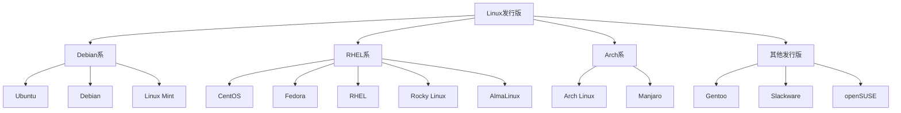
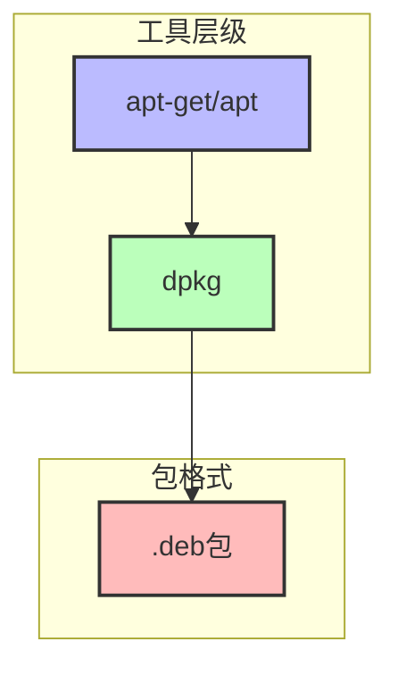
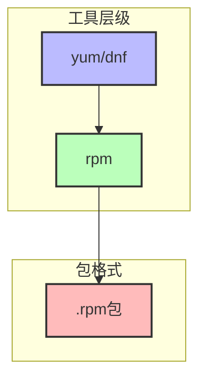
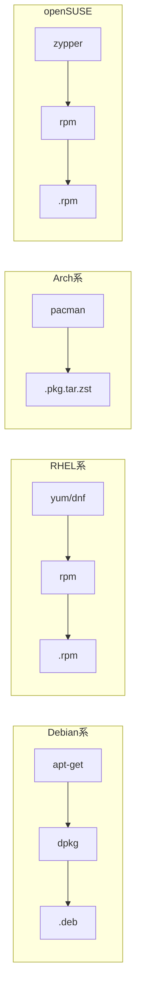
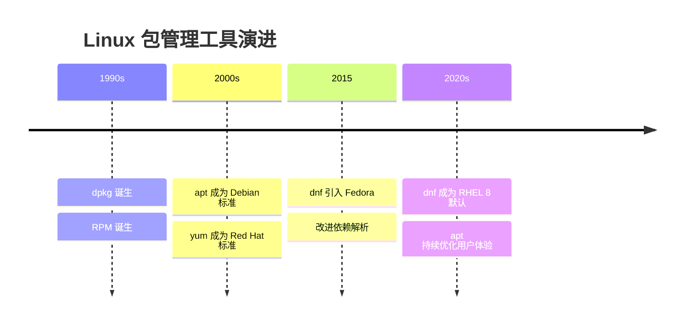

# Linux 发行版和包管理工具

> Linux的各个发行版本和各种包管理工具有什么区别和联系

## 一、Linux 发行版分类

### 1.1 主要发行版家族



### 1.2 各发行版特点

| 发行版 | 特点 | 包管理工具 |
|--------|------|------------|
| **Ubuntu** | 用户友好，社区活跃 | apt, dpkg |
| **Debian** | 稳定性高，社区驱动 | apt, dpkg |
| **CentOS** | 企业级，免费 | yum, dnf, rpm |
| **Fedora** | 前沿技术，RHEL测试床 | dnf, rpm |
| **RHEL** | 企业级，付费支持 | yum, dnf, rpm |
| **Arch Linux** | 滚动更新，高度定制 | pacman |
| **openSUSE** | 企业级，稳定 | zypper, rpm |

## 二、包管理工具体系

### 2.1 Debian 系包管理工具



| 工具 | 说明 |
|------|------|
| **dpkg** | Debian Package，低层包管理工具 |
| **apt** | Advanced Package Tool，更现代的命令行界面 |
| **apt-get** | apt的低层后端，功能更强大 |
| **apt-cache** | 包缓存查询工具 |
| **dpkg-reconfigure** | 重新配置已安装的包 |

### 2.2 RHEL 系包管理工具



| 工具 | 说明 |
|------|------|
| **rpm** | Red Hat Package Manager，低层包管理工具 |
| **yum** | Yellowdog Updater Modified，CentOS 6/7 默认 |
| **dnf** | Dandified YUM，RHEL 8+ 默认，yum的下一代 |

### 2.3 包管理工具对比



## 三、常见操作命令

### 3.1 Debian 系命令

```bash
# 更新软件包列表
sudo apt update

# 升级所有可升级的包
sudo apt upgrade

# 安装软件包
sudo apt install <package-name>

# 卸载软件包
sudo apt remove <package-name>

# 搜索软件包
apt search <keyword>

# 显示软件包信息
apt show <package-name>

# 清理不再需要的依赖
sudo apt autoremove
```

### 3.2 RHEL 系命令

```bash
# 检查更新
sudo yum check-update

# 安装软件包
sudo yum install <package-name>

# 更新软件包
sudo yum update <package-name>

# 卸载软件包
sudo yum remove <package-name>

# 搜索软件包
yum search <keyword>

# 列出已安装的包
yum list installed

# 清理缓存
yum clean all
```

## 四、包管理工具演进



## 五、相关资料

- [非常详细的linux发行版大全](https://github.com/FabioLolix/LinuxTimeline/releases/)
- [五种常见 Linux 系统安装包管理工具中文使用指南](https://zhuanlan.zhihu.com/p/562391617)