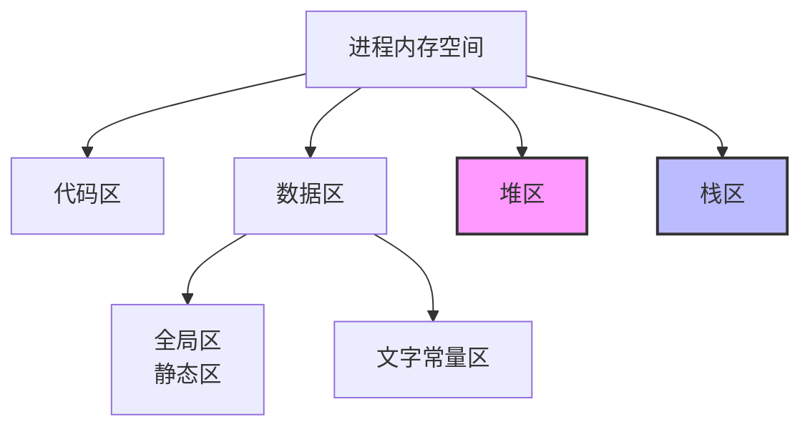
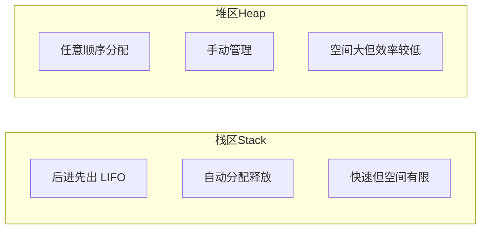
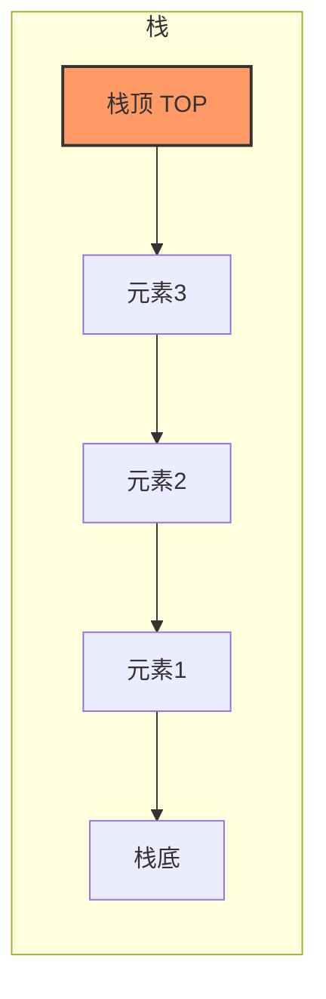
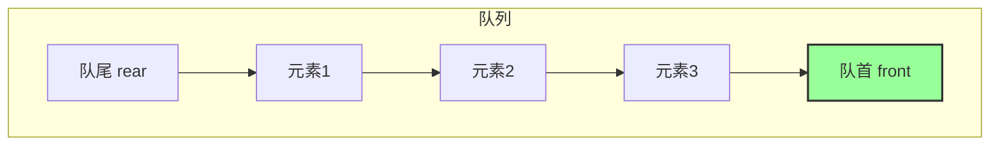

# 堆和栈的区别

## 一、内存区域划分

程序在内存中的布局主要包括以下几个区域：

| 区域 | 说明 |
|------|------|
| **代码区** | 存放程序代码 |
| **数据区** | 包含全局区和静态区 |
| **堆区** | 动态分配内存 |
| **栈区** | 函数调用和局部变量 |

## 二、堆与栈对比

### 核心区别

| 特性 | 栈区 | 堆区 |
|------|------|------|
| **申请方式** | 系统自动分配释放 | 程序员手动申请释放 |
| **响应速度** | 速度快 | 速度较慢 |
| **空间大小** | 有限（通常1-8MB） | 相对较大 |
| **存储内容** | 函数参数、局部变量 | 动态分配的数据 |
| **管理方式** | 后进先出（LIFO） | 任意顺序 |

## 三、数据结构

### 栈（Stack）

- **特性**：后进先出（Last In First Out）
- **操作**：push（入栈）、pop（出栈）

### 队列（Queue）

- **特性**：先进先出（First In First Out）
- **操作**：enqueue（入队）、dequeue（出队）

## 四、相关资料

- [堆和栈的区别](https://cloud.tencent.com/developer/article/1688327)