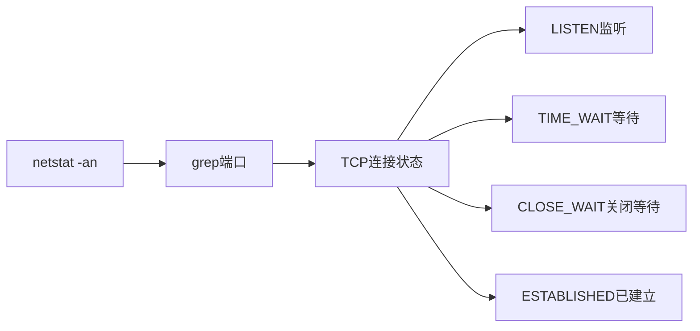
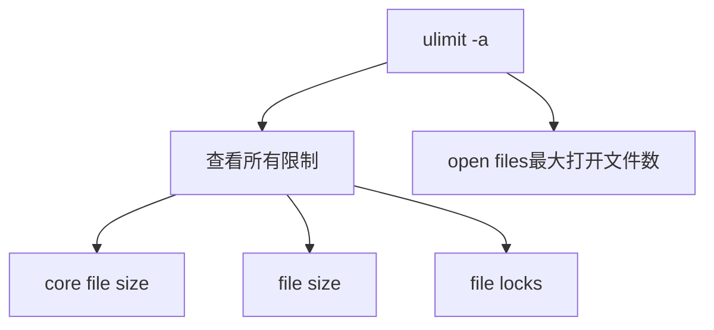
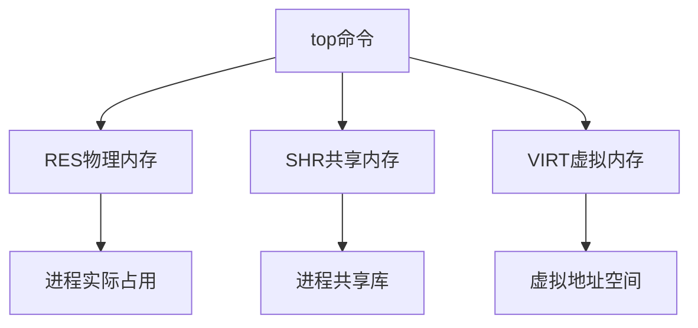
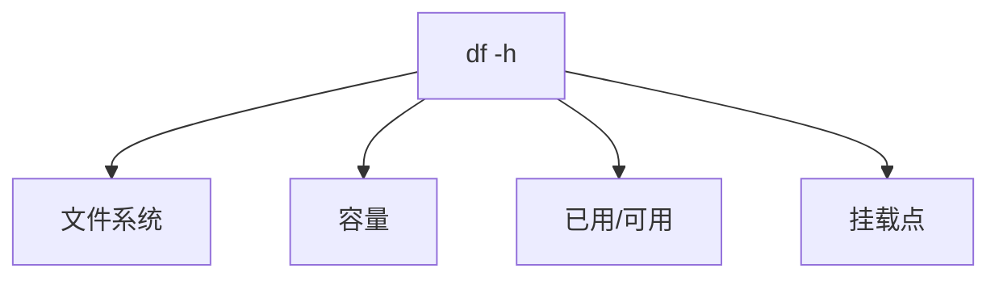

# 常用命令

## 一、网络连接命令

### 1.1 查看端口 TCP 连接



```bash
$ netstat -an | grep ':19201'
tcp6       0      0 :::19201                :::*                    LISTEN
tcp6       0      0 10.201.62.65:19201      10.201.62.63:42062      TIME_WAIT
tcp6       1      0 127.0.0.1:51340         127.0.0.1:19201         CLOSE_WAIT
```

| 状态 | 说明 |
|------|------|
| **LISTEN** | 端口正在监听 |
| **TIME_WAIT** | 等待连接关闭 |
| **CLOSE_WAIT** | 等待关闭通知 |
| **ESTABLISHED** | 连接已建立 |

## 二、文件描述符

### 2.1 ulimit 查看资源限制



```bash
$ ulimit -a | grep file
core file size          (blocks, -c) 0
file size               (blocks, -f) unlimited
open files                      (-n) 1024
file locks                      (-x) unlimited

# 设置最大文件连接数
$ ulimit -n 10240
```

### 2.2 查看进程打开的文件

```bash
$ lsof -p $PID

# FD文件描述符: 8w表示编号8，w表示只写，r表示只读，u表示读写
$ lsof -p 20329 | grep REG
COMMAND   PID USER    FD      TYPE             DEVICE      SIZE/OFF  NODE      NAME
java    20329 root    8w      REG             253,17      3531      338575098 warn-log.log
```

| FD | 说明 |
|----|------|
| **cwd** | 当前工作目录 |
| **rtd** | 根目录 |
| **txt** | 程序代码 |
| **mem** | 内存映射文件 |
| **8w** | 文件描述符8，只写模式 |

## 三、内存管理

### 3.1 top 命令详解



```bash
# top 交互命令
e    # 内存转MB或GB
M    # 按内存使用排序
m    # 显示内存占比进度条
c    # 显示完整命令路径
```

### 3.2 free 查看内存

```bash
# 以MB为单位显示内存
$ free -m
```

## 四、磁盘管理

### 4.1 df 查看磁盘使用



```bash
$ df -h
Filesystem      Size  Used Avail Use% Mounted on
/dev/vda2        30G  2.4G   28G   8% /
tmpfs           3.9G  385M  3.6G  10% /run
```

## 五、系统信息

```bash
# 查看CPU信息
$ cat /proc/cpuinfo

# 查看内存信息
$ cat /proc/meminfo

# 查看系统版本
$ cat /proc/version

# 查看文件系统
$ ls /proc/fs
```

## 六、相关命令速查

| 命令 | 用途 |
|------|------|
| `netstat -an \| grep port` | 查看端口连接状态 |
| `ulimit -n number` | 设置最大文件描述符 |
| `lsof -p pid` | 查看进程打开的文件 |
| `top` | 实时查看进程资源使用 |
| `free -m` | 查看内存使用情况 |
| `df -h` | 查看磁盘空间 |