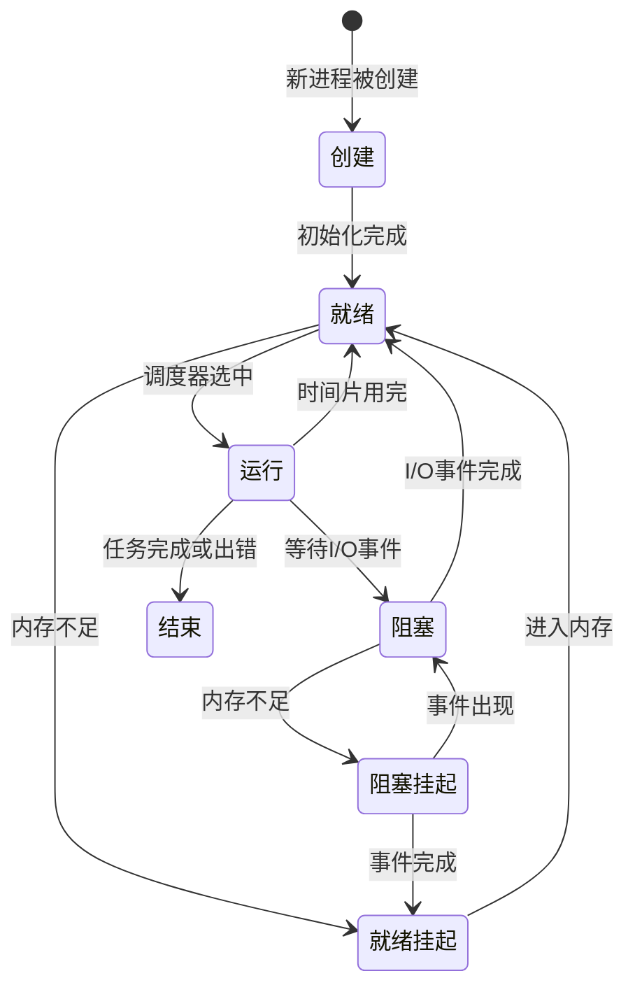
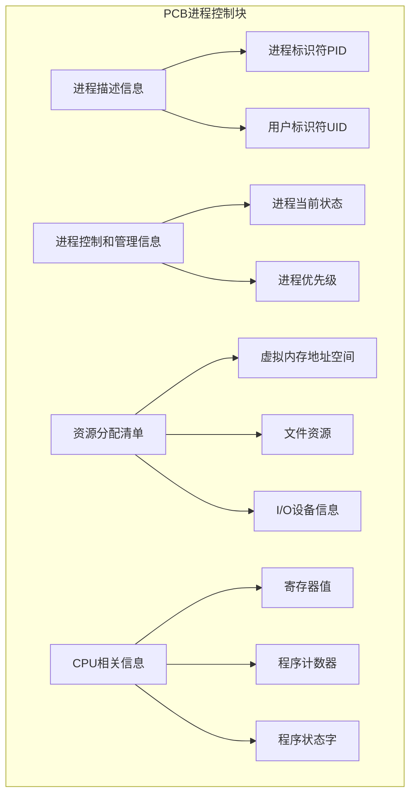
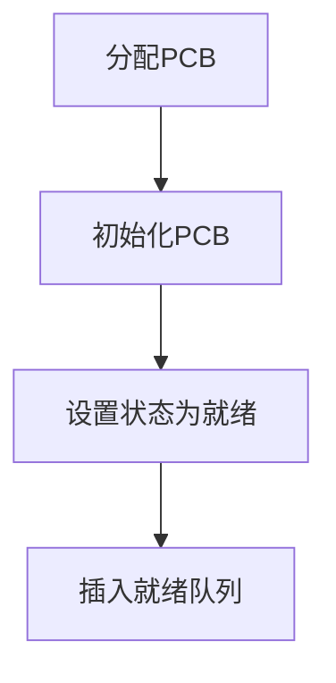
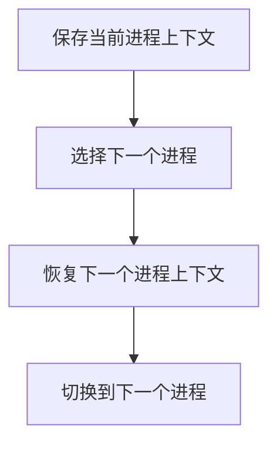
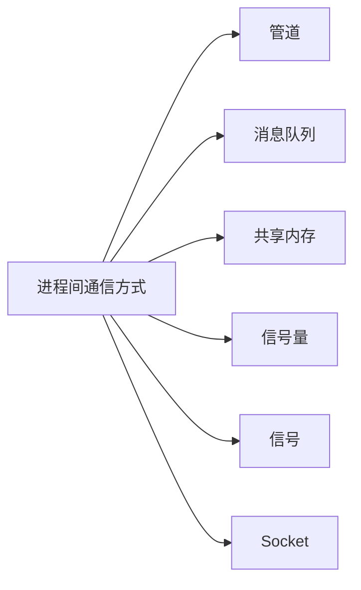
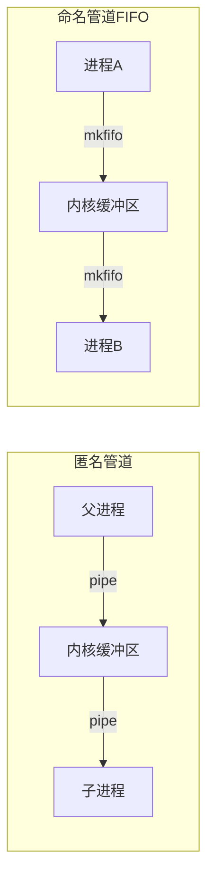
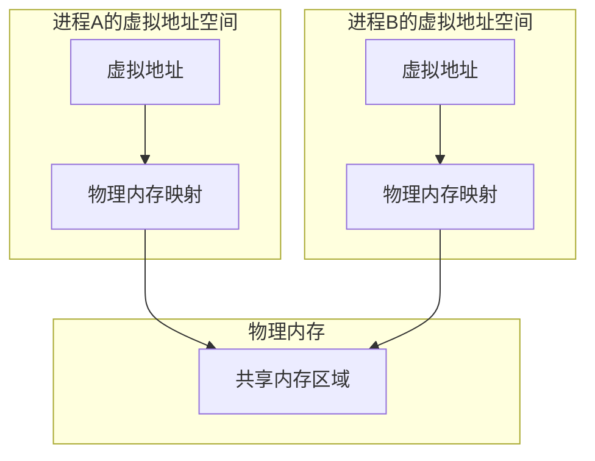
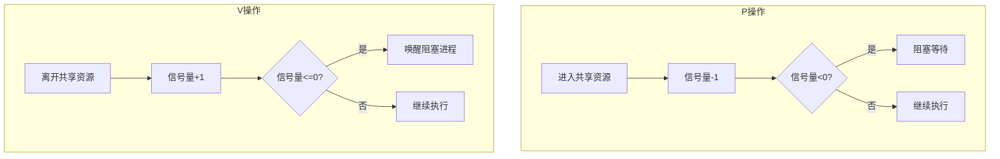
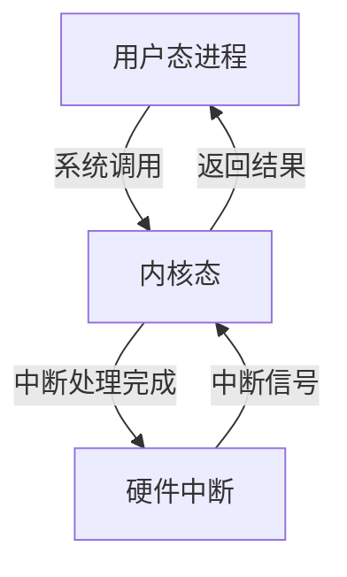
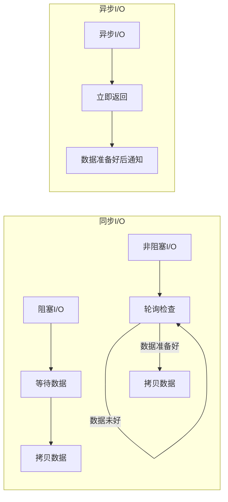

# 操作系统

## 一、进程概述

### 1.1 进程的概念

**进程**是程序在执行过程中的一个实例。静态代码文件经过编译后生成二进制可执行文件，当我们运行这个可执行文件后，CPU会执行程序中的每一条指令，这个运行中的程序就称为进程。

### 1.2 进程与程序的区别

- **程序**：静态的代码文件，存储在磁盘中
- **进程**：动态执行的实例，拥有自己的生命周期和资源

## 二、进程状态

### 2.1 七种基本状态

| 状态 | 描述 |
|------|------|
| **创建** | 进程被创建时的状态 |
| **就绪** | 可运行，由于其他进程处于运行状态而暂时停止运行 |
| **运行** | 当前进程占用 CPU |
| **阻塞** | 该进程正在等待某一事件发生（如等待输入/输出操作的完成）而暂时停止运行 |
| **结束** | 进程从系统中消失时的状态 |
| **就绪挂起** | 进程在外存（硬盘），但只要进入内存，即刻立刻运行 |
| **阻塞挂起** | 进程在外存（硬盘）并等待某个事件的出现 |

### 2.2 进程状态转换图

### 2.3 进程被挂起的三种情况

- **系统行为**：进程所使用的内存空间不在物理内存
- **用户行为**：
  - 通过 `sleep` 让进程间歇性挂起，其工作原理是设置一个定时器，到期后唤醒进程
  - 用户希望挂起一个程序的执行，比如在 Linux 中用 `Ctrl+Z` 挂起进程

## 三、进程控制结构

### 3.1 进程控制块（PCB）

**进程控制块（Process Control Block，PCB）** 是进程存在的唯一标识，包含以下信息：

### 3.2 PCB的连接方式

- **单链表形式**：把具有相同状态的进程链在一起，组成各种队列

## 四、进程控制

### 4.1 进程创建的流程

### 4.2 进程终止的三种方式

| 终止方式 | 描述 |
|----------|------|
| **正常结束** | 进程任务完成，正常退出 |
| **异常结束** | 进程执行过程中发生错误 |
| **外部干扰** | 如 `kill` 命令强制终止 |

### 4.3 父子进程关系

- 当子进程被终止时，其在父进程处继承的资源应当还给父进程
- 当父进程被终止时，该父进程的子进程就变为**孤儿进程**，会被 1 号进程（init）收养

### 4.4 进程的阻塞与唤醒

- **阻塞**：当进程需要等待某一事件完成时，它可以调用阻塞语句把自己阻塞等待
- **唤醒**：当进程要等待的事件完成时，由发现者进程用唤醒语句叫醒它

## 五、进程上下文切换

### 5.1 上下文切换过程

### 5.2 进程上下文资源

| 资源类型 | 包含内容 |
|----------|----------|
| **用户空间资源** | 虚拟内存、堆栈、全局变量 |
| **内核空间资源** | 内核堆栈、寄存器等 |

### 5.3 五种切换场景

1. **时间片用完**：CPU分配给进程的时间片不足以让进程运行完
2. **资源不足**：进程在系统资源不足（如内存不足）时等待资源
3. **主动挂起**：当进程通过睡眠函数 `sleep` 主动挂起
4. **优先级抢占**：当有优先级更高的进程运行时
5. **硬件中断**：发生硬件中断时CPU上的进程被中断挂起

## 六、进程间通信（IPC）

### 6.1 六种通信方式概览

### 6.2 管道

- **定义**：内核里面的一串缓存，从管道的一端写入的数据实际上缓存在内核中，另一端读取
- **生命周期**：随进程的创建而建立，随进程的结束而销毁
- **特点**：遵循先进先出原则

### 6.3 消息队列

- **定义**：保存在内核中的消息链表，发送的数据分成一个一个独立的数据单元
- **生命周期**：随内核，如果没有释放或关闭操作系统，消息队列会一直存在
- **优点**：适合进程间频繁地交换数据
- **缺点**：
  - 通信不及时
  - 数据大小有限制
  - 存在用户态与内核态之间的数据拷贝开销

### 6.4 共享内存

- **定义**：拿出一块虚拟地址空间来，映射到相同的物理内存中

- **优点**：不需要做数据拷贝，通信速度快
- **缺点**：存在多进程竞争共享资源，造成数据错乱的风险

### 6.5 信号量

- **定义**：一个整型的计数器，主要用于实现进程间的**互斥与同步**
- **两种原子操作**：

- **两种初始值**：
  - **初始化为 1**：互斥信号量，保证任意时刻只有一个线程访问共享资源
  - **初始化为 0**：同步信号量，保证线程 A 应在线程 B 之前执行

### 6.6 信号

- **定义**：进程间通信机制中唯一的**异步通信机制**，用于异常情况下的工作模式
- **三种处理方式**：
  1. 执行默认操作
  2. 捕捉信号，自定义处理
  3. 忽略信号
- **两个无法捕捉和忽略的信号**：`SIGKILL` 和 `SEGSTOP`

### 6.7 Socket

- **定义**：不仅用于不同主机进程间通信，还可用于本地主机进程间通信
- **三种通信方式**：
  1. 基于 TCP 协议的通信方式
  2. 基于 UDP 协议的通信方式
  3. 本地进程间通信方式

## 七、特殊进程类型

### 7.1 僵尸进程

- **定义**：已完成且处于终止状态，但在进程表中却仍然存在的进程
- **产生原因**：子进程退出，而父进程并没有调用 `wait()` 或 `waitpid()`

### 7.2 孤儿进程

- **定义**：一个父进程退出，而它的一个或多个子进程还在运行
- **处理方式**：被 init 进程（1号进程）收养，不会对系统造成危害

## 八、用户态与内核态

### 8.1 基本概念

| 概念 | 描述 |
|------|------|
| **用户态** | 操作系统为应用程序分配的内存区域，不能直接访问硬件或内核数据结构 |
| **内核态** | 操作系统内核代码及其运行时数据结构所在的内存区域，拥有完全访问权限 |

### 8.2 用户态与内核态切换

### 8.3 常见的系统调用类型

- **文件操作**：`open`、`read`、`write`
- **进程控制**：`fork`、`exec`
- **内存管理**：`mmap`

## 九、I/O模型

### 9.1 阻塞I/O vs 非阻塞I/O

| 模型 | 描述 |
|------|------|
| **阻塞I/O** | 执行 `read` 时，线程会被阻塞，直到数据从内核拷贝到应用程序缓冲区 |
| **非阻塞I/O** | 数据未准备好时立即返回，应用程序不断轮询内核，直到数据准备好 |

### 9.2 同步I/O vs 异步I/O

| 模型 | 描述 |
|------|------|
| **同步I/O** | `read` 调用时，内核将数据从内核空间拷贝到应用程序空间的过程需要等待 |
| **异步I/O** | 内核数据准备好和拷贝到用户态这两个过程都不需要等待 |

### 9.3 I/O模型对比图

## 十、相关资料

- [Linux进程状态转换详解](https://cloud.tencent.com/developer/article/1688327)