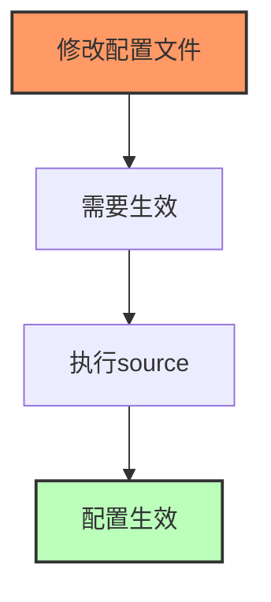

# 环境变量配置

> Linux 环境变量的分类和配置方法

## 一、环境变量分类

```mermaid
flowchart TB
    A[环境变量] --> B[系统级环境变量]
    A --> C[用户级环境变量]
    
    B --> B1[/etc/environment]
    B --> B2[/etc/profile]
    B --> B3[/etc/bashrc]
    
    C --> C1[~/.bash_profile]
    C --> C2[~/.bashrc]
    C --> C3[~/.profile]
    
    style A fill:#f9f,stroke:#333,stroke-width:2px
    style B fill:#bbf,stroke:#333,stroke-width:2px
    style C fill:#bfb,stroke:#333,stroke-width:2px
```

### 1.1 系统级环境变量

| 文件 | 说明 | 加载时机 |
|------|------|----------|
| **/etc/environment** | 系统全局环境变量 | 系统启动时 |
| **/etc/profile** | 系统全局环境变量和启动程序 | 登录shell时 |
| **/etc/bashrc** | 系统全局别名和函数 | 打开shell时 |

### 1.2 用户级环境变量

| 文件 | 说明 | 加载时机 |
|------|------|----------|
| **~/.bash_profile** | 用户环境变量 | 登录shell时 |
| **~/.bashrc** | 用户别名和函数 | 打开交互式shell时 |
| **~/.profile** | 用户环境变量 | 登录shell时 |

## 二、环境变量加载顺序

```mermaid
flowchart TB
    A[系统启动] --> B[/etc/environment]
    B --> C[/etc/profile]
    C --> D[/etc/bashrc]
    D --> E[~/.bash_profile]
    E --> F[~/.bashrc]
    F --> G[shell终端]
    
    style A fill:#f96,stroke:#333,stroke-width:2px
    style G fill:#bfb,stroke:#333,stroke-width:2px
```

## 三、PATH 环境变量

### 3.1 PATH 作用

PATH 是最重要的环境变量，指定命令搜索路径。

```mermaid
flowchart LR
    A[输入命令] --> B[PATH路径列表]
    B --> C[/usr/bin]
    B --> D[/bin]
    B --> E[/usr/local/bin]
    
    C --> F{找到命令?}
    D --> F
    E --> F
    
    F -->|是| G[执行命令]
    F -->|否| H[command not found]
```

### 3.2 PATH 配置

```bash
# 查看当前PATH
echo $PATH

# 追加新路径
export PATH=$PATH:/new/path

# 永久添加（用户级）
echo 'export PATH=$PATH:/new/path' >> ~/.bashrc

# 永久添加（系统级）
echo 'export PATH=$PATH:/new/path' >> /etc/profile
```

## 四、常用环境变量

| 变量 | 说明 |
|------|------|
| **PATH** | 命令搜索路径 |
| **HOME** | 用户主目录 |
| **SHELL** | 当前shell类型 |
| **USER** | 当前用户名 |
| **PWD** | 当前工作目录 |
| **LANG** | 语言设置 |
| **LD_LIBRARY_PATH** | 动态库搜索路径 |

```bash
# 查看所有环境变量
env

# 查看特定变量
echo $HOME
echo $PATH
```

## 五、临时与永久配置

### 5.1 临时配置


```bash
# 临时设置，只对当前shell有效
export JAVA_HOME=/usr/local/java
export PATH=$PATH:$JAVA_HOME/bin
```

### 5.2 永久配置

```mermaid
flowchart TB
    A[永久配置] --> B[用户级配置]
    A --> C[系统级配置]
    
    B --> B1[~/.bashrc]
    B --> B2[~/.bash_profile]
    
    C --> C1[/etc/profile]
    C --> C2[/etc/environment]
    
    style A fill:#f9f,stroke:#333,stroke-width:2px
```

## 六、source 命令

修改配置后需要 source 重新加载。

```bash
# 重新加载配置文件
source ~/.bashrc

# 或使用以下等价命令
. ~/.bashrc
```



## 七、配置示例

### 7.1 配置 Java 环境

```bash
# 编辑配置文件
vim ~/.bashrc

# 添加以下内容
export JAVA_HOME=/usr/local/java/jdk1.8.0_301
export PATH=$PATH:$JAVA_HOME/bin
export CLASSPATH=.:$JAVA_HOME/lib/dt.jar:$JAVA_HOME/lib/tools.jar

# 重新加载
source ~/.bashrc

# 验证
java -version
```

### 7.2 配置 Go 环境

```bash
# 编辑配置文件
vim ~/.bashrc

# 添加以下内容
export GOROOT=/usr/local/go
export GOPATH=$HOME/go
export PATH=$PATH:$GOROOT/bin:$GOPATH/bin

# 重新加载
source ~/.bashrc

# 验证
go version
```