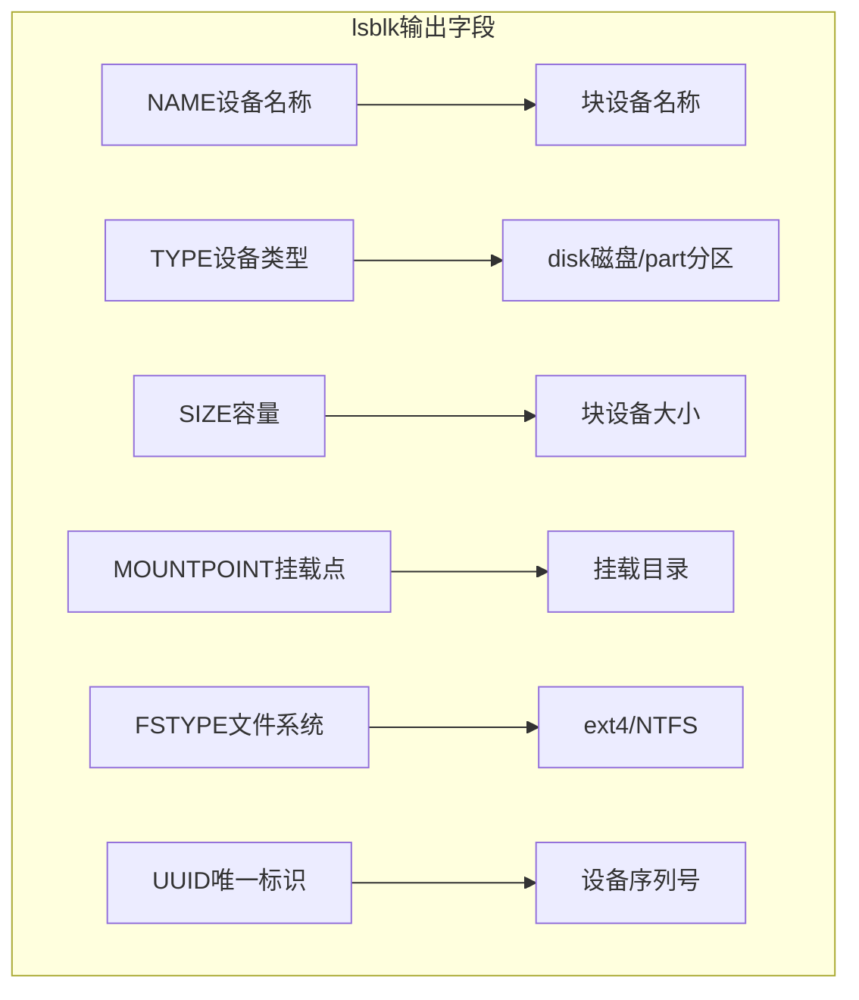
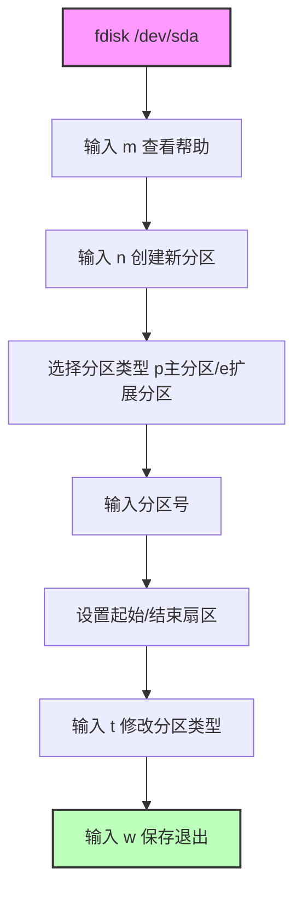
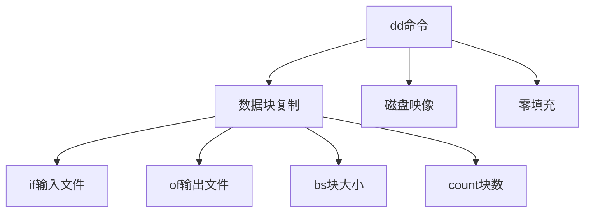

# 磁盘分区

> 简单学习磁盘分区是什么，如何使用，常用的命令有哪些

## 一、磁盘分区基础

### 1.1 lsblk 命令详解



| 字段 | 说明 |
|------|------|
| **NAME** | 块设备名称 |
| **SIZE** | 块设备容量大小 |
| **TYPE** | 设备类型（disk/disk/part） |
| **MOUNTPOINT** | 挂载点 |
| **FSTYPE** | 文件系统类型 |
| **UUID** | 唯一标识符 |

```bash
[root@k8s-master network-scripts]# lsblk
NAME   MAJ:MIN RM   SIZE RO TYPE MOUNTPOINT
sr0     11:0    1 203.6M  0 rom
vda    253:0    0    60G  0 disk
└─vda1 253:1    0    60G  0 part /
```

### 1.2 MAJ:MIN 含义


- **主设备号**：用于识别驱动程序
- **次设备号**：用于识别设备本身
- **rom**：只读存储器（Read-Only Memory）

## 二、分区管理

### 2.1 fdisk 查看分区

```bash
# 查看磁盘分区
fdisk -l

# 查看某一个磁盘下面的分区
fdisk -l /dev/sda
```

### 2.2 fdisk 创建分区流程



## 三、LVM 逻辑卷管理器

### 3.1 LVM 架构

```mermaid
flowchart TB
    A[物理磁盘] --> B[物理卷 PV]
    B --> C[卷组 VG]
    C --> D[逻辑卷 LV]
    
    subgraph 物理卷 PV
        P1[分区或磁盘]
    end
    
    subgraph 卷组 VG
        V1[物理卷组合]
    end
    
    subgraph 逻辑卷 LV
        L1[格式化后挂载]
    end
    
    D --> E1[/home]
    D --> E2[/var]
    D --> E3[swap]
```

### 3.2 LVM 命令速查

| 操作 | 命令 |
|------|------|
| **创建物理卷** | `pvcreate /dev/sdb` |
| **创建卷组** | `vgcreate vg01 /dev/sdb` |
| **创建逻辑卷** | `lvcreate -L 10G -n lv01 vg01` |
| **扩容逻辑卷** | `lvextend -L +5G /dev/vg01/lv01` |

## 四、文件系统与挂载

### 4.1 常见文件系统

| 文件系统 | 特点 | 命令 |
|----------|------|------|
| **ext4** | Linux 默认 | `mkfs.ext4` |
| **xfs** | 高性能 | `mkfs.xfs` |
| **NTFS** | Windows | `mkfs.ntfs` |

### 4.2 挂载流程


## 五、df 命令详解

```bash
# 以人类可读方式显示磁盘使用情况
df -h
```


```bash
# 输出示例
$ df -h
文件系统        容量  已用  可用 已用% 挂载点
/dev/sda1        15G  6.9G  7.3G   49% /
tmpfs           3.9G  159M  3.8G    4% /dev/shm
```

## 六、dd 命令



```bash
# 创建1G空白文件
dd if=/dev/zero of=/dev/sdb bs=1M count=1024
```

| 参数 | 说明 |
|------|------|
| **if** | 输入文件 |
| **of** | 输出文件 |
| **bs** | 块大小 |
| **count** | 块数量 |

## 七、相关命令速查

```bash
# 查看块设备
lsblk

# 查看磁盘分区表
fdisk -l

# 磁盘分区
fdisk /dev/sda

# 格式化文件系统
mkfs.ext4 /dev/sda1

# 挂载
mount /dev/sda1 /mnt/mydisk

# 查看磁盘使用情况
df -h

# 查看磁盘详细信息
blkid
```

## 八、相关资料

- [一篇看懂！Linux磁盘的管理（分区、格式化、挂载），LVM逻辑卷，RAID磁盘阵列](https://zhuanlan.zhihu.com/p/296777898)