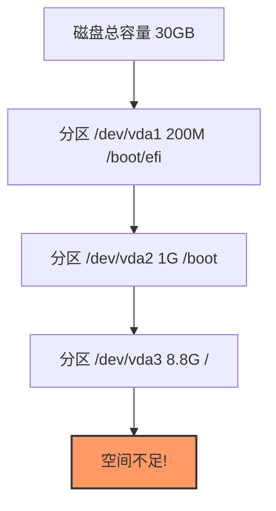
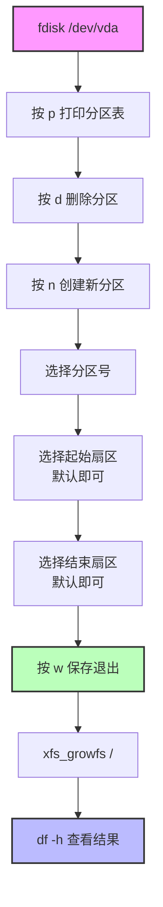
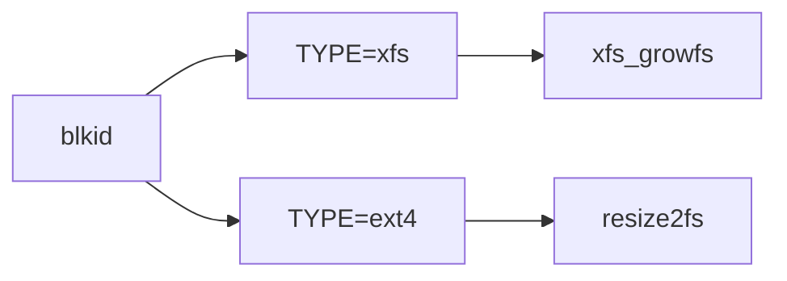

# 磁盘扩容

> 磁盘内存空间不足，但是磁盘的大小是足够的，需要重新分区并且挂载

## 一、问题描述



> Error: `no space left on device`

## 二、磁盘分区查看

### 2.1 lsblk 查看分区

```bash
$ lsblk
NAME   MAJ:MIN RM  SIZE RO TYPE MOUNTPOINT
sr0     11:0    1 1024M  0 rom
sr1     11:1    1 1024M  0 rom
vda    253:0    0   30G  0 disk
├─vda1 253:1    0  200M  0 part /boot/efi
├─vda2 253:2    0    1G  0 part /boot
└─vda3 253:3    0  8.8G  0 part /
```

### 2.2 fdisk 查看详细信息

```bash
$ fdisk -l
Disk /dev/vda：30 GiB，32212254720 字节，62914560 个扇区

设备          起点     末尾     扇区  大小 类型
/dev/vda1     2048   411647   409600  200M EFI 系统
/dev/vda2   411648  2508799  2097152    1G Linux 文件系统
/dev/vda3  2508800 20969471 18460672  8.8G Linux 文件系统
```

## 三、分区扩容流程



### 3.1 fdisk 交互操作

```bash
# 进入fdisk交互界面
$ fdisk /dev/vda

# 按键顺序
p    # 打印分区表
d    # 删除分区
n    # 创建新分区
w    # 保存并退出
```

```bash
# 注意：提示签名时选择 N
分区 #3 包含一个 xfs 签名。
您想移除该签名吗？是[Y]/否[N]：N
```

### 3.2 扩容后分区

```bash
$ lsblk
NAME   MAJ:MIN RM  SIZE RO TYPE MOUNTPOINT
vda    253:0    0   30G  0 disk
├─vda1 253:1    0  200M  0 part /boot/efi
├─vda2 253:2    0    1G  0 part /boot
└─vda3 253:3    0 28.8G  0 part /   # 分区已扩大
```

## 四、文件系统扩容

### 4.1 查看文件系统类型



```bash
$ blkid
/dev/vda1: TYPE="vfat"
/dev/vda2: TYPE="xfs"
/dev/vda3: TYPE="xfs"
```

### 4.2 扩容命令

| 文件系统 | 扩容命令 |
|----------|----------|
| **xfs** | `xfs_growfs /` |
| **ext4** | `resize2fs /dev/vda3` |

```bash
# xfs 文件系统扩容
$ xfs_growfs /

# ext4 文件系统扩容
$ resize2fs /dev/vda3
```

## 五、验证结果

```bash
$ df -h
文件系统        容量  已用  可用 已用% 挂载点
/dev/vda3        29G  7.3G   22G   26% /   # 扩容成功
tmpfs           3.4G   16M  3.3G    1% /tmp
/dev/vda2      1014M  239M  776M   24% /boot
/dev/vda1       200M  6.7M  194M    4% /boot/efi
```

## 六、流程总结

