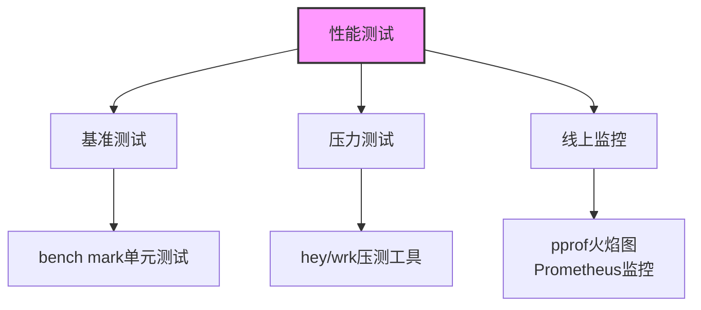
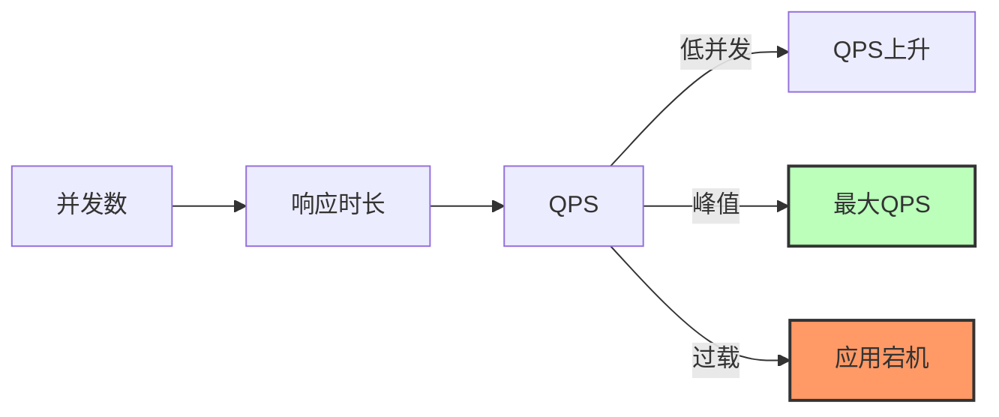
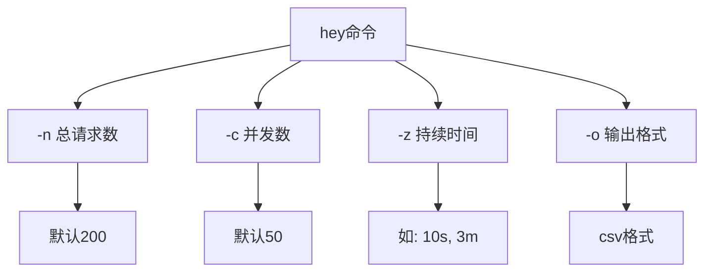
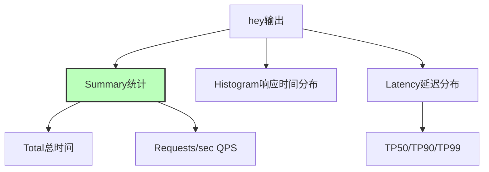
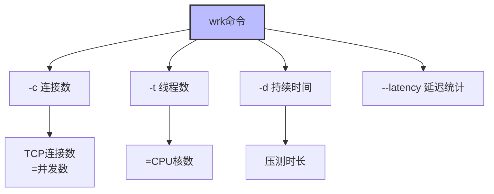
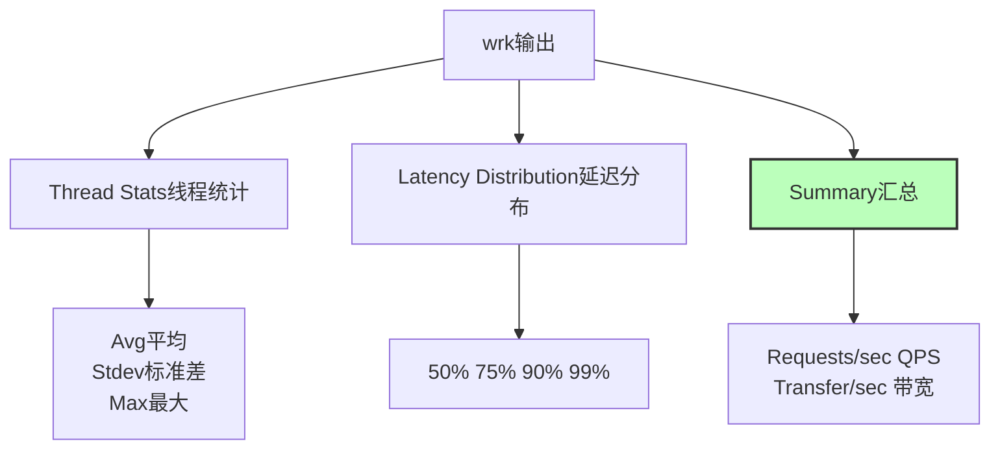
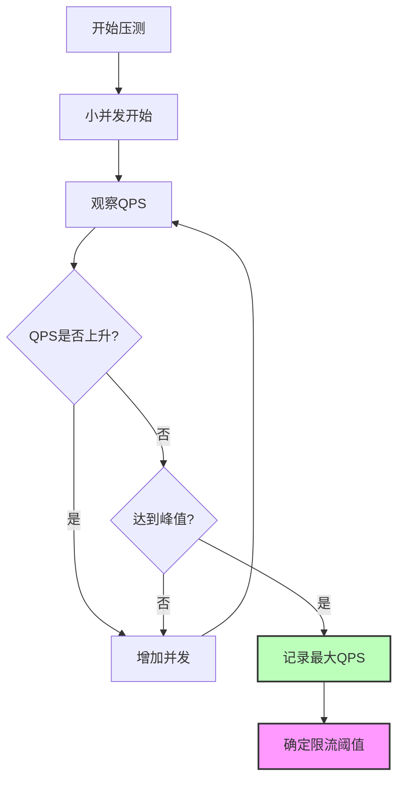

# 性能测试与基准测试完全指南

> 站点性能监测、压测工具使用以及相关代码实现

## 一、概述



性能测试目标：
1. 知道应用哪个模块、哪个接口响应最慢
2. 知道应用随请求数量增加哪块最薄弱
3. 知道站点消费请求数量最大值，做出相应保护措施

## 二、QPS与并发关系



### QPS计算公式

```
QPS = 并发数 × (1000ms / 响应时长ms)
```

| 并发数 | 响应时长 | QPS |
|--------|----------|-----|
| 10 | 1ms | 10,000 |
| 100 | 500ms | 200 |
| 10000 | 崩溃 | N/A |

> 并发数增高 → 响应时间变长 → QPS先升后降 → 临界点为最大QPS

## 三、性能测试工具

### 3.1 hey 工具

HTTP负载生成器，用于Web应用性能测试。



#### hey 使用示例

```bash
# 并发400 持续120秒
hey -z 120s -c 400 http://localhost:8080/school/list
```

| 参数 | 说明 | 默认值 |
|------|------|--------|
| `-n` | 总请求数 | 200 |
| `-c` | 并发数 | 50 |
| `-z` | 持续时间 | - |
| `-m` | HTTP方法 | GET |
| `-t` | 超时时间 | 20s |

#### hey 结果解析



关键指标：
- **Requests/sec**: 吞吐量
- **Average**: 平均响应时间
- **TP99**: 99%请求的响应时间

### 3.2 wrk 工具

现代化HTTP基准测试工具，单CPU多核产生显著负载。



#### wrk 使用示例

```bash
# 10线程 400连接 持续120秒
wrk -c 400 -t 10 -d 120s -H "Authorization: Bearer pwd" --latency http://localhost:8080/user/list
```

#### wrk 结果解析



## 四、性能测试流程



## 五、连接数与QPS关系

```
QPS = (1000 / 响应时间ms) × 连接数
```

| 连接数 | 响应时间 | QPS |
|--------|----------|-----|
| 10 | 100ms | 100 |
| 100 | 100ms | 1,000 |
| 400 | 200ms | 2,000 |

## 六、代码实现

### 6.1 Web服务 (Gin)

```go
package main

import (
    "github.com/gin-gonic/gin"
    "net/http"
)

func main() {
    engine := gin.Default()
    engine.GET("/user/list", userListHandler)
    engine.GET("/school/list", schoolListHandler)
    engine.Run(":8080")
}

func userListHandler(c *gin.Context) {
    userList, err := getUserList()
    if err != nil {
        c.JSON(http.StatusOK, err.Error())
        return
    }
    c.JSON(http.StatusOK, userList)
}
```

### 6.2 MySQL连接池

```go
func InitDBClient(cfg *MysqlConfig) (*gorm.DB, error) {
    dsn := fmt.Sprintf("%s:%s@tcp(%s)/%s?charset=%s",
        cfg.User, cfg.Passwd, cfg.Addr, cfg.DB, cfg.Charset)

    db, err := gorm.Open(mysql.Open(dsn), &gorm.Config{})
    if err != nil {
        return nil, err
    }

    sqlDB, _ := db.DB()
    sqlDB.SetMaxIdleConns(cfg.MaxIdleCount)
    sqlDB.SetMaxOpenConns(cfg.MaxOpenCount)

    return db, nil
}
```

### 6.3 Redis连接池

```go
func NewRedisAi() *RedisApi {
    pool := newRedisPoolWithSizeAndPasswd("127.0.0.1:6379", 1000, "")
    return &RedisApi{redisPool: pool}
}

func (api *RedisApi) Get(key string) (string, error) {
    redisConn := api.redisPool.Get()
    defer redisConn.Close()

    r, err := redisConn.Do("GET", key)
    return redis.String(r, err)
}
```

## 七、压测指标速查

| 指标 | 说明 | 目标值 |
|------|------|--------|
| **QPS** | 每秒请求数 | 越高越好 |
| **TP50** | 50%请求响应时间 | < 50ms |
| **TP99** | 99%请求响应时间 | < 500ms |
| **Error Rate** | 错误率 | < 1% |
| **并发数** | 同时处理请求数 | 根据CPU核数 |