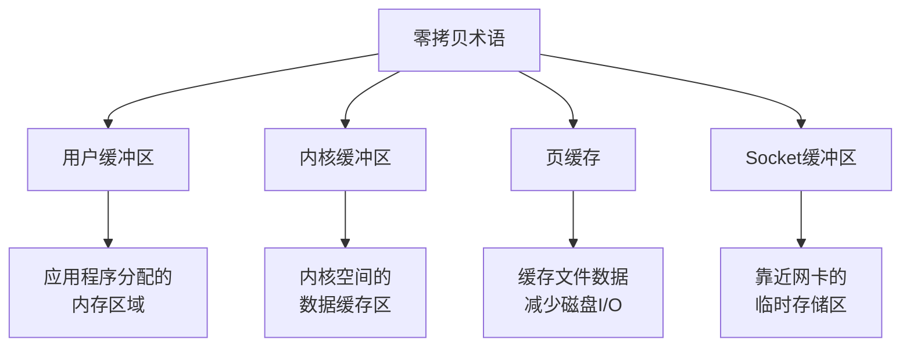
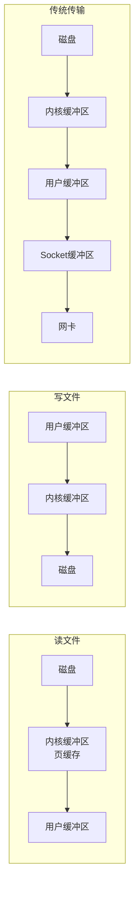
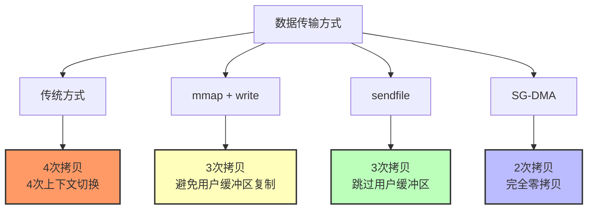
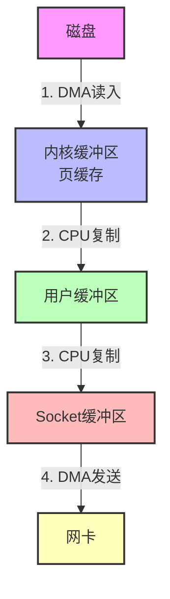
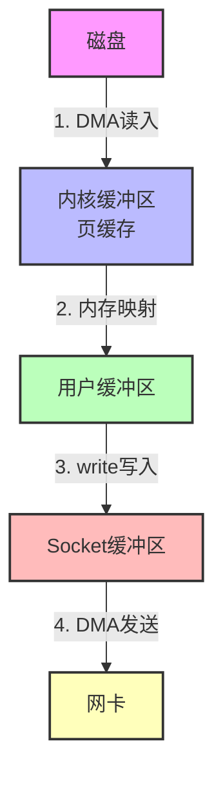
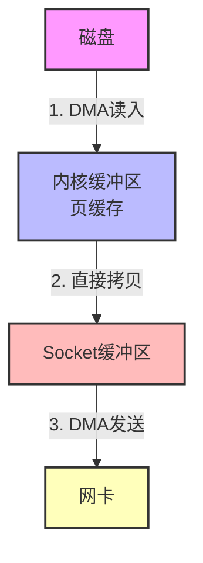
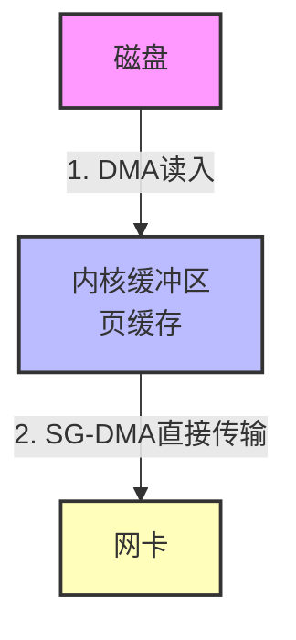

# 零拷贝

> 零拷贝（Zero-copy）是一种计算机操作技术，主要减少数据在不同存储区域之间的复制次数，提高数据传输效率。

## 一、关键术语



| 术语 | 说明 |
|------|------|
| **用户缓冲区** | 应用程序自己分配的内存区域 |
| **内核缓冲区** | 内核空间中的内存区域，用于缓存数据 |
| **页缓存** | 缓存文件数据，减少磁盘I/O |
| **Socket缓冲区** | 发送/接收数据时临时存储，靠近网卡 |

## 二、数据流转



## 三、零拷贝技术对比



### 3.1 传统方式（非零拷贝）



**问题**：
- 4次数据拷贝
- 4次上下文切换（用户态 ↔ 内核态）

### 3.2 mmap + write

mmap 将内核缓冲区直接映射到用户空间。



**改进**：
- 避免用户缓冲区到内核缓冲区的CPU复制

### 3.3 sendfile

Linux 2.2+ 支持，直接在内核中完成数据拷贝。



**改进**：
- 完全跳过用户缓冲区
- 3次数据拷贝

### 3.4 SG-DMA（完全零拷贝）

使用 DMA 引擎直接传输数据。



**改进**：
- 只需要 2 次 DMA 操作
- 真正的零拷贝

## 四、技术对比表

| 方式 | 拷贝次数 | 上下文切换 | 说明 |
|------|----------|------------|------|
| **传统方式** | 4 | 4 | 最慢 |
| **mmap + write** | 3 | 3 | 避免用户缓冲区复制 |
| **sendfile** | 3 | 2 | 跳过用户缓冲区 |
| **SG-DMA** | 2 | 2 | 完全零拷贝 |

## 五、使用场景

### 5.1 Nginx 配置

```nginx
http {
    # 启用sendfile
    sendfile on;

    # 启用tcp_nopush提高网络效率
    tcp_nopush on;
}
```

### 5.2 Kafka 传输

Kafka 使用 Java NIO 的 `transferTo` 方法，底层调用 sendfile：

```java
// 内核缓冲区 >> 直接到Socket缓冲区（跳过用户缓冲区）
long transferTo(FileChannel fileChannel, long position, long count) {
    return fileChannel.transferTo(position, count, socketChannel);
}
```

## 六、相关资料

- [图解零拷贝原理](https://www.xiaolincoding.com/os/8_network_system/zero_copy.html)