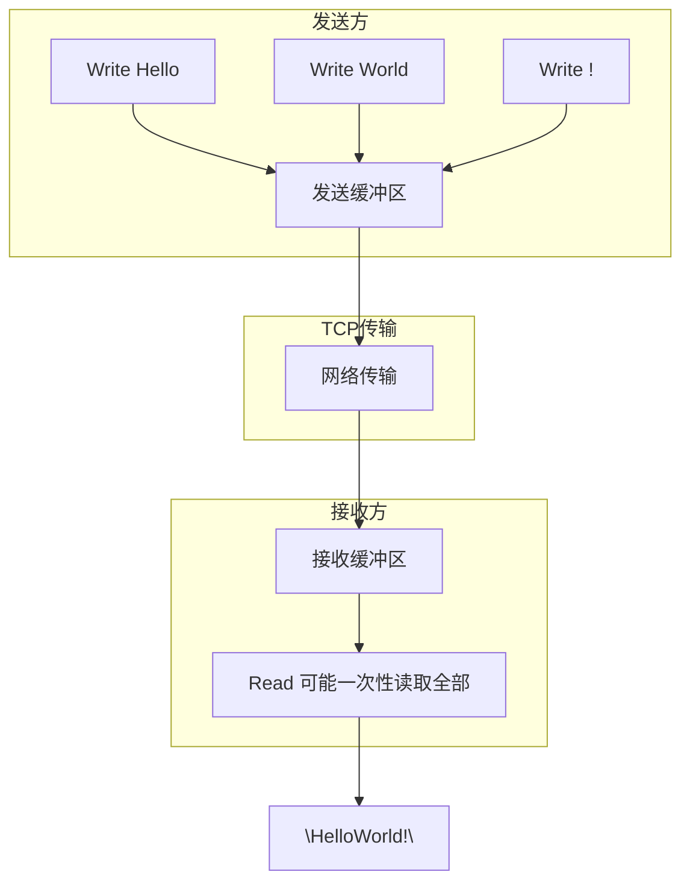
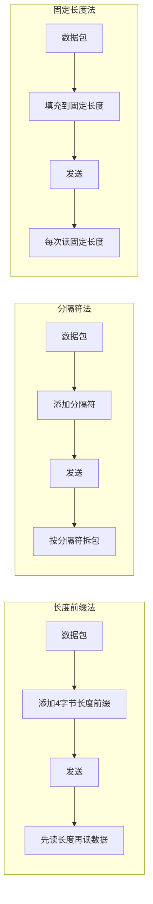

## 一、TCP粘包概述

### 1. 什么是TCP粘包

**TCP粘包**是指发送方发送的多个数据包在接收方被合并成一个数据包的现象。具体表现为：

- 发送方多次调用 `Write` 发送的小数据包，在接收方被一次性读取
- 接收方无法区分数据包的边界，导致数据解析错误

#### TCP粘包原理图



### 2. 粘包现象示例

**发送方**：
```go
// 发送三个独立的数据包
conn.Write([]byte("Hello"))
conn.Write([]byte("World"))
conn.Write([]byte("!")
```

**接收方可能收到**：
- `"HelloWorld!"` （三个包被粘在一起）
- `"HelloWor"` + `"ld!"` （部分粘包）
- `"Hello"` + `"World!"` （部分粘包）

## 二、TCP粘包产生的原因

### 1. 发送端原因

#### 1.1 Nagle算法

**Nagle算法**是TCP协议中的一种流量控制算法，用于减少网络中的小数据包数量：

- 当发送小数据包时，算法会将其缓存
- 等待一段时间或积累到一定数量后再一次性发送
- 目的是提高网络传输效率，减少网络拥塞

**配置**：
```go
// 禁用Nagle算法（不推荐，会增加网络负载）
conn.SetNoDelay(true)
```

#### 1.2 应用层缓冲区

- 应用程序使用缓冲区批量发送数据
- 多次 `Write` 调用可能被合并到同一个缓冲区

### 2. 接收端原因

#### 2.1 接收缓冲区

- TCP接收方有自己的缓冲区
- 当数据到达时，会先存储在缓冲区中
- 应用程序通过 `Read` 调用从缓冲区读取数据
- 如果缓冲区中有多个数据包，`Read` 可能一次性读取多个

#### 2.2 读取时机

- 应用程序可能在数据未完全到达时就开始读取
- 或者在多个数据包到达后才读取

### 3. 网络层原因

- 数据包在网络传输过程中可能被合并
- 路由器、交换机等网络设备可能进行数据包合并

## 三、TCP粘包的解决方案

### 1. 长度前缀法

**原理**：在每个数据包前添加固定长度的头部，记录数据包的长度。

**实现步骤**：
1. 发送方：计算数据长度 → 构建长度前缀 → 发送长度前缀 + 数据
2. 接收方：先读取长度前缀 → 根据长度读取对应的数据

**代码示例**：

```go
// 发送方
func sendData(conn net.Conn, data []byte) error {
    // 计算数据长度（4字节）
    length := uint32(len(data))
    // 构建长度前缀
    lengthBytes := make([]byte, 4)
    binary.BigEndian.PutUint32(lengthBytes, length)
    // 发送长度前缀 + 数据
    _, err := conn.Write(append(lengthBytes, data...))
    return err
}

// 接收方
func receiveData(conn net.Conn) ([]byte, error) {
    // 先读取4字节长度前缀
    lengthBytes := make([]byte, 4)
    _, err := io.ReadFull(conn, lengthBytes)
    if err != nil {
        return nil, err
    }
    // 解析长度
    length := binary.BigEndian.Uint32(lengthBytes)
    // 根据长度读取数据
    data := make([]byte, length)
    _, err = io.ReadFull(conn, data)
    if err != nil {
        return nil, err
    }
    return data, nil
}
```

### 2. 分隔符法

**原理**：使用特殊的分隔符标记数据包的边界。

**实现步骤**：
1. 发送方：在每个数据包后添加分隔符
2. 接收方：根据分隔符分割数据

**代码示例**：

```go
// 发送方（使用\n作为分隔符）
func sendData(conn net.Conn, data []byte) error {
    // 添加分隔符
    msg := append(data, '\n')
    _, err := conn.Write(msg)
    return err
}

// 接收方
func receiveData(conn net.Conn) ([]byte, error) {
    // 使用bufio.Scanner按行读取
    scanner := bufio.NewScanner(conn)
    if scanner.Scan() {
        return scanner.Bytes(), nil
    }
    if err := scanner.Err(); err != nil {
        return nil, err
    }
    return nil, io.EOF
}
```

### 3. 固定长度法

**原理**：每个数据包使用固定的长度。

**实现步骤**：
1. 发送方：将数据填充到固定长度
2. 接收方：每次读取固定长度的数据

**代码示例**：

```go
const packetSize = 1024

// 发送方
func sendData(conn net.Conn, data []byte) error {
    // 填充数据到固定长度
    paddedData := make([]byte, packetSize)
    copy(paddedData, data)
    _, err := conn.Write(paddedData)
    return err
}

// 接收方
func receiveData(conn net.Conn) ([]byte, error) {
    data := make([]byte, packetSize)
    _, err := io.ReadFull(conn, data)
    if err != nil {
        return nil, err
    }
    // 去除填充的空字节
    return bytes.TrimRight(data, "\x00"), nil
}
```

### 4. 协议格式法

**原理**：定义完整的协议格式，包含头部、长度、数据等字段。

**协议示例**：
```
+----------+----------+----------+----------+
| 魔数(4B) | 版本(1B) | 长度(4B) | 数据(NB) |
+----------+----------+----------+----------+
```

**代码示例**：

```go
// 协议头部
type Header struct {
    Magic   uint32 // 魔数，用于标识协议
    Version byte   // 协议版本
    Length  uint32 // 数据长度
}

// 发送方
func sendData(conn net.Conn, data []byte) error {
    header := Header{
        Magic:   0x12345678,
        Version: 1,
        Length:  uint32(len(data)),
    }
    
    // 序列化头部
    headerBytes := make([]byte, 9) // 4+1+4
    binary.BigEndian.PutUint32(headerBytes[0:4], header.Magic)
    headerBytes[4] = header.Version
    binary.BigEndian.PutUint32(headerBytes[5:9], header.Length)
    
    // 发送头部 + 数据
    _, err := conn.Write(append(headerBytes, data...))
    return err
}

// 接收方
func receiveData(conn net.Conn) ([]byte, error) {
    // 读取头部
    headerBytes := make([]byte, 9)
    _, err := io.ReadFull(conn, headerBytes)
    if err != nil {
        return nil, err
    }
    
    // 解析头部
    header := Header{
        Magic:   binary.BigEndian.Uint32(headerBytes[0:4]),
        Version: headerBytes[4],
        Length:  binary.BigEndian.Uint32(headerBytes[5:9]),
    }
    
    // 验证魔数
    if header.Magic != 0x12345678 {
        return nil, errors.New("invalid magic number")
    }
    
    // 读取数据
    data := make([]byte, header.Length)
    _, err = io.ReadFull(conn, data)
    if err != nil {
        return nil, err
    }
    
    return data, nil
}
```

## 四、HTTP如何解决TCP粘包问题

### 1. HTTP协议的解决方法

HTTP协议通过以下机制解决粘包问题：

#### 1.1 Content-Length头部

- 在HTTP响应中添加 `Content-Length` 头部，指定响应体的长度
- 接收方根据此长度读取响应体

**示例**：
```
HTTP/1.1 200 OK
Content-Type: text/plain
Content-Length: 13

Hello, World!
```

#### 1.2 Transfer-Encoding: chunked

- 当响应体长度未知时，使用分块传输编码
- 每个块包含长度和数据，最后以空块结束

**示例**：
```
HTTP/1.1 200 OK
Content-Type: text/plain
Transfer-Encoding: chunked

5
Hello
7
, World!
0

```

#### 1.3 连接关闭

- HTTP/1.0中，服务器在发送完响应后关闭连接
- 客户端读取数据直到连接关闭

### 2. HTTP/2的帧机制

HTTP/2使用**帧**（Frame）作为基本传输单位：

- 每个帧都有固定的头部，包含长度字段
- 帧类型包括数据帧、头帧等
- 多路复用通过帧的流ID实现

**帧结构**：
```
+-----------------------------------------------+
| Length (24) | Type (8) | Flags (8) |
+-----------------------------------------------+
| Stream Identifier (31) |
+-----------------------------------------------+
| Frame Payload (0...) |
+-----------------------------------------------+
```

## 五、实际应用案例

### 1. 聊天服务器

**需求**：实现一个实时聊天服务器，需要处理多个客户端的消息。

**解决方案**：使用长度前缀法

```go
// 聊天服务器消息格式
type Message struct {
    Type    string `json:"type"`    // 消息类型：chat, join, leave
    User    string `json:"user"`    // 用户名
    Content string `json:"content"` // 消息内容
}

// 发送消息
func sendMessage(conn net.Conn, msg Message) error {
    // 序列化消息
    data, err := json.Marshal(msg)
    if err != nil {
        return err
    }
    // 发送带长度前缀的数据
    return sendData(conn, data)
}

// 接收消息
func receiveMessage(conn net.Conn) (Message, error) {
    var msg Message
    data, err := receiveData(conn)
    if err != nil {
        return msg, err
    }
    // 反序列化消息
    err = json.Unmarshal(data, &msg)
    return msg, err
}
```

### 2. 文件传输

**需求**：实现一个文件传输服务，需要可靠地传输大文件。

**解决方案**：使用协议格式法

```go
// 文件传输协议
type FileHeader struct {
    Magic    uint32 // 魔数
    FileName string // 文件名
    FileSize int64  // 文件大小
}

// 发送文件
func sendFile(conn net.Conn, filePath string) error {
    // 打开文件
    file, err := os.Open(filePath)
    if err != nil {
        return err
    }
    defer file.Close()
    
    // 获取文件信息
    fileInfo, err := file.Stat()
    if err != nil {
        return err
    }
    
    // 构建文件头部
    header := FileHeader{
        Magic:    0x87654321,
        FileName: filepath.Base(filePath),
        FileSize: fileInfo.Size(),
    }
    
    // 序列化头部
    headerData, err := json.Marshal(header)
    if err != nil {
        return err
    }
    
    // 发送头部长度 + 头部数据
    err = sendData(conn, headerData)
    if err != nil {
        return err
    }
    
    // 发送文件数据
    _, err = io.Copy(conn, file)
    return err
}

// 接收文件
func receiveFile(conn net.Conn, saveDir string) error {
    // 接收头部
    headerData, err := receiveData(conn)
    if err != nil {
        return err
    }
    
    // 解析头部
    var header FileHeader
    err = json.Unmarshal(headerData, &header)
    if err != nil {
        return err
    }
    
    // 验证魔数
    if header.Magic != 0x87654321 {
        return errors.New("invalid file header")
    }
    
    // 创建保存路径
    savePath := filepath.Join(saveDir, header.FileName)
    file, err := os.Create(savePath)
    if err != nil {
        return err
    }
    defer file.Close()
    
    // 接收文件数据
    _, err = io.CopyN(file, conn, header.FileSize)
    return err
}
```

## 六、最佳实践和注意事项

### 1. 选择合适的解决方案

| 方案 | 优点 | 缺点 | 适用场景 |
|------|------|------|----------|
| 长度前缀法 | 简单高效，无分隔符问题 | 需要固定长度字段 | 大多数场景 |
| 分隔符法 | 实现简单，可读性好 | 数据中可能包含分隔符 | 文本数据 |
| 固定长度法 | 实现简单 | 浪费空间，不适合变长数据 | 固定格式数据 |
| 协议格式法 | 功能强大，扩展性好 | 实现复杂 | 复杂应用 |

#### 解决方案流程对比图



### 2. 性能优化

- **缓冲区大小**：合理设置读写缓冲区大小
- **批量处理**：减少系统调用次数
- **并发处理**：使用goroutine处理多个连接
- **内存管理**：避免频繁内存分配

### 3. 错误处理

- **网络错误**：妥善处理连接断开、超时等错误
- **数据完整性**：验证数据长度、校验和等
- **边界情况**：处理空数据、超大数据等情况

### 4. 安全考虑

- **数据验证**：验证输入数据的合法性
- **防止缓冲区溢出**：限制数据包大小
- **加密传输**：敏感数据使用TLS/SSL

### 5. 调试技巧

- **日志记录**：记录收发的数据长度和内容
- **抓包分析**：使用Wireshark等工具分析网络流量
- **单元测试**：编写测试用例验证拆包逻辑

## 七、常见问题解答

### 1. 为什么禁用Nagle算法不能彻底解决粘包问题？

**答**：Nagle算法只是发送端的一种优化，接收端的缓冲区机制仍然可能导致粘包。即使禁用Nagle算法，网络层和接收端的缓冲区仍然可能合并数据包。

### 2. 如何处理半包问题？

**答**：半包是指接收方只收到了部分数据包。解决方案：
- 长度前缀法：先读取长度，再读取对应的数据
- 缓冲区：使用缓冲区积累数据，直到凑够完整的数据包

### 3. 如何处理超大数据包？

**答**：
- 分片传输：将大文件分成多个小数据包
- 流式处理：边接收边处理，不一次性加载到内存
- 设置合理的缓冲区大小

### 4. 不同语言之间如何处理TCP粘包？

**答**：
- 统一协议：不同语言使用相同的封包/拆包协议
- 序列化格式：使用跨语言的序列化格式（如JSON、Protocol Buffers）
- 测试验证：确保不同语言实现的兼容性

### 5. HTTP/2和HTTP/3如何解决粘包问题？

**答**：
- **HTTP/2**：使用帧机制，每个帧都有长度字段
- **HTTP/3**：基于QUIC协议，使用消息帧和流控制

## 八、总结

### 1. 核心要点

- **TCP粘包**是由于TCP的流特性和缓冲区机制导致的
- **解决方案**包括长度前缀法、分隔符法、固定长度法和协议格式法
- **HTTP**通过Content-Length、分块传输编码等机制解决粘包
- **选择合适的方案**取决于具体的应用场景和性能要求

### 2. 实践建议

- **统一协议**：在整个系统中使用统一的封包/拆包协议
- **错误处理**：充分考虑各种异常情况
- **性能优化**：根据实际情况调整缓冲区大小和处理策略
- **测试验证**：编写充分的测试用例验证实现

### 3. 未来发展

- **QUIC协议**：基于UDP的新型传输协议，内置流控制和多路复用
- **gRPC**：基于HTTP/2的RPC框架，自动处理数据传输
- **WebSockets**：全双工通信协议，内置消息帧机制

TCP粘包是网络编程中的常见问题，但通过合理的设计和实现，可以有效地解决。选择合适的解决方案，结合具体的应用场景，可以确保数据传输的可靠性和效率。

## 参考资料

- [TCP/IP协议详解](https://book.douban.com/subject/1088054/)  
- [Go网络编程](https://book.douban.com/subject/27015037/)  
- [HTTP权威指南](https://book.douban.com/subject/10746113/)  
- [RFC 793 - Transmission Control Protocol](https://tools.ietf.org/html/rfc793)  
- [RFC 7540 - Hypertext Transfer Protocol Version 2 (HTTP/2)](https://tools.ietf.org/html/rfc7540)  
- [Go标准库文档 - net](https://golang.org/pkg/net/)  
- [Go标准库文档 - encoding/binary](https://golang.org/pkg/encoding/binary/)  
