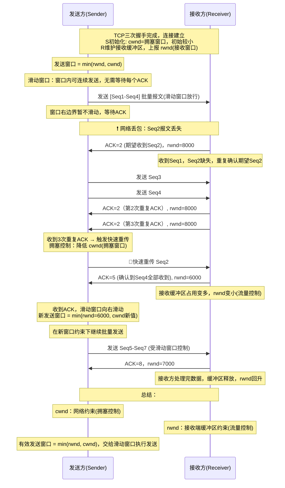

### 三次握手后滑动窗口、rwnd/cwnd、丢包重传的完整流程

> TCP 重传、滑动窗口、流量控制、拥塞控制分别解决什么问题.

```mermaid
    sequenceDiagram
        participant S as 发送方(Sender)
        participant R as 接收方(Receiver)

        Note over S,R: TCP三次握手完成，连接建立<br/>S初始化: cwnd=拥塞窗口，初始较小<br/>R维护接收缓冲区，上报 rwnd(接收窗口)

        Note over S: 发送窗口 = min(rwnd, cwnd)
        Note over S: 滑动窗口：窗口内可连续发送，无需等待每个ACK

        %% 第一轮批量发送
        S->>R: 发送 [Seq1‑Seq4] 批量报文(滑动窗口放行)
        Note over S: 窗口右边界暂不滑动，等待ACK

        %% 中间丢包：Seq2丢失
        Note over S,R: ❗ 网络丢包：Seq2报文丢失
        R->>S: ACK=2 (期望收到Seq2)，rwnd=8000
        Note over R: 收到Seq1，Seq2缺失，重复确认期望Seq2

        %% 继续收到后续报文Seq3、Seq4
        S->>R: 发送 Seq3
        S->>R: 发送 Seq4
        R->>S: ACK=2（第2次重复ACK）, rwnd=8000
        R->>S: ACK=2（第3次重复ACK）, rwnd=8000

        %% 快速重传触发
        Note over S: 收到3次重复ACK → 触发快速重传<br/>拥塞控制：降低 cwnd(拥塞窗口)
        S->>R: 🔁快速重传 Seq2

        %% 接收方收到缺失报文
        R->>S: ACK=5 (确认到Seq4全部收到), rwnd=6000
        Note over R: 接收缓冲区占用变多，rwnd变小(流量控制)
        Note over S: 收到ACK，滑动窗口向右滑动<br/>新发送窗口 = min(rwnd=6000, cwnd新值)

        %% 后续正常传输
        Note over S: 在新窗口约束下继续批量发送
        S->>R: 发送 Seq5‑Seq7 (受滑动窗口控制)
        R->>S: ACK=8，rwnd=7000
        Note over R: 接收方处理完数据，缓冲区释放，rwnd回升

        Note over S,R: 总结：
        Note over S: cwnd：网络约束(拥塞控制)
        Note over R: rwnd：接收端缓冲区约束(流量控制)
        Note over S: 有效发送窗口 = min(rwnd, cwnd)，交给滑动窗口执行发送
```