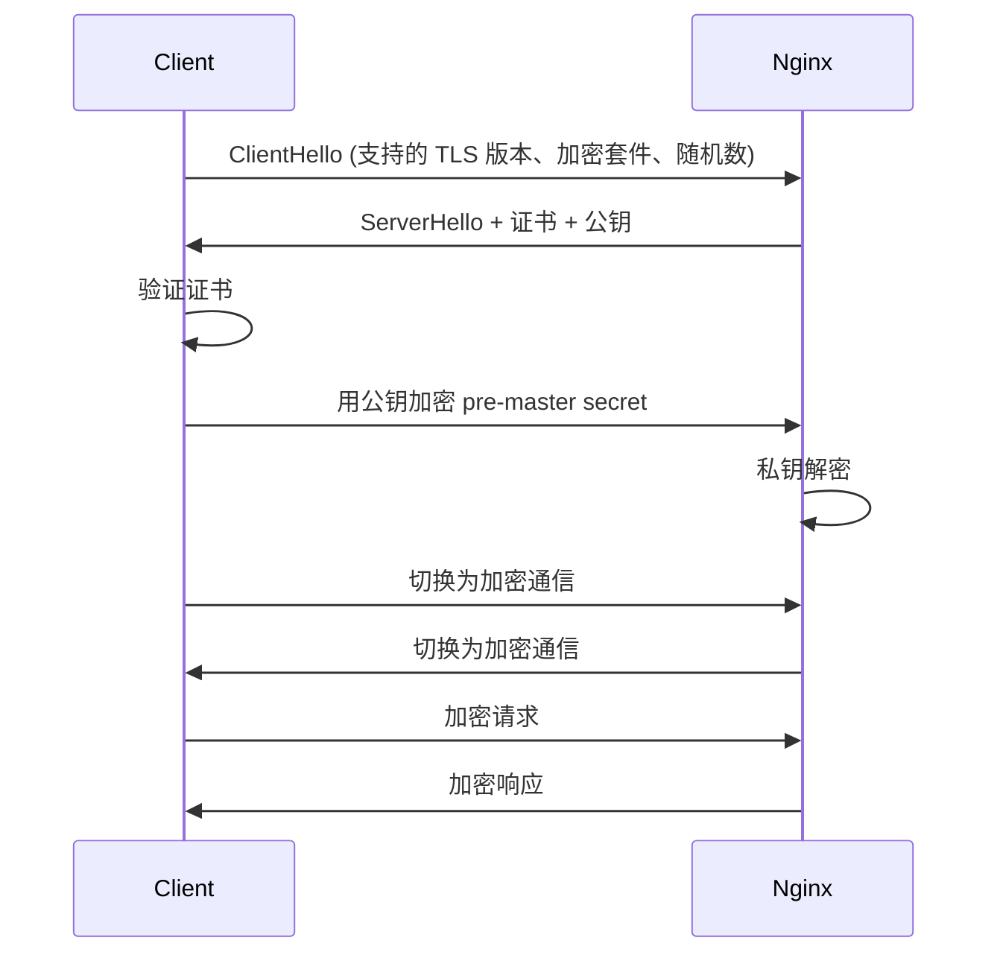
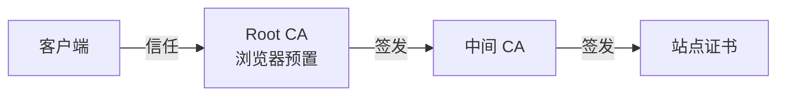

# Nginx HTTPS 与 SSL 配置

> 本章讲解 Nginx HTTPS 配置、证书生成、TLS 优化、HTTP/2、安全加固(HSTS、OCSP Stapling)等。

## 目录

- [一、HTTPS 基础](#一https-基础)
- [二、证书生成](#二证书生成)
- [三、Nginx HTTPS 配置](#三nginx-https-配置)
- [四、HTTP/2 配置](#四http2-配置)
- [五、安全加固](#五安全加固)
- [六、HTTP 强制跳转 HTTPS](#六http-强制跳转-https)
- [七、证书自动续期](#七证书自动续期)
- [八、SSL 性能优化](#八ssl-性能优化)

## 一、HTTPS 基础

### 1.1 TLS 握手流程



| 阶段 | 作用 |
|------|------|
| ClientHello | 协商 TLS 版本、加密套件 |
| 证书 | 服务端身份验证 |
| 密钥交换 | 协商对称密钥 |
| 加密通信 | 用对称密钥加解密 |

### 1.2 证书类型

| 类型 | 颁发 | 信任 | 适用 |
|------|------|------|------|
| 自签名 | 自己 | 浏览器警告 | 测试 |
| DV | CA 自动验证域名 | ✓ | 个人/普通站 |
| OV | CA 验证组织 | ✓✓ | 企业站 |
| EV | CA 严格验证 | ✓✓✓ 显示组织名 | 金融 |

### 1.3 证书文件格式

| 格式 | 编码 | 内容 |
|------|------|------|
| `.crt` / `.cer` | PEM 或 DER | 证书 |
| `.key` | PEM | 私钥 |
| `.csr` | PEM | 证书签名请求 |
| `.pem` | PEM(BASE64) | 通用 |
| `.p12` / `.pfx` | 二进制 | 证书+私钥打包 |

Nginx 用 PEM 格式(`.crt` + `.key`)。

## 二、证书生成

### 2.1 自签名证书(测试)

```bash
# 生成自签名证书(测试用)
openssl req -x509 -nodes -days 365 \
  -newkey rsa:2048 \
  -keyout nginx.key \
  -out nginx.crt
```

**参数详解**:

| 参数 | 含义 |
|------|------|
| `req` | 使用 CSR 子命令 |
| `-x509` | 输出自签名证书而非 CSR |
| `-nodes` | 不加密私钥(无密码) |
| `-days 365` | 有效期 365 天 |
| `-newkey rsa:2048` | 生成 2048 位 RSA 新私钥 |
| `-keyout` | 私钥文件 |
| `-out` | 证书文件 |

> 浏览器会警告"不安全",但能正常加密。

### 2.2 生成 CSR 申请正式证书

```bash
# 1. 生成私钥
openssl genrsa -out nginx.key 2048

# 2. 生成 CSR
openssl req -new -key nginx.key -out nginx.csr
# 按提示填:
# Country Name (2 letter code) []:CN
# State or Province Name []:Beijing
# Locality Name (eg, city) []:Beijing
# Organization Name (eg, company) []:MyCompany
# Common Name []:example.com
# Email Address []:admin@example.com

# 3. 把 nginx.csr 提交给 CA,获取签名后的 nginx.crt
```

### 2.3 Let's Encrypt 免费证书

```bash
# 使用 certbot
certbot certonly --webroot -w /var/www/html -d example.com -d www.example.com

# 证书位置:
# /etc/letsencrypt/live/example.com/fullchain.pem
# /etc/letsencrypt/live/example.com/privkey.pem
```

| 文件 | 内容 |
|------|------|
| `fullchain.pem` | 证书链 |
| `privkey.pem` | 私钥 |
| `chain.pem` | 中间证书 |
| `cert.pem` | 站点证书 |

## 三、Nginx HTTPS 配置

### 3.1 最简配置

```nginx
server {
    listen 443 ssl;
    server_name example.com;

    ssl_certificate     /etc/nginx/certs/nginx.crt;
    ssl_certificate_key /etc/nginx/certs/nginx.key;

    location / {
        root /usr/share/nginx/html;
        index index.html;
    }
}
```

### 3.2 推荐配置

```nginx
server {
    listen 443 ssl http2;
    server_name example.com;

    # 证书与私钥
    ssl_certificate     /etc/nginx/certs/fullchain.pem;
    ssl_certificate_key /etc/nginx/certs/privkey.pem;

    # 会话缓存(性能)
    ssl_session_cache shared:SSL:10m;
    ssl_session_timeout 10m;
    ssl_session_tickets off;

    # 协议与加密套件
    ssl_protocols TLSv1.2 TLSv1.3;
    ssl_ciphers ECDHE-ECDSA-AES128-GCM-SHA256:ECDHE-RSA-AES128-GCM-SHA256:ECDHE-ECDSA-AES256-GCM-SHA384:ECDHE-RSA-AES256-GCM-SHA384;
    ssl_prefer_server_ciphers off;

    # 安全头
    add_header Strict-Transport-Security "max-age=63072000; includeSubDomains; preload" always;
    add_header X-Frame-Options SAMEORIGIN;
    add_header X-Content-Type-Options nosniff;

    location / {
        proxy_pass http://backend;
    }
}
```

### 3.3 指令详解

| 指令 | 含义 | 推荐值 |
|------|------|-------|
| `ssl_certificate` | 证书(含链) | fullchain.pem |
| `ssl_certificate_key` | 私钥 | privkey.pem |
| `ssl_protocols` | TLS 版本 | TLSv1.2 TLSv1.3 |
| `ssl_ciphers` | 加密套件 | ECDHE + AES-GCM |
| `ssl_prefer_server_ciphers` | 服务端优先选择套件 | TLS 1.3 off |
| `ssl_session_cache` | 会话缓存 | `shared:SSL:10m` |
| `ssl_session_timeout` | 会话超时 | 10m |
| `ssl_session_tickets` | TLS Session Ticket | off(前瞻保密) |

### 3.4 证书链



> `ssl_certificate` 必须包含**站点证书 + 中间证书**(即 fullchain),否则部分客户端无法验证。Let's Encrypt 的 `fullchain.pem` 已包含。

### 3.5 多证书 SNI

```nginx
server {
    listen 443 ssl http2;
    server_name a.com;
    ssl_certificate     /etc/nginx/certs/a.com.crt;
    ssl_certificate_key /etc/nginx/certs/a.com.key;
}

server {
    listen 443 ssl http2;
    server_name b.com;
    ssl_certificate     /etc/nginx/certs/b.com.crt;
    ssl_certificate_key /etc/nginx/certs/b.com.key;
}
```

SNI(Server Name Indication)允许同一 IP:port 服务多个域名证书。Nginx 1.25+ 还支持 `ssl_reject_handshake on` 兜底。

## 四、HTTP/2 配置

### 4.1 启用

```nginx
listen 443 ssl http2;
```

| 特性 | HTTP/1.1 | HTTP/2 |
|------|----------|--------|
| 多路复用 | ✗ | ✓ |
| 头部压缩 | ✗ | HPACK |
| 服务端推送 | ✗ | ✓(已不推荐) |
| 二进制 | 文本 | 二进制 |
| 强制 HTTPS | 否 | 是(浏览器要求) |

### 4.2 HTTP/2 推送(已废弃)

```nginx
# Nginx 1.25.1+ 已移除 http2_push,不推荐使用
# http2_push /style.css;
```

> Chrome 已移除对 HTTP/2 Push 的支持,推荐用 `<link rel="preload">`。

## 五、安全加固

### 5.1 HSTS

```nginx
add_header Strict-Transport-Security "max-age=63072000; includeSubDomains; preload" always;
```

| 参数 | 含义 |
|------|------|
| `max-age=63072000` | 2 年内强制 HTTPS |
| `includeSubDomains` | 含子域名 |
| `preload` | 加入浏览器预加载列表 |

> HSTS 第一次访问无效(用户没拿到头),preload 列表解决冷启动。

### 5.2 OCSP Stapling

```nginx
ssl_stapling on;
ssl_stapling_verify on;
ssl_trusted_certificate /etc/nginx/certs/chain.pem;
resolver 8.8.8.8 8.8.4.4 valid=300s;
resolver_timeout 5s;
```

| 问题 | OCSP Stapling 解决 |
|------|-------------------|
| 客户端查询 CA OCSP 暴露用户访问 | Nginx 代查并附带在握手 |
| CA 服务器宕机影响验证 | Nginx 缓存 OCSP 响应 |

### 5.3 其他安全头

```nginx
# 防止点击劫持
add_header X-Frame-Options SAMEORIGIN;

# 防止 MIME 嗅探
add_header X-Content-Type-Options nosniff;

# CSP(内容安全策略)
add_header Content-Security-Policy "default-src 'self'";

# Referrer
add_header Referrer-Policy "strict-origin-when-cross-origin";
```

| 头 | 作用 |
|----|------|
| `X-Frame-Options` | 防点击劫持 |
| `X-Content-Type-Options` | 防 MIME 嗅探 |
| `Content-Security-Policy` | 内容白名单 |
| `Referrer-Policy` | Referrer 控制 |

### 5.4 禁用弱加密

```nginx
# 不要用 SSLv3、TLSv1.0、TLSv1.1
ssl_protocols TLSv1.2 TLSv1.3;

# 弱加密套件不要包含
# RC4, DES, 3DES, MD5, SHA1, EXPORT, NULL
```

| 算法 | 状态 |
|------|------|
| SSLv3 / TLSv1.0 / 1.1 | 弃用 |
| TLSv1.2 | 主流 |
| TLSv1.3 | 推荐 |
| RC4 / MD5 / SHA1 | 弱 |

## 六、HTTP 强制跳转 HTTPS

### 6.1 简单跳转

```nginx
server {
    listen 80;
    server_name example.com;
    return 301 https://$host$request_uri;
}
```

### 6. 双 server 共存

```nginx
# HTTP 强制跳转
server {
    listen 80;
    server_name example.com www.example.com;
    return 301 https://$host$request_uri;
}

# HTTPS 主服务
server {
    listen 443 ssl http2;
    server_name example.com www.example.com;
    ssl_certificate     /etc/nginx/certs/example.com.crt;
    ssl_certificate_key /etc/nginx/certs/example.com.key;
    location / {
        proxy_pass http://backend;
    }
}
```

## 七、证书自动续期

### 7.1 Let's Encrypt 自动续期

```bash
# 测试续期
certbot renew --dry-run

# 实际续期(到期 30 天内)
certbot renew

# 续期后 reload Nginx
# /etc/letsencrypt/renewal-hooks/deploy/reload-nginx.sh
#!/bin/bash
nginx -s reload
```

### 7.2 crontab

```bash
# 每周一 3 点尝试续期
0 3 * * 1 /usr/bin/certbot renew --quiet
```

## 八、SSL 性能优化

### 8.1 会话复用

| 机制 | 指令 | 说明 |
|------|------|------|
| Session Cache | `ssl_session_cache shared:SSL:10m` | 服务端缓存会话 |
| Session Ticket | `ssl_session_tickets on` | 客户端缓存(有前向保密争议) |

```nginx
ssl_session_cache shared:SSL:10m;
ssl_session_timeout 10m;
ssl_session_tickets off;
```

> `shared:SSL:10m` 在多 worker 间共享,10m 约支持 4 万个会话。

### 8.2 TLS 1.3 优化

```nginx
ssl_protocols TLSv1.2 TLSv1.3;
ssl_early_data on;  # TLS 1.3 0-RTT(注意重放攻击风险)
```

| 特性 | TLS 1.2 | TLS 1.3 |
|------|---------|---------|
| 握手 RTT | 2 | 1 |
| 0-RTT | ✗ | ✓(可选) |
| 加密套件 | 多 | 精简,全前向保密 |

### 8.3 完整优化示例

```nginx
server {
    listen 443 ssl http2;
    server_name example.com;

    ssl_certificate     /etc/nginx/certs/fullchain.pem;
    ssl_certificate_key /etc/nginx/certs/privkey.pem;

    ssl_protocols TLSv1.2 TLSv1.3;
    ssl_ciphers ECDHE-ECDSA-AES128-GCM-SHA256:ECDHE-RSA-AES128-GCM-SHA256:ECDHE-ECDSA-AES256-GCM-SHA384:ECDHE-RSA-AES256-GCM-SHA384:ECDHE-ECDSA-CHACHA20-POLY1305:ECDHE-RSA-CHACHA20-POLY1305;
    ssl_prefer_server_ciphers off;

    ssl_session_cache shared:SSL:10m;
    ssl_session_timeout 10m;
    ssl_session_tickets off;

    ssl_stapling on;
    ssl_stapling_verify on;
    ssl_trusted_certificate /etc/nginx/certs/chain.pem;
    resolver 8.8.8.8 8.8.4.4 valid=300s;
    resolver_timeout 5s;

    add_header Strict-Transport-Security "max-age=63072000; includeSubDomains; preload" always;

    location / {
        proxy_pass http://backend;
    }
}
```

## 九、Docker 启动 HTTPS 示例

### 9.1 生成证书

```bash
mkdir cert && cd cert
openssl req -x509 -nodes -days 365 \
  -newkey rsa:2048 \
  -keyout nginx.key -out nginx.crt
```

### 9.2 配置

```nginx
server {
    listen 443 ssl;
    server_name testnginx.com;
    ssl_certificate     /home/nginx.crt;
    ssl_certificate_key /home/nginx.key;
    ssl_session_timeout 5m;
    ssl_protocols TLSv1.2 TLSv1.3;
    ssl_ciphers HIGH:!aNULL:!MD5;
    ssl_prefer_server_ciphers on;
    location / {
        root /usr/share/nginx/html;
        index index.html index.htm;
    }
}
```

### 9.3 启动

```bash
docker run -itd \
  -p 80:80 -p 443:443 \
  -v ./nginx.crt:/home/nginx.crt \
  -v ./nginx.key:/home/nginx.key \
  -v ./nginx.conf:/etc/nginx/conf.d/proxy.conf \
  nginx:1.25
```

访问 `https://localhost/`,输出 Welcome to nginx!。

## 十、SSL 测试工具

| 工具 | 用途 |
|------|------|
| [SSL Labs](https://www.ssllabs.com/ssltest/) | 在线扫描 SSL 配置等级 |
| `openssl s_client` | 命令行测试握手 |
| `nmap --script ssl-enum-ciphers` | 列出加密套件 |
| `testssl.sh` | 综合本地测试 |

```bash
# 命令行测试
openssl s_client -connect example.com:443 -servername example.com

# 查看 TLS 1.3
openssl s_client -connect example.com:443 -tls1_3
```

## 相关专题

- [README.md](./README.md) Nginx 整体架构
- [核心配置详解.md](./核心配置详解.md) 配置层级
- [反向代理与负载均衡.md](./反向代理与负载均衡.md) upstream
- [性能调优.md](./性能调优.md) 性能参数
