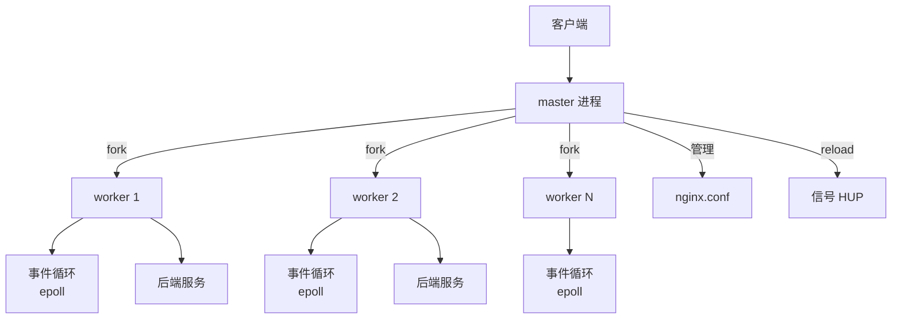
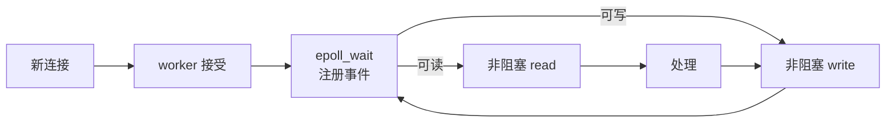
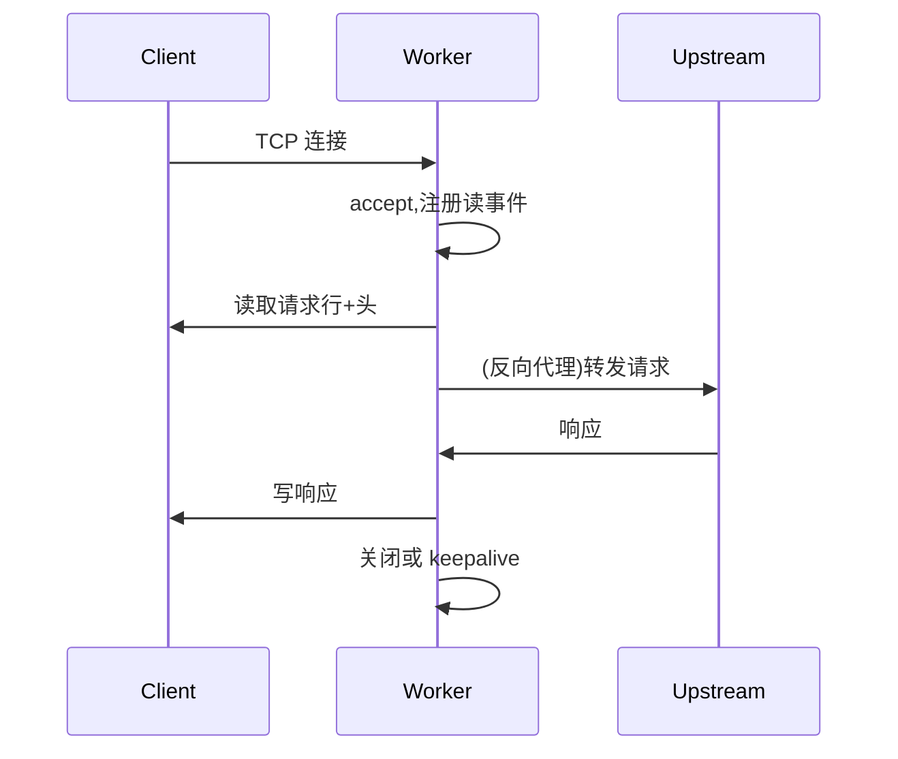
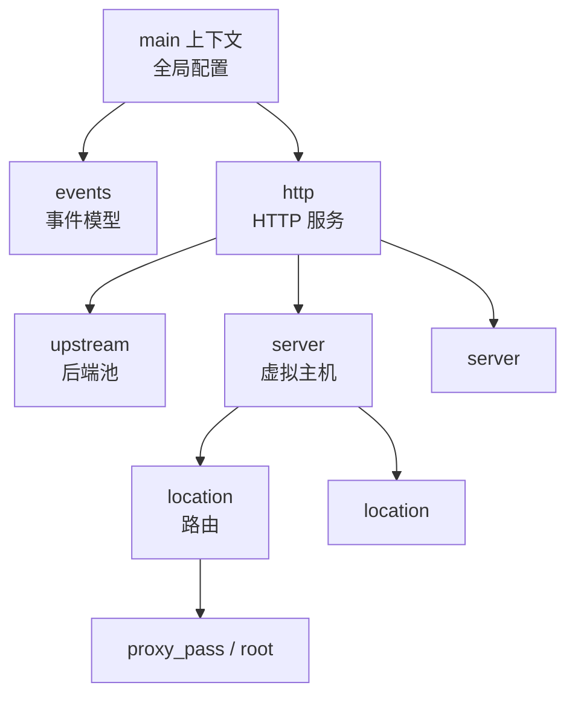

# Nginx

> Nginx 是工业级高性能 Web 服务器 / 反向代理 / API 网关,核心设计是**事件驱动 + 多进程 + 非阻塞 I/O**。本章系统讲解 Nginx 架构、配置、负载均衡、HTTPS、性能调优等核心知识。

## 目录

- [README.md](./README.md) — 你正在看的总览
- [核心配置详解.md](./核心配置详解.md) — 配置层级、指令、变量、location 匹配规则
- [反向代理与负载均衡.md](./反向代理与负载均衡.md) — upstream、6 种算法、健康检查、会话粘性
- [HTTPS与SSL配置.md](./HTTPS与SSL配置.md) — 证书、安全加固、HTTP/2、HSTS
- [域名与路由配置.md](./域名与路由配置.md) — 多域名、多路由、转发头处理
- [性能调优.md](./性能调优.md) — worker、连接数、缓冲、gzip、内核参数
- [面试要点.md](./面试要点.md) — 高频面试题与速查

## 一、整体架构



| 进程 | 数量 | 职责 |
|------|------|------|
| master | 1 | 读取配置、管理 worker、响应信号(reload/stop) |
| worker | `worker_processes` | 处理实际请求,事件驱动 |
| cache manager | 0-N | 缓存管理(可选) |

### 1.1 master / worker 模型

- **master 不处理请求**,只管理 worker
- **worker 之间完全独立**,互不共享连接(避免锁)
- 每个 worker 是一个**单线程事件循环**,可处理数万并发连接

### 1.2 worker 数量

```nginx
worker_processes auto;  # 默认 auto,等于 CPU 核数
```

| 配置 | 适用 |
|------|------|
| `auto` | 通用,CPU 核数 |
| `4` | 固定数量 |
| `worker_cpu_affinity auto;` | 绑核,提升缓存命中率 |

> 不是越多越好。worker 数 = CPU 核数是最佳实践,太多反而上下文切换损耗。

### 1.3 事件驱动模型



| 事件模型 | 平台 | 说明 |
|---------|------|------|
| epoll | Linux | 默认,高效 |
| kqueue | FreeBSD/macOS | 高效 |
| select/poll | 跨平台 | 兼容,性能差 |

> Linux 默认用 epoll,通过 `use epoll;` 可强制指定。

### 1.4 请求处理流程



## 二、配置文件层级



```nginx
# 全局
worker_processes auto;

events {
    worker_connections 10240;
    use epoll;
}

http {
    # http 块配置
    include       mime.types;
    default_type  application/octet-stream;

    upstream backend {
        server 10.0.0.1:8080;
        server 10.0.0.2:8080;
    }

    server {
        listen 80;
        server_name example.com;
        location / {
            proxy_pass http://backend;
        }
    }
}
```

| 块 | 作用域 | 典型指令 |
|----|-------|---------|
| main | 全局 | worker_processes、error_log |
| events | events | worker_connections、use |
| http | http | sendfile、keepalive_timeout、log_format |
| upstream | http | 负载均衡池、算法 |
| server | http | listen、server_name |
| location | server | proxy_pass、root、index |

详细配置见 [核心配置详解.md](./核心配置详解.md)。

## 三、核心能力一览

| 能力 | 模块 | 关键指令 |
|------|------|---------|
| 静态文件 | ngx_http_core_module | `root` / `index` |
| 反向代理 | ngx_http_proxy_module | `proxy_pass` |
| 负载均衡 | ngx_http_upstream_module | `upstream` |
| HTTPS | ngx_http_ssl_module | `ssl_certificate` |
| gzip | ngx_http_gzip_module | `gzip on` |
| rewrite | ngx_http_rewrite_module | `rewrite` / `if` |
| 限流 | ngx_http_limit_req_module | `limit_req` |
| 缓存 | ngx_http_proxy_module | `proxy_cache` |

## 四、安装与启动

### 4.1 Docker 启动

```bash
docker run --name nginx \
  -p 80:80 -p 443:443 \
  -v ./nginx.conf:/etc/nginx/conf.d/proxy.conf \
  -v ./html:/usr/share/nginx/html \
  -v ./certs:/etc/nginx/certs \
  nginx:1.25
```

### 4.2 配置文件位置

| 文件 | 位置 |
|------|------|
| 主配置 | `/etc/nginx/nginx.conf` |
| 子配置 | `/etc/nginx/conf.d/*.conf` |
| 默认站点 | `/etc/nginx/conf.d/default.conf` |
| 静态资源 | `/usr/share/nginx/html` |
| 日志 | `/var/log/nginx/access.log`、`/var/log/nginx/error.log` |

### 4.3 常用命令

```bash
nginx -t              # 测试配置语法
nginx -s reload       # 热重载(不中断连接)
nginx -s stop         # 停止
nginx -s reopen       # 重新打开日志(日志切割)
nginx -V             # 查看编译参数与模块
```

## 五、与同类组件对比

| 维度 | Nginx | Apache | HAProxy | Envoy |
|------|-------|--------|--------|-------|
| 模型 | 事件驱动 | 进程/线程 | 事件驱动 | 事件驱动 |
| 静态文件 | ✓ 强 | ✓ 强 | ✗ | ✗ |
| 反向代理 | ✓ 强 | ✓ | ✓ 强 | ✓ 强 |
| L4 负载 | stream 模块 | ✗ | ✓ 强 | ✓ |
| HTTP/2 | ✓ | ✓ | 部分 | ✓ |
| 配置语言 | DSL | DSL | DSL | YAML |
| 适用 | Web + 反代 + 网关 | 传统 Web | L4/L7 LB | Service Mesh |

## 六、相关资料

- [Nginx 官方文档](https://nginx.org/en/docs/)
- [Nginx 核心 DEEPDIVE 文章集](https://www.nginx.com/blog/deep-dive-nginx-architecture/)
- [agentzh 的 Nginx 教程](https://openresty.org/download/agentzh-nginx-tutorials-en.html)
