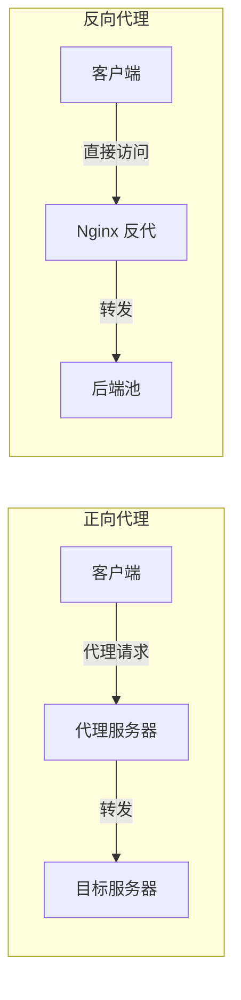
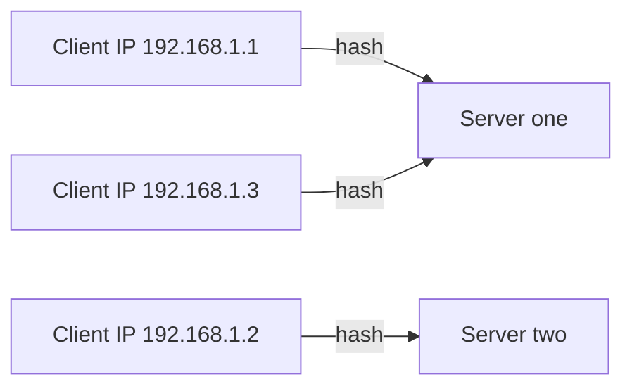
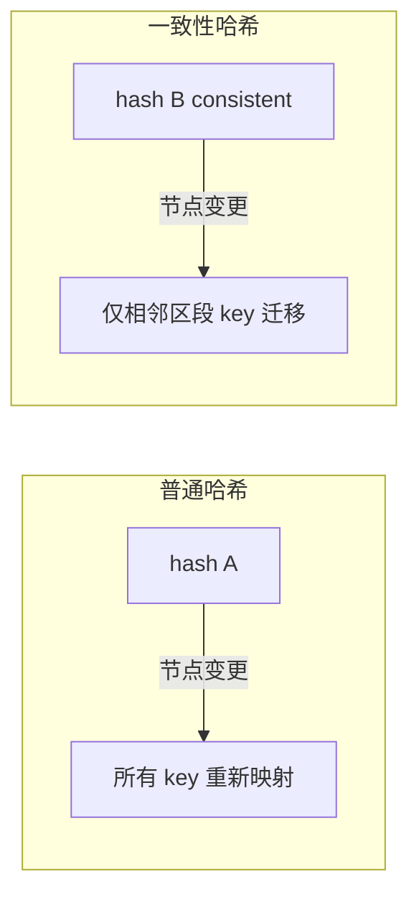
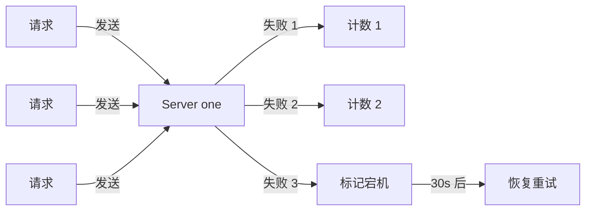
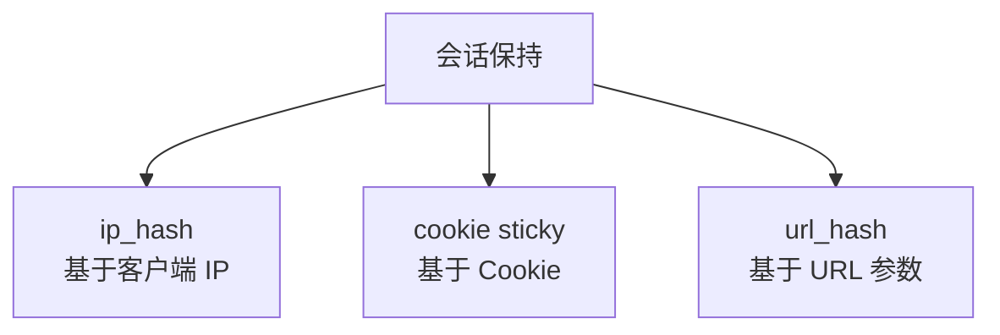
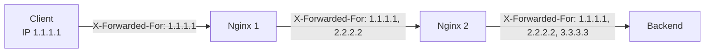
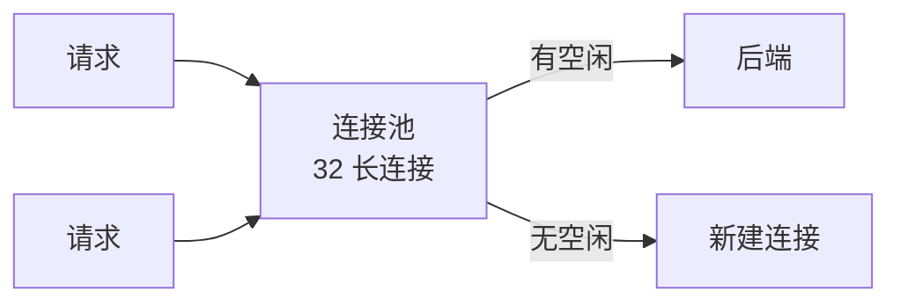

# Nginx 反向代理与负载均衡

> 反向代理与负载均衡是 Nginx 在生产中最重要的能力。本章系统讲解 upstream 配置、6 种负载均衡算法、健康检查、故障转移、会话粘性。

## 目录

- [一、反向代理基础](#一反向代理基础)
- [二、upstream 配置](#二upstream-配置)
- [三、负载均衡算法](#三负载均衡算法)
- [四、健康检查与故障转移](#四健康检查与故障转移)
- [五、会话粘性](#五会话粘性)
- [六、转发头处理](#六转发头处理)
- [七、长连接与连接池](#七长连接与连接池)
- [八、实战示例](#八实战示例)

## 一、反向代理基础

### 1.1 正向 vs 反向代理



| 维度 | 正向代理 | 反向代理 |
|------|---------|---------|
| 客户端感知 | ✓ 知道有代理 | ✗ 以为是目标 |
| 代理谁 | 代理客户端 | 代理服务端 |
| 用途 | 翻墙、隐藏 IP | 负载均衡、SSL 终止、缓存 |

### 1.2 基本反向代理

```nginx
server {
    listen 80;
    server_name example.com;

    location / {
        proxy_pass http://127.0.0.1:8080;
    }
}
```

| 关键指令 | 作用 |
|---------|------|
| `proxy_pass` | 转发目标 URL |
| `proxy_set_header` | 设置转发给后端的头 |
| `proxy_connect_timeout` | 连接后端超时 |
| `proxy_read_timeout` | 读后端响应超时 |
| `proxy_send_timeout` | 发请求给后端超时 |

## 二、upstream 配置

```nginx
http {
    upstream backend {
        server 10.0.0.1:8080 weight=3;
        server 10.0.0.2:8080 weight=1;
        server 10.0.0.3:8080 backup;
    }

    server {
        location / {
            proxy_pass http://backend;
        }
    }
}
```

### 2.1 server 参数

```nginx
server address [parameters];
```

| 参数 | 含义 |
|------|------|
| `weight=N` | 权重,默认 1 |
| `max_fails=N` | 失败 N 次标记宕机,默认 1 |
| `fail_timeout=T` | 失败统计窗口,默认 10s |
| `backup` | 备用,主节点全挂才启用 |
| `down` | 永久标记不可用 |
| `max_conns=N` | 单后端最大并发连接数 |
| `slow_start=T` | 慢启动,逐步恢复权重 |
| `resolve` | 动态解析域名(商业版) |

### 2.2 upstream 参数

```nginx
upstream backend {
    # 算法指令(二选一)
    # ip_hash;
    # least_conn;
    # hash $request_uri;

    # 长连接池
    keepalive 32;
    keepalive_requests 1000;
    keepalive_timeout 60s;

    server 10.0.0.1:8080;
}
```

| 指令 | 作用 |
|------|------|
| `keepalive N` | 到后端的长连接池大小 |
| `keepalive_requests` | 单连接最大请求数 |
| `keepalive_timeout` | 长连接空闲超时 |
| `queue T N` | 请求排队(商业版) |

## 三、负载均衡算法

### 3.1 算法总览

| 算法 | 指令 | 适用 |
|------|------|------|
| 轮询 | 默认 | 通用 |
| 加权轮询 | `weight=N` | 后端性能不均 |
| ip_hash | `ip_hash;` | 会话粘性 |
| least_conn | `least_conn;` | 长短任务混合 |
| url_hash | `hash $uri;` | 缓存命中率 |
| 一致性哈希 | `hash $key consistent;` | 节点变更影响小 |

### 3.2 加权轮询(默认)

```nginx
upstream backend {
    server one:8080 weight=3;
    server two:8080 weight=1;
}
```

**调度结果**:3:1 比例分配,one 拿到 75%,two 拿到 25%。

> Nginx 的加权轮询是**平滑加权轮询**(Smooth Weighted Round-Robin),避免连续打到同一节点。

### 3.3 ip_hash

```nginx
upstream backend {
    ip_hash;
    server one:8080;
    server two:8080;
}
```

**原理**:对客户端 IP 哈希,固定到同一后端。



| 特性 | 说明 |
|------|------|
| 解决 session | 简单方案,无需后端改造 |
| 取前 3 段 IPv4 | `192.168.1.x` 视为同一来源 |
| 节点宕机 | 自动 fallback 到其他节点 |
| 节点扩缩容 | 大量 session 重新映射 |

### 3.4 least_conn

```nginx
upstream backend {
    least_conn;
    server one:8080;
    server two:8080;
}
```

**原理**:选择当前活跃连接数最少的后端。配合 weight 时,按 `连接数/weight` 选最小。

| 适用 | 不适用 |
|------|-------|
| 长短请求混合 | 请求处理时间相近 |
| 后端性能差异大 | 短连接高频请求 |

### 3.5 url_hash(第三方算法用 hash 指令)

```nginx
upstream backend {
    hash $request_uri;
    server one:8080;
    server two:8080;
}
```

**原理**:对 URL 哈希,同一 URL 始终打到同一后端,提高后端缓存命中率。

### 3.6 一致性哈希

```nginx
upstream backend {
    hash $request_uri consistent;
    server one:8080;
    server two:8080;
}
```



| 算法 | 节点扩缩容影响 | 缓存失效率 |
|------|-------------|----------|
| 普通哈希 | 全部 key 重新映射 | 100% |
| 一致性哈希 | 仅 k/N 个 key 迁移 | 1/N |

### 3.7 fair(第三方模块)

按后端响应时间智能分配,响应快的优先。需安装 `nginx-upstream-fair` 模块。

```nginx
upstream backend {
    fair;
    server one:8080;
    server two:8080;
}
```

## 四、健康检查与故障转移

### 4.1 被动健康检查(开源版)

```nginx
upstream backend {
    server one:8080 max_fails=3 fail_timeout=30s;
    server two:8080 max_fails=3 fail_timeout=30s;
}
```

| 参数 | 含义 |
|------|------|
| `max_fails=3` | 30s 内失败 3 次标记宕机 |
| `fail_timeout=30s` | 失败窗口 + 宕机时长,30s 后重试 |



### 4.2 主动健康检查(商业版 / 第三方)

商业版 `health_check`:

```nginx
location / {
    proxy_pass http://backend;
    health_check interval=10s fails=3 passes=2;
}
```

开源版可用 `nginx_upstream_check_module` 第三方模块。

### 4.3 故障转移超时配置

```nginx
location / {
    proxy_pass http://backend;

    proxy_connect_timeout 1s;  # 连接后端超时
    proxy_send_timeout 1s;      # 发送请求超时
    proxy_read_timeout 1s;      # 读响应超时

    proxy_next_upstream error timeout http_502 http_503 http_504;
    proxy_next_upstream_tries 3;
    proxy_next_upstream_timeout 5s;
}
```

| 指令 | 含义 |
|------|------|
| `proxy_next_upstream` | 哪些错误触发切换下一个后端 |
| `proxy_next_upstream_tries` | 最多尝试几个后端 |
| `proxy_next_upstream_timeout` | 切换总超时 |

`proxy_next_upstream` 触发条件:

| 值 | 含义 |
|----|------|
| `error` | 连接错误 |
| `timeout` | 超时 |
| `http_502` / `http_503` / `http_504` | 后端返回这些状态 |
| `invalid_header` | 响应头无效 |
| `http_404` | 404(谨慎使用) |
| `off` | 禁用故障转移 |

## 五、会话粘性

### 5.1 三种方案对比



| 方案 | 实现难度 | 后端无感知 | 客户端 IP 变动 |
|------|---------|----------|---------------|
| ip_hash | 简单 | ✓ | 失效 |
| sticky cookie | 中(商业版/模块) | ✓ | 不影响 |
| url_hash | 简单 | ✓ | 不影响 |

### 5.2 ip_hash

```nginx
upstream backend {
    ip_hash;
    server one:8080;
    server two:8080;
}
```

> 节点宕机会自动 fallback,节点恢复后会重新转发回原节点。

### 5.3 sticky cookie(商业版)

```nginx
upstream backend {
    sticky name=srv_id expires=1h domain=.example.com path=/;
    server one:8080;
    server two:8080;
}
```

| 参数 | 含义 |
|------|------|
| `name` | cookie 名 |
| `expires` | 过期时间 |
| `domain` | 域名 |
| `path` | 路径 |
| `httponly` | JS 不可读 |

### 5.4 sticky 第三方模块

开源版用 `nginx-sticky-module`:

```nginx
upstream backend {
    sticky;
    server one:8080;
    server two:8080;
}
```

## 六、转发头处理

### 6.1 必备转发头

```nginx
location / {
    proxy_pass http://backend;

    # 保留原 Host
    proxy_set_header Host $host;

    # 客户端真实 IP
    proxy_set_header X-Real-IP $remote_addr;

    # 链路 IP(追加)
    proxy_set_header X-Forwarded-For $proxy_add_x_forwarded_for;

    # 协议(http/https)
    proxy_set_header X-Forwarded-Proto $scheme;
}
```

| 头 | 用途 |
|----|------|
| `Host` | 后端识别虚拟主机 |
| `X-Real-IP` | 客户端真实 IP |
| `X-Forwarded-For` | 客户端 IP 链路 |
| `X-Forwarded-Proto` | 原协议 |

### 6.2 X-Forwarded-For 链路



`$proxy_add_x_forwarded_for` 自动追加当前 `$remote_addr` 到链路末尾。

### 6.3 透传 WebSocket

```nginx
location /ws {
    proxy_pass http://backend;
    proxy_http_version 1.1;
    proxy_set_header Upgrade $http_upgrade;
    proxy_set_header Connection "upgrade";
    proxy_read_timeout 3600s;  # 长连接超时
}
```

## 七、长连接与连接池

### 7.1 到后端的长连接

```nginx
upstream backend {
    server 10.0.0.1:8080;
    keepalive 32;  # 连接池大小
}

server {
    location / {
        proxy_pass http://backend;
        proxy_http_version 1.1;        # 必须 1.1
        proxy_set_header Connection "";  # 清空 Connection 头
    }
}
```

| 配置 | 作用 |
|------|------|
| `keepalive N` | 与后端保持 N 个长连接 |
| `proxy_http_version 1.1` | 必须用 HTTP/1.1 才支持 keepalive |
| `proxy_set_header Connection ""` | 清空,避免 close |

### 7.2 连接池工作原理



> 没有 keepalive 时,每个请求都要新建 TCP 连接,后端 TIME_WAIT 堆积,高 QPS 下成为瓶颈。

## 八、实战示例

### 8.1 完整生产示例

```nginx
upstream backend {
    least_conn;
    server 10.0.0.1:8080 weight=3 max_fails=3 fail_timeout=30s;
    server 10.0.0.2:8080 weight=3 max_fails=3 fail_timeout=30s;
    server 10.0.0.3:8080 weight=1 backup;
    keepalive 64;
}

server {
    listen 80;
    server_name api.example.com;

    location / {
        proxy_pass http://backend;

        proxy_http_version 1.1;
        proxy_set_header Connection "";
        proxy_set_header Host $host;
        proxy_set_header X-Real-IP $remote_addr;
        proxy_set_header X-Forwarded-For $proxy_add_x_forwarded_for;
        proxy_set_header X-Forwarded-Proto $scheme;

        proxy_connect_timeout 2s;
        proxy_send_timeout 10s;
        proxy_read_timeout 30s;

        proxy_next_upstream error timeout http_502 http_503 http_504;
        proxy_next_upstream_tries 3;
        proxy_next_upstream_timeout 5s;
    }
}
```

### 8.2 Docker 启动多后端 + Nginx 负载均衡

```bash
docker network create nginx-test

# 两个后端
docker run --network nginx-test -itd \
  --network-alias one 435861851/gin:v0.0.1
docker run --network nginx-test -itd \
  --network-alias two hashicorp/http-echo -text="hello world"

# Nginx
docker run --name nginx --network nginx-test -itd \
  -p 80:80 \
  -v ./nginx.conf:/etc/nginx/conf.d/proxy.conf \
  nginx:1.25
```

```nginx
# nginx.conf
upstream backServer {
    server one:8080 weight=1;
    server two:5678 weight=2;
}

server {
    listen 80;
    server_name testnginx.com;
    location / {
        proxy_pass http://backServer;
    }
}
```

### 8.3 验证

```bash
# 配置 hosts
echo "127.0.0.1 testnginx.com" >> /etc/hosts

# 多次访问验证轮询
curl testnginx.com  # {"message":"Hello Gin!"}
curl testnginx.com  # hello world
```

### 8.4 故障转移验证

```bash
# 启动后关闭 one,验证 Nginx 自动切到 two
docker stop one
curl testnginx.com  # 仍可访问,走 two
```

> 即使不配 `proxy_connect_timeout`,Nginx 也会在默认超时后切换,但配置后切换更快。

## 相关专题

- [README.md](./README.md) Nginx 整体架构
- [核心配置详解.md](./核心配置详解.md) 配置层级与指令
- [HTTPS与SSL配置.md](./HTTPS与SSL配置.md) 证书与安全
- [性能调优.md](./性能调优.md) worker、连接数、缓冲
