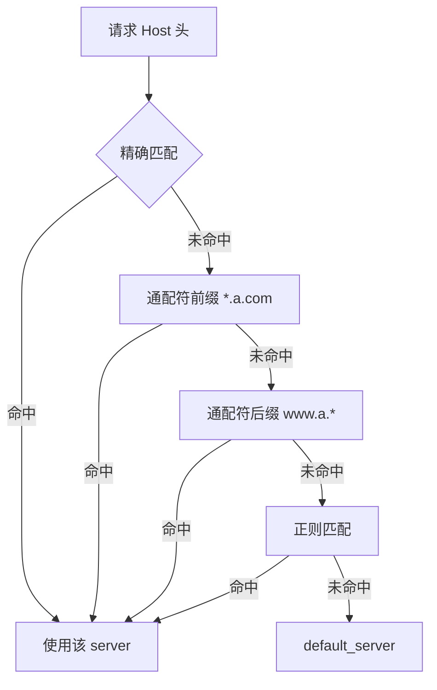
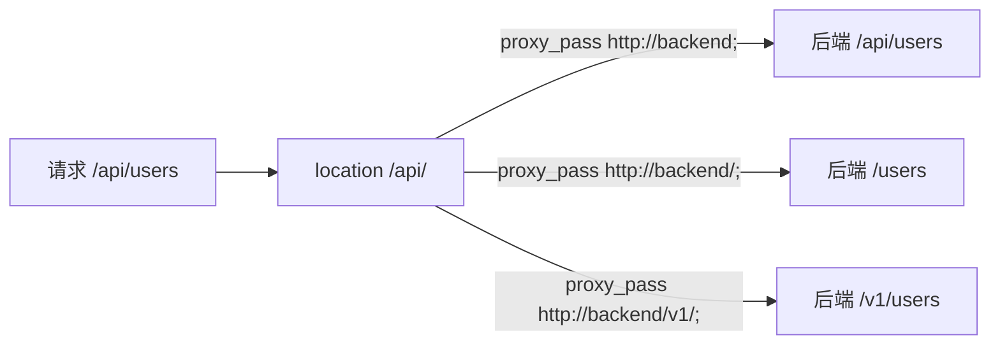
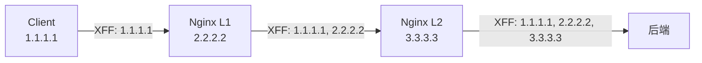

# Nginx 域名与路由配置

> 本章聚焦 Nginx 的多域名分发、多路由分发、不同后端按 URL 路径转发等实战场景。

## 目录

- [一、多域名分发](#一多域名分发)
- [二、多路由分发](#二多路由分发)
- [三、proxy_pass 路径规则](#三proxy_pass-路径规则)
- [四、转发头处理](#四转发头处理)
- [五、按请求头分流](#五按请求头分流)
- [六、生产实战](#六生产实战)

## 一、多域名分发

### 1.1 不同域名指向不同后端

```nginx
server {
    listen 80;
    server_name a.com;
    location / {
        proxy_pass http://service-a:8080;
        proxy_set_header Host $host;
        proxy_set_header X-Real-IP $remote_addr;
        proxy_set_header X-Forwarded-For $proxy_add_x_forwarded_for;
        proxy_set_header X-Forwarded-Proto $scheme;
    }
}

server {
    listen 80;
    server_name b.com;
    location / {
        proxy_pass http://service-b:8080;
        proxy_set_header Host $host;
        proxy_set_header X-Real-IP $remote_addr;
        proxy_set_header X-Forwarded-For $proxy_add_x_forwarded_for;
        proxy_set_header X-Forwarded-Proto $scheme;
    }
}
```

### 1.2 server_name 匹配优先级



| 优先级 | 类型 | 示例 |
|-------|------|------|
| 1 | 精确 | `a.com` |
| 2 | 通配符前缀 | `*.a.com` |
| 3 | 通配符后缀 | `www.a.*` |
| 4 | 正则 | `~^www\d+\.a\.com$` |
| 5 | default_server | 兜底 |

### 1.3 默认虚拟主机

```nginx
server {
    listen 80 default_server;
    server_name _;  # 无效域名,作为兜底
    return 444;     # 关闭连接
}
```

> 生产环境用 default_server 拒绝未知 Host,防止域名仿冒。

## 二、多路由分发

### 2.1 同域名不同路径

```nginx
server {
    listen 80;
    server_name example.com;

    location / {
        proxy_pass http://frontend:80;
    }

    location /api {
        proxy_pass http://api:8080;
    }

    location /user {
        proxy_pass http://user-service:8080;
    }

    location /static {
        root /var/www;
        expires 30d;
    }
}
```

### 2.2 路径前缀剥离

| proxy_pass 写法 | 行为 |
|---------------|------|
| `proxy_pass http://backend;` | 保留原 URI |
| `proxy_pass http://backend/;` | 替换 location 前缀 |
| `proxy_pass http://backend/api;` | 替换为指定路径 |

```nginx
# 请求 /api/users → 后端 /users
location /api/ {
    proxy_pass http://backend/;
}

# 请求 /api/users → 后端 /v2/users
location /api/ {
    proxy_pass http://backend/v2/;
}

# 请求 /api/users → 后端 /api/users(保留)
location /api {
    proxy_pass http://backend;
}
```

### 2.3 URL 重写后转发

```nginx
location /old-api/ {
    rewrite ^/old-api/(.*)$ /api/$1 break;
    proxy_pass http://backend;
}

location /v1/ {
    rewrite ^/v1/(.*)$ /v2/$1 last;
}

location /v2/ {
    proxy_pass http://backend;
}
```

| flag | 行为 |
|------|------|
| `last` | 重新匹配 location |
| `break` | 停止 rewrite,继续当前 location |
| `redirect` | 302 跳转 |
| `permanent` | 301 跳转 |

## 三、proxy_pass 路径规则

### 3.1 关键区别:末尾的 `/`

```nginx
# 情况 1:proxy_pass 无 URI
location /api {
    proxy_pass http://backend;
    # 请求 /api/users → 后端 /api/users
}

# 情况 2:proxy_pass 有 URI(含末尾 /)
location /api/ {
    proxy_pass http://backend/;
    # 请求 /api/users → 后端 /users
}

# 情况 3:proxy_pass 有路径
location /api/ {
    proxy_pass http://backend/v1/;
    # 请求 /api/users → 后端 /v1/users
}
```



### 3.2 带 upstream 名的写法

```nginx
upstream backend {
    server 10.0.0.1:8080;
}

location /api/ {
    proxy_pass http://backend/;  # upstream 名 + URI
}
```

> 注意:upstream 名 + URI 时,upstream 名必须不含路径。

### 3.3 常见坑

```nginx
# ❌ 错:有 URI 时不能用 rewrite 修改 URI
location /api/ {
    rewrite ^/api/(.*)$ /v1/$1 break;
    proxy_pass http://backend/;  # 此时 / 不会拼接 rewrite 后的 URI
}

# ✅ 对:rewrite 后 proxy_pass 不带 URI
location /api/ {
    rewrite ^/api/(.*)$ /v1/$1 break;
    proxy_pass http://backend;
}
```

## 四、转发头处理

### 4.1 标准转发头

```nginx
proxy_set_header Host $host;
proxy_set_header X-Real-IP $remote_addr;
proxy_set_header X-Forwarded-For $proxy_add_x_forwarded_for;
proxy_set_header X-Forwarded-Proto $scheme;
```

| 头 | 含义 |
|----|------|
| `Host` | 原请求 Host,后端识别虚拟主机 |
| `X-Real-IP` | 客户端真实 IP |
| `X-Forwarded-For` | IP 链路 |
| `X-Forwarded-Proto` | 原协议 |

### 4.2 X-Forwarded-For 链路



`$proxy_add_x_forwarded_for` 自动追加当前 `$remote_addr`:

```nginx
proxy_set_header X-Forwarded-For $proxy_add_x_forwarded_for;
# 等价于:
# if (X-Forwarded-For 存在) 追加 $remote_addr
# else 直接用 $remote_addr
```

### 4.3 透传原始请求头

```nginx
proxy_pass_request_headers on;  # 默认 on
# 或单独透传
proxy_set_header X-Custom-Header $http_x_custom_header;
```

### 4.4 后端拿真实客户端 IP

后端通常要从 X-Forwarded-For 取**第一个 IP**:

```go
func realIP(r *http.Request) string {
    xff := r.Header.Get("X-Forwarded-For")
    if xff != "" {
        return strings.Split(xff, ",")[0]
    }
    return r.RemoteAddr
}
```

## 五、按请求头分流

### 5.1 按 User-Agent 区分 PC/Mobile

```nginx
map $http_user_agent $is_mobile {
    default 0;
    ~*mobile 1;
    ~*android 1;
    ~*iphone 1;
}

server {
    location / {
        if ($is_mobile) {
            proxy_pass http://mobile-backend;
        }
        proxy_pass http://pc-backend;
    }
}
```

### 5.2 按 Cookie 灰度

```nginx
map $cookie_canary $is_canary {
    default 0;
    "true" 1;
}

server {
    location / {
        if ($is_canary) {
            proxy_pass http://canary-backend;
            break;
        }
        proxy_pass http://stable-backend;
    }
}
```

### 5.3 按 Header 路由

```nginx
map $http_x_env $target {
    default  "http://prod-backend";
    "stage"  "http://stage-backend";
    "dev"    "http://dev-backend";
}

server {
    location / {
        proxy_pass $target;
    }
}
```

> 注意:`proxy_pass` 用变量时,**不能含 upstream 名**,且要求 DNS resolver。

## 六、生产实战

### 6.1 完整配置示例

```nginx
# 客户端请求缓冲
client_body_buffer_size 2048m;
client_header_buffer_size 2048m;
client_max_body_size 2048m;

server {
    listen 80;
    server_name a.com;
    location / {
        proxy_pass http://127.0.0.1:5000;
        proxy_set_header Host $host;
        proxy_set_header X-Real-IP $remote_addr;
        proxy_set_header X-Forwarded-For $proxy_add_x_forwarded_for;
        proxy_set_header X-Forwarded-Proto $scheme;
    }
}

server {
    listen 80;
    server_name b.com;
    location / {
        proxy_pass http://gin:8080;
        proxy_set_header Host $host;
        proxy_set_header X-Real-IP $remote_addr;
        proxy_set_header X-Forwarded-For $proxy_add_x_forwarded_for;
        proxy_set_header X-Forwarded-Proto $scheme;
    }
}
```

### 6.2 多路由 + 静态资源

```nginx
user nginx;
worker_processes auto;

events {
    worker_connections 1024;
}

http {
    include       mime.types;
    default_type  application/octet-stream;

    log_format  main  '$remote_addr - $remote_user [$time_local] "$request" '
                      '$status $body_bytes_sent "$http_referer" '
                      '"$http_user_agent" "$http_x_forwarded_for"';

    access_log /var/log/nginx/access.log main;

    sendfile on;
    keepalive_timeout 65;

    upstream api_backend {
        server 10.0.0.1:8080;
    }

    upstream user_backend {
        server 10.0.0.2:8080;
    }

    server {
        listen 80;
        server_name example.com;

        error_page 500 502 503 504 /50x.html;

        location /api {
            proxy_pass http://api_backend;
            proxy_set_header Host $host;
            proxy_set_header X-Real-IP $remote_addr;
            proxy_set_header X-Forwarded-For $proxy_add_x_forwarded_for;
        }

        location /user {
            proxy_pass http://user_backend;
            proxy_set_header Host $host;
            proxy_set_header X-Real-IP $remote_addr;
            proxy_set_header X-Forwarded-For $proxy_add_x_forwarded_for;
        }

        location /static {
            root /var/www;
            expires 30d;
            add_header Cache-Control "public, immutable";
        }

        location / {
            root /var/www/html;
            index index.html;
            try_files $uri $uri/ /index.html;
        }

        location = /50x.html {
            root /usr/share/nginx/html;
            internal;
        }
    }
}
```

### 6.3 SPA 应用回退到 index.html

```nginx
location / {
    root /var/www/html;
    try_files $uri $uri/ /index.html;
}
```

> React/Vue 等单页应用路由在前端,所有未匹配路径都返回 index.html。

### 6.4 Docker 启动验证

```bash
docker network create nginx-test

docker run --name nginx \
  --network nginx-test -itd \
  -p 80:80 \
  -v ./nginx.conf:/etc/nginx/conf.d/proxy.conf \
  nginx:1.25

# 后端服务
docker run --network nginx-test -itd \
  --network-alias gin \
  435861851/gin:v0.0.1

# 配置 hosts
echo "127.0.0.1 b.com" >> /etc/hosts

# 访问验证
curl http://b.com
# 输出 {"message":"Hello Gin!"}
```

## 相关专题

- [README.md](./README.md) Nginx 整体架构
- [核心配置详解.md](./核心配置详解.md) 配置层级与 location 匹配
- [反向代理与负载均衡.md](./反向代理与负载均衡.md) upstream 负载均衡
- [HTTPS与SSL配置.md](./HTTPS与SSL配置.md) HTTPS 证书
- [性能调优.md](./性能调优.md) 性能参数
