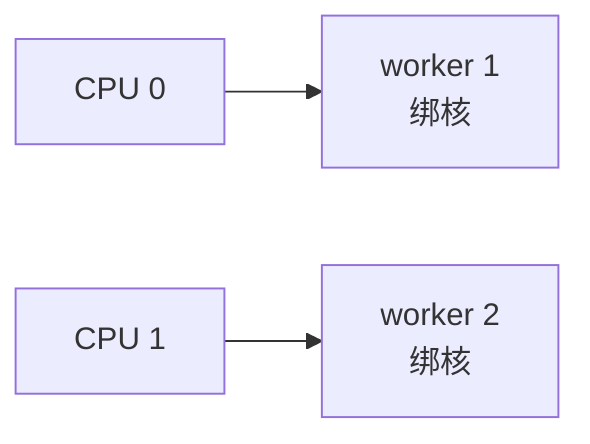
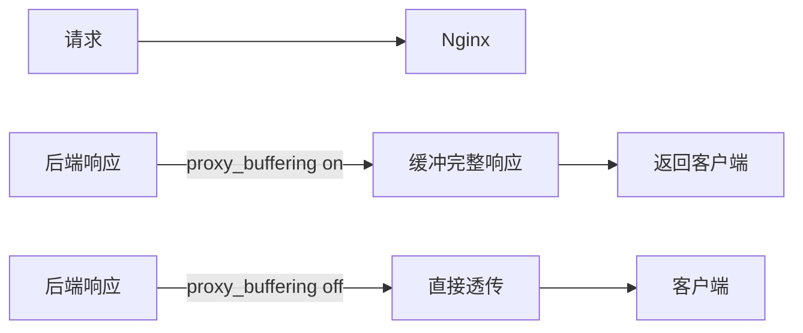
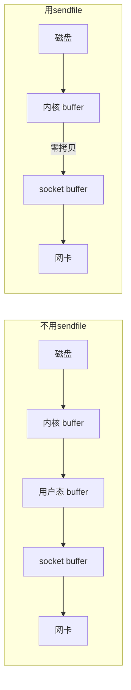
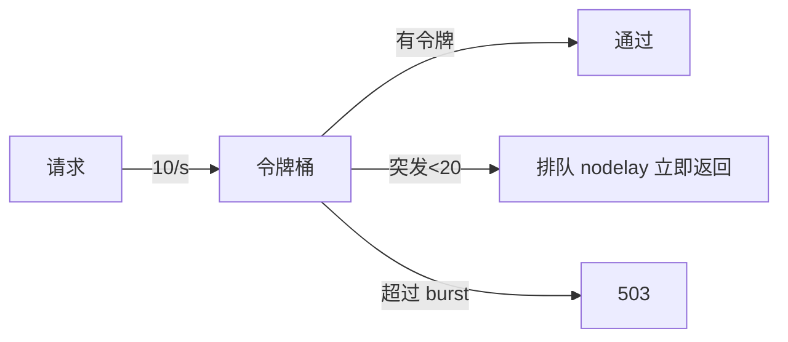

# Nginx 性能调优

> 本章系统讲解 Nginx 性能调优,涵盖 worker、连接数、缓冲、gzip、limit_req、内核参数等。

## 目录

- [一、性能瓶颈定位](#一性能瓶颈定位)
- [二、worker 调优](#二worker-调优)
- [三、连接数调优](#三连接数调优)
- [四、缓冲区调优](#四缓冲区调优)
- [五、gzip 压缩](#五gzip-压缩)
- [六、静态文件优化](#六静态文件优化)
- [七、限流](#七限流)
- [八、内核参数调优](#八内核参数调优)
- [九、监控指标](#九监控指标)

## 一、性能瓶颈定位

### 1.1 瓶颈分布


| 瓶颈 | 现象 | 排查 |
|------|------|------|
| CPU | top Nginx 进程 100% | worker 数、复杂正则 |
| 内存 | RES 持续增长 | 缓冲区过大、连接泄漏 |
| 磁盘 IO | iostat 高 | access_log 同步写、缓存盘 |
| 网络 | 带宽打满 | iftop、流量分析 |
| 后端 | upstream 响应慢 | 拆 Nginx、加缓存 |
| 连接数 | TIME_WAIT 堆积 | 内核参数、keepalive |

### 1.2 关键指标

```bash
# Nginx 状态(需编译 stub_status 模块)
curl http://localhost/nginx_status
# Active connections: 15
# server accepts handled requests
# 8456 8456 32891
# Reading: 0 Writing: 1 Waiting: 14
```

| 指标 | 含义 |
|------|------|
| Active connections | 当前活跃连接 |
| accepts | 总共接受的连接 |
| handled | 总共处理的连接 |
| requests | 总共处理的请求 |
| Reading | 正在读取请求头的连接 |
| Writing | 正在返回响应的连接 |
| Waiting | 长连接等待中的连接 |

## 二、worker 调优

### 2.1 worker 数量

```nginx
worker_processes auto;             # 默认,等于 CPU 核数
worker_cpu_affinity auto;          # 自动绑核
worker_rlimit_nofile 65535;        # 最大文件描述符
```

| 配置 | 推荐 |
|------|------|
| `worker_processes` | `auto` 或 CPU 核数 |
| `worker_cpu_affinity` | `auto` |
| `worker_rlimit_nofile` | 65535+(与 ulimit 一致) |

### 2.2 worker 上下文切换



| 不绑核 | 绑核 |
|-------|------|
| worker 在 CPU 间漂移 | 固定一个 CPU |
| L1/L2 缓存失效 | 缓存命中率高 |
| 上下文切换损耗 | 损耗小 |

```nginx
# 4 核手动绑核
worker_processes 4;
worker_cpu_affinity 0001 0010 0100 1000;

# 自动(推荐)
worker_processes auto;
worker_cpu_affinity auto;
```

### 2.3 worker_connections

```nginx
events {
    worker_connections 10240;
    use epoll;
    multi_accept on;
}
```

| 配置 | 推荐 |
|------|------|
| `worker_connections` | 10240+(每 worker) |
| `use` | epoll(Linux) |
| `multi_accept` | on(高并发) |
| `accept_mutex` | off(默认,Nginx 1.11+ 已优化) |

**最大并发 = `worker_processes × worker_connections`**

反代场景每客户端连接占 2 个连接(客户端 + 后端),实际约 `worker_connections / 2`。

### 2.4 用户级文件描述符

```bash
# 查看
ulimit -n
# 默认 1024

# 临时调高
ulimit -n 65535

# 永久
# /etc/security/limits.conf
* soft nofile 65535
* hard nofile 65535

# 或 systemd
# /etc/systemd/system/nginx.service
[Service]
LimitNOFILE=65535
```

## 三、连接数调优

### 3.1 keepalive

```nginx
http {
    keepalive_timeout 65;
    keepalive_requests 1000;
}
```

| 指令 | 含义 | 默认 |
|------|------|------|
| `keepalive_timeout` | 客户端 keepalive 空闲超时 | 75s |
| `keepalive_requests` | 单连接最大请求数 | 1000 |

### 3.2 到后端的长连接池

```nginx
upstream backend {
    server 10.0.0.1:8080;
    keepalive 32;
}

server {
    location / {
        proxy_pass http://backend;
        proxy_http_version 1.1;
        proxy_set_header Connection "";
    }
}
```

> 不开启时,每个请求都新建 TCP,后端 TIME_WAIT 堆积。

### 3.3 reset_timedout_connection

```nginx
reset_timedout_connection on;
```

> 开启后,超时连接立即关闭并发送 RST,释放内存。

## 四、缓冲区调优

### 4.1 客户端缓冲

```nginx
client_body_buffer_size 16k;     # 请求体内存缓冲
client_header_buffer_size 4k;     # 请求头缓冲
client_max_body_size 10m;          # 最大请求体
large_client_header_buffers 4 16k; # 大请求头
```

| 指令 | 默认 | 含义 |
|------|------|------|
| `client_body_buffer_size` | 8k/16k | 请求体内存缓冲,超出落盘 |
| `client_header_buffer_size` | 1k | 请求头第一块 |
| `client_max_body_size` | 1m | 请求体上限,超过 413 |
| `large_client_header_buffers` | 4 8k | 大请求头扩展缓冲 |

### 4.2 代理缓冲

```nginx
location / {
    proxy_pass http://backend;

    proxy_buffering on;              # 默认 on
    proxy_buffer_size 4k;            # 响应头缓冲
    proxy_buffers 8 4k;              # 响应体缓冲 8 块 4k
    proxy_busy_buffers_size 8k;      # 繁忙时使用缓冲上限
    proxy_temp_path /var/nginx/proxy_temp;
    proxy_max_temp_file_size 1024m;  # 落盘上限
    proxy_temp_file_write_size 8k;   # 落盘块大小
}
```

| 指令 | 含义 |
|------|------|
| `proxy_buffering on` | 缓冲整个响应再返回,提高吞吐 |
| `proxy_buffering off` | 直接透传(流式响应适用) |
| `proxy_buffers` | 响应体缓冲块 |
| `proxy_busy_buffers_size` | 同时用于响应和写入的缓冲 |



### 4.3 大文件上传下载

```nginx
# 大上传
client_max_body_size 1024m;
client_body_buffer_size 256k;
client_body_temp_path /var/nginx/body_temp;

# 大下载
proxy_max_temp_file_size 0;  # 不限制
proxy_buffering off;          # 流式下载
```

## 五、gzip 压缩

### 5.1 基础配置

```nginx
gzip on;
gzip_min_length 1k;
gzip_comp_level 6;
gzip_types text/plain text/css application/json application/javascript application/xml;
gzip_vary on;
gzip_proxied any;
gzip_disable "msie6";
```

| 指令 | 含义 | 推荐 |
|------|------|------|
| `gzip_min_length` | 小于此不压缩 | 1k |
| `gzip_comp_level` | 压缩级别 1-9 | 6 |
| `gzip_types` | 压缩的 MIME | text/* application/json |
| `gzip_vary` | 添加 Vary: Accept-Encoding | on |
| `gzip_proxied` | 反代请求是否压缩 | any |

### 5.2 压缩级别权衡

| 级别 | CPU 占用 | 压缩比 |
|------|---------|-------|
| 1 | 低 | 70% |
| 6 | 中 | 75%(推荐) |
| 9 | 高 | 80% |

> 高级别 CPU 开销线性增长,压缩比增益递减。6 是平衡点。

### 5.3 Brotli 压缩(更优)

```nginx
# 需安装 ngx_brotli 模块
brotli on;
brotli_comp_level 6;
brotli_types text/plain application/json;
```

| 算法 | 压缩比 | CPU | 兼容 |
|------|-------|-----|------|
| gzip | 中 | 中 | 全 |
| brotli | 高 | 中 | 现代浏览器 |

## 六、静态文件优化

### 6.1 sendfile / tcp_nopush

```nginx
sendfile on;
tcp_nopush on;
tcp_nodelay on;
```

| 指令 | 作用 |
|------|------|
| `sendfile on` | 内核态零拷贝,绕过用户态 |
| `tcp_nopush on` | 攒满包再发(配合 sendfile) |
| `tcp_nodelay on` | 小包立即发(配合 keepalive) |



### 6.2 缓存策略

```nginx
location ~* \.(jpg|jpeg|png|gif|ico|css|js)$ {
    expires 30d;
    add_header Cache-Control "public, immutable";
    access_log off;
}

location ~* \.(woff2?|ttf|eot|svg)$ {
    expires 1y;
    add_header Cache-Control "public";
    access_log off;
}
```

| 文件类型 | 缓存时间 |
|---------|---------|
| HTML | 不缓存或短 |
| CSS/JS | 30 天,带 hash |
| 图片 | 30 天 |
| 字体 | 1 年 |

### 6.3 open_file_cache

```nginx
open_file_cache max=10000 inactive=20s;
open_file_cache_valid 30s;
open_file_cache_min_uses 2;
open_file_cache_errors on;
```

| 指令 | 含义 |
|------|------|
| `max=10000` | 缓存 1 万个文件描述符 |
| `inactive=20s` | 20s 未访问则清除 |
| `valid=30s` | 30s 校验一次 |
| `min_uses=2` | 至少访问 2 次才缓存 |

## 七、限流

### 7.1 limit_req

```nginx
# 定义限流区
limit_req_zone $binary_remote_addr zone=req_limit:10m rate=10r/s;

server {
    location /api {
        limit_req zone=req_limit burst=20 nodelay;
        proxy_pass http://backend;
    }
}
```

| 参数 | 含义 |
|------|------|
| `zone=name:size` | 共享内存区 |
| `rate=10r/s` | 平均 10 请求/秒 |
| `burst=20` | 突发 20 个排队 |
| `nodelay` | 不延迟,超过 burst 立即 503 |
| `delay=N` | 前 N 个立即处理,后续排队 |



### 7.2 limit_conn

```nginx
limit_conn_zone $binary_remote_addr zone=conn_limit:10m;

server {
    location / {
        limit_conn conn_limit 10;  # 单 IP 最多 10 并发连接
    }
}
```

### 7.3 限制请求体大小

```nginx
client_max_body_size 10m;  # 超过返回 413
```

## 八、内核参数调优

### 8.1 sysctl 配置

```bash
# /etc/sysctl.conf
# TIME_WAIT 复用
net.ipv4.tcp_tw_reuse = 1

# 连接队列大小
net.core.somaxconn = 65535
net.ipv4.tcp_max_syn_backlog = 65535

# 文件描述符
fs.file-max = 1000000

# TCP 缓冲
net.ipv4.tcp_rmem = 4096 87380 16777216
net.ipv4.tcp_wmem = 4096 65536 16777216

# keepalive 探测
net.ipv4.tcp_keepalive_time = 600
net.ipv4.tcp_keepalive_intvl = 30
net.ipv4.tcp_keepalive_probes = 3

# 端口范围
net.ipv4.ip_local_port_range = 1024 65535

# 生效
sysctl -p
```

| 参数 | 含义 |
|------|------|
| `tcp_tw_reuse` | TIME_WAIT 复用 |
| `somaxconn` | 监听队列大小 |
| `tcp_max_syn_backlog` | SYN 队列 |
| `file-max` | 系统最大 fd |
| `tcp_rmem/wmem` | TCP 读写缓冲 |

### 8.2 ulimit

```bash
# 临时
ulimit -n 65535
ulimit -u 65535

# 永久(/etc/security/limits.conf)
* soft nofile 65535
* hard nofile 65535
* soft nproc 65535
* hard nproc 65535
```

### 8.3 完整调优清单

```mermaid
flowchart TD
    OS[OS 内核] --> Sysctl[/etc/sysctl.conf]
    OS --> Ulimit[/etc/security/limits.conf]
    Nginx[Nginx] --> Worker[worker_processes / cpu_affinity]
    Nginx --> Conn[worker_connections / rlimit_nofile]
    Nginx --> Buf[缓冲区 / proxy_buffering]
    Nginx --> Static[sendfile / 缓存]
    Nginx --> Gzip[gzip brotli]
    Nginx --> Limit[limit_req / limit_conn]
```

## 九、监控指标

### 9.1 stub_status

```nginx
location /nginx_status {
    stub_status on;
    access_log off;
    allow 127.0.0.1;
    deny all;
}
```

```
Active connections: 15
server accepts handled requests
 8456 8456 32891
Reading: 0 Writing: 1 Waiting: 14
```

### 9.2 关键 PromQL(配合 nginx_exporter)

| 指标 | 含义 |
|------|------|
| `nginx_connections_active` | 活跃连接数 |
| `nginx_connections_waiting` | 等待连接数 |
| `nginx_http_requests_total` | 总请求数 |
| `nginx_upstream_response_time_seconds` | 后端响应时间 |
| `nginx_upstream_failures_total` | 后端失败数 |

### 9.3 日志分析

```nginx
log_format perf '$remote_addr - [$time_local] '
                '"$request" $status $body_bytes_sent '
                'rt=$request_time '
                'urt=$upstream_response_time '
                'uct=$upstream_connect_time '
                'urt=$upstream_response_time';
```

| 字段 | 含义 |
|------|------|
| `$request_time` | 总请求时间 |
| `$upstream_response_time` | 后端处理时间 |
| `$upstream_connect_time` | 后端连接时间 |
| `$upstream_header_time` | 后端发响应头时间 |

```bash
# 找最慢的 10 个请求
awk '{print $NF}' /var/log/nginx/access.log | sort -nr | head -10

# 找 5xx 占比
awk '$9 ~ /^5/ {c++} END {print c/NR*100"%"}' /var/log/nginx/access.log
```

## 十、调优速查表

| 场景 | 配置 |
|------|------|
| 单机 10 万并发 | worker_processes auto + worker_connections 65535 + sysctl + ulimit |
| 大文件上传 | client_max_body_size + client_body_buffer_size |
| 静态文件加速 | sendfile + tcp_nopush + open_file_cache |
| 后端慢 | proxy buffering + keepalive |
| 防 DDoS | limit_req + limit_conn |
| CPU 高 | 检查复杂正则、worker 数 |
| 内存涨 | 缓冲区、worker_connections 过大 |
| TIME_WAIT 堆积 | tcp_tw_reuse + 后端 keepalive |

## 相关专题

- [README.md](./README.md) Nginx 整体架构
- [核心配置详解.md](./核心配置详解.md) 配置层级
- [反向代理与负载均衡.md](./反向代理与负载均衡.md) upstream
- [HTTPS与SSL配置.md](./HTTPS与SSL配置.md) SSL 性能
