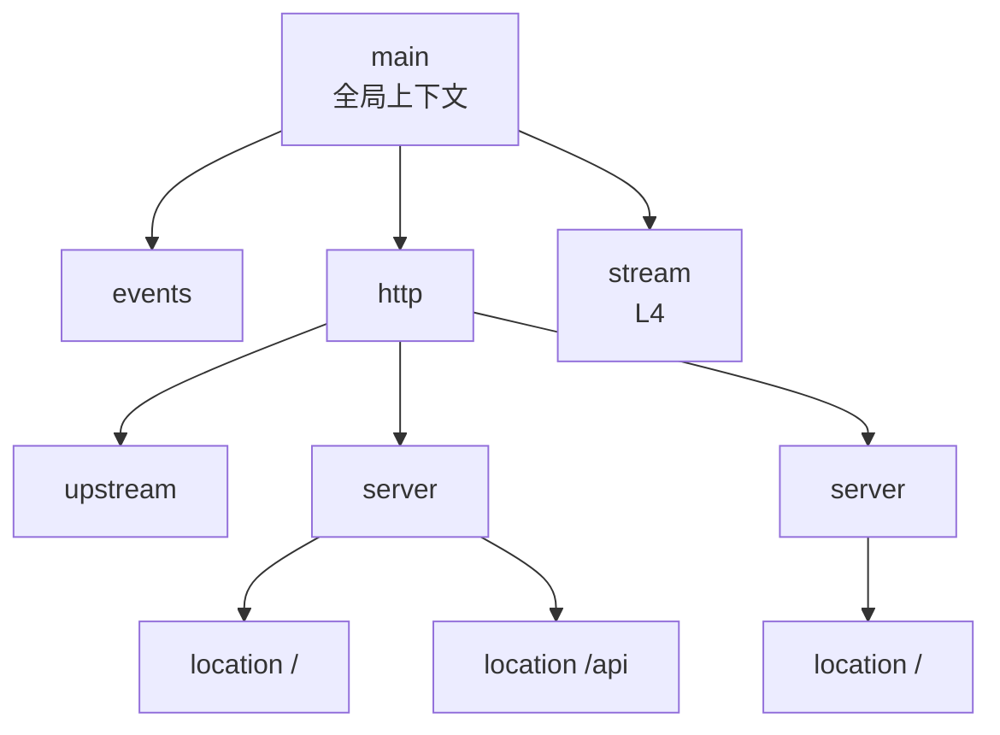
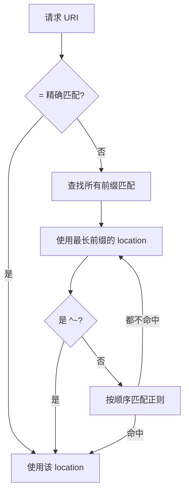

# Nginx 核心配置详解

> 本章系统讲解 nginx.conf 的层级、指令、变量、location 匹配规则等核心配置知识。

## 目录

- [一、配置文件层级](#一配置文件层级)
- [二、全局指令](#二全局指令)
- [三、events 块](#三events-块)
- [四、http 块](#四http-块)
- [五、server 虚拟主机](#五server-虚拟主机)
- [六、location 匹配规则](#六location-匹配规则)
- [七、变量体系](#七变量体系)
- [八、常用指令速查](#八常用指令速查)

## 一、配置文件层级



| 上下文 | 包含关系 | 用途 |
|-------|---------|------|
| main | 顶层 | 全局参数 |
| events | main 内 | 事件模型 |
| http | main 内 | HTTP 服务 |
| server | http 内 | 虚拟主机 |
| location | server 内 | URL 路由 |
| upstream | http 内 | 后端负载池 |
| stream | main 内 | TCP/UDP 代理 |

### 1.1 完整骨架示例

```nginx
user nginx;
worker_processes auto;
error_log /var/log/nginx/error.log warn;
pid /var/run/nginx.pid;

events {
    worker_connections 10240;
    use epoll;
}

http {
    include       /etc/nginx/mime.types;
    default_type  application/octet-stream;

    log_format main '$remote_addr - $remote_user [$time_local] '
                    '"$request" $status $body_bytes_sent '
                    '"$http_referer" "$http_user_agent"';
    access_log /var/log/nginx/access.log main;

    sendfile on;
    keepalive_timeout 65;
    gzip on;

    upstream backend {
        server 10.0.0.1:8080;
        server 10.0.0.2:8080;
    }

    server {
        listen 80;
        server_name example.com;
        location / {
            proxy_pass http://backend;
        }
    }
}
```

### 1.2 include 模块化

```nginx
http {
    include /etc/nginx/conf.d/*.conf;   # 自动加载所有子配置
    include /etc/nginx/sites-enabled/*;
}
```

> 生产实践:把每个 server 单独放 `conf.d/<name>.conf`,主配置只 include,便于管理。

## 二、全局指令

| 指令 | 含义 | 示例 |
|------|------|------|
| `user` | worker 运行用户 | `user nginx;` |
| `worker_processes` | worker 数量 | `auto` 或具体数字 |
| `worker_cpu_affinity` | 绑核 | `auto` |
| `worker_rlimit_nofile` | 最大文件描述符 | `65535;` |
| `error_log` | 错误日志路径与级别 | `/var/log/nginx/error.log warn;` |
| `pid` | PID 文件 | `/var/run/nginx.pid;` |
| `daemon` | 是否后台运行 | `on`(默认)/ `off`(调试用) |

### 2.1 日志级别

```
error_log /path [debug|info|notice|warn|error|crit|alert|emerg];
```

| 级别 | 用途 |
|------|------|
| debug | 调试(需要编译时 `--with-debug`) |
| info | 常用运维 |
| warn | 警告 |
| error | 错误,生产默认 |
| crit | 严重 |

## 三、events 块

```nginx
events {
    worker_connections 10240;    # 单 worker 最大连接数
    use epoll;                   # 事件模型(Linux)
    multi_accept on;             # 一次接受多个连接
    accept_mutex on;             # 惊群避免(默认 off)
}
```

| 指令 | 默认 | 含义 |
|------|------|------|
| `worker_connections` | 512/1024 | 单 worker 并发连接上限 |
| `use` | 自动 | 事件模型(epoll/kqueue/select) |
| `multi_accept` | off | 一次 accept 多个连接 |
| `accept_mutex` | off | worker 轮流 accept,避免惊群 |

**最大并发连接数 = `worker_processes × worker_connections`**。反向代理场景下,每个客户端连接还要消耗 1 个到后端的连接,实际并发约 `worker_connections / 2`。

## 四、http 块

```nginx
http {
    # 文件类型
    include       mime.types;
    default_type  application/octet-stream;

    # 日志
    log_format main '...';
    access_log /var/log/nginx/access.log main;

    # 性能
    sendfile on;
    tcp_nopush on;
    tcp_nodelay on;
    keepalive_timeout 65;
    keepalive_requests 100;

    # 压缩
    gzip on;
    gzip_types text/plain application/json;

    # 限流
    limit_req_zone $binary_remote_addr zone=req_limit:10m rate=10r/s;
}
```

| 指令类别 | 关键指令 |
|---------|---------|
| 文件类型 | `include mime.types`、`default_type` |
| 日志 | `log_format`、`access_log` |
| 性能 | `sendfile`、`tcp_nopush`、`keepalive_timeout` |
| 压缩 | `gzip`、`gzip_types` |
| 限流 | `limit_req_zone`、`limit_conn_zone` |
| 缓冲 | `client_body_buffer_size`、`client_max_body_size` |

### 4.1 sendfile / tcp_nopush / tcp_nodelay

| 指令 | 作用 |
|------|------|
| `sendfile on` | 内核态直接发送文件,绕过用户态拷贝 |
| `tcp_nopush on` | 配合 sendfile,等数据包攒大再发(降低开销) |
| `tcp_nodelay on` | 禁用 Nagle,小包立即发(低延迟) |

> `tcp_nopush` 和 `tcp_nodelay` 看似矛盾:前者用于 sendfile 大文件,后者用于 keepalive 小响应。Nginx 在响应不同阶段智能切换。

### 4.2 keepalive

| 指令 | 含义 | 默认 |
|------|------|------|
| `keepalive_timeout` | 客户端 keepalive 超时 | 75s |
| `keepalive_requests` | 单连接最大请求数 | 1000 |
| `upstream 中的 keepalive` | 到后端的长连接池 | - |

## 五、server 虚拟主机

```nginx
server {
    listen 80;
    server_name example.com www.example.com;

    root /var/www/example;
    index index.html index.htm;

    location / {
        try_files $uri $uri/ =404;
    }
}
```

### 5.1 listen 语法

```nginx
listen 80;
listen 443 ssl;
listen [::]:80;                    # IPv6
listen 127.0.0.1:8080;             # 指定地址
listen 443 ssl http2;              # HTTP/2
listen unix:/var/run/nginx.sock;   # Unix socket
```

| 选项 | 含义 |
|------|------|
| `default_server` | 该 server 是默认虚拟主机(未匹配 server_name 时) |
| `ssl` | 启用 SSL |
| `http2` | 启用 HTTP/2(需同时 ssl) |
| `reuseport` | 启用 SO_REUSEPORT,worker 各自 listen |

### 5.2 server_name 匹配优先级

```nginx
server_name example.com;           # 精确
server_name *.example.com;         # 通配符前缀
server_name www.example.*;         # 通配符后缀
server_name ~^www\d+\.example\.com$; # 正则
```

| 优先级 | 类型 | 例子 |
|-------|------|------|
| 1 | 精确匹配 | `example.com` |
| 2 | 通配符开头 | `*.example.com` |
| 3 | 通配符结尾 | `www.example.*` |
| 4 | 正则 | `~^www\d+\.example\.com$` |
| 5 | default_server | 兜底 |

### 5.3 多虚拟主机示例

```nginx
server {
    listen 80;
    server_name a.com;
    location / { proxy_pass http://service-a:8080; }
}

server {
    listen 80;
    server_name b.com;
    location / { proxy_pass http://service-b:8080; }
}
```

详细见 [域名与路由配置.md](./域名与路由配置.md)。

## 六、location 匹配规则

### 6.1 匹配语法

```nginx
location [ = | ~ | ~* | ^~ ] uri { ... }
```

| 修饰符 | 含义 | 优先级 |
|-------|------|-------|
| `=` | 精确匹配 | 1(最高) |
| `^~` | 前缀匹配,匹配后不再正则 | 2 |
| `~` | 区分大小写正则 | 3 |
| `~*` | 不区分大小写正则 | 3 |
| 无 | 普通前缀匹配 | 4(最低) |

### 6.2 匹配流程



### 6.3 示例

```nginx
location = / {
    # 仅匹配 /
}

location = /favicon.ico {
    # 精确匹配,可高缓存
}

location ^~ /static/ {
    # /static/ 开头,优先级高于正则
    root /var/www;
}

location ~* \.(gif|jpg|jpeg|png)$ {
    # 不区分大小写匹配图片
    expires 30d;
}

location /api {
    # 普通前缀,兜底
    proxy_pass http://backend;
}
```

### 6.4 嵌套 location

location 不能嵌套 location(语法不允许),但可以 `rewrite` 跳转或 `internal` 重定向。

## 七、变量体系

### 7.1 变量分类

```nginx
# 内置变量
$remote_addr        # 客户端 IP
$remote_user        # 客户端用户(Basic Auth)
$time_local         # 本地时间
$request            # 完整请求行
$request_method     # GET/POST
$request_uri        # 原始 URI(带参数)
$uri                # 规范化后的 URI
$args               # 查询参数
$host               # Host 头
$http_user_agent    # 任意请求头:$http_<header_name>
$status             # 响应状态码
$body_bytes_sent    # 响应体字节
```

### 7.2 自定义变量

```nginx
# map 映射
map $http_user_agent $is_mobile {
    default 0;
    ~*mobile 1;
}

server {
    location / {
        if ($is_mobile) { rewrite ^ /m$uri last; }
    }
}
```

### 7.3 变量常见用法

```nginx
log_format main '$remote_addr - [$time_local] '
                '"$request" $status $body_bytes_sent '
                '"$http_referer" "$http_user_agent" '
                'rt=$request_time uct="$upstream_connect_time"';

# 限流
limit_req_zone $binary_remote_addr zone=req:10m rate=10r/s;

# 转发头
proxy_set_header X-Real-IP $remote_addr;
proxy_set_header X-Forwarded-For $proxy_add_x_forwarded_for;
```

## 八、常用指令速查

### 8.1 静态文件

```nginx
root /var/www/example;       # 根目录
index index.html;            # 默认首页
try_files $uri $uri/ =404;   # 文件不存在则 404
expires 30d;                  # 缓存
```

`root` vs `alias`:

| 指令 | 拼接方式 | 例子 |
|------|---------|------|
| `root /var/www;` | URL 追加到 root 后 | `/static/a.css` → `/var/www/static/a.css` |
| `alias /var/www/;` | URL 替换 location 前缀 | `location /static/` + `/static/a.css` → `/var/www/a.css` |

### 8.2 rewrite

```nginx
rewrite ^/old/(.*)$ /new/$1 permanent;  # 301
rewrite ^/old/(.*)$ /new/$1 redirect;   # 302
rewrite ^/old/(.*)$ /new/$1 last;       # 内部重新匹配
rewrite ^/old/(.*)$ /new/$1 break;      # 停止 rewrite,继续当前 location
```

| flag | 含义 |
|------|------|
| `last` | 重新匹配 location |
| `break` | 停止 rewrite,继续处理 |
| `redirect` | 302 |
| `permanent` | 301 |

### 8.3 if 与条件

```nginx
if ($http_host = api.example.com) {
    return 418;
}

if ($request_method != GET) {
    return 405;
}
```

> **Nginx 官方建议避免 if**("If is Evil"),复杂逻辑用 `map` 或 `try_files` 替代。

### 8.4 错误页面

```nginx
error_page 404 /404.html;
error_page 500 502 503 504 /50x.html;

location = /50x.html {
    root /usr/share/nginx/html;
    internal;   # 仅内部跳转,外部访问返回 404
}
```

### 8.5 防盗链

```nginx
location ~* \.(gif|jpg|png)$ {
    valid_referers none blocked example.com *.example.com;
    if ($invalid_referer) {
        return 403;
    }
}
```

## 相关专题

- [README.md](./README.md) Nginx 整体架构
- [反向代理与负载均衡.md](./反向代理与负载均衡.md) upstream 与算法
- [HTTPS与SSL配置.md](./HTTPS与SSL配置.md) 证书与安全
- [域名与路由配置.md](./域名与路由配置.md) 多域名多路由
- [性能调优.md](./性能调优.md) 性能参数
