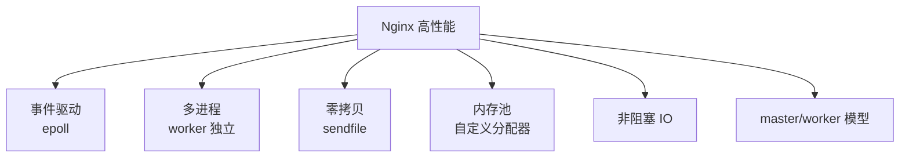
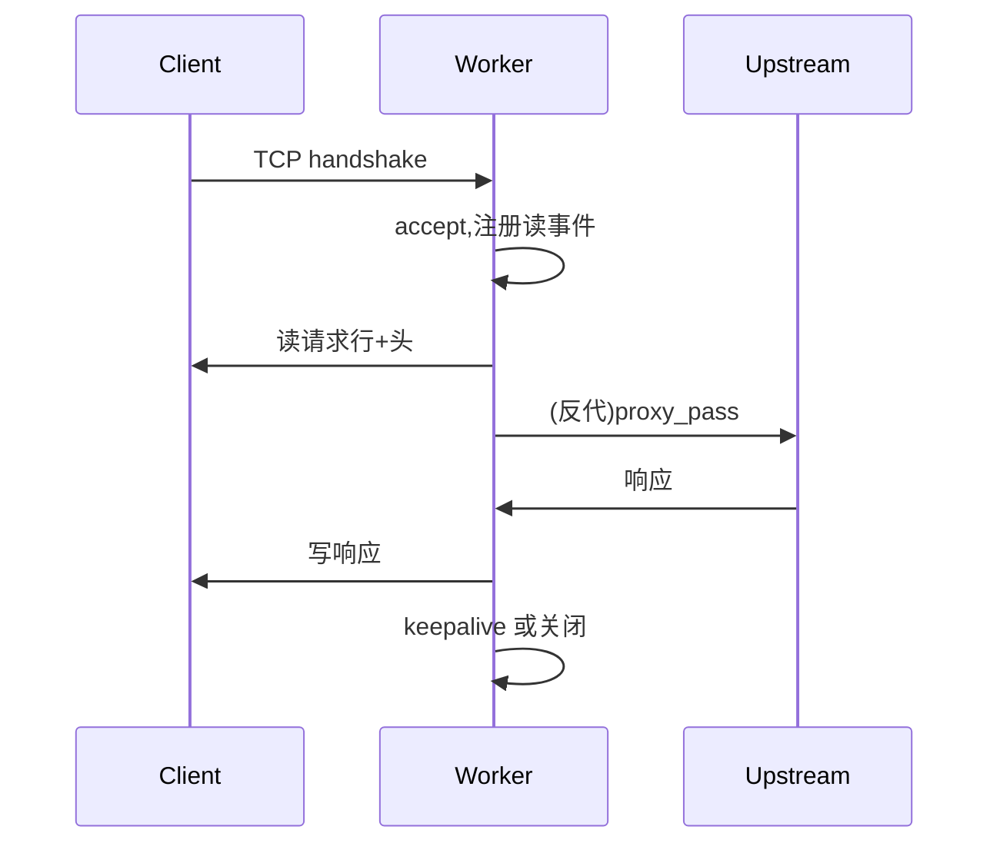
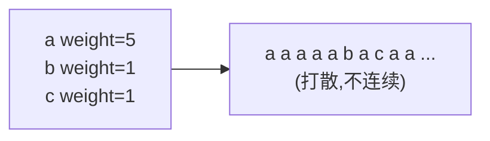
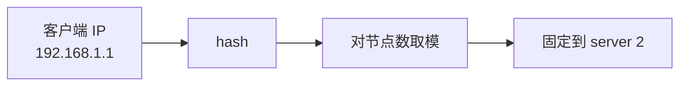

# Nginx 面试要点

> 本章汇总 Nginx 高频面试题,涵盖架构、配置、负载均衡、HTTPS、性能调优等。

## 目录

- [一、架构原理](#一架构原理)
- [二、配置与 location](#二配置与-location)
- [三、负载均衡](#三负载均衡)
- [四、反向代理](#四反向代理)
- [五、HTTPS 与安全](#五https-与安全)
- [六、性能调优](#六性能调优)
- [七、实战场景](#七实战场景)
- [八、易错点](#八易错点)

## 一、架构原理

### 1.1 Nginx 为什么快?



| 设计 | 收益 |
|------|------|
| 事件驱动 epoll | 单 worker 处理数万并发 |
| 多进程独立 | worker 互不影响,无锁 |
| 零拷贝 sendfile | 静态文件内核态直传 |
| 内存池 | 减少内存碎片 |
| 非阻塞 IO | 不等待慢客户端 |

### 1.2 master/worker 模型

| 进程 | 数量 | 职责 |
|------|------|------|
| master | 1 | 管理 worker、配置加载、信号响应 |
| worker | CPU 核数 | 处理请求 |
| cache manager | 可选 | 缓存管理 |

**为什么不是多线程?**
- 多线程需要锁,竞争损耗
- 单线程事件循环无锁,简单可靠
- 多进程 worker 之间独立,一个挂不影响其他

### 1.3 worker 数量怎么定?

```nginx
worker_processes auto;
worker_cpu_affinity auto;
```

| 原则 | 说明 |
|------|------|
| worker = CPU 核数 | 充分利用多核 |
| 绑核 | 提升 L1/L2 缓存命中 |
| 不是越多越好 | 上下文切换损耗 |

### 1.4 一个请求的处理流程



### 1.5 Nginx 与 Apache 对比

| 维度 | Nginx | Apache |
|------|-------|--------|
| 模型 | 事件驱动 | 进程/线程 |
| 并发 | 数万 | 数百到数千 |
| 静态 | ✓ 强 | ✓ 强 |
| 动态 | 反代后端 | 直接 mod_php |
| 内存 | 低 | 高 |
| 配置 | 简洁 | 复杂 |

## 二、配置与 location

### 2.1 location 匹配优先级

```nginx
location = /favicon.ico { ... }      # 1. 精确
location ^~ /static/ { ... }          # 2. 前缀 + 不再正则
location ~* \.(gif|jpg)$ { ... }      # 3. 正则(按顺序)
location /api { ... }                 # 4. 普通前缀
```

| 修饰符 | 含义 | 优先级 |
|-------|------|-------|
| `=` | 精确 | 1 |
| `^~` | 前缀,匹配后不再正则 | 2 |
| `~` / `~*` | 区分/不区分大小写正则 | 3 |
| 无 | 普通前缀 | 4 |

### 2.2 root vs alias

```nginx
# root:URL 追加到 root 后
location /static {
    root /var/www;
    # /static/a.css → /var/www/static/a.css
}

# alias:URL 替换 location 前缀
location /static/ {
    alias /var/www/;
    # /static/a.css → /var/www/a.css
}
```

| 指令 | URL 处理 |
|------|---------|
| `root` | 追加 |
| `alias` | 替换 location 前缀 |

### 2.3 try_files

```nginx
location / {
    root /var/www;
    try_files $uri $uri/ /index.html =404;
}
```

依次尝试 `$uri` → `$uri/` → `/index.html` → 404。SPA 必备。

### 2.4 if is Evil

```nginx
# ❌ 避免这样写
if ($foo) { ... }

# ✅ 用 map 替代
map $foo $bar {
    default 0;
    "yes" 1;
}
```

**原因**:if 在 location 上下文行为复杂,可能引发意外。复杂逻辑用 map / try_files。

## 三、负载均衡

### 3.1 6 种算法对比

| 算法 | 指令 | 适用 |
|------|------|------|
| 轮询 | 默认 | 通用 |
| 加权轮询 | `weight=N` | 后端性能不均 |
| ip_hash | `ip_hash;` | session 粘性 |
| least_conn | `least_conn;` | 长短任务混合 |
| url_hash | `hash $uri;` | 缓存命中 |
| 一致性哈希 | `hash $key consistent;` | 节点变更影响小 |

### 3.2 加权轮询的"平滑"



> Nginx 用**平滑加权轮询**(Smooth WRR),避免连续打到同一节点。

### 3.3 ip_hash 原理



- IPv4 取**前 3 段**作为哈希源(同 C 段视为同一来源)
- 节点宕机自动 fallback
- 节点扩缩容会重新映射大量 session

### 3.4 一致性哈希 vs 普通哈希

| 算法 | 节点变更影响 | 缓存失效率 |
|------|------------|----------|
| 普通哈希 | 全部重新映射 | ~100% |
| 一致性哈希 | 仅相邻区段迁移 | ~1/N |

### 3.5 健康检查

| 类型 | 实现 | 版本 |
|------|------|------|
| 被动 | `max_fails=N fail_timeout=T` | 开源 |
| 主动 | `health_check` | 商业 |
| 第三方 | nginx_upstream_check_module | 开源模块 |

```nginx
# 被动检查
server 10.0.0.1:8080 max_fails=3 fail_timeout=30s;
```

**原理**:请求失败时计数,达到 `max_fails` 标记宕机 `fail_timeout` 时长。

## 四、反向代理

### 4.1 转发头必填

```nginx
proxy_set_header Host $host;
proxy_set_header X-Real-IP $remote_addr;
proxy_set_header X-Forwarded-For $proxy_add_x_forwarded_for;
proxy_set_header X-Forwarded-Proto $scheme;
```

### 4.2 X-Forwarded-For 链路


`$proxy_add_x_forwarded_for` 自动追加当前 `$remote_addr`。

### 4.3 proxy_pass 末尾 `/`

```nginx
location /api/ {
    proxy_pass http://backend;    # 保留 /api/users
    proxy_pass http://backend/;   # 变成 /users
    proxy_pass http://backend/v1/; # 变成 /v1/users
}
```

### 4.4 到后端的长连接

```nginx
upstream backend {
    server 10.0.0.1:8080;
    keepalive 32;
}

location / {
    proxy_pass http://backend;
    proxy_http_version 1.1;        # 必须 1.1
    proxy_set_header Connection ""; # 清空
}
```

**为什么需要**?
- 默认每个请求新建 TCP,后端 TIME_WAIT 堆积
- keepalive 复用连接,降低延迟和资源消耗

## 五、HTTPS 与安全

### 5.1 TLS 握手流程

```mermaid
sequenceDiagram
    C->>S: ClientHello
    S->>C: ServerHello + 证书
    C->>S: 用公钥加密 pre-master
    S->>S: 私钥解密
    C<->>S: 对称加密通信
```

### 5.2 推荐配置

```nginx
ssl_protocols TLSv1.2 TLSv1.3;
ssl_ciphers ECDHE-ECDSA-AES128-GCM-SHA256:...;
ssl_prefer_server_ciphers off;
ssl_session_cache shared:SSL:10m;
ssl_session_tickets off;
```

### 5.3 HSTS

```nginx
add_header Strict-Transport-Security "max-age=63072000; includeSubDomains; preload" always;
```

强制浏览器 2 年内只用 HTTPS 访问,避免 SSL Strip 攻击。

### 5.4 OCSP Stapling

| 问题 | 解决 |
|------|------|
| 客户端查 OCSP 暴露隐私 | Nginx 代查并附带 |
| CA OCSP 站宕机 | Nginx 缓存响应 |

### 5.5 HTTP 跳 HTTPS

```nginx
server {
    listen 80;
    return 301 https://$host$request_uri;
}
```

## 六、性能调优

### 6.1 高并发关键参数

```nginx
worker_processes auto;
worker_cpu_affinity auto;
worker_rlimit_nofile 65535;

events {
    worker_connections 65535;
    use epoll;
    multi_accept on;
}
```

| 配置 | 含义 |
|------|------|
| worker 数 | CPU 核数 |
| worker_connections | 单 worker 并发上限 |
| worker_rlimit_nofile | 单 worker 文件描述符上限 |
| use epoll | 事件模型 |
| multi_accept | 一次 accept 多个连接 |

**最大并发 = worker_processes × worker_connections**

### 6.2 sendfile / tcp_nopush / tcp_nodelay

| 指令 | 场景 |
|------|------|
| `sendfile on` | 静态文件,内核态零拷贝 |
| `tcp_nopush on` | 配合 sendfile,攒包发送 |
| `tcp_nodelay on` | keepalive 小响应立即发 |

### 6.3 gzip 配置

```nginx
gzip on;
gzip_min_length 1k;
gzip_comp_level 6;
gzip_types text/plain application/json application/javascript;
```

| 级别 | CPU | 压缩比 |
|------|-----|-------|
| 1 | 低 | 70% |
| 6 | 中(推荐) | 75% |
| 9 | 高 | 80% |

### 6.4 限流

```nginx
limit_req_zone $binary_remote_addr zone=req:10m rate=10r/s;

location /api {
    limit_req zone=req burst=20 nodelay;
}
```

| 参数 | 含义 |
|------|------|
| `rate=10r/s` | 平均 10 请求/秒 |
| `burst=20` | 突发 20 排队 |
| `nodelay` | 突发不延迟,超即 503 |

### 6.5 内核参数

```bash
net.ipv4.tcp_tw_reuse = 1
net.core.somaxconn = 65535
net.ipv4.tcp_max_syn_backlog = 65535
fs.file-max = 1000000
```

## 七、实战场景

### 7.1 灰度发布

```nginx
map $cookie_canary $is_canary {
    default 0;
    "true" 1;
}

server {
    location / {
        if ($is_canary) {
            proxy_pass http://canary;
            break;
        }
        proxy_pass http://stable;
    }
}
```

### 7.2 蓝绿发布

```nginx
upstream blue { server 10.0.0.1:8080; }
upstream green { server 10.0.0.2:8080; }

# 通过变量切换
map $http_x_env $backend {
    default blue;
    "green" green;
}

server {
    location / {
        proxy_pass http://$backend;
    }
}
```

### 7.3 SPA 路由

```nginx
location / {
    root /var/www/html;
    try_files $uri $uri/ /index.html;
}
```

### 7.4 WebSocket

```nginx
location /ws {
    proxy_pass http://backend;
    proxy_http_version 1.1;
    proxy_set_header Upgrade $http_upgrade;
    proxy_set_header Connection "upgrade";
    proxy_read_timeout 3600s;
}
```

### 7.5 大文件上传

```nginx
client_max_body_size 1024m;
client_body_buffer_size 256k;
client_body_temp_path /var/nginx/body_temp;
```

## 八、易错点

### 8.1 高频错误

| 错误 | 原因 | 解决 |
|------|------|------|
| `413 Request Entity Too Large` | `client_max_body_size` 过小 | 调大 |
| `502 Bad Gateway` | 后端不可达或协议错误 | 检查后端 |
| `504 Gateway Timeout` | 后端响应慢 | 调 `proxy_read_timeout` |
| `400 Bad Request` | 请求头过大 | 调 `large_client_header_buffers` |
| `too many open files` | ulimit 不足 | 调 ulimit + worker_rlimit_nofile |
| 修改配置未生效 | 没 reload | `nginx -s reload` |

### 8.2 调试技巧

```bash
# 测试配置
nginx -t

# 查看实际加载的配置文件
nginx -T | less

# 查看编译参数
nginx -V

# 热重载
nginx -s reload

# 重新打开日志(日志切割)
nginx -s reopen
```

### 8.3 location 嵌套坑

```nginx
# ❌ location 不能嵌套
location /a {
    location /b { ... }  # 语法错误
}

# ✅ 用 rewrite 或 try_files
location /a {
    rewrite ^/a/(.*)$ /b/$1 last;
}
```

### 8.4 if 的坑

```nginx
# ❌ if 中不能嵌套 if
if ($a) {
    if ($b) { ... }  # 错误
}

# ❌ if 中不能使用某些指令
if ($a) {
    rewrite ^ /;  # 部分版本受限
}
```

### 8.5 proxy_pass + 变量

```nginx
# ❌ 错:proxy_pass 用变量时不能用 upstream
upstream backend { ... }
location / {
    proxy_pass http://$backend;  # 错误
}

# ✅ 对:用 resolver 解析
location / {
    resolver 8.8.8.8;
    proxy_pass http://backend.example.com;
}
```

## 九、面试速查

### 9.1 30 秒答核心架构

"Nginx 采用 **master/worker 多进程**模型,master 管理,worker 处理请求。worker 用 **epoll 事件驱动 + 非阻塞 IO**,单 worker 可处理数万并发连接。worker 数 = CPU 核数并绑核。配置分为 main/events/http/server/location 层级。"

### 9.2 30 秒答性能调优

"调优四层:
1. **OS 层**:ulimit、sysctl(tcp_tw_reuse、somaxconn)
2. **worker 层**:auto + cpu_affinity + rlimit_nofile
3. **连接层**:worker_connections、keepalive
4. **业务层**:sendfile、gzip、limit_req、缓冲区"

### 9.3 30 秒答负载均衡

"6 种算法:轮询(默认)、加权轮询、ip_hash(session 粘性)、least_conn(最少连接)、url_hash(缓存命中)、一致性哈希。健康检查用 max_fails+fail_timeout 被动检查。到后端用 keepalive 长连接池。"

### 9.4 高频问答

| Q | A |
|---|---|
| 为什么 Nginx 快? | 事件驱动 + 多进程无锁 + sendfile 零拷贝 |
| worker 数怎么定? | CPU 核数,绑核 |
| ip_hash 怎么实现? | 哈希客户端 IP 前 3 段,固定到节点 |
| 一致性哈希优点? | 节点变更仅迁移 1/N 数据 |
| location 优先级? | `=` > `^~` > `~` > 普通前缀 |
| proxy_pass 末尾 `/`? | 有 `/` 替换 location 前缀,无则保留 |
| HTTP/2 优势? | 多路复用 + HPACK 头压缩 |
| 502 / 504 区别? | 502 后端不可达,504 后端超时 |
| HSTS 作用? | 强制浏览器使用 HTTPS,防 SSL Strip |
| 如何限流? | limit_req(令牌桶) + limit_conn(连接数) |

## 相关专题

- [README.md](./README.md) Nginx 整体架构
- [核心配置详解.md](./核心配置详解.md) 配置层级与指令
- [反向代理与负载均衡.md](./反向代理与负载均衡.md) upstream
- [HTTPS与SSL配置.md](./HTTPS与SSL配置.md) 证书与安全
- [域名与路由配置.md](./域名与路由配置.md) 多域名多路由
- [性能调优.md](./性能调优.md) 性能参数
