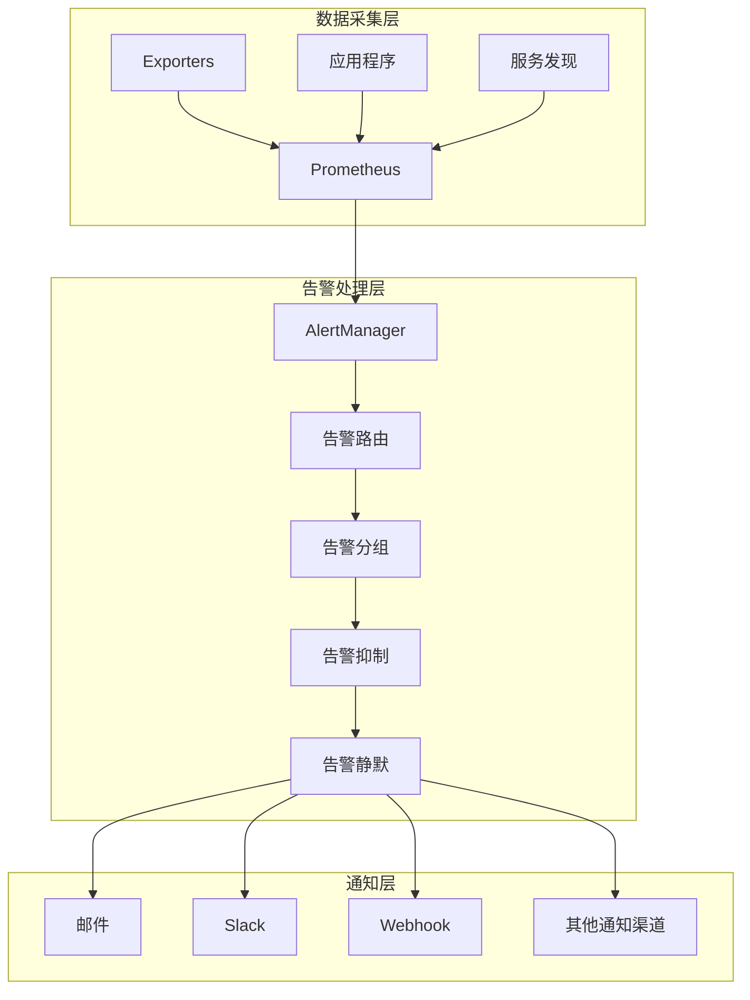
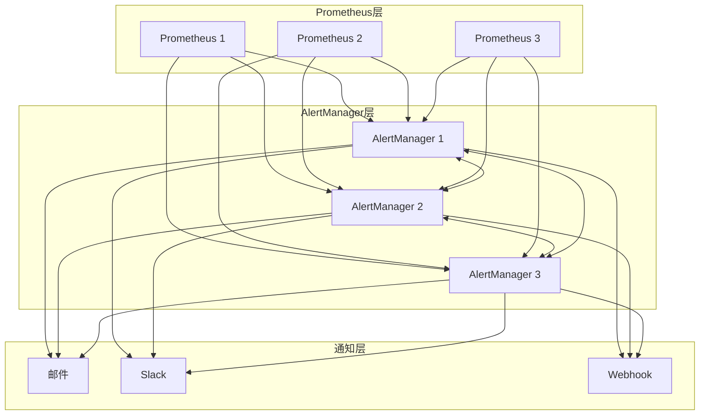

## 一、AlertManager 概述

### 1. 什么是 AlertManager

**AlertManager** 是 Prometheus 生态系统中的核心组件，负责处理由 Prometheus 服务器发送的告警，并提供告警的路由、分组、静默和抑制等功能。

**主要功能**：
- **告警路由**：根据告警标签将告警发送到不同的接收器
- **告警分组**：将相关告警合并为单个通知，减少告警噪声
- **告警抑制**：当高优先级告警触发时，抑制相关的低优先级告警
- **告警静默**：暂时禁用特定告警的通知
- **多种通知渠道**：支持邮件、Slack、Webhook 等多种通知方式
- **高可用**：通过 Gossip 协议实现集群部署，确保告警不丢失

### 2. AlertManager 在监控系统中的位置



### 3. AlertManager 与 Prometheus 的关系

- **Prometheus**：负责指标采集、存储和告警规则评估，当指标满足告警条件时生成告警
- **AlertManager**：负责接收、处理和发送告警通知，提供高级告警管理功能

**数据流向**：
1. Prometheus 评估告警规则
2. 当规则触发时，Prometheus 发送告警到 AlertManager
3. AlertManager 处理告警（路由、分组、抑制等）
4. AlertManager 发送通知到配置的接收渠道

## 二、AlertManager 核心概念

### 1. 告警状态

AlertManager 中的告警有三种状态：

| 状态 | 描述 | 处理方式 |
|------|------|----------|
| **Inactive** | 告警未触发，指标正常 | 不发送通知 |
| **Pending** | 告警已触发但未满足持续时间 | 不发送通知，等待确认 |
| **Firing** | 告警已触发且满足持续时间 | 发送通知 |
| **Resolved** | 告警已恢复正常 | 发送恢复通知（如果配置） |

### 2. 告警路由（Route）

**告警路由**是 AlertManager 中最核心的概念之一，决定了告警如何被处理和发送。

**路由规则**：
- 基于告警标签进行匹配
- 支持嵌套路由，形成路由树
- 每个路由可以指定不同的接收器

**路由配置示例**：

```yaml
route:
  group_by: ['alertname']
  group_wait: 30s
  group_interval: 5m
  repeat_interval: 4h
  receiver: 'default-receiver'
  routes:
  - match:
      severity: critical
    receiver: 'critical-receiver'
  - match:
      service: database
    receiver: 'database-receiver'
```

### 3. 告警分组（Grouping）

**告警分组**将相关的告警合并为单个通知，减少告警噪声。

**分组配置**：
- `group_by`：指定用于分组的标签
- `group_wait`：分组等待时间，收集同一组的告警
- `group_interval`：同一组告警的发送间隔

**分组效果**：
- 当多个服务器同时出现相同问题时，只发送一个汇总通知
- 避免告警风暴，提高告警的可读性

### 4. 告警抑制（Inhibition）

**告警抑制**是指当高优先级告警触发时，抑制相关的低优先级告警。

**抑制规则**：
- 当存在满足条件的告警时，抑制其他匹配的告警
- 用于减少冗余告警，突出重要问题

**抑制配置示例**：

```yaml
inhibit_rules:
  - source_match:
      severity: 'critical'
    target_match:
      severity: 'warning'
    equal: ['alertname', 'instance']
```

### 5. 告警静默（Silence）

**告警静默**允许暂时禁用特定告警的通知，适用于计划维护等场景。

**静默配置**：
- 基于标签匹配规则
- 可以设置开始和结束时间
- 可以添加注释说明

**静默管理**：
- 通过 AlertManager Web UI 创建和管理
- 通过 API 进行自动化管理

### 6. 接收器（Receiver）

**接收器**定义了告警通知的发送方式和目标。

**支持的接收器类型**：
- **邮件**（email_configs）
- **Slack**（slack_configs）
- **Webhook**（webhook_configs）
- **PagerDuty**（pagerduty_configs）
- **OpsGenie**（opsgenie_configs）
- **VictorOps**（victorops_configs）

## 三、AlertManager 安装与配置

### 1. 安装方式

#### 1.1 Docker 安装

```bash
docker run -d \
    --name alertmanager \
    -p 9093:9093 \
    -v /path/to/config:/etc/alertmanager \
    prom/alertmanager:latest
```

#### 1.2 二进制安装

```bash
# 下载
wget https://github.com/prometheus/alertmanager/releases/download/v0.25.0/alertmanager-0.25.0.linux-amd64.tar.gz

# 解压
tar xvf alertmanager-0.25.0.linux-amd64.tar.gz
cd alertmanager-0.25.0.linux-amd64

# 运行
./alertmanager --config.file=alertmanager.yml
```

### 2. 核心配置文件

**alertmanager.yml** 是 AlertManager 的主配置文件，包含以下部分：

```yaml
global:
  resolve_timeout: 5m
  smtp_from: 'alerts@example.com'
  smtp_smarthost: 'smtp.example.com:587'
  smtp_auth_username: 'alerts@example.com'
  smtp_auth_password: 'password'
  smtp_require_tls: true

templates:
  - '/etc/alertmanager/template/*.tmpl'

route:
  group_by: ['alertname', 'cluster', 'service']
  group_wait: 30s
  group_interval: 5m
  repeat_interval: 4h
  receiver: 'email'
  routes:
  - match:
      severity: critical
    receiver: 'pagerduty'

receivers:
- name: 'email'
  email_configs:
  - to: 'team@example.com'
    send_resolved: true

- name: 'pagerduty'
  pagerduty_configs:
  - service_key: 'your-service-key'

inhibit_rules:
  - source_match:
      severity: 'critical'
    target_match:
      severity: 'warning'
    equal: ['alertname', 'cluster', 'service']
```

### 3. 告警模板

**告警模板**允许自定义告警通知的格式，使用 Go 模板语法。

**模板示例**（email.tmpl）：

```html
{{ define "email.html" }}
{{ range $i, $alert := .Alerts }}
========== 监控告警 ==========<br>
告警状态：{{ .Status }}<br>
告警级别：{{ $alert.Labels.severity }}<br>
告警类型：{{ $alert.Labels.alertname }}<br>
告警服务：{{ $alert.Labels.service }}<br>
告警主机：{{ $alert.Labels.instance }}<br>
告警详情：{{ $alert.Annotations.description }}<br>
触发值：{{ $alert.Annotations.value }}<br>
告警时间：{{ $alert.StartsAt.Format "2006-01-02 15:04:05" }}<br>
{{ if $alert.EndsAt.Before (now) }}
恢复时间：{{ $alert.EndsAt.Format "2006-01-02 15:04:05" }}<br>
{{ end }}
========== END ==========<br>
{{ end }}
{{ end }}
```

### 4. Prometheus 配置

**Prometheus** 需要配置 AlertManager 地址：

```yaml
alerting:
  alertmanagers:
  - static_configs:
    - targets:
      - 'alertmanager:9093'

rule_files:
  - 'rules/*.yml'
```

**告警规则示例**（rules/example.yml）：

```yaml
groups:
- name: example-alerts
  rules:
  - alert: HighCPUUsage
    expr: (1 - avg(irate(node_cpu_seconds_total{mode="idle"}[5m])) by (instance)) * 100 > 80
    for: 5m
    labels:
      severity: warning
    annotations:
      summary: "High CPU usage on {{ $labels.instance }}"
      description: "CPU usage is {{ $value }}% for more than 5 minutes"

  - alert: HighMemoryUsage
    expr: (1 - (node_memory_MemAvailable_bytes / node_memory_MemTotal_bytes)) * 100 > 85
    for: 5m
    labels:
      severity: critical
    annotations:
      summary: "High memory usage on {{ $labels.instance }}"
      description: "Memory usage is {{ $value }}% for more than 5 minutes"
```

## 四、AlertManager 高可用部署

### 1. 高可用架构

**AlertManager 高可用**通过集群部署实现，使用 Gossip 协议在节点之间同步状态。

**推荐架构**：



### 2. Gossip 协议

**Gossip 协议**是一种去中心化的信息传播协议，用于 AlertManager 集群中的状态同步。

**工作原理**：
1. 当一个节点接收到告警时，会计算告警的指纹（Fingerprint）
2. 节点将告警指纹广播给其他节点
3. 其他节点将指纹添加到自己的已知列表中
4. 当节点要发送告警时，会检查指纹是否已存在，避免重复发送

**核心特点**：
- **去中心化**：无中心节点，所有节点平等
- **可靠性**：即使部分节点故障，信息仍能传播
- **扩展性**：支持动态添加和移除节点

### 3. 集群配置

**AlertManager 集群**通过以下参数配置：

```bash
# 节点1
alertmanager \
  --web.listen-address="0.0.0.0:9093" \
  --cluster.listen-address="0.0.0.0:8001" \
  --config.file="alertmanager.yml"

# 节点2
alertmanager \
  --web.listen-address="0.0.0.0:9094" \
  --cluster.listen-address="0.0.0.0:8002" \
  --cluster.peer="node1:8001" \
  --config.file="alertmanager.yml"

# 节点3
alertmanager \
  --web.listen-address="0.0.0.0:9095" \
  --cluster.listen-address="0.0.0.0:8003" \
  --cluster.peer="node1:8001" \
  --cluster.peer="node2:8002" \
  --config.file="alertmanager.yml"
```

**Prometheus 配置**：

```yaml
alerting:
  alertmanagers:
  - static_configs:
    - targets:
      - 'node1:9093'
      - 'node2:9094'
      - 'node3:9095'
```

### 4. 高可用最佳实践

- **奇数节点**：建议使用 3 或 5 个节点，提高容错能力
- **网络隔离**：确保集群节点之间网络畅通
- **配置同步**：所有节点使用相同的配置文件
- **负载均衡**：使用负载均衡器分发 Prometheus 的告警请求
- **监控集群**：监控 AlertManager 自身的状态

## 五、AlertManager Webhook 集成

### 1. Webhook 概述

**Webhook** 是 AlertManager 与外部系统集成的重要方式，通过 HTTP POST 请求发送告警信息。

**Webhook 数据格式**：

```json
{
  "receiver": "webhook",
  "status": "firing",
  "alerts": [
    {
      "status": "firing",
      "labels": {
        "alertname": "HighCPUUsage",
        "instance": "server-01",
        "severity": "warning"
      },
      "annotations": {
        "summary": "High CPU usage",
        "description": "CPU usage is 85%"
      },
      "startsAt": "2023-04-01T12:00:00Z",
      "endsAt": "0001-01-01T00:00:00Z",
      "generatorURL": "http://prometheus:9090/graph?g0.expr=..."
    }
  ],
  "groupLabels": {
    "alertname": "HighCPUUsage"
  },
  "commonLabels": {
    "alertname": "HighCPUUsage",
    "severity": "warning"
  },
  "commonAnnotations": {
    "summary": "High CPU usage"
  },
  "externalURL": "http://alertmanager:9093"
}
```

### 2. Webhook 实现示例

**Go 语言实现**：

```go
package main

import (
	"encoding/json"
	"fmt"
	"log"
	"net/http"
	"time"
)

type AlertManagerPayload struct {
	Receiver          string            `json:"receiver"`
	Status            string            `json:"status"`
	Alerts            []Alert           `json:"alerts"`
	GroupLabels       map[string]string `json:"groupLabels"`
	CommonLabels      map[string]string `json:"commonLabels"`
	CommonAnnotations map[string]string `json:"commonAnnotations"`
	ExternalURL       string            `json:"externalURL"`
}

type Alert struct {
	Status       string            `json:"status"`
	Labels       map[string]string `json:"labels"`
	Annotations  map[string]string `json:"annotations"`
	StartsAt     time.Time         `json:"startsAt"`
	EndsAt       time.Time         `json:"endsAt"`
	GeneratorURL string            `json:"generatorURL"`
}

func webhookHandler(w http.ResponseWriter, r *http.Request) {
	var payload AlertManagerPayload
	if err := json.NewDecoder(r.Body).Decode(&payload); err != nil {
		http.Error(w, err.Error(), http.StatusBadRequest)
		return
	}
	
	// 处理告警
	log.Printf("Received alert: status=%s, receiver=%s", payload.Status, payload.Receiver)
	for _, alert := range payload.Alerts {
		log.Printf("Alert: %s - %s", alert.Labels["alertname"], alert.Annotations["description"])
		// 这里可以添加自定义处理逻辑，如存储到数据库、发送到其他系统等
	}
	
	w.WriteHeader(http.StatusNoContent)
}

func main() {
	http.HandleFunc("/webhook", webhookHandler)
	log.Println("Starting webhook server on :8080")
	if err := http.ListenAndServe(":8080", nil); err != nil {
		log.Fatalf("Server failed: %v", err)
	}
}
```

**AlertManager 配置**：

```yaml
receivers:
- name: 'webhook'
  webhook_configs:
  - url: 'http://webhook-server:8080/webhook'
    send_resolved: true
```

### 3. 常见 Webhook 集成

#### 3.1 与企业微信集成

**企业微信 Webhook** 配置：

```yaml
receivers:
- name: 'wechat'
  wechat_configs:
  - corp_id: 'your-corp-id'
    api_url: 'https://qyapi.weixin.qq.com/cgi-bin/'
    to_party: '1'
    agent_id: '1000002'
    api_secret: 'your-api-secret'
```

#### 3.2 与钉钉集成

**钉钉 Webhook** 配置：

```yaml
receivers:
- name: 'dingtalk'
  webhook_configs:
  - url: 'https://oapi.dingtalk.com/robot/send?access_token=your-token'
    http_config:
      bearer_token: 'your-bearer-token'
    send_resolved: true
```

#### 3.3 与自定义系统集成

**自定义 Webhook** 可以实现：
- 告警存储到数据库
- 告警分析和统计
- 与工单系统集成
- 与自动化运维系统集成

## 六、AlertManager 最佳实践

### 1. 告警策略设计

#### 1.1 告警分级

**建议的告警级别**：

| 级别 | 描述 | 处理方式 |
|------|------|----------|
| **critical** | 严重问题，需要立即处理 | 电话、短信通知 |
| **warning** | 警告信息，需要关注 | 邮件、聊天工具通知 |
| **info** | 信息性通知，无需立即处理 | 日志记录 |

#### 1.2 告警规则设计

**告警规则最佳实践**：
- **明确的阈值**：基于历史数据和业务需求设置合理的阈值
- **适当的持续时间**：使用 `for` 字段避免瞬时波动触发告警
- **清晰的标签**：使用一致的标签命名规范
- **详细的注释**：在 annotations 中提供足够的上下文信息

**示例**：

```yaml
- alert: HighErrorRate
  expr: sum(rate(http_requests_total{status=~"5.."}[5m])) by (service) / sum(rate(http_requests_total[5m])) by (service) > 0.05
  for: 5m
  labels:
    severity: warning
  annotations:
    summary: "High error rate for {{ $labels.service }}"
    description: "Error rate is {{ $value | humanizePercentage }} for more than 5 minutes"
```

### 2. 配置最佳实践

#### 2.1 路由配置

- **合理的路由树**：根据业务结构设计路由树
- **默认接收器**：设置默认接收器，确保所有告警都能被处理
- **优先级顺序**：更具体的路由放在前面

#### 2.2 分组配置

- **合理的分组维度**：根据业务逻辑选择分组标签
- **适当的等待时间**：`group_wait` 设置为 30s-1m
- **合理的重复间隔**：`repeat_interval` 设置为 4h-24h

#### 2.3 抑制规则

- **明确的抑制关系**：只抑制真正相关的告警
- **使用 equal 字段**：确保只抑制相同上下文的告警

### 3. 性能优化

#### 3.1 内存优化

- **合理的告警保留时间**：通过 `--storage.path` 和 `--storage.tsdb.retention.time` 控制
- **限制告警数量**：避免生成过多的告警
- **批量处理**：使用分组减少通知数量

#### 3.2 网络优化

- **合理的集群大小**：根据告警量选择合适的集群规模
- **网络带宽**：确保集群节点之间网络畅通
- **超时设置**：合理设置 `resolve_timeout` 和 HTTP 超时

### 4. 监控与维护

#### 4.1 监控 AlertManager

**关键指标**：
- `alertmanager_alerts`：当前告警数量
- `alertmanager_notifications_total`：通知发送数量
- `alertmanager_notifications_failed_total`：通知失败数量
- `alertmanager_cluster_members`：集群成员数量

**Grafana 面板**：
- 使用官方提供的 AlertManager 面板
- 监控通知成功率和延迟

#### 4.2 常见问题排查

**通知失败**：
- 检查接收渠道配置
- 检查网络连接
- 查看 AlertManager 日志

**重复通知**：
- 检查集群配置
- 确保 Gossip 协议正常工作
- 检查 Prometheus 配置是否正确

**告警丢失**：
- 检查 AlertManager 健康状态
- 检查 Prometheus 到 AlertManager 的连接
- 查看 Prometheus 告警规则评估情况

## 七、AlertManager API

### 1. 核心 API 端点

| API 端点 | 方法 | 描述 |
|----------|------|------|
| `/api/v2/alerts` | GET | 获取当前告警 |
| `/api/v2/alerts` | POST | 创建新告警 |
| `/api/v2/silences` | GET | 获取静默列表 |
| `/api/v2/silences` | POST | 创建新静默 |
| `/api/v2/silences/{silenceId}` | DELETE | 删除静默 |
| `/api/v2/status` | GET | 获取 AlertManager 状态 |
| `/api/v2/receivers` | GET | 获取接收器配置 |

### 2. API 使用示例

#### 2.1 查询当前告警

```bash
curl http://alertmanager:9093/api/v2/alerts
```

#### 2.2 创建静默

```bash
curl -X POST http://alertmanager:9093/api/v2/silences \
  -H "Content-Type: application/json" \
  -d '{
    "matchers": [
      {"name": "alertname", "value": "HighCPUUsage", "isRegex": false},
      {"name": "instance", "value": "server-01", "isRegex": false}
    ],
    "startsAt": "2023-04-01T00:00:00Z",
    "endsAt": "2023-04-01T02:00:00Z",
    "createdBy": "admin",
    "comment": "计划维护"
  }'
```

#### 2.3 发送测试告警

```bash
curl -X POST http://alertmanager:9093/api/v2/alerts \
  -H "Content-Type: application/json" \
  -d '[
    {
      "labels": {
        "alertname": "TestAlert",
        "severity": "warning",
        "instance": "test-server"
      },
      "annotations": {
        "summary": "Test alert",
        "description": "This is a test alert"
      }
    }
  ]'
```

## 八、AlertManager 与其他告警系统的对比

### 1. 与传统告警系统的对比

| 特性 | AlertManager | 传统告警系统（如 Nagios） |
|------|-------------|------------------------|
| **集成性** | 与 Prometheus 无缝集成 | 需要插件或适配器 |
| **灵活性** | 基于标签的路由和分组 | 基于主机或服务的固定配置 |
| **高可用** | 内置集群支持 | 需要外部负载均衡 |
| **扩展性** | 支持多种通知渠道 | 有限的通知选项 |
| **告警管理** | 支持抑制、静默等高级功能 | 基本的告警管理 |
| **数据模型** | 基于时间序列数据 | 基于状态检查 |

### 2. 与其他现代告警系统的对比

| 系统 | 优势 | 劣势 |
|------|------|------|
| **AlertManager** | 与 Prometheus 生态系统深度集成，简单易用 | 主要针对 Prometheus 告警 |
| **Grafana Alerting** | 与 Grafana 面板集成，支持多种数据源 | 配置相对复杂 |
| **VictorOps** | 强大的事件管理和升级策略 | 商业产品，成本较高 |
| **PagerDuty** | 专业的事件响应和升级管理 | 商业产品，成本较高 |
| **OpsGenie** | 丰富的集成和自动化功能 | 商业产品，成本较高 |

## 九、常见问题与解决方案

### 1. 告警未触发

**可能原因**：
- 告警规则配置错误
- 指标数据异常
- Prometheus 评估周期问题

**解决方案**：
- 检查告警规则表达式
- 在 Prometheus UI 中测试表达式
- 检查指标数据是否正常

### 2. 告警未发送

**可能原因**：
- AlertManager 配置错误
- 通知渠道配置错误
- 网络连接问题

**解决方案**：
- 检查 AlertManager 配置
- 检查通知渠道的认证信息
- 查看 AlertManager 日志

### 3. 重复告警

**可能原因**：
- 集群配置问题
- Prometheus 配置错误
- Gossip 协议异常

**解决方案**：
- 检查集群配置和网络连接
- 确保所有 AlertManager 节点使用相同的配置
- 检查 Prometheus 的 alertmanagers 配置

### 4. 告警风暴

**可能原因**：
- 告警规则过于敏感
- 系统故障导致大量指标异常
- 分组配置不合理

**解决方案**：
- 调整告警规则阈值和持续时间
- 优化分组配置，减少通知数量
- 使用抑制规则减少冗余告警

### 5. 告警恢复通知不发送

**可能原因**：
- `send_resolved` 配置未启用
- 告警状态未正确更新
- 网络延迟

**解决方案**：
- 确保所有接收器配置了 `send_resolved: true`
- 检查 Prometheus 告警规则评估
- 检查网络连接

## 十、总结

### 1. 核心要点

- **AlertManager** 是 Prometheus 生态系统中的告警管理中心，提供路由、分组、抑制和静默等功能
- **高可用** 通过 Gossip 协议实现，确保告警不丢失
- **灵活的配置** 支持多种通知渠道和自定义模板
- **Webhook 集成** 提供与外部系统的接口
- **最佳实践** 包括合理的告警策略、配置优化和监控维护

### 2. 实践建议

- **分层告警**：根据严重程度设置不同的告警级别和通知方式
- **合理分组**：使用分组减少告警噪声，提高可读性
- **抑制规则**：使用抑制规则减少冗余告警
- **高可用部署**：生产环境建议部署 3 节点集群
- **监控自身**：监控 AlertManager 自身的健康状态
- **定期review**：定期审查告警规则和配置，优化告警策略

### 3. 未来发展

- **更多集成**：支持更多的通知渠道和第三方系统
- **智能化**：利用机器学习减少误报和优化告警策略
- **更好的可视化**：改进 Web UI，提供更直观的告警管理界面
- **更强的扩展性**：支持更大规模的告警处理

AlertManager 作为 Prometheus 生态系统的重要组成部分，为监控系统提供了强大的告警管理能力。通过合理的配置和最佳实践，可以构建一个高效、可靠的告警系统，及时发现和响应系统异常，保障业务的稳定运行。

## 参考资料

- [Prometheus 官方文档](https://prometheus.io/docs/alerting/latest/alertmanager/)
- [AlertManager 配置文档](https://prometheus.io/docs/alerting/latest/configuration/)
- [AlertManager API 文档](https://prometheus.io/docs/alerting/latest/clients/)
- [Prometheus 告警规则最佳实践](https://prometheus.io/docs/practices/alerting/)
- [AlertManager 高可用部署](https://prometheus.io/docs/alerting/latest/ha/)
- [Prometheus: Up & Running](https://book.douban.com/subject/30449237/)
- [Grafana Alerting 与 AlertManager 对比](https://grafana.com/docs/grafana/latest/alerting/compare-alerting-systems/)
- [AlertManager Webhook 集成示例](https://github.com/prometheus/alertmanager/tree/main/examples)
