# Prometheus

> Prometheus 是云原生时代的事实标准监控系统,采用 pull 模型 + 自研时序数据库(TSDB)。本章聚焦 **Prometheus 架构与 TSDB 存储原理**,告警、高可用等专题见 [alertmanager.md](./alertmanager.md)、[prometheus高可用.md](./prometheus高可用.md)。

## 目录

- [一、整体架构](#一整体架构)
- [二、数据模型](#二数据模型)
- [三、TSDB 时序数据库](#三tsdb-时序数据库)
- [四、Metric 类型与客户端](#四metric-类型与客户端)
- [五、配置体系](#五配置体系)
- [六、资源占用与调优](#六资源占用与调优)
- [七、数据备份与远程读写](#七数据备份与远程读写)
- [八、联邦机制](#八联邦机制)
- [九、面试要点](#九面试要点)
- [十、相关资料](#十相关资料)

## 一、整体架构

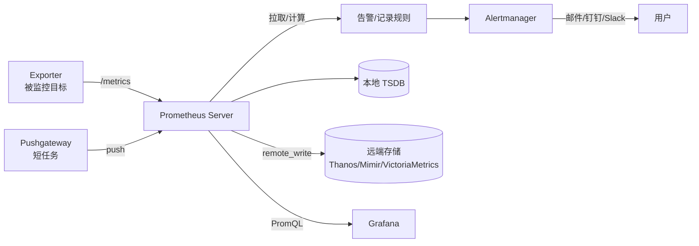

| 组件 | 职责 |
|------|------|
| Prometheus Server | 采集、存储、查询 |
| Exporter | 暴露 `/metrics` 端点 |
| Pushgateway | 短任务推送指标中转 |
| Alertmanager | 告警去重、分组、路由 |
| Grafana | 可视化 |
| 远端存储 | 长期存储、全局查询 |

### 1.1 Pull 模型

Prometheus 主动拉取目标,而非被动接收。优点:
- 主动控制采集节奏,避免被压垮
- 目标无感知,故障时仍可探测
- 便于水平扩展(多实例各自拉取)

短任务(如 Cron)生命周期短,无法被 pull,改用 Pushgateway 中转:

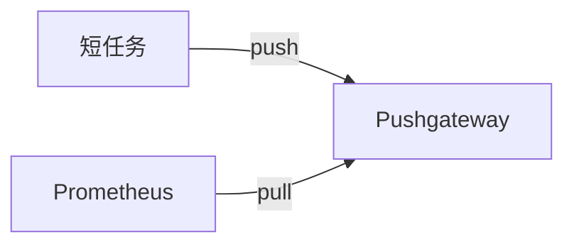

### 1.2 本地启动

```bash
./prometheus \
  --storage.tsdb.path=/Users/xuweiqiang/Documents/data \
  --config.file=/Users/xuweiqiang/Documents/prometheus.yml \
  --web.listen-address=:8989
```

健康检查:`http://localhost:8989/-/healthy`

## 二、数据模型

### 2.1 时间序列

每个指标 = 指标名 + 一组标签,**由它们唯一确定一条时间序列**。

```
http_requests_total{method="POST", endpoint="/api/orders", status="200"}
```

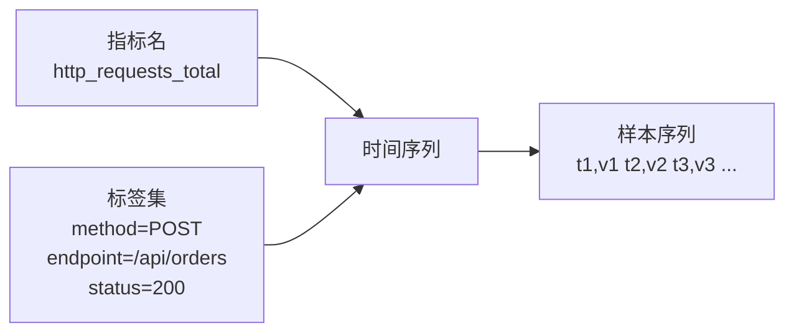

- **样本(Sample)**:`(timestamp, float64 value)` 二元组,默认 4-8 字节
- **序列(Series)**:由 `metric_name + labelset` 唯一标识,基数 = 序列数

### 2.2 指标类型

| 类型 | 含义 | 例子 | 客户端 API |
|------|------|------|----------|
| Counter | 单调递增计数 | 请求总数、错误总数 | `Inc()` |
| Gauge | 可增可减瞬时值 | 温度、内存、连接数 | `Set()`/`Inc()`/`Dec()` |
| Histogram | 分桶统计分布 | 接口延迟分布 | `Observe()` |
| Summary | 客户端分位数 | 95/99 延迟 | `Observe()` |

Histogram vs Summary:

| 维度 | Histogram | Summary |
|------|-----------|---------|
| 分位数计算 | 服务端 PromQL `histogram_quantile` | 客户端预计算 |
| 跨实例聚合 | 支持 | 不支持 |
| 多分位 | 服务端任意 | 客户端配置固定 |
| 推荐 | ✓ 主流 | 仅特定场景 |

### 2.3 基数控制

**高基数标签是 Prometheus 内存爆炸的头号杀手**。每个标签的不同值都会倍增序列数:

```
http_requests_total{user_id="..."}  # ❌ user_id 千万级 → 千万条序列
http_requests_total{tenant_id="..."}  # ✓ 租户数有限
```

| 标签来源 | 基数 | 是否安全 |
|---------|------|---------|
| `status` (200/404/500) | 几十 | ✓ |
| `method` (GET/POST) | < 10 | ✓ |
| `user_id` / `trace_id` / `ip` | 海量 | ✗ |
| `endpoint` 全路径 | 数百 | 谨慎 |

## 三、TSDB 时序数据库

> Prometheus 内置专用时序数据库,是理解内存占用、retention、调优参数的基石。

### 3.1 设计目标

- **写优化**:海量时间序列的追加写
- **压缩友好**:同序列相邻样本变化小,Gorilla 等压缩算法
- **范围查询快**:按时间分块、按序列索引
- **本地存储**:不做分布式,长期存储交给远端

### 3.2 存储层次:Head → 持久 Block

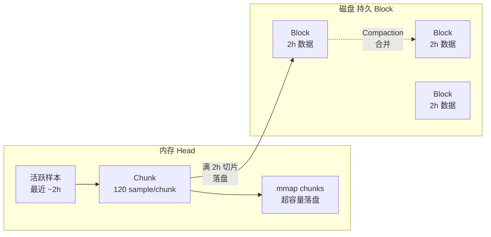

| 层级 | 位置 | 内容 | 生命周期 |
|------|------|------|---------|
| Head | 内存 + mmap | 最新的活跃样本 | 2 小时窗口 |
| 持久 Block | 磁盘 | 2 小时切片 | retention 期内 |
| Compacted Block | 磁盘 | 多 Block 合并 | 长期保留 |

### 3.3 Block 结构

每个 2 小时 Block 是一个独立目录:

```
01H8XKPRJQK.../                  # Block ID = 时间范围起止
├── chunks/                      # 实际样本数据
│   ├── 000001                   # chunk 文件,默认 512KB
│   └── 000002
├── index                        # 倒排索引:标签 → 序列 → chunk
├── meta.json                    # Block 元数据
└── tombstones                   # 删除标记(不真删,标记后过滤)
```

| 文件 | 作用 |
|------|------|
| `chunks/` | 原始样本数据,按 chunk 组织 |
| `index` | 标签倒排索引,支持快速查找匹配序列 |
| `meta.json` | Block 时间范围、compaction level |
| `tombstones` | 删除标记,查询时过滤 |

### 3.4 Chunk:样本压缩单元

每个 chunk 默认容纳 **120 个样本**(约 15s 采集间隔 × 30 分钟)。

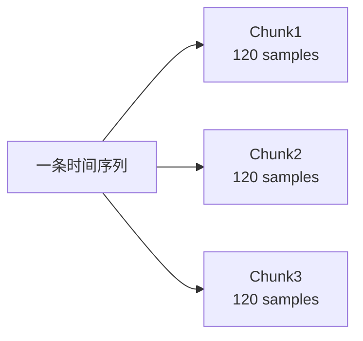

**Gorilla 压缩算法**(Facebook 提出):
- **时间戳**:Delta-of-delta 编码,相邻样本时间差再差分
- **值**:XOR 编码,相邻值按位异或后变长编码

| 数据类型 | 未压缩 | Gorilla 压缩后 |
|---------|-------|---------------|
| 单样本 | 16 字节(8B ts + 8B value) | ~1-2 字节 |
| 120 样本 chunk | 1920 字节 | ~120-240 字节 |

**结论**:理论每样本 1-2 字节,30 天 2000 QPS 采集 ≈ 0.96 GB。

### 3.5 Head Block:写入路径

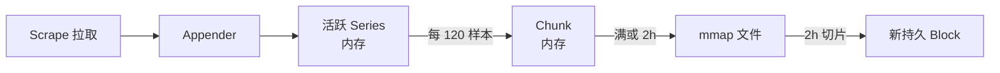

**关键机制**:
1. **Series 缓存**:活跃序列在内存中保留 1-2 小时(可查 `--query.lookback-delta`)
2. **Chunk 写满即落 mmap**:避免内存暴涨
3. **2 小时切片**:Head 周期性切成持久 Block,清空对应内存

### 3.6 WAL(Write-Ahead Log)

写入样本前先追加 WAL,防止宕机丢失:

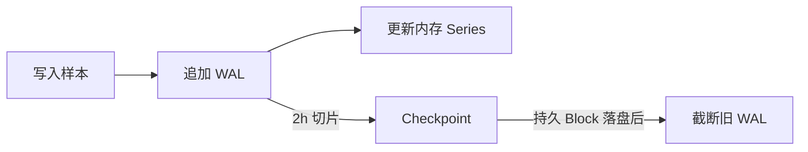

| 参数 | 含义 | 默认 |
|------|------|------|
| `--storage.tsdb.wal-segment-size` | WAL 段大小 | 128 MB |
| `--storage.tsdb.wal-compression` | WAL 压缩 | 开启 |

**remote write 与 WAL 的关系**:remote write 失败的数据保留在 WAL 中重试,超过 2 小时 WAL 被 compaction 压缩后**未发送的数据会丢失**。

### 3.7 Compaction

把多个 2h Block 合并成更大的 Block,降低 Block 数量、提升查询:

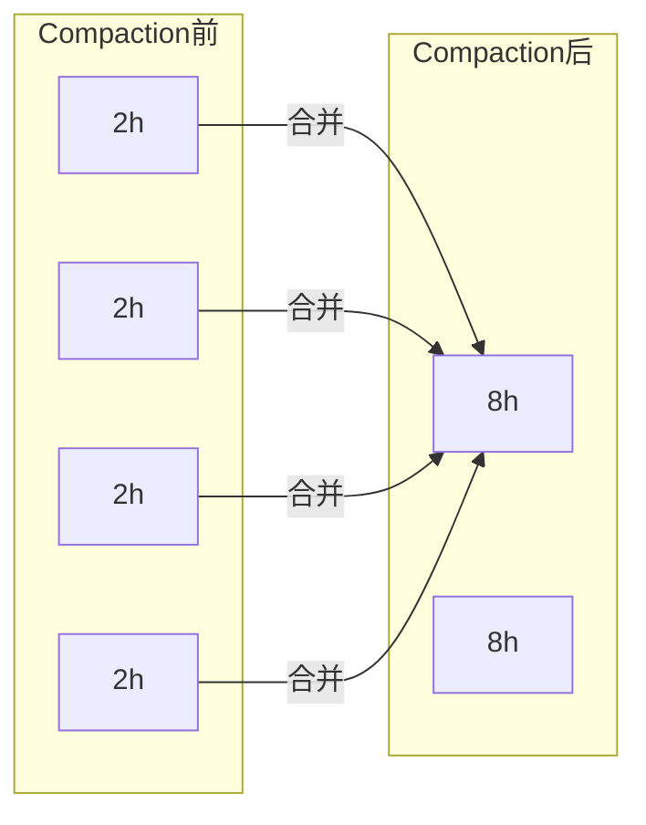

| Level | 时间跨度 |
|-------|---------|
| L1 | 2h |
| L2 | 8h(4×2h) |
| L3 | 24h(3×8h) |
| L4 | ...直到 retention |

**关键参数**:

| 参数 | 默认 | 含义 |
|------|------|------|
| `--storage.tsdb.min-block-duration` | 2h | 切片大小 |
| `--storage.tsdb.max-block-duration` | 2h 或 retention/10 | Compaction 上限 |
| `--storage.tsdb.retention.time` | 15d | 数据保留时长 |
| `--storage.tsdb.retention.size` | 0(不限) | 数据保留大小上限 |

> `max-block-duration` 默认为 `min(retention/10, 31d)`,设为 2h 可**加速落盘**(测试场景常用),但生产环境通常按默认。

### 3.8 倒排索引

`index` 文件是按**标签**建立的倒排索引,支持 PromQL 的标签匹配:

```
查询:http_requests_total{status="500"}
索引:{status="500"} → [series_id_1, series_id_42, ...] → chunk 定位
```

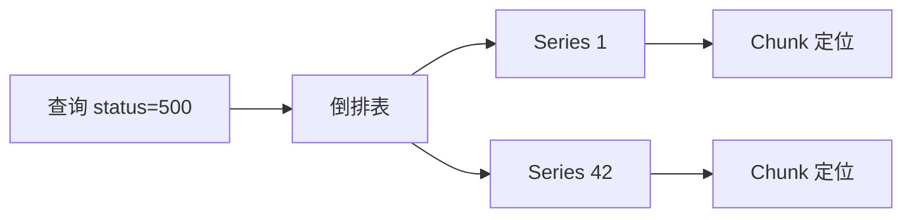

**基数影响**:每个标签值都生成一条倒排表,基数爆炸会撑爆 index。

### 3.9 查询路径

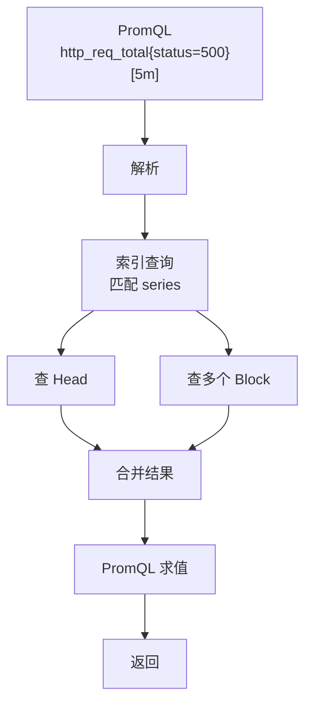

**查询内存 = 命中序列数 × 样本数**。`--query.max-samples`(默认 5000 万)是安全上限,超过则查询中止。

## 四、Metric 类型与客户端

### 4.1 Go 自定义 Exporter 示例

```go
package main

import (
	"net/http"

	"github.com/prometheus/client_golang/prometheus"
	"github.com/prometheus/client_golang/prometheus/collectors"
	"github.com/prometheus/client_golang/prometheus/promhttp"
)

var requestCounter = prometheus.NewCounter(prometheus.CounterOpts{
	Namespace:   "app",
	Subsystem:   "system",
	Name:        "request",
	Help:        "request counter",
	ConstLabels: map[string]string{},
})

func init() {
	prometheus.DefaultRegisterer.Unregister(collectors.NewGoCollector())
	prometheus.MustRegister(requestCounter)
}

func main() {
	http.HandleFunc("/hello", func(w http.ResponseWriter, r *http.Request) {
		requestCounter.Inc()
		_, _ = w.Write([]byte("hello world"))
	})
	http.Handle("/metrics", promhttp.Handler())
	err := http.ListenAndServe("127.0.0.1:6969", nil)
	if err != nil {
		panic(err)
	}
}
```

### 4.2 四大客户端 API 对比

| 类型 | Go API | 适用 |
|------|--------|------|
| Counter | `Inc()` | 累加指标 |
| Gauge | `Set(v)` / `Inc()` / `Dec()` | 瞬时值 |
| Histogram | `Observe(v)` | 延迟分布,服务端算分位 |
| Summary | `Observe(v)` | 客户端预计算分位 |

### 4.3 metric 端点查看

```bash
curl localhost:9090/metrics
# process_resident_memory_bytes 进程内存(单位 byte)
# process_cpu_seconds_total  累计 CPU 时间
```

## 五、配置体系

### 5.1 配置分类

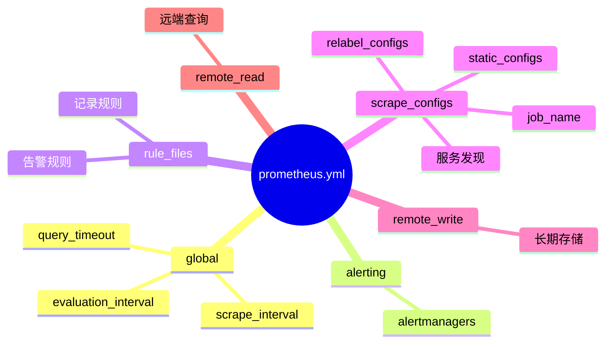

### 5.2 默认配置示例

```yaml
global:
  scrape_interval: 15s      # 采集间隔,默认 1m
  evaluation_interval: 15s  # 规则计算间隔,默认 1m
  # scrape_timeout: 10s     # 默认 10s

alerting:
  alertmanagers:
    - static_configs:
        - targets: []

rule_files: []
  # - "first_rules.yml"

scrape_configs:
  - job_name: "prometheus"
    static_configs:
      - targets: ["localhost:9090"]
```

### 5.3 配置源码结构

```go
// prometheus/config/config.go
type Config struct {
	GlobalConfig   GlobalConfig    `yaml:"global"`
	AlertingConfig AlertingConfig  `yaml:"alerting,omitempty"`
	RuleFiles      []string        `yaml:"rule_files,omitempty"`
	ScrapeConfigs  []*ScrapeConfig `yaml:"scrape_configs,omitempty"`
	RemoteWriteConfigs []*RemoteWriteConfig `yaml:"remote_write,omitempty"`
	RemoteReadConfigs  []*RemoteReadConfig  `yaml:"remote_read,omitempty"`
}
```

### 5.4 自定义标签

```yaml
scrape_configs:
  - job_name: 'my_job'
    static_configs:
      - targets: ['my_target']
        labels:
          my_label: 'my_value'
```

> 动态标签或从外部源配置目标,使用服务发现或 Relabeling。

## 六、资源占用与调优

### 6.1 内存消耗来源

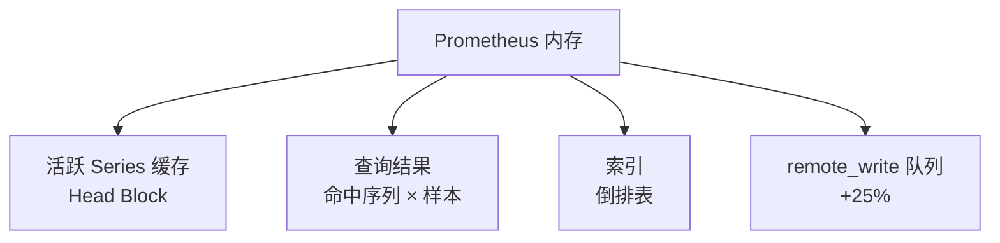

### 6.2 内存查看

```bash
# 方式 1:top RES
ps -ef | grep prometheus
top -p ${pid}

# 方式 2:指标端点(单位 byte,与 top RES 一致)
curl localhost:9090/metrics | grep process_resident_memory_bytes
```

### 6.3 影响内存的关键参数

| 参数 | 默认 | 影响 |
|------|------|------|
| `scrape_interval` | 15s | 越小,Head 内存越高 |
| `evaluation_interval` | 15s | 越小,规则计算越频繁 |
| `--storage.tsdb.retention.time` | 15d | 越大,查询大范围时内存越高 |
| `--storage.tsdb.max-block-duration` | 2h | 越大,落盘越慢、内存越高 |
| `--query.max-samples` | 5000万 | 单查询内存上限 |
| `--query.lookback-delta` | 5m | 拉取缓点回溯窗口 |

### 6.4 内存消耗估算

假设 1000 个指标,每指标 10 个标签,每标签 10 个值:
- 时间序列数:1000 × 10 × 10 = 100,000
- 每序列标签对字节:~200 字节(100 标签对 × 2 字节)
- 单序列内存:~1-2 KB(含索引、缓存)
- 总内存:**约 200 MB ~ 1 GB**(加上查询与缓存)

### 6.5 磁盘消耗估算

每 5 秒采集 2000 个样本,每样本压缩后 ~2 字节:

```
30 天容量 = 2000 × (86400/5) × 30 × 2 / (1024³) ≈ 0.96 GB
```

### 6.6 CPU 消耗

| 来源 | 占比 |
|------|------|
| 采集 scrape | 中 |
| 规则 evaluation | 低 |
| 查询 query | 高(突发) |
| Compaction | 低(后台周期) |

```bash
# 查看 CPU
curl http://localhost:9090/metrics | grep process_cpu_seconds_total
```

经验值:Prometheus 启动 7 天,`process_cpu_seconds_total` 约 1260s,平均每小时 7.5 秒 CPU。

### 6.7 Query 调优

| 策略 | 做法 |
|------|------|
| 缩小时间范围 | `metric{label=v}[5m]` 而非全 retention |
| 带具体标签 | `{instance="...",job="..."}` |
| 配置超时 | `global.query_timeout: 30s` |
| 子查询带步长 | `metric[5m:10s]` |
| 多实例分担 | 联邦机制或分片 |

### 6.8 降低内存消耗

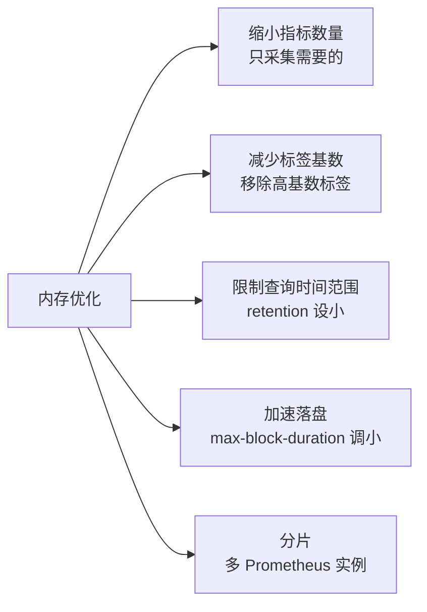

## 七、数据备份与远程读写

### 7.1 Snapshot 快照备份

调用 admin API 触发 Head 数据落盘生成快照:

```bash
# 启动时需 --web.enable-admin-api
curl -XPOST http://127.0.0.1:9090/api/v1/admin/tsdb/snapshot
```

返回快照目录名:

```json
{"status":"success","data":{"name":"20230418T015823Z-29b962a698b24a01"}}
```

快照位于 `--storage.tsdb.path/snapshots/<name>`。

### 7.2 remote_write 机制

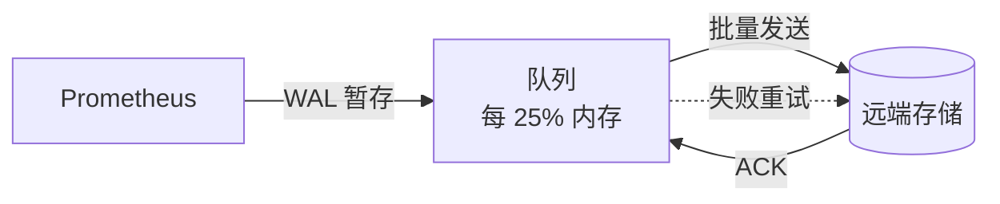

```yaml
remote_write:
  - url: "http://slave:9090/api/v1/write"
    queue_config:
      capacity: 10000
      max_samples_per_send: 200
      min_backoff: 30ms
      max_backoff: 5s
```

**重试机制**(源码 `storage/remote/queue_manager.go`):

```go
// sendWriteReqWithBackoff
// MinBackoff: 30ms, MaxBackoff: 5s
// 失败后 sleep 30ms 重试,每次间隔翻倍,最大 5s
// 持续失败不跳过,直到超过 2 小时 WAL 被压缩,数据丢失
func sendWriteReqWithBackoff(ctx context.Context, cfg config.QueueConfig, ...) error
```

| 失败时长 | 结果 |
|---------|------|
| < 2h | 重试成功,不丢数据 |
| > 2h | WAL 被压缩,**未发送数据丢失** |

**内存代价**:开启 remote_write 内存增加约 25%。

### 7.3 搭建 remote_write 集群

#### 从库(接收方)

```yaml
# slave.yml
global:
  scrape_interval: 15s
  evaluation_interval: 15s
```

```bash
docker run \
    --name slave \
    -d \
    -p 7979:9090 \
    --network p_net \
    --network-alias slave \
    -v /Users/prometheus/write.yml:/etc/prometheus/prometheus.yml \
    prom/prometheus \
    --web.enable-remote-write-receiver \
    --config.file=/etc/prometheus/prometheus.yml
```

#### 主库(发送方)

```yaml
# master.yml
global:
  scrape_interval: 15s
  evaluation_interval: 15s
remote_write:
  - url: "http://slave:9090/api/v1/write"
scrape_configs:
  - job_name: "request_count"
    metrics_path: '/metrics'
    static_configs:
      - targets: ["docker.for.mac.host.internal:6969"]
```

```bash
docker run \
    --name master \
    -d \
    -p 8989:9090 \
    --network p_net \
    --network-alias master \
    -v /Users/prometheus/master.yml:/etc/prometheus/prometheus.yml \
    prom/prometheus
```

### 7.4 snapshot + remote_write 保证数据完整

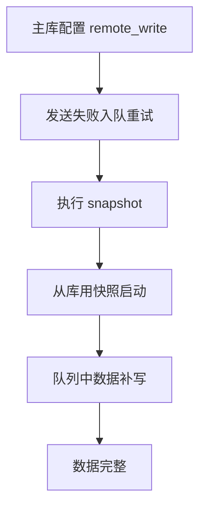

主库执行 snapshot 之前,先配置 remote_write 到 slave。push 失败的数据进入队列重试,slave 用快照启动后,队列数据被写入,**2 小时内不丢**(WAL 压缩周期)。

## 八、联邦机制

### 8.1 原理

```mermaid
flowchart LR
    PromA[Prometheus A<br/>采集节点1] -->|scrape| Exp1[Exporter]
    PromB[Prometheus B<br/>采集节点2] -->|scrape| Exp2[Exporter]
    Fed[中心 Prometheus] -->|/federate?match[]=...| PromA
    Fed -->|/federate| PromB
    Fed --> Grafana[Grafana<br/>全局视图]
```

从节点通过 `/federate` 端点拉取主节点的指标。主节点继续正常 scrape,从节点周期性"拉取拉取到的数据"。

### 8.2 主节点配置

```yaml
# master.yml
global:
  scrape_interval: 15s
  evaluation_interval: 15s
scrape_configs:
  - job_name: "request_count"
    metrics_path: '/metrics'
    static_configs:
      - targets: ["docker.for.mac.host.internal:6969"]
```

启动:

```bash
docker run \
    --name master -d -p 9090:9090 \
    --network p_net --network-alias master \
    -v /Users/master.yml:/etc/prometheus/prometheus.yml \
    prom/prometheus \
    --query.lookback-delta=15d \
    --config.file=/etc/prometheus/prometheus.yml
```

### 8.3 从节点配置

```yaml
# slave.yml
global:
  scrape_interval: 15s
  evaluation_interval: 15s

scrape_configs:
  - job_name: 'federate'
    scrape_timeout: 15s
    scrape_interval: 15s
    honor_labels: true              # 保留原 metrics 的标签
    metrics_path: '/federate'
    params:
      'match[]':
        - '{__name__=~".+"}'        # 拉取所有指标
    static_configs:
      - targets: ['master:9090']
```

### 8.4 联邦 vs remote_write

| 维度 | 联邦 | remote_write |
|------|------|-------------|
| 方向 | pull(从节点拉主) | push(主节点推从) |
| 协议 | HTTP `/federate` | Protobuf over HTTP |
| 实时性 | 受 scrape_interval 限制 | 准实时 |
| 数据完整 | 可能漏(查询时窗) | WAL 重试 |
| 适用 | 分级采集、跨集群汇总 | 长期存储、灾备 |

## 九、面试要点

### 9.1 高频概念题

1. **Prometheus 为什么用 pull 而不用 push?**
   - 主动控制采集节奏,避免被压垮;目标无感知,故障时仍可探测;便于水平扩展。

2. **什么是时间序列?Series 数怎么算?**
   - `metric_name + labelset` 唯一确定一条序列;Series 数 = 各标签基数乘积,如 `1000 指标 × 10 标签 × 10 值 = 100,000`。

3. **Histogram 和 Summary 的区别?**
   - Histogram 在服务端用 `histogram_quantile` 算分位,可跨实例聚合;Summary 在客户端预算分位,无法聚合。

4. **Prometheus 内存为什么会暴涨?**
   - 高基数标签(如 user_id)撑爆 Series 数,Head 缓存 + 索引 + 查询结果三处都涨。

5. **TSDB 的 Block 是什么?为什么是 2 小时?**
   - Block 是 Head 落盘后的持久化单元,2 小时是写性能与查询性能的折衷。太小 Block 数量爆炸,太大 Head 内存暴涨。

6. **Chunk 是什么?用什么压缩?**
   - Chunk 是序列内 120 样本的压缩单元;用 Gorilla 算法(delta-of-delta 时间戳 + XOR 值),单样本压到 1-2 字节。

7. **WAL 在 remote_write 中起什么作用?**
   - 写入先落 WAL,remote_write 失败的数据保留在 WAL 重试;超过 2 小时 WAL 被压缩后未发送的数据会丢。

8. **Prometheus 单点容量是多少?如何扩展?**
   - 单实例约 100-200 万 Series、80 万 samples/s;扩展用分片(多 Prometheus 实例)+ 联邦 + 远端存储。

9. **federation 和 remote_write 选哪个?**
   - 联邦适合分级采集、跨集群汇总;remote_write 适合长期存储、灾备、实时性要求高。

10. **如何避免高基数标签?**
    - 不用 user_id/trace_id/ip 等高基标签;用聚合后的维度(租户、地区);在 relabel 阶段丢弃。

### 9.2 易错点

1. **Counter 不能减**:`http_requests_total` 是单调增,失败重启后会重置,PromQL 用 `rate()`/`increase()` 自动处理。
2. **`rate()` 必须有范围**:`rate(metric[5m])` 而非 `rate(metric)`。
3. **`max-block-duration` 不能小于 `min-block-duration`**,否则启动报错。
4. **retention 单位**:`15d` 而非 `15`,默认 15 天。
5. **`honor_labels: true`** 在联邦中必设,否则从节点会用 job/instance 覆盖原标签。
6. **remote_write 失败超 2h 才丢数据**,不是立即丢;失败期间内存会涨。

### 9.3 调优速查

| 症状 | 排查 | 优化 |
|------|------|------|
| 内存高 | `prometheus_tsdb_head_series` 看基数 | 去高基标签、缩小 retention |
| 查询慢 | `prometheus_engine_query_duration_seconds` | 缩范围、加标签、降采样 |
| 磁盘满 | `prometheus_tsdb_storage_blocks_bytes` | 缩 retention、关 remote_write 队列 |
| remote_write 丢数据 | `prometheus_remote_storage_dropped_samples_total` | 增大队列容量、提高超时 |
| 卡在 Compaction | `prometheus_tsdb_compactions_total` | 调大 `max-block-duration` |

## 十、相关资料

- [Prometheus 官方文档](https://prometheus.io/docs/prometheus/latest/)
- [Prometheus TSDB 源码文档](https://github.com/prometheus/prometheus/tree/main/tsdb/docs)
- [TSDB Head Block 设计](https://github.com/prometheus/prometheus/blob/main/tsdb/docs/head.md)
- [Gorilla 论文](http://www.vldb.org/pvldb/vol8/p1816-teller.pdf)
- [官方内存估算](https://www.robustperception.io/how-much-ram-does-prometheus-2-x-need-for-cardinality-and-ingestion/)
- [Prometheus 远程写入调整](https://prometheus.io/docs/practices/remote_write/)
- [联邦机制官方文档](https://prometheus.io/docs/prometheus/latest/federation/)
- [快照 API](https://prometheus.io/docs/prometheus/latest/querying/api/#snapshot)
- 高可用方案详见 [prometheus高可用.md](./prometheus高可用.md)
- 告警详见 [alertmanager.md](./alertmanager.md)
