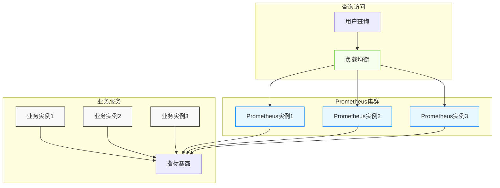
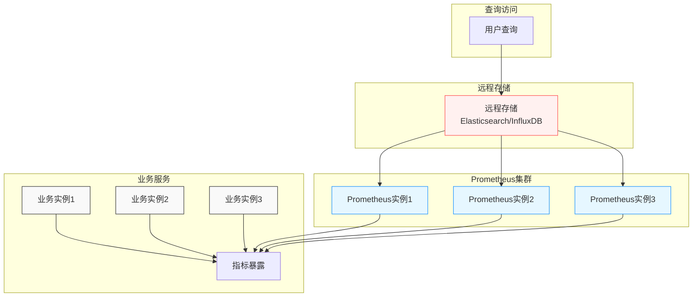
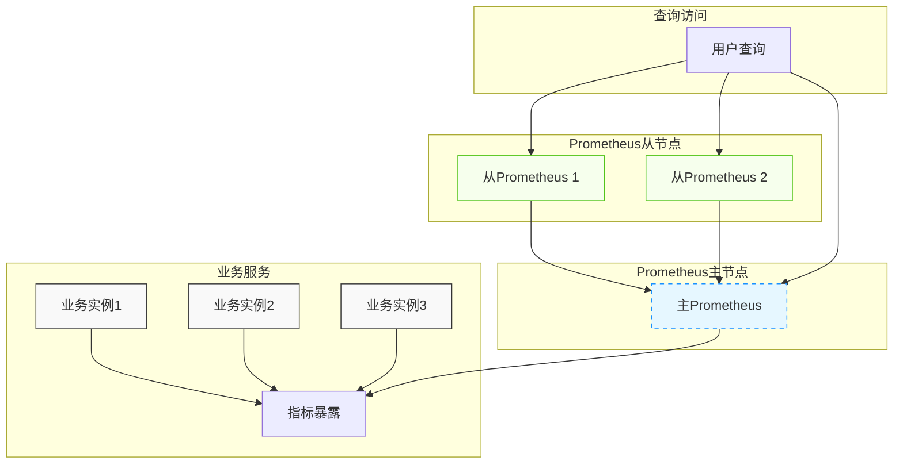
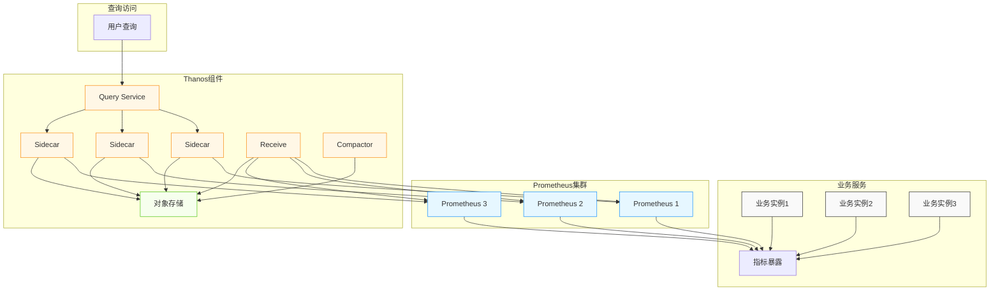
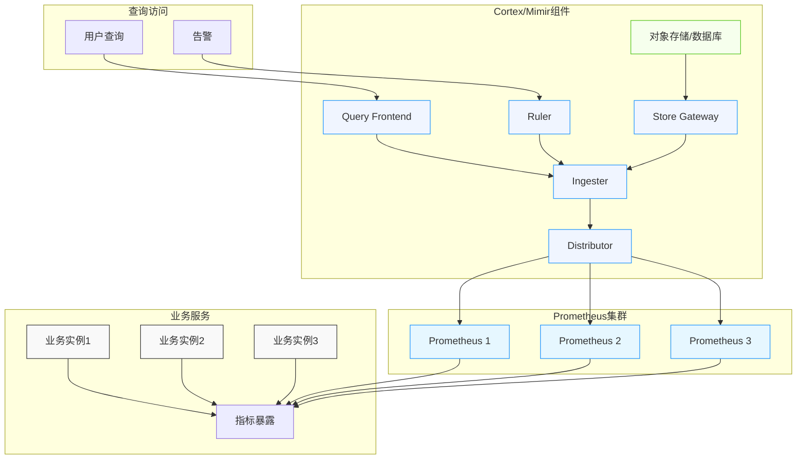
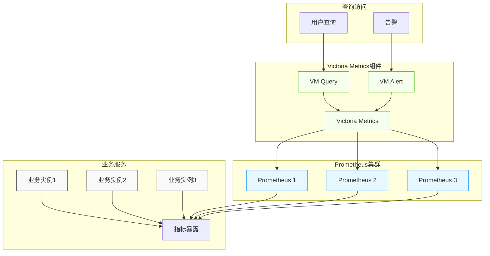
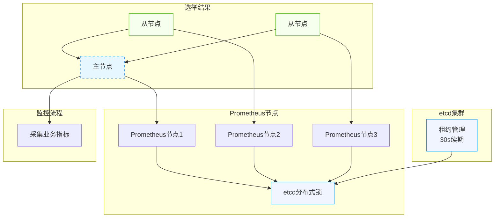

### 一、应用场景

  HCI超融合的监控场景，应用程序与主机一起打包交付，客户环境可能包含1-3台主机。监控服务随主机启动，业务暴露指标给Prometheus采集。多主机场景下，每台主机运行独立的Prometheus实例，各自存储独立。

### 二、需求

1. Prometheus任何一台宕机，监控系统仍能正常运行；
2. 监控服务独立于业务，资源消耗（内存、磁盘）不影响业务正常运行；
3. 支持大规模指标采集和长期数据存储；
4. 提供统一的查询入口和高可用的告警能力。

### 三、目标

1. 实现Prometheus高可用方案（数据同步、配置管理、主从选举）；
2. 优化资源消耗，确保系统稳定性；
3. 支持长期数据存储和大规模指标管理；
4. 提供统一的监控查询和告警平台。


### 四、数据同步方案

#### 4.1 传统方案

##### 4.1.1 多实例并行采集 + 负载均衡



**优点**：
- 配置简单，部署成本低
- 无单点故障，任一Prometheus实例宕机不影响整体监控

**缺点**：
- 数据一致性取决于拉取频率，低频采集时数据一致性较差
- 高频采集会增加业务指标接口的网络IO压力
- 单机存储限制，不适用于海量数据场景

##### 4.1.2 远程写入模式



**工作原理**：
Prometheus从目标拉取数据后，先写入本地存储，再通过remote write接口发送到远程存储。如果远程写入失败，会自动重试（可配置重试次数）。

**优点**：
- 解决单机存储限制问题
- 配置相对简单
- 数据安全性高，本地存储作为备份

**缺点**：
- 需要额外部署远程存储服务
- 重试策略需要根据负载和业务需求调整
- 远程存储可能成为性能瓶颈

##### 4.1.3 Federation联邦机制



**工作原理**：
主Prometheus采集业务指标，从Prometheus通过`/federate`端点拉取主节点的即时向量数据。

**优点**：
- 官方原生方案，配置相对简单
- 数据丢失范围可控，最大丢失时间等于拉取间隔
- 压缩传输，网络开销小

**缺点**：
- 无法拉取历史数据，新节点需要手动同步数据目录
- 存在主从同步延迟
- 主节点可能成为单点故障

#### 4.2 现代解决方案

##### 4.2.1 Thanos



**核心特性**：
- 全局查询视图：通过Query Service聚合多个Prometheus实例的数据
- 长期存储：将数据压缩存储到对象存储（S3、GCS等）
- 高可用：多Prometheus实例并行采集，数据通过Sidecar上传到对象存储
- 无单点故障：任意组件故障不影响整体系统

**优势**：
- 解决长期存储问题，支持PB级数据
- 保持Prometheus的查询性能
- 水平扩展能力强
- 与Prometheus完全兼容

##### 4.2.2 Cortex/Mimir



**核心特性**：
- 多租户支持：适合多团队共享监控基础设施
- 水平扩展：支持大规模指标采集和查询
- 长期存储：集成多种后端存储方案
- 高可用：所有组件均可水平扩展

**优势**：
- 适合大规模部署场景
- 强大的多租户隔离能力
- 灵活的存储后端选项
- 企业级监控解决方案

##### 4.2.3 Victoria Metrics



**核心特性**：
- 高性能：单实例支持每秒数百万指标写入
- 高压缩率：比Prometheus存储节省80%以上空间
- 易于部署：单二进制文件，无依赖
- 完全兼容PromQL

**优势**：
- 极高的性能和存储效率
- 简单部署和维护
- 适合从小型到大型的各种场景
- 成本效益高

### 五、选主和配置管理

#### 5.1 主从选举机制

##### 5.1.1 基于etcd的分布式锁选主



**工作原理**：
- 主节点通过etcd获取分布式锁，通过30秒租约续期保活
- 超过30秒未续期，触发重新选主
- 支持手动选主，通过在etcd中设置手动主节点标记

**适用场景**：
- 传统主从架构的Prometheus部署
- 需要明确主节点负责采集，从节点负责备份的场景

##### 5.1.2 现代方案的无主架构

在现代解决方案（如Thanos、Cortex）中，通常采用无主架构：

- **多实例并行采集**：所有Prometheus实例同时采集数据
- **数据聚合**：通过Query Service或类似组件聚合多个实例的数据
- **自动负载均衡**：查询请求自动分发到多个实例

**优势**：
- 无需复杂的选主机制
- 更高的可用性和扩展性
- 简化运维管理

#### 5.2 配置管理

##### 5.2.1 传统配置热重载

**官方方案**：
- 使用 `curl -X POST http://IP/-/reload` 触发配置重新加载
- 或使用 `kill -HUP pid` 发送信号触发重载

**优点**：
- 无需修改源码，保持Prometheus原生特性
- 操作简单，易于集成到自动化脚本

**缺点**：
- 需要直接访问每个Prometheus实例
- 配置变更需要逐个节点执行

##### 5.2.2 集中式配置管理

**基于etcd的配置管理**：
- 将Prometheus配置存储在etcd中
- 实现配置变更的自动同步
- 通过watch机制实时感知配置变化

**现代方案**：
- **Thanos**：支持通过对象存储或etcd存储配置
- **Cortex/Mimir**：提供集中式配置管理API
- **Prometheus Operator**：通过Kubernetes CRD管理配置

**优势**：
- 集中管理配置，避免配置不一致
- 支持版本控制和回滚
- 简化大规模部署的配置管理

### 六、现代Prometheus生态工具

#### 6.1 Thanos

**概念**：Thanos是一个开源的Prometheus高可用解决方案，主要解决Prometheus的长期存储和全局查询问题。

**核心组件**：
- **Sidecar**：与Prometheus实例一起部署，负责将数据上传到对象存储
- **Query Service**：聚合多个Prometheus实例的数据，提供统一查询入口
- **Compact**：压缩和降采样历史数据，优化存储
- **Store Gateway**：从对象存储中读取历史数据
- **Receive**：接收远程写入的数据

**使用方法**：
1. **部署Prometheus**：配置较短的本地存储 retention（如24小时）
2. **部署Thanos Sidecar**：与每个Prometheus实例一起运行
3. **配置对象存储**：创建S3、GCS等对象存储桶
4. **部署Thanos Query**：作为统一查询入口
5. **可选部署Compactor**：优化存储

**配置示例**：
```bash
# Prometheus配置
./prometheus \
  --storage.tsdb.path=/data \
  --storage.tsdb.retention.time=24h \
  --web.listen-address=:9090 \
  --web.enable-lifecycle

# Thanos Sidecar
./thanos sidecar \
  --prometheus.url=http://localhost:9090 \
  --tsdb.path=/data \
  --objstore.config-file=objectstore.yml

# Thanos Query
./thanos query \
  --http-address=:10902 \
  --store=localhost:10901
```

#### 6.2 Cortex/Mimir

**概念**：Cortex（现更名为Mimir）是一个水平可扩展的Prometheus兼容的监控系统，专为大规模部署设计。

**核心组件**：
- **Distributor**：接收和验证远程写入的指标数据
- **Ingester**：暂时存储指标数据并定期写入长期存储
- **Query Frontend**：处理查询请求，提供缓存和查询并行化
- **Ruler**：执行告警规则
- **Store Gateway**：从长期存储中读取数据

**使用方法**：
1. **部署Mimir集群**：包括所有核心组件
2. **配置Prometheus**：通过remote write将数据发送到Mimir
3. **配置存储后端**：如对象存储或数据库
4. **使用Grafana**：连接Mimir进行查询和可视化

**配置示例**：
```yaml
# Prometheus remote write配置
remote_write:
  - url: "http://mimir-distributor:9009/api/v1/push"
    basic_auth:
      username: "user"
      password: "password"
```

#### 6.3 Prometheus Operator

**概念**：Prometheus Operator是一个Kubernetes operator，用于在Kubernetes集群中自动化管理Prometheus及其相关组件。

**核心功能**：
- **自动部署和管理Prometheus实例**
- **自动发现和监控Kubernetes资源**
- **通过CRD定义监控目标和告警规则**
- **集成Alertmanager和Grafana**

**使用方法**：
1. **安装Prometheus Operator**：使用Helm或直接应用YAML
2. **定义ServiceMonitor**：指定要监控的Kubernetes服务
3. **定义Prometheus**：配置Prometheus实例
4. **定义Alertmanager**：配置告警规则和接收器

**配置示例**：
```yaml
# ServiceMonitor示例
apiVersion: monitoring.coreos.com/v1
kind: ServiceMonitor
metadata:
  name: example-app
  namespace: monitoring
spec:
  selector:
    matchLabels:
      app: example
  endpoints:
  - port: web
    interval: 15s

# Prometheus示例
apiVersion: monitoring.coreos.com/v1
kind: Prometheus
metadata:
  name: main
  namespace: monitoring
spec:
  serviceMonitorSelector:
    matchLabels:
      team: frontend
  resources:
    requests:
      memory: 400Mi
  enableAdminAPI: true
```

### 七、最佳实践与常见问题

#### 7.1 资源管理

##### 7.1.1 磁盘管理
- **存储计算**：每个样本约1-2字节，磁盘大小 = 保留时间 × 每秒样本数 × 样本大小
- **默认配置**：
  - `storage.tsdb.path`：数据存储目录，默认为`data/`
  - `storage.tsdb.retention.time`：数据保留时间，默认15天
- **现代方案**：使用Thanos、Cortex等解决方案将数据存储到对象存储，实现无限存储

##### 7.1.2 内存管理
- **内存消耗因素**：
  - 采集的时间序列数量
  - 查询复杂度和范围
  - 存储块大小和落盘频率
- **优化策略**：
  - 合理设置`--storage.tsdb.max-block-duration`（默认2小时）
  - 启用`--storage.tsdb.wal-compression`减少内存占用
  - 使用短周期采样减少数据量
  - 限制查询时间范围和复杂度
  - 在容器环境中设置内存限制

##### 7.1.3 性能优化
- **水平扩展**：
  - 按业务或服务分片采集
  - 使用联邦机制或现代解决方案聚合数据
- **垂直优化**：
  - 调整`scrape_interval`和`scrape_timeout`
  - 优化Exporter输出，减少不必要的指标
  - 使用`relabel_configs`过滤指标

#### 7.2 高可用部署建议

##### 7.2.1 小型部署（1-3节点）
- **方案**：多实例并行采集 + 负载均衡
- **优势**：部署简单，成本低
- **配置**：
  - 所有Prometheus实例配置相同的采集目标
  - 前端部署负载均衡器分发查询请求

##### 7.2.2 中型部署（4-10节点）
- **方案**：Thanos或Victoria Metrics
- **优势**：支持长期存储，查询性能好
- **配置**：
  - 部署Thanos Sidecar与Prometheus实例
  - 配置对象存储作为长期存储
  - 部署Thanos Query作为统一查询入口

##### 7.2.3 大型部署（10+节点）
- **方案**：Cortex/Mimir
- **优势**：多租户支持，水平扩展能力强
- **配置**：
  - 部署完整的Cortex/Mimir集群
  - 配置分布式存储后端
  - 实现细粒度的租户隔离

#### 7.3 常见问题解答

##### 7.3.1 数据一致性问题
- **传统方案**：数据一致性取决于拉取频率
- **现代方案**：通过分布式架构和数据复制确保一致性

##### 7.3.2 数据丢失风险
- **联邦机制**：最大丢失时间等于拉取间隔
- **远程写入**：本地存储作为备份，降低数据丢失风险
- **现代方案**：多副本存储，几乎零数据丢失

##### 7.3.3 配置管理
- **传统方式**：手动或脚本触发热重载
- **现代方式**：通过配置管理系统或Operator实现自动化

##### 7.3.4 高可用切换时间
- **基于etcd的选主**：租约过期时间（通常10-30秒）
- **现代无主架构**：几乎无切换时间，自动故障转移

##### 7.3.5 监控系统本身的监控
- **关键指标**：
  - Prometheus自身的监控指标（`prometheus_*`）
  - 存储使用率和查询性能
  - 服务可用性和响应时间
- **告警策略**：
  - 设置存储使用率阈值告警
  - 监控查询延迟和失败率
  - 配置系统组件健康检查

#### 7.4 现代解决方案对比

| 方案 | 适用场景 | 优势 | 劣势 |
|------|----------|------|------|
| Thanos | 中大型部署 | 全局查询视图，长期存储 | 部署复杂度较高 |
| Cortex/Mimir | 大型企业级部署 | 多租户支持，水平扩展 | 资源消耗较大 |
| Victoria Metrics | 从小型到大型 | 高性能，易部署 | 生态相对较小 |
| 传统多实例 | 小型部署 | 简单部署，成本低 | 缺乏长期存储 |

#### 7.5 部署示例

##### 7.5.1 Thanos部署示例
```bash
# Prometheus配置
./prometheus \
  --storage.tsdb.path=/data \
  --storage.tsdb.retention.time=24h \
  --web.listen-address=:9090 \
  --web.enable-lifecycle

# Thanos Sidecar
./thanos sidecar \
  --prometheus.url=http://localhost:9090 \
  --tsdb.path=/data \
  --objstore.config-file=objectstore.yml

# Thanos Query
./thanos query \
  --http-address=:10902 \
  --store=localhost:10901
```

##### 7.5.2 Victoria Metrics部署示例
```bash
# 启动Victoria Metrics
./victoria-metrics \
  --storageDataPath=/var/lib/victoria-metrics \
  --httpListenAddr=:8428

# Prometheus配置remote write
remote_write:
  - url: "http://localhost:8428/api/v1/write"
```

### 参考资料

#### 官方文档
- [Prometheus官方文档](https://prometheus.io/docs/introduction/overview/)
- [Thanos官方文档](https://thanos.io/tip/thanos/getting-started.md/)
- [Grafana Mimir官方文档](https://grafana.com/docs/mimir/latest/)
- [Victoria Metrics官方文档](https://docs.victoriametrics.com/)

#### 技术博客
- [Prometheus时序数据库-磁盘中的存储结构](https://www.cnblogs.com/alchemystar/p/14462052.html)
- [根据指标数量和采集频率计算prometheus最大内存占用计算器](https://www.robustperception.io/how-much-ram-does-prometheus-2-x-need-for-cardinality-and-ingestion/)
- [Prometheus高可用最佳实践](https://prometheus.io/blog/2017/06/17/high-availability-prometheus/)

#### 工具与集成
- [etcd + confd + prometheus 自动发现](https://github.com/ywanbing/golearning/tree/master/etcd_confd_prometheus)
- [prometheus自带的基于文件的服务发现](https://yunlzheng.gitbook.io/prometheus-book/part-ii-prometheus-jin-jie/sd/service-discovery-with-file)
- [etcd 服务发现](https://prometheus.io/blog/2015/08/17/service-discovery-with-etcd/)

#### 部署指南
- [Prometheus Operator官方文档](https://operatorhub.io/operator/prometheus)
- [Thanos部署指南](https://thanos.io/tip/thanos/tutorials/quick-start.md/)
- [Victoria Metrics部署指南](https://docs.victoriametrics.com/guides/#how-to-deploy-victoria-metrics)
