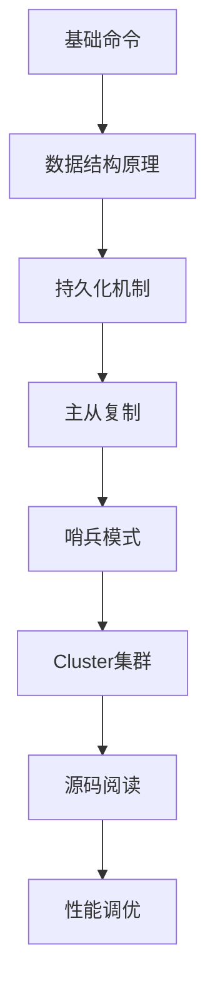

> Redis 学习资料汇总与博客索引

## 目录

- [一、官方资料](#一官方资料)
- [二、经典书籍](#二经典书籍)
- [三、优质博客](#三优质博客)
- [四、源码学习](#四源码学习)
- [五、实践笔记](#五实践笔记)

## 一、官方资料

| 资源 | 链接 |
|------|------|
| 官网 | https://redis.io/ |
| 文档 | https://redis.io/docs/ |
| 命令参考 | https://redis.io/commands/ |
| 源码仓库 | https://github.com/redis/redis |
| 模块仓库 | https://github.com/redislabs |

## 二、经典书籍

| 书名 | 作者 | 说明 |
|------|------|------|
| 《Redis设计与实现》 | 黄健宏 | 数据结构与底层实现讲解透彻 |
| 《Redis开发与运维》 | 付磊 | 实战开发+运维 |
| 《Redis实战》 | Josiah L. Carlson | 应用场景与最佳实践 |
| 《Redis 5设计与源码分析》 | 陈雷等 | 源码级剖析 |

## 三、优质博客

- [antirez 博客](http://antirez.com/) - Redis作者博客
- [Redis Labs 博客](https://redis.com/blog/)
- [黄健宏博客](http://huangz.me/)
- [钱文品博客](https://www.cnblogs.com/happyhope/)

## 四、源码学习

### 4.1 关键源码文件

| 文件 | 内容 |
|------|------|
| `src/server.c` | Redis服务器主流程 |
| `src/networking.c` | 网络层实现 |
| `src/dict.c` | 哈希表实现 |
| `src/t_string.c` | String类型实现 |
| `src/t_hash.c` | Hash类型实现 |
| `src/t_list.c` | List类型实现 |
| `src/t_set.c` | Set类型实现 |
| `src/t_zset.c` | SortedSet实现（含跳表） |
| `src/expire.c` | 过期键实现 |
| `src/aof.c` | AOF持久化 |
| `src/rdb.c` | RDB持久化 |
| `src/cluster.c` | 集群实现 |
| `src/replication.c` | 主从复制 |

### 4.2 数据结构源码

| 文件 | 数据结构 |
|------|----------|
| `src/sds.c` | 简单动态字符串 |
| `src/adlist.c` | 双向链表 |
| `src/dict.c` | 字典 |
| `src/intset.c` | 整数集合 |
| `src/ziplist.c` | 压缩列表 |
| `src/quicklist.c` | 快速列表 |
| `src/listpack.c` | 紧凑列表（Redis 7） |
| `src/t_zset.c` | 跳表 |

## 五、实践笔记

### 5.1 学习路径建议

### 5.2 进阶主题

- Redis 7.0 新特性：Functions、ACL v2、多线程AOF
- Redis 6.0 多线程IO
- Redis Modules（RediSearch、RedisGraph、RedisJSON）
- Redis Stream 消息队列
- Redis on Flash
- Redis 8.0 AI向量检索
