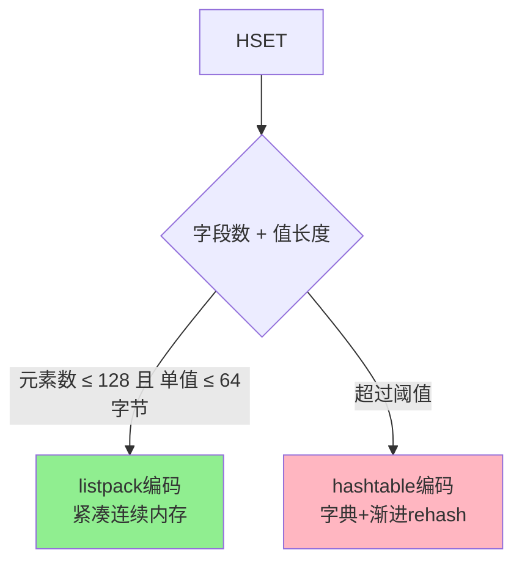
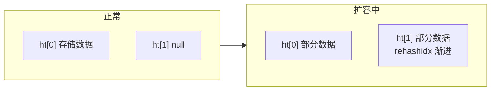

> Redis Hash 类型：字段-值映射表，适合存储对象

## 目录

- [一、基本概念](#一基本概念)
- [二、常用命令](#二常用命令)
- [三、底层实现](#三底层实现)
- [四、应用场景](#四应用场景)
- [五、使用示例](#五使用示例)
- [六、相关资料](#六相关资料)

## 一、基本概念

| 特性 | 说明 |
|------|------|
| 结构 | field-value 键值对集合 |
| 字段数上限 | 2^32 - 1 |
| 编码方式 | listpack / hashtable |
| 适用场景 | 对象存储 |

## 二、常用命令

### 2.1 基本操作

```bash
# 设置单个字段
$ HSET user:1001 name Alice age 30

# 获取单个字段
$ HGET user:1001 name

# 设置多个字段
$ HMSET user:1001 name Alice age 30 city Beijing

# 获取多个字段
$ HMGET user:1001 name age city

# 获取所有字段
$ HGETALL user:1001

# 获取所有字段名
$ HKEYS user:1001

# 获取所有值
$ HVALS user:1001

# 获取字段数
$ HLEN user:1001
```

### 2.2 字段管理

```bash
# 删除字段
$ HDEL user:1001 age

# 判断字段是否存在
$ HEXISTS user:1001 name

# 字段值自增
$ HINCRBY user:1001 age 1
$ HINCRBYFLOAT user:1001 score 0.5

# 仅在字段不存在时设置
$ HSETNX user:1001 email alice@example.com
```

### 2.3 扫描与迭代

```bash
# 扫描字段（生产推荐）
$ HSCAN user:1001 0 MATCH na* COUNT 10
```

## 三、底层实现

### 3.1 编码选择



### 3.2 listpack 编码

紧凑的连续内存结构，适合少量字段：

```
| total bytes | num elements | field1 | value1 | field2 | value2 | ... | end |
```

**优点**：
- 内存占用少
- 访问局部性好

**缺点**：
- 查找O(n)
- 字段数多时性能下降

### 3.3 hashtable 编码

基于字典实现，使用渐进式 rehash：



**优点**：
- O(1) 查找
- 支持大量字段

## 四、应用场景

### 4.1 对象存储

```python
# 存储用户信息
r.hset('user:1001', mapping={
    'name': 'Alice',
    'age': 30,
    'city': 'Beijing',
    'email': 'alice@example.com'
})

# 读取单个字段
name = r.hget('user:1001', 'name')

# 读取所有
user = r.hgetall('user:1001')
```

**对比String存储JSON**：

| 方式 | 优点 | 缺点 |
|------|------|------|
| String存JSON | 一次IO读取 | 修改字段需读取全部 |
| Hash存字段 | 可单独修改字段 | 多次IO读取所有字段 |

### 4.2 购物车

```python
# 添加商品到购物车
r.hset('cart:user:1001', 'product:1001', 2)  # 商品ID:数量
r.hincrby('cart:user:1001', 'product:1001', 1)  # 数量+1

# 查看购物车
cart = r.hgetall('cart:user:1001')

# 移除商品
r.hdel('cart:user:1001', 'product:1001')
```

### 4.3 计数器组

```python
# 文章统计：浏览、点赞、评论
r.hincrby('article:123:stats', 'views', 1)
r.hincrby('article:123:stats', 'likes', 1)
r.hincrby('article:123:stats', 'comments', 1)

# 获取所有统计
stats = r.hgetall('article:123:stats')
```

## 五、使用示例

### 5.1 Python示例

```python
import redis

r = redis.Redis(host='localhost', port=6379, decode_responses=True)

# 设置字段
r.hset('user:1001', 'name', 'Alice')
r.hset('user:1001', 'age', 30)

# 批量设置
r.hset('user:1001', mapping={'city': 'Beijing', 'email': 'alice@example.com'})

# 获取
print(r.hget('user:1001', 'name'))  # Alice
print(r.hgetall('user:1001'))
# {'name': 'Alice', 'age': '30', 'city': 'Beijing', 'email': 'alice@example.com'}

# 自增
r.hincrby('user:1001', 'age', 1)

# 判断字段存在
print(r.hexists('user:1001', 'email'))  # True
```

### 5.2 Go示例

```go
package main

import (
    "context"
    "fmt"
    "github.com/redis/go-redis/v9"
)

func main() {
    rdb := redis.NewClient(&redis.Options{Addr: "localhost:6379"})
    ctx := context.Background()

    // 设置字段
    rdb.HSet(ctx, "user:1001", "name", "Alice", "age", 30)

    // 批量设置
    rdb.HSet(ctx, "user:1001", map[string]interface{}{
        "city":  "Beijing",
        "email": "alice@example.com",
    })

    // 获取
    name, _ := rdb.HGet(ctx, "user:1001", "name").Result()
    fmt.Println(name) // Alice

    all, _ := rdb.HGetAll(ctx, "user:1001").Result()
    fmt.Println(all)
}
```

## 六、相关资料

- [Redis Hash命令](https://redis.io/commands/?group=hash)
- [Redis哈希实现](https://redis.io/docs/reference/internals/data-types/)
