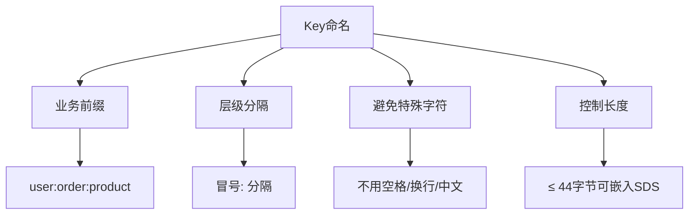

> Redis Key 通用操作与设计规范

## 目录

- [一、Key基本操作](#一key基本操作)
- [二、过期时间](#二过期时间)
- [三、Key扫描](#三key扫描)
- [四、Key设计规范](#四key设计规范)
- [五、BigKey处理](#五bigkey处理)
- [六、相关资料](#六相关资料)

## 一、Key基本操作

```bash
# 查找Key
$ KEYS pattern          # 慎用，阻塞
$ SCAN 0 MATCH user:* COUNT 100  # 推荐

# 判断Key存在
$ EXISTS key
$ EXISTS key1 key2 key3  # 返回存在的数量

# 查看类型
$ TYPE key

# 查看编码
$ OBJECT ENCODING key

# 查看内存占用
$ MEMORY USAGE key
$ MEMORY USAGE key SAMPLES 5

# 重命名
$ RENAME oldkey newkey
$ RENAMENX oldkey newkey

# 删除
$ DEL key1 key2
$ UNLINK key    # 异步删除（大key推荐）

# 随机返回一个Key
$ RANDOMKEY

# 查看Key的引用次数
$ OBJECT REFCOUNT key

# 查看Key空闲时间（秒）
$ OBJECT IDLETIME key
```

## 二、过期时间

### 2.1 设置过期

```bash
# 秒级
$ EXPIRE key 60
$ SETEX key 60 value

# 毫秒级
$ PEXPIRE key 60000
$ PSETEX key 60000 value
$ SET key value PX 60000

# 时间戳（秒）
$ EXPIREAT key 1700000000

# 时间戳（毫秒）
$ PEXPIREAT key 1700000000000

# 只在Key有TTL时设置（Redis 7+）
$ EXPIRE key 60 NX
$ EXPIRE key 60 XX
$ EXPIRE key 60 GT
$ EXPIRE key 60 LT
```

### 2.2 查询与取消

```bash
# 查看剩余时间
$ TTL key       # 秒，-1表示永不过期，-2表示不存在
$ PTTL key      # 毫秒

# 取消过期
$ PERSIST key
```

## 三、Key扫描

### 3.1 SCAN 命令

```bash
# 基础扫描
$ SCAN 0

# 带匹配模式
$ SCAN 0 MATCH user:* COUNT 100

# 带类型过滤
$ SCAN 0 TYPE hash

# 返回值
# 1) 下一个游标（0表示扫描完成）
# 2) 匹配的Key列表
```

### 3.2 类型专属扫描

```bash
$ HSCAN hashkey 0 MATCH field* COUNT 10
$ SSCAN setkey 0 MATCH member* COUNT 10
$ ZSCAN zsetkey 0 MATCH member* COUNT 10
```

### 3.3 SCAN vs KEYS

| 维度 | KEYS | SCAN |
|------|------|------|
| 阻塞 | 阻塞主线程 | 非阻塞（游标） |
| 返回 | 完整结果 | 增量结果 |
| 一致性 | 强一致 | 弱一致 |
| 生产使用 | 禁止 | 推荐 |

## 四、Key设计规范

### 4.1 命名规范



### 4.2 命名示例

| 业务 | Key示例 | 说明 |
|------|---------|------|
| 用户信息 | `user:1001:profile` | 业务:ID:字段 |
| 订单 | `order:2024:12345` | 业务:年份:订单号 |
| 商品库存 | `stock:product:1001` | 业务:类型:ID |
| 会话 | `session:abc123` | 业务:sessionID |
| 排行榜 | `rank:game:2024w01` | 业务:子类:周期 |
| 分布式锁 | `lock:order:1001` | 业务:操作:ID |

### 4.3 Key分层建议

```
业务名 : 对象类型 : 对象ID : 字段
order  :  user    : 1001   : profile
order  :  user    : 1001   : cart
```

## 五、BigKey处理

### 5.1 BigKey定义

| 类型 | 阈值 | 风险 |
|------|------|------|
| String | > 10KB | 网络阻塞 |
| Hash | > 500字段或 > 10MB | 阻塞主线程 |
| List | > 5000元素 | 删除耗时 |
| Set | > 5000元素 | 内存膨胀 |
| ZSet | > 5000元素 | 范围查询慢 |

### 5.2 检测BigKey

```bash
# redis-cli工具
$ redis-cli --bigkeys

# 生产安全扫描
$ redis-cli --memkeys

# 手动查看
$ MEMORY USAGE key
$ DEBUG OBJECT key
$ STRLEN key          # String
$ HLEN key            # Hash
$ LLEN key            # List
$ SCARD key           # Set
$ ZCARD key           # ZSet
```

### 5.3 处理BigKey

```bash
# 1. 异步删除（不阻塞主线程）
$ UNLINK bigkey

# 2. 分批删除Hash字段
$ HSCAN bigkey 0 COUNT 100
$ HDEL bigkey field1 field2 ... field100

# 3. 分批删除List元素
$ LTRIM bigkey 0 -101   # 删除最后100个
$ LTRIM bigkey 0 -1     # 保留全部

# 4. 分批删除Set元素
$ SSCAN bigkey 0 COUNT 100
$ SREM bigkey member1 member2 ... member100

# 5. 分批删除ZSet元素
$ ZREMRANGEBYRANK bigkey 0 99  # 删除前100个
```

### 5.4 预防BigKey

| 方案 | 说明 |
|------|------|
| 拆分 | 大Hash拆为多个小Hash |
| 压缩 | 大Value压缩存储 |
| 过期 | 设置TTL避免长期堆积 |
| 监控 | 定期扫描bigkey |
| 上限 | 业务侧控制元素数 |

## 六、相关资料

- [Redis Key命令](https://redis.io/commands/?group=generic)
- [Redis内存优化](https://redis.io/docs/management/optimization/memory-optimization/)
