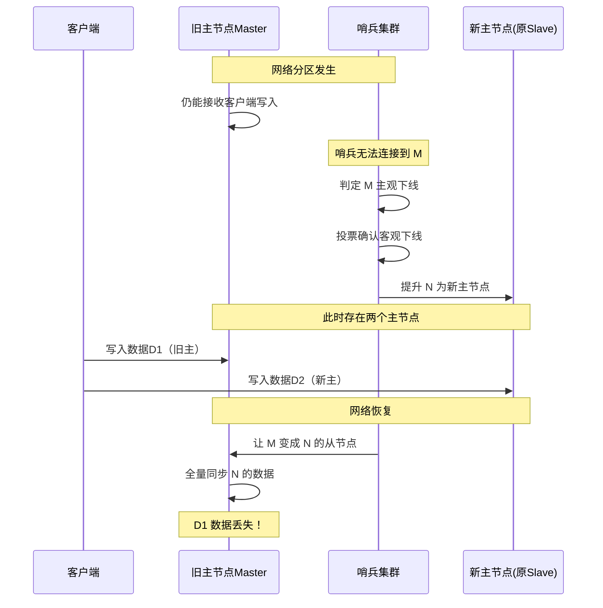
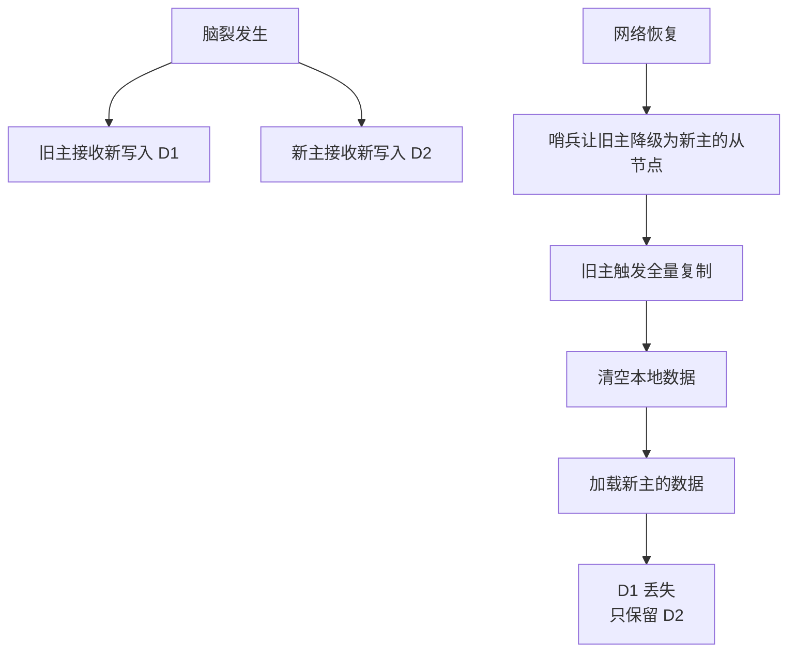
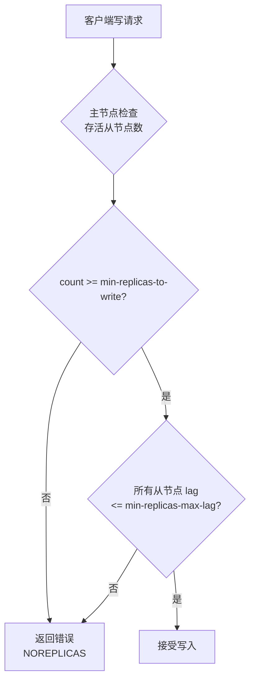
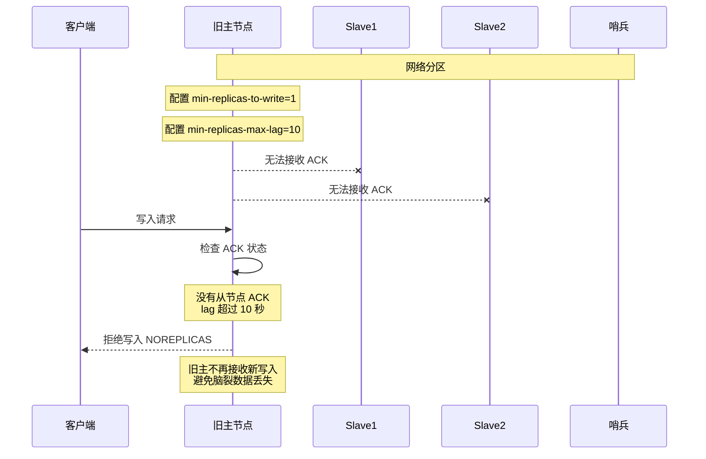
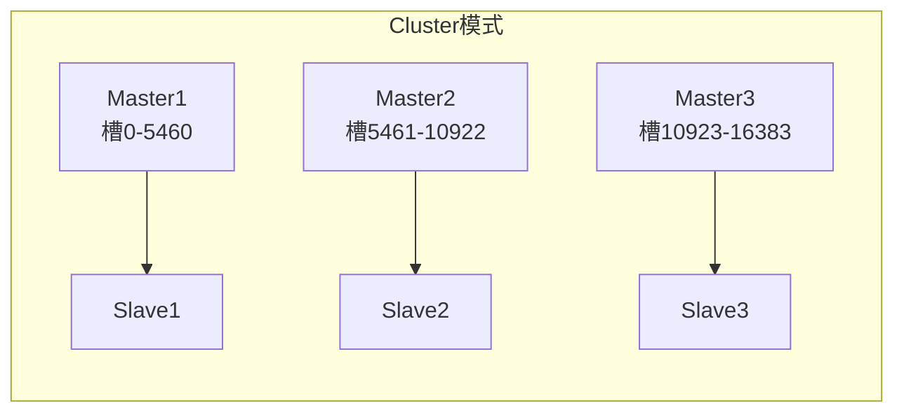

# Redis 主从脑裂问题与解决方案

> 脑裂（Split-Brain）：主从集群中出现多个主节点同时接受写入，导致数据不一致或丢失

## 一、脑裂现象

在主从+哨兵的架构中，因网络分区或哨兵误判，导致**原主节点仍在接受写入**，同时**哨兵将某个从节点提升为新主节点**，集群中同时存在两个主节点。



## 二、数据丢失的根本原因



**关键点**：从节点第一次会全量复制主节点数据，旧主降级为从节点时会**先清空本地数据再全量同步**，导致旧主在脑裂期间接收的写入全部丢失。

## 三、脑裂的常见原因

| 原因 | 说明 |
|------|------|
| 网络分区 | 主节点与哨兵之间网络断开，但主节点仍能服务客户端 |
| 哨兵配置异常 | `quorum` 或 `down-after-milliseconds` 配置过低，误判主节点下线 |
| 主节点假死 | 主节点 GC、磁盘 IO 阻塞导致响应超时，实际未宕机 |
| 跨机房网络抖动 | 多机房部署时网络延迟波动 |

## 四、解决方案：min-replicas 配置

Redis 提供原生的脑裂防护配置，限制主节点在缺乏足够从节点 ACK 时拒绝写入。

### 4.1 配置项

```bash
# 主节点配置
min-replicas-to-write 1
min-replicas-max-lag 10
```

| 配置项 | 含义 |
|--------|------|
| `min-replicas-to-write N` | 主节点至少要有 N 个从节点保持连接，否则拒绝写入 |
| `min-replicas-max-lag T` | 从节点的 ACK 延迟不能超过 T 秒 |

### 4.2 工作机制



### 4.3 防护脑裂的原理



**核心思路**：脑裂发生时，旧主节点必然无法与从节点通信（被网络分区隔离），因此 ACK 必然超时，旧主会自动拒绝写入，从而避免数据丢失。

## 五、配置权衡

### 5.1 推荐配置

```bash
# 至少1个从节点 ACK 延迟不超过10秒
min-replicas-to-write 1
min-replicas-max-lag 10
```

| 场景 | min-replicas-to-write | min-replicas-max-lag |
|------|----------------------|---------------------|
| 单从节点 | 1 | 10 |
| 两从节点 | 1 | 10 |
| 三从节点 | 1~2 | 10 |
| 高可用优先 | 1 | 5 |
| 数据安全优先 | floor(n/2)+1 | 5 |

### 5.2 注意事项

1. **不能太高**：`min-replicas-to-write` 设置过高会导致从节点全部宕机时主节点不可写
2. **兼顾网络抖动**：`min-replicas-max-lag` 应略大于正常网络延迟峰值
3. **配合持久化**：主节点必须开启持久化，避免重启后空数据被同步到从节点

## 六、其他防护措施

### 6.1 哨兵参数调优

```bash
# sentinel.conf
sentinel down-after-milliseconds mymaster 30000   # 30秒无响应才判定下线
sentinel parallel-syncs mymaster 1                # 每次只允许1个从节点同步
sentinel failover-timeout mymaster 180000         # 故障转移超时3分钟
```

**调优建议**：
- `down-after-milliseconds` 不宜过低，避免主节点假死时误判
- `parallel-syncs` 设置为 1，避免所有从节点同时全量同步压垮新主

### 6.2 客户端重试机制

```python
import redis
import time

def safe_write(client, key, value, max_retry=3):
    for i in range(max_retry):
        try:
            return client.set(key, value)
        except redis.ResponseError as e:
            if "NOREPLICAS" in str(e):
                # 主节点拒绝写入（脑裂保护触发）
                time.sleep(0.5)
                continue
            raise
    raise Exception("Write failed after retries")
```

### 6.3 监控告警

```bash
# 监控主从切换事件
redis-cli -p 26379 SUBSCRIBE +switch-master

# 监控主从延迟
redis-cli -p 6379 INFO replication | grep lag
# slave0:ip=...,lag=0  # lag 持续 >10 秒需告警
```

## 七、Cluster 模式的脑裂避免

Redis Cluster 通过**去中心化设计**避免脑裂：



| 维度 | 主从+哨兵 | Cluster |
|------|----------|---------|
| 主节点数量 | 1 | 多个（每主负责部分槽） |
| 故障转移决策 | 哨兵投票 | Gossip + 节点投票 |
| 脑裂风险 | 高（单主易被误判） | 低（多主各管槽位） |
| 数据丢失影响 | 全部数据 | 仅影响该槽位数据 |

**Cluster 仍有故障转移脑裂可能**：当主节点与集群多数节点失联但与客户端仍能通信时。Cluster 通过 `cluster-node-timeout` 控制检测灵敏度。

## 八、相关资料

- [小林 coding - 主从切换如何减少数据丢失](https://xiaolincoding.com/redis/cluster/master_slave_replication.html#主从切换如何减少数据丢失)
- [Redis 官方文档 - 副本配置](https://redis.io/docs/management/replication/)
- [Redis 官方文档 - Sentinel](https://redis.io/docs/management/sentinel/)
- [根因分析：脑裂数据丢失](https://blog.csdn.net/qq_37248807/article/details/124617623)
