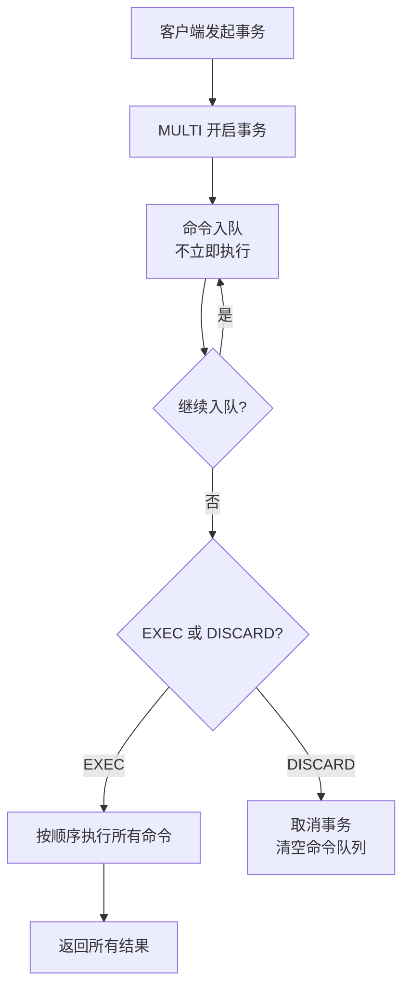
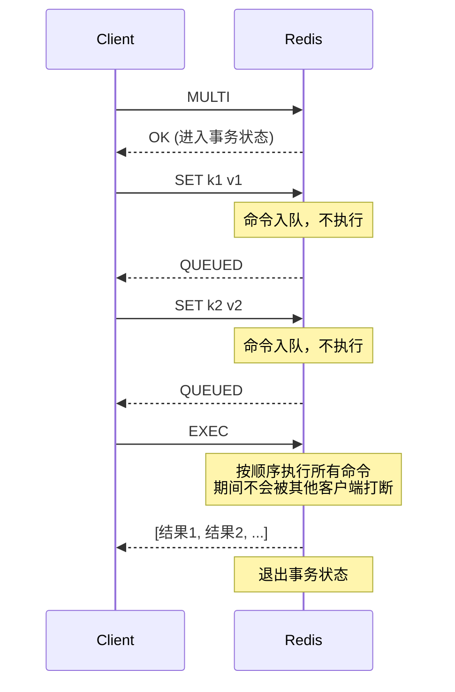
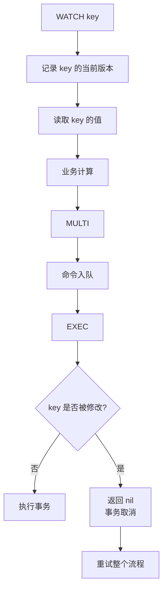
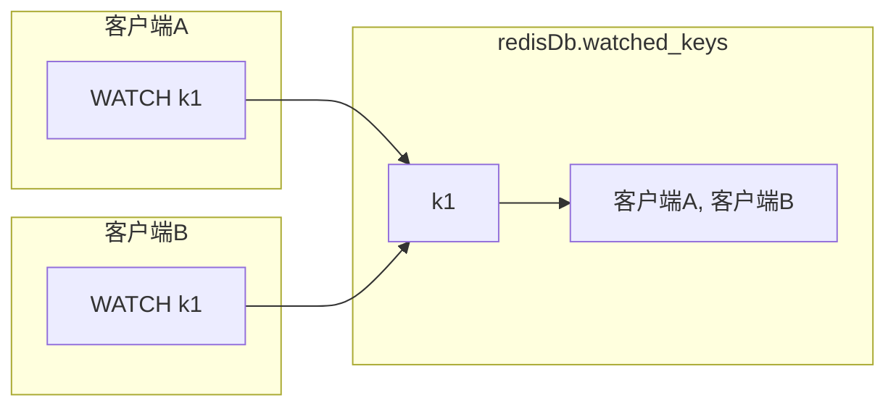
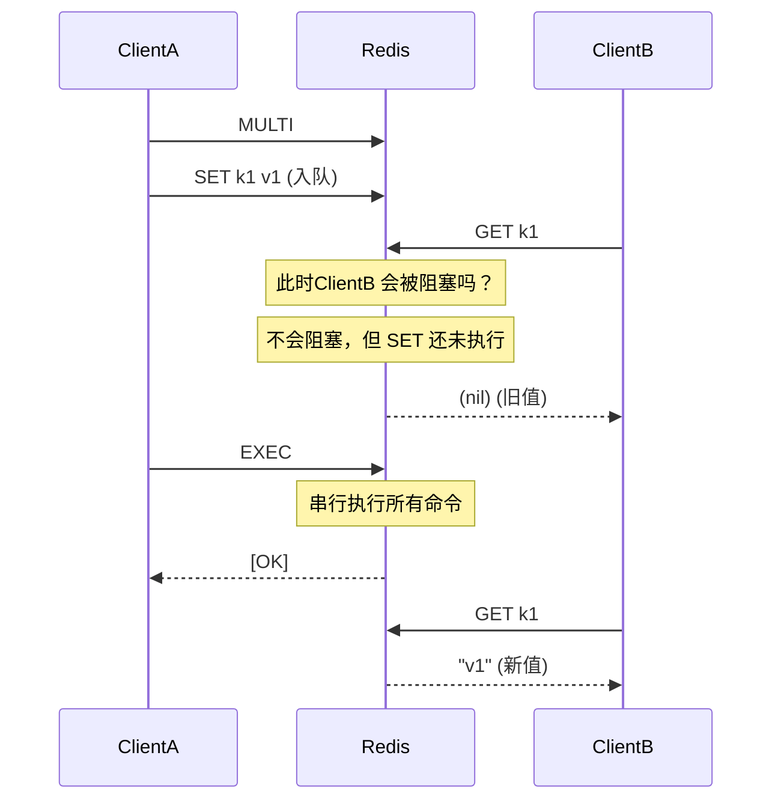

> Redis 事务：MULTI/EXEC 串行化命令队列，结合 WATCH 实现乐观锁，但**不支持回滚**

## 目录

- [一、事务概述](#一事务概述)
- [二、基本用法](#二基本用法)
- [三、事务的三种错误场景](#三事务的三种错误场景)
- [四、WATCH 实现乐观锁](#四watch-实现乐观锁)
- [五、事务的 ACID 分析](#五事务的-acid-分析)
- [六、Lua 脚本：更严格的原子性](#六lua-脚本更严格的原子性)
- [七、应用场景与最佳实践](#七应用场景与最佳实践)
- [八、相关资料](#八相关资料)

## 一、事务概述

Redis 事务是一组命令的集合，具备以下特性：

| 特性 | 是否支持 | 说明 |
|------|---------|------|
| 原子性 | 部分支持 | 命令要么全部执行要么都不执行，但**不支持回滚** |
| 一致性 | 支持 | 不会破坏数据完整性 |
| 隔离性 | 支持 | 单线程模型，事务串行执行 |
| 持久性 | 取决配置 | 由 RDB/AOF 持久化机制决定 |



## 二、基本用法

### 2.1 核心命令

| 命令 | 作用 | 返回值 |
|------|------|--------|
| `MULTI` | 开启事务 | `OK` |
| `EXEC` | 执行事务中的所有命令 | 数组，每条命令的结果 |
| `DISCARD` | 取消事务，清空命令队列 | `OK` |
| `WATCH key [key...]` | 监视 Key，若被修改则事务失败 | `OK` |
| `UNWATCH` | 取消所有监视 | `OK` |

### 2.2 基本流程

```bash
127.0.0.1:6379> MULTI
OK
127.0.0.1:6379(TX)> SET user:1001:name "Tom"
QUEUED
127.0.0.1:6379(TX)> INCR user:1001:age
QUEUED
127.0.0.1:6379(TX)> SET user:1001:city "Beijing"
QUEUED
127.0.0.1:6379(TX)> EXEC
1) OK
2) (integer) 25
3) OK
```

### 2.3 DISCARD 取消事务

```bash
127.0.0.1:6379> MULTI
OK
127.0.0.1:6379(TX)> SET key1 "v1"
QUEUED
127.0.0.1:6379(TX)> SET key2 "v2"
QUEUED
127.0.0.1:6379(TX)> DISCARD
OK
127.0.0.1:6379> GET key1
(nil)
```

### 2.4 命令入队原理



**关键点**：
- 事务期间的命令仅入队，不会立即执行
- EXEC 时 Redis 会串行执行所有命令，**期间不被其他客户端命令打断**
- 事务中所有命令执行完成后，才会处理其他客户端请求

## 三、事务的三种错误场景

### 3.1 命令入队错误（语法错误）

**特征**：命令本身存在语法错误，入队时即报错。

```bash
127.0.0.1:6379> MULTI
OK
127.0.0.1:6379(TX)> SET key value
QUEUED
127.0.0.1:6379(TX)> WRONGCOMMAND key
(error) ERR unknown command 'WRONGCOMMAND'
127.0.0.1:6379(TX)> SET
(error) ERR wrong number of arguments for 'set' command
127.0.0.1:6379(TX)> EXEC
(error) EXECABORT Transaction discarded because of previous errors.
```

**结果**：自动取消事务，**所有命令都不执行**。

### 3.2 命令执行错误（运行时错误）

**特征**：命令语法正确但执行时类型不匹配，**不会回滚**。

```bash
127.0.0.1:6379> SET k1 "abc"
OK
127.0.0.1:6379> MULTI
OK
127.0.0.1:6379(TX)> INCR k1       # 对字符串执行INCR
QUEUED
127.0.0.1:6379(TX)> SET k2 "v2"
QUEUED
127.0.0.1:6379(TX)> EXEC
1) (error) ERR value is not an integer or out of range
2) OK
127.0.0.1:6379> GET k2
"v2"
```

**结果**：错误命令返回错误，**后续命令继续执行**，已执行的命令不会回滚。

### 3.3 WATCH 监视的 Key 被修改

```bash
# 客户端A
127.0.0.1:6379> WATCH balance
OK
127.0.0.1:6379> MULTI
OK
127.0.0.1:6379(TX)> INCRBY balance 100
QUEUED

# 此时客户端B 修改了 balance
# 客户端B
127.0.0.1:6379> INCRBY balance -50
(integer) 50

# 客户端A 继续执行
127.0.0.1:6379(TX)> EXEC
(nil)   # 整个事务被取消
```

**结果**：EXEC 返回 nil，事务取消，所有命令不执行。

### 3.4 三种错误对比

| 错误类型 | 发生时机 | 是否执行 | 是否回滚 |
|---------|---------|---------|---------|
| 命令入队错误 | 命令入队时 | 全部不执行 | - |
| 命令执行错误 | EXEC 时 | 错误命令失败，其他继续 | 不回滚 |
| WATCH 触发 | EXEC 时 | 全部不执行 | - |

### 3.5 为什么 Redis 不支持回滚？

Redis 官方解释：
1. **命令错误通常是 Bug**：类型错误、参数错误应通过测试在开发阶段解决
2. **不回滚简化实现**：避免复杂的回滚机制，保持 Redis 简单高效
3. **性能优先**：回滚需要记录 undo 日志，影响性能

## 四、WATCH 实现乐观锁

### 4.1 工作原理

WATCH 基于 **CAS（Compare And Swap）** 思想，监视 Key 在事务执行前是否被修改：



### 4.2 经典场景：账户转账

```bash
# 客户端A：从 account:1 转 100 到 account:2
127.0.0.1:6379> WATCH account:1 account:2
OK
127.0.0.1:6379> GET account:1
"500"
127.0.0.1:6379> GET account:2
"300"

127.0.0.1:6379> MULTI
OK
127.0.0.1:6379(TX)> DECRBY account:1 100
QUEUED
127.0.0.1:6379(TX)> INCRBY account:2 100
QUEUED
127.0.0.1:6379(TX)> EXEC
1) (integer) 400
2) (integer) 400
```

### 4.3 WATCH 的实现机制

Redis 通过 `watched_keys` 字典管理被监视的 Key：

```c
typedef struct redisDb {
    dict *watched_keys;  // key -> 监视该 key 的客户端列表
    // ...
} redisDb;
```



**触发修改检测**：
- 任何修改 Key 的命令（SET/DEL/INCR 等）执行后
- Redis 检查 `watched_keys` 中是否有该 Key
- 若有，将所有监视该 Key 的客户端标记为 `REDIS_DIRTY_CAS`
- EXEC 时检查该标记，若已设置则取消事务

### 4.4 UNWATCH

```bash
# 主动取消监视
127.0.0.1:6379> UNWATCH
OK

# EXEC 或 DISCARD 后会自动 UNWATCH
```

### 4.5 CAS 与 ABA 问题

**ABA 问题**：CAS 仅比较值是否一致，但无法识别"A→B→A"的变化。

```
时间点T1: key = "A"
客户端A: WATCH key, 读取值 = "A"
时间点T2: 客户端B 修改 key = "B"
时间点T3: 客户端B 修改 key = "A"
客户端A: EXEC 时检查 key 还是 "A"，事务执行成功
```

**Redis 中的 ABA**：
- Redis 的 WATCH 基于"是否被修改过"，而非"值是否变化"
- 即使值变回了原值，只要被修改过，WATCH 仍会触发取消
- **Redis 不存在经典 CAS 的 ABA 问题**

## 五、事务的 ACID 分析

### 5.1 原子性（Atomicity）

- **入队错误**：所有命令都不执行，满足原子性
- **执行错误**：错误命令失败，其他命令继续，**不满足原子性**
- **WATCH 触发**：全部不执行，满足原子性

**结论**：Redis 事务**不完全满足原子性**（不支持回滚）。

### 5.2 一致性（Consistency）

Redis 通过以下机制保证一致性：
- 命令本身不会破坏数据结构（如 INCR 对非数字报错）
- 持久化机制保证数据可恢复
- 事务执行期间不会被其他命令打断

**结论**：满足一致性。

### 5.3 隔离性（Isolation）

Redis 单线程模型，事务串行执行：



**结论**：满足隔离性。

### 5.4 持久性（Durability）

取决于持久化配置：
- **RDB**：可能丢失最近一次快照后的数据
- **AOF appendfsync always**：基本不丢失
- **AOF appendfsync everysec**：最多丢 1 秒
- **无持久化**：不满足持久性

## 六、Lua 脚本：更严格的原子性

对于需要严格原子性的场景，推荐使用 Lua 脚本：

```mermaid
flowchart LR
    A[客户端] --> B[EVAL script numkeys keys args]
    B --> C[Redis 加载并编译 Lua]
    C --> D[原子性执行整个脚本]
    D --> E[返回结果]
    Note over C,D: 期间不会被任何命令打断
```

### 6.1 转账脚本示例

```lua
-- transfer.lua: 从 from 扣减 amount 到 to
local from = KEYS[1]
local to = KEYS[2]
local amount = tonumber(ARGV[1])

local balance = tonumber(redis.call('GET', from) or '0')
if balance < amount then
    return {err='INSUFFICIENT_BALANCE'}
end

redis.call('DECRBY', from, amount)
redis.call('INCRBY', to, amount)
return {ok='SUCCESS'}
```

```bash
# 执行脚本
127.0.0.1:6379> EVAL "$(cat transfer.lua)" 2 account:1 account:2 100
```

### 6.2 事务 vs Lua 脚本

| 维度 | MULTI/EXEC 事务 | Lua 脚本 |
|------|----------------|---------|
| 原子性 | 部分（不回滚） | 完全（整体原子） |
| 条件分支 | 不支持 | 支持 if/else |
| 错误处理 | 错误后继续 | 可 try/catch 自定义 |
| 网络开销 | 多次 RTT | 1 次 RTT |
| 复用性 | 不支持 | 可 SCRIPT LOAD 缓存 |
| 适用场景 | 简单串行命令 | 复杂业务逻辑 |

## 七、应用场景与最佳实践

### 7.1 适用场景

| 场景 | 推荐方案 |
|------|---------|
| 简单批量操作（减少 RTT） | MULTI/EXEC |
| 读取-修改-写入的原子操作 | WATCH + MULTI |
| 复杂业务逻辑（条件分支） | Lua 脚本 |
| 分布式锁释放 | Lua 脚本（先 GET 比较 再 DEL） |
| 限流器 | Lua 脚本 |

### 7.2 分布式锁释放示例

```lua
-- unlock.lua: 仅当 value 匹配时才删除（避免释放别人的锁）
if redis.call('GET', KEYS[1]) == ARGV[1] then
    return redis.call('DEL', KEYS[1])
else
    return 0
end
```

### 7.3 注意事项

1. **避免长事务**：事务期间 Redis 不会处理其他请求，长事务会阻塞
2. **WATCH 后尽快 EXEC**：监视时间越长，被修改的概率越大
3. **重试机制**：WATCH 触发失败后应重试，但要限制重试次数避免活锁
4. **不要在事务中执行耗时命令**：如 KEYS、SORT 大集合

### 7.4 WATCH 重试模式（Python 示例）

```python
import redis

def transfer(client, from_key, to_key, amount, max_retry=3):
    for i in range(max_retry):
        try:
            with client.pipeline() as pipe:
                pipe.watch(from_key, to_key)
                from_balance = int(pipe.get(from_key) or 0)
                if from_balance < amount:
                    pipe.unwatch()
                    return False, "INSUFFICIENT_BALANCE"
                pipe.multi()
                pipe.decrby(from_key, amount)
                pipe.incrby(to_key, amount)
                pipe.execute()
                return True, "SUCCESS"
        except redis.WatchError:
            continue
    return False, "RETRY_EXHAUSTED"
```

## 八、相关资料

- [Redis 官方文档 - 事务](https://redis.io/docs/manual/transactions/)
- [Redis 官方文档 - EVAL/Lua](https://redis.io/docs/manual/programmability/eval/)
- [Redis 源码 - multi.c](https://github.com/redis/redis/blob/unstable/src/multi.c)
- 《Redis 设计与实现》黄健宏 - 第 19 章
- [小林 coding - Redis 事务](https://xiaolincoding.com/redis/feature/transaction.html)
