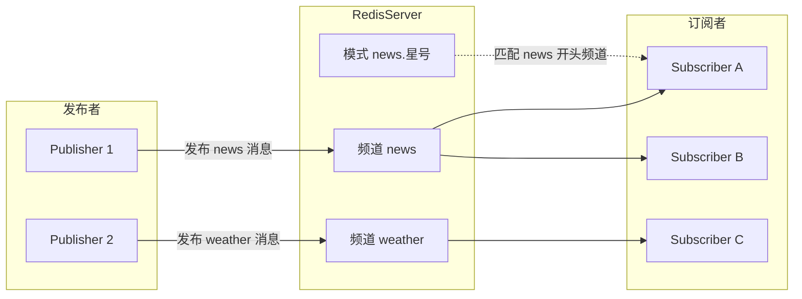
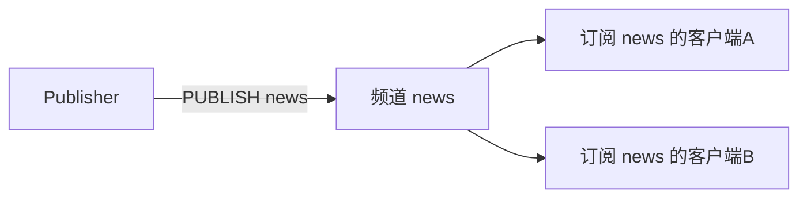
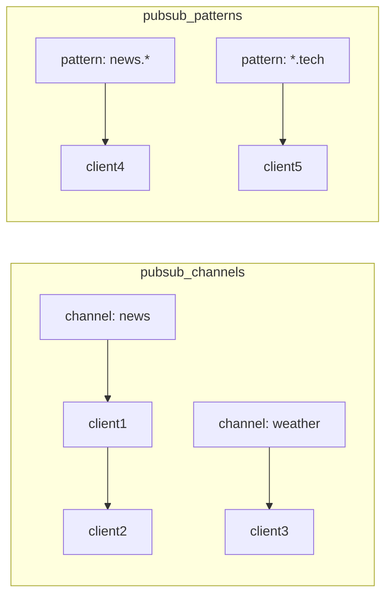
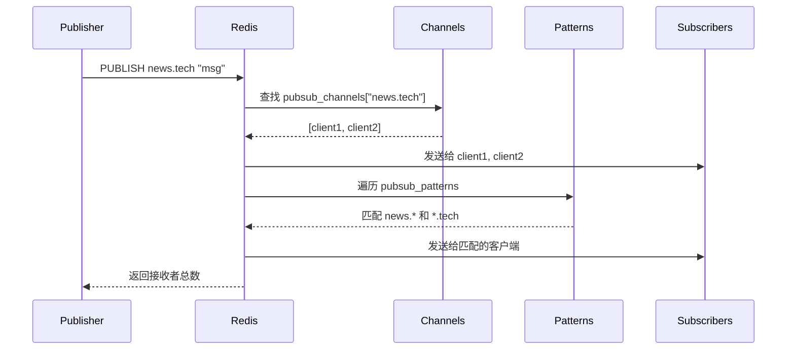
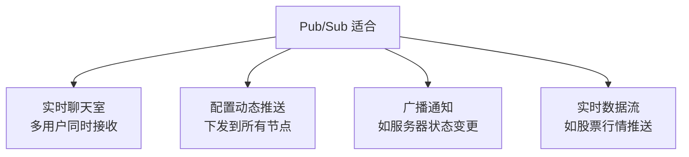
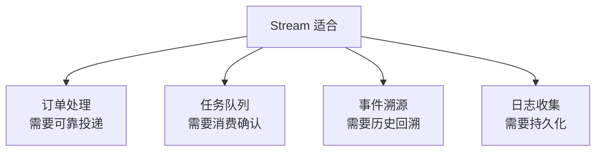

> Redis 发布订阅（Pub/Sub）：基于频道的消息广播模式，实现生产者与消费者解耦

## 目录

- [一、发布订阅概述](#一发布订阅概述)
- [二、基本命令](#二基本命令)
- [三、订阅模式](#三订阅模式)
- [四、工作原理](#四工作原理)
- [五、与 Stream 对比](#五与-stream-对比)
- [六、应用场景](#六应用场景)
- [七、生产实践](#七生产实践)
- [八、相关资料](#八相关资料)

## 一、发布订阅概述

Redis 发布订阅（Pub/Sub）是一种消息通信模式：发送者（Publisher）发送消息，订阅者（Subscriber）接收消息。发送者不需要知道订阅者是谁，实现解耦。



### 核心概念

| 概念 | 说明 |
|------|------|
| **频道（Channel）** | 消息的"管道"，订阅者订阅频道以接收该频道的消息 |
| **发布者（Publisher）** | 向指定频道发送消息的客户端 |
| **订阅者（Subscriber）** | 监听一个或多个频道的客户端 |
| **模式（Pattern）** | 使用 glob 风格通配符订阅频道（如 `news.*`） |

### 主要特性

| 特性 | 说明 |
|------|------|
| 实时性 | 消息即时推送，无延迟 |
| 解耦 | 发布者与订阅者互不感知 |
| 多播 | 一条消息可被多个订阅者接收 |
| 无持久化 | 消息不存储，订阅前的消息不会被接收 |
| 离线丢弃 | 订阅者离线时收到的消息会丢失 |

## 二、基本命令

### 2.1 核心命令

| 命令 | 说明 | 返回值 |
|------|------|--------|
| `SUBSCRIBE channel [channel...]` | 订阅一个或多个频道 | 进入订阅模式，持续推送消息 |
| `UNSUBSCRIBE [channel...]` | 取消订阅 | 取消确认 |
| `PUBLISH channel message` | 向频道发布消息 | 接收到消息的订阅者数量 |
| `PSUBSCRIBE pattern [pattern...]` | 订阅匹配模式 | 进入订阅模式 |
| `PUNSUBSCRIBE [pattern...]` | 取消模式订阅 | 取消确认 |
| `PUBSUB CHANNELS [pattern]` | 查看活跃频道 | 频道列表 |
| `PUBSUB NUMSUB [channel...]` | 查看频道订阅数 | 频道与订阅数对应 |
| `PUBSUB NUMPAT` | 查看模式订阅总数 | 数量 |

### 2.2 订阅频道

```bash
# 客户端 A：订阅
127.0.0.1:6379> SUBSCRIBE news
Reading messages... (press Ctrl-C to quit)
1) "subscribe"
2) "news"
3) (integer) 1

# 客户端 B：发布消息
127.0.0.1:6379> PUBLISH news "Hello Redis"
(integer) 1

# 客户端 A：收到消息
1) "message"
2) "news"
3) "Hello Redis"
```

### 2.3 多频道订阅

```bash
127.0.0.1:6379> SUBSCRIBE news weather sports
1) "subscribe"
2) "news"
3) (integer) 1
1) "subscribe"
2) "weather"
3) (integer) 2
1) "subscribe"
3) (integer) 3
```

### 2.4 模式订阅

```bash
# 订阅所有以 news. 开头的频道
127.0.0.1:6379> PSUBSCRIBE news.*
1) "psubscribe"
2) "news.*"
3) (integer) 1

# 客户端发布
127.0.0.1:6379> PUBLISH news.tech "Redis 7.0 released"
(integer) 1

# 收到消息
1) "pmessage"
2) "news.*"        # 匹配的模式
3) "news.tech"     # 实际频道
4) "Redis 7.0 released"
```

### 2.5 查看订阅状态

```bash
# 查看当前活跃频道（至少有一个订阅者）
127.0.0.1:6379> PUBSUB CHANNELS
1) "news"
2) "weather"

# 按模式过滤
127.0.0.1:6379> PUBSUB CHANNELS news*
1) "news"

# 查看指定频道的订阅者数量
127.0.0.1:6379> PUBSUB NUMSUB news weather
1) "news"
2) (integer) 2
3) "weather"
4) (integer) 1

# 查看模式订阅总数
127.0.0.1:6379> PUBSUB NUMPAT
(integer) 3
```

## 三、订阅模式

### 3.1 频道订阅（SUBSCRIBE）

订阅者精确订阅一个或多个频道，只接收这些频道的消息。



### 3.2 模式订阅（PSUBSCRIBE）

使用 glob 通配符订阅频道：

| 通配符 | 含义 | 示例 |
|--------|------|------|
| `*` | 匹配任意数量字符 | `news.*` 匹配 `news.tech`、`news.sport` |
| `?` | 匹配单个字符 | `news.?` 匹配 `news.a`、`news.b` |
| `[abc]` | 匹配括号内任意字符 | `news.[ab]` 匹配 `news.a`、`news.b` |

### 3.3 频道与模式同时匹配

如果一条消息同时匹配订阅者的频道和模式，订阅者会收到**两次**消息：

```bash
# 客户端 A 同时订阅频道和模式
127.0.0.1:6379> SUBSCRIBE news.tech
127.0.0.1:6379> PSUBSCRIBE news.*

# 发布消息
127.0.0.1:6379> PUBLISH news.tech "msg"

# 客户端 A 收到：
1) "message"        # 频道订阅收到
2) "news.tech"
3) "msg"
1) "pmessage"       # 模式订阅也收到
2) "news.*"
3) "news.tech"
4) "msg"
```

## 四、工作原理

### 4.1 数据结构

Redis 在 server 状态中维护两个字典：

```c
typedef struct redisServer {
    dict *pubsub_channels;  // 频道订阅字典：channel -> 客户端链表
    list *pubsub_patterns;  // 模式订阅链表：节点包含 pattern 和 client
    dict *pubsub_patterns_idx;  // 模式索引（7.0+ 优化）
    // ...
} redisServer;
```



### 4.2 PUBLISH 执行流程



### 4.3 订阅者的客户端状态

进入订阅模式后，客户端只能执行以下命令：

| 允许的命令 |
|----------|
| `SUBSCRIBE` |
| `UNSUBSCRIBE` |
| `PSUBSCRIBE` |
| `PUNSUBSCRIBE` |
| `PING` |
| `QUIT` |

执行其他命令会返回错误：

```bash
127.0.0.1:6379> SUBSCRIBE news
127.0.0.1:6379> SET k1 v1
(error) ERR Can't execute 'set': only (P)SUBSCRIBE / (P)UNSUBSCRIBE / PING / QUIT / RESET are allowed in this context
```

## 五、与 Stream 对比

Redis 5.0 引入 Stream，提供了更强大的消息队列能力：

| 维度 | Pub/Sub | Stream |
|------|---------|--------|
| 消息持久化 | 否 | 是（存储在内存中） |
| 消息丢失 | 离线即丢失 | 不丢失，可重新消费 |
| 消费组 | 不支持 | 支持（Consumer Group） |
| 消息确认 | 不支持 | 支持（ACK） |
| 历史消息 | 不可查 | 可按 ID 范围查询 |
| 投递保证 | At-most-once | At-least-once |
| 性能 | 极高 | 高 |
| 适用场景 | 实时广播、配置推送 | 可靠消息队列、事件溯源 |

### 5.1 Pub/Sub 适用场景



### 5.2 Stream 适用场景



## 六、应用场景

### 6.1 实时聊天室

```python
import redis
import threading

r = redis.Redis()

def subscribe(channel, name):
    pubsub = r.pubsub()
    pubsub.subscribe(channel)
    for msg in pubsub.listen():
        if msg['type'] == 'message':
            print(f"[{name} 收到] {msg['data'].decode()}")

def send(channel, name, text):
    r.publish(channel, f"{name}: {text}")

# 启动订阅线程
threading.Thread(target=subscribe, args=("chat:room1", "Alice"), daemon=True).start()
threading.Thread(target=subscribe, args=("chat:room1", "Bob"), daemon=True).start()

# 发送消息
send("chat:room1", "Alice", "Hello everyone!")
```

### 6.2 配置中心动态推送

```python
# 配置中心：发布配置变更
def publish_config(service, config):
    r.publish(f"config:{service}", json.dumps(config))

# 服务节点：订阅配置变更
def watch_config(service):
    pubsub = r.pubsub()
    pubsub.subscribe(f"config:{service}")
    for msg in pubsub.listen():
        if msg['type'] == 'message':
            new_config = json.loads(msg['data'])
            apply_config(new_config)  # 热更新配置
```

### 6.3 Redis Sentinel 事件订阅

Sentinel 通过 Pub/Sub 通知主节点故障转移事件：

```bash
# 订阅 Sentinel 事件
127.0.0.1:26379> PSUBSCRIBE *

# 收到事件示例
1) "pmessage"
2) "*"
3) "+odown"                          # 主观下线
4) "master mymaster 192.168.1.10 6379 1 #quorum 2/2"

1) "pmessage"
2) "*"
3) "+switch-master"                  # 故障转移
4) "mymaster 192.168.1.10 6379 192.168.1.11 6379"
```

### 6.4 集群节点间通信

Redis Cluster 节点通过 Pub/Sub 在 `__redis__:hello` 频道广播自身信息，实现节点发现：

```bash
127.0.0.1:6379> SUBSCRIBE __redis__:hello
```

## 七、生产实践

### 7.1 局限性与注意事项

1. **消息不持久化**：订阅者离线期间的消息会丢失，需要可靠投递请用 Stream
2. **无 ACK 机制**：无法确认订阅者是否处理成功
3. **可能堆积**：订阅者处理慢会积压在 Redis 输出缓冲区，触发 `client-output-buffer-limit` 后会被断开
4. **模式匹配开销**：大量模式订阅时 PUBLISH 性能会下降

### 7.2 输出缓冲区配置

```bash
# 订阅客户端的输出缓冲区限制
client-output-buffer-limit pubsub 32mb 8mb 60

# 含义：
# - 硬限制 32MB：超过立即断开
# - 软限制 8MB：持续 60 秒超过则断开
```

### 7.3 监控指标

```bash
# 查看订阅客户端数量
redis-cli PUBSUB NUMPAT
redis-cli PUBSUB NUMSUB channel_name

# 查看客户端输出缓冲区使用情况
redis-cli CLIENT LIST TYPE pubsub
# 输出：id=... addr=... omem=123456 ...

# 查看因为缓冲区超限被断开的客户端
redis-cli INFO clients
# rejected_connections:123
```

### 7.4 避免广播风暴

```bash
# 1. 控制订阅者数量（单个频道建议 < 10000）
# 2. 拆分频道，避免单频道订阅者过多
# 3. 大消息体使用短消息 + 拉取模式
#    例如：先 PUBLISH 通知，订阅者再 GET 完整数据
```

### 7.5 与 Stream 配合使用

```python
# 模式：Pub/Sub 触发 + Stream 存储
def publish_event(channel, event):
    # 1. 写入 Stream 持久化
    msg_id = r.xadd(f"stream:{channel}", event)
    # 2. 通过 Pub/Sub 通知
    r.publish(f"notify:{channel}", msg_id)

def handle_event(channel):
    pubsub = r.pubsub()
    pubsub.subscribe(f"notify:{channel}")
    for msg in pubsub.listen():
        if msg['type'] == 'message':
            msg_id = msg['data']
            # 从 Stream 拉取完整事件
            event = r.xrange(f"stream:{channel}", msg_id, msg_id)
            process(event)
```

## 八、相关资料

- [Redis 官方文档 - Pub/Sub](https://redis.io/docs/manual/pubsub/)
- [Redis 官方文档 - Stream](https://redis.io/docs/data-types/streams/)
- [Redis 源码 - pubsub.c](https://github.com/redis/redis/blob/unstable/src/pubsub.c)
- 《Redis 设计与实现》黄健宏 - 第 18 章
- [小林 coding - Redis 发布订阅](https://xiaolincoding.com/redis/feature/publish_subscribe.html)
