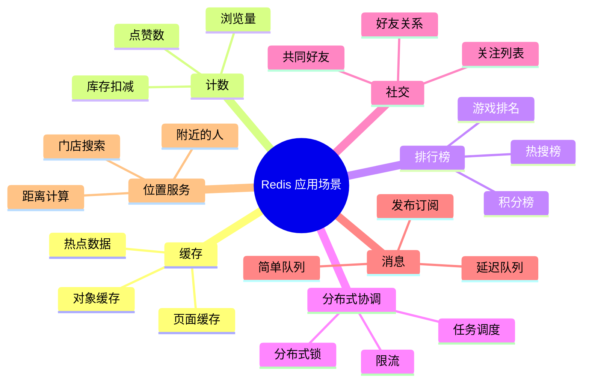

# Redis 常见应用场景

> Redis 丰富的数据结构和原子操作，使其在缓存、计数、排行、社交、消息队列等领域被广泛使用。本文系统梳理 Redis 的典型应用场景及实现方案。

## 目录

- [一、应用总览](#一应用总览)
- [二、缓存](#二缓存)
- [三、计数器](#三计数器)
- [四、排行榜](#四排行榜)
- [五、分布式锁](#五分布式锁)
- [六、会话存储](#六会话存储)
- [七、消息队列](#七消息队列)
- [八、社交关系](#八社交关系)
- [九、地理位置](#九地理位置)
- [十、限流](#十限流)
- [十一、相关资料](#十一相关资料)

## 一、应用总览



| 场景 | 主要数据结构 | 核心特性 |
|------|------------|---------|
| 缓存 | String | 过期、高吞吐 |
| 计数器 | String (INCR) | 原子递增 |
| 排行榜 | Sorted Set | 自动排序 |
| 分布式锁 | String (NX) | 互斥 |
| 会话存储 | String / Hash | TTL 自动过期 |
| 消息队列 | List / Stream | FIFO、持久化 |
| 社交关系 | Set | 交并差集 |
| 地理位置 | Geo | 距离、范围查询 |
| 限流 | String / List | 计数、滑动窗口 |

## 二、缓存

### 2.1 对象缓存

```python
import json
import redis

r = redis.Redis()

def cache_user(user_id, user_data, ttl=3600):
    """缓存用户对象"""
    r.setex(f"user:{user_id}", ttl, json.dumps(user_data))

def get_user(user_id):
    """获取用户对象"""
    data = r.get(f"user:{user_id}")
    if data:
        return json.loads(data)
    # 未命中查 DB
    user = db.query_user(user_id)
    if user:
        cache_user(user_id, user)
    return user
```

### 2.2 页面缓存

```python
def render_page(page_key, render_func, ttl=300):
    """页面级缓存"""
    cached = r.get(f"page:{page_key}")
    if cached:
        return cached
    html = render_func()  # 渲染页面
    r.setex(f"page:{page_key}", ttl, html)
    return html
```

### 2.3 缓存策略

| 策略 | 说明 | 适用场景 |
|------|------|---------|
| Cache Aside | 旁路缓存，读时回填 | 通用 |
| Read/Write Through | 缓存层代理 DB 读写 | 一致性要求高 |
| Write Behind | 异步写 DB | 写吞吐高 |

## 三、计数器

### 3.1 文章点赞

```python
def like_article(article_id, user_id):
    """点赞：集合记录已点赞用户 + 计数器"""
    # 防止重复点赞
    if r.sadd(f"article:likes:{article_id}", user_id):
        r.incr(f"article:like_count:{article_id}")
        return True
    return False

def unlike_article(article_id, user_id):
    """取消点赞"""
    if r.srem(f"article:likes:{article_id}", user_id):
        r.decr(f"article:like_count:{article_id}")

def get_like_count(article_id):
    return int(r.get(f"article:like_count:{article_id}") or 0)
```

### 3.2 页面浏览量 (PV)

```python
# 每次访问原子递增
r.incr(f"pv:article:{article_id}")

# 独立访客 (UV) 用 HyperLogLog
r.pfadd(f"uv:article:{article_id}", user_id)
uv = r.pfcount(f"uv:article:{article_id}")  # 误差 0.81%
```

| 方案 | 内存 | 精度 | 适用场景 |
|------|------|------|---------|
| Set | 高（存所有 ID） | 精确 | UV 小 |
| HyperLogLog | 12KB | 0.81% 误差 | 大规模 UV |

### 3.3 库存扣减

```python
def deduct_stock(item_id, quantity=1):
    """原子扣减库存"""
    remaining = r.decrby(f"stock:{item_id}", quantity)
    if remaining < 0:
        # 库存不足，回滚
        r.incrby(f"stock:{item_id}", quantity)
        return False
    return True
```

### 3.4 限速计数

```python
def is_rate_limited(user_id, max_requests=100, window=60):
    """每分钟最多 100 次请求"""
    key = f"rate:{user_id}:{int(time.time() // window)}"
    count = r.incr(key)
    if count == 1:
        r.expire(key, window)
    return count > max_requests
```

## 四、排行榜

### 4.1 游戏积分榜

```python
def add_score(player_id, score):
    """更新玩家分数"""
    r.zadd("leaderboard:game1", {player_id: score})

def incr_score(player_id, delta):
    """增加积分"""
    r.zincrby("leaderboard:game1", delta, player_id)

def get_top_n(n=10):
    """获取前 N 名"""
    return r.zrevrange("leaderboard:game1", 0, n-1, withscores=True)

def get_rank(player_id):
    """获取玩家排名（从 0 开始）"""
    return r.zrevrank("leaderboard:game1", player_id)

def get_around(player_id, n=5):
    """获取玩家前后各 5 名"""
    rank = r.zrevrank("leaderboard:game1", player_id)
    if rank is None:
        return []
    start = max(0, rank - n)
    end = rank + n
    return r.zrevrange("leaderboard:game1", start, end, withscores=True)
```

### 4.2 实时热搜榜

```python
def search(keyword):
    """每次搜索递增关键词权重"""
    r.zincrby("hot_search", 1, keyword)

def get_hot_keywords(n=20):
    """获取热搜 Top 20"""
    return r.zrevrange("hot_search", 0, n-1, withscores=True)

# 定时衰减（每小时执行）
def decay_hot_search():
    """分数衰减，让旧热搜下沉"""
    r.zrange("hot_search", 0, -1, withscores=True)
    for keyword, score in r.zrange("hot_search", 0, -1, withscores=True):
        r.zadd("hot_search", {keyword: score * 0.9})
```

### 4.3 分页排行榜

```python
def get_leaderboard_page(page, page_size=50):
    """分页获取排行榜"""
    start = (page - 1) * page_size
    end = start + page_size - 1
    return r.zrevrange("leaderboard:game1", start, end, withscores=True)
```

## 五、分布式锁

```python
import uuid

def acquire_lock(lock_key, expire=10):
    """获取分布式锁"""
    request_id = str(uuid.uuid4())
    if r.set(lock_key, request_id, nx=True, ex=expire):
        return request_id
    return None

def release_lock(lock_key, request_id):
    """释放锁（Lua 脚本保证原子性）"""
    script = """
    if redis.call('GET', KEYS[1]) == ARGV[1] then
        return redis.call('DEL', KEYS[1])
    else
        return 0
    end
    """
    return r.eval(script, 1, lock_key, request_id)
```

详见 [Redis集群分布式锁.md](./Redis集群分布式锁.md)

## 六、会话存储

### 6.1 单机 Session

```python
def create_session(user_id):
    """创建会话"""
    session_id = str(uuid.uuid4())
    session_data = {
        "user_id": user_id,
        "login_time": int(time.time()),
        "ip": get_client_ip(),
    }
    # TTL 30 分钟
    r.setex(f"session:{session_id}", 1800, json.dumps(session_data))
    return session_id

def get_session(session_id):
    """获取会话"""
    data = r.get(f"session:{session_id}")
    if data:
        # 续期
        r.expire(f"session:{session_id}", 1800)
        return json.loads(data)
    return None

def destroy_session(session_id):
    """销毁会话"""
    r.delete(f"session:{session_id}")
```

### 6.2 分布式 Session

```python
# 使用 Hash 存储会话字段，便于局部更新
def update_session_field(session_id, field, value):
    r.hset(f"session:{session_id}", field, value)
    r.expire(f"session:{session_id}", 1800)

def get_session_field(session_id, field):
    return r.hget(f"session:{session_id}", field)
```

| 方案 | 优点 | 缺点 |
|------|------|------|
| String (JSON) | 实现简单 | 更新需整体读写 |
| Hash | 字段级更新 | 不能嵌套 |
| Hash + TTL | 兼顾性能与过期 | 实现稍复杂 |

## 七、消息队列

### 7.1 简单队列（List）

```python
# 生产者
def produce(queue, message):
    r.lpush(queue, json.dumps(message))

# 消费者（阻塞式）
def consume(queue, timeout=0):
    result = r.brpop(queue, timeout=timeout)
    if result:
        _, data = result
        return json.loads(data)
    return None
```

### 7.2 延迟队列（Sorted Set）

```python
def schedule_task(task, delay):
    """延迟执行任务"""
    execute_at = time.time() + delay
    r.zadd("delay_queue", {json.dumps(task): execute_at})

def consume_delay_queue():
    """轮询消费延迟任务"""
    while True:
        now = time.time()
        # 获取已到期的任务
        tasks = r.zrangebyscore("delay_queue", 0, now, start=0, num=1)
        if not tasks:
            time.sleep(0.1)
            continue
        task = tasks[0]
        # 用 ZREM 原子删除（保证只有一个消费者处理）
        if r.zrem("delay_queue", task):
            process(json.loads(task))
```

### 7.3 Stream 消息队列（推荐）

```python
# 生产者
r.xadd("orders", {"order_id": "1001", "amount": 99.9})

# 消费者组
r.xgroup_create("orders", "processor", id="0")

# 消费
while True:
    messages = r.xreadgroup(
        groupname="processor",
        consumername="consumer-1",
        streams={"orders": ">"},
        count=10,
        block=5000
    )
    for stream, msg_list in messages:
        for msg_id, data in msg_list:
            process(data)
            r.xack("orders", "processor", msg_id)  # 确认
```

| 方案 | 持久化 | 消费组 | ACK | 适用场景 |
|------|--------|--------|-----|---------|
| List | 是 | 否 | 否 | 简单 FIFO |
| Sorted Set | 是 | 否 | 否 | 延迟任务 |
| Pub/Sub | 否 | 否 | 否 | 实时广播 |
| Stream | 是 | 是 | 是 | 可靠消息队列 |

## 八、社交关系

### 8.1 关注/粉丝

```python
def follow(user_id, target_id):
    """关注"""
    r.sadd(f"following:{user_id}", target_id)
    r.sadd(f"followers:{target_id}", user_id)

def unfollow(user_id, target_id):
    """取关"""
    r.srem(f"following:{user_id}", target_id)
    r.srem(f"followers:{target_id}", user_id)

def is_following(user_id, target_id):
    return r.sismember(f"following:{user_id}", target_id)
```

### 8.2 共同好友

```python
def common_friends(user_a, user_b):
    """共同好友（交集）"""
    return r.sinter(f"friends:{user_a}", f"friends:{user_b}")

def recommended_friends(user_id):
    """可能认识的人（好友的好友 - 自己的好友 - 自己）"""
    friends = r.smembers(f"friends:{user_id}")
    if not friends:
        return []
    # 获取所有好友的好友
    fof = set()
    for friend in friends:
        fof |= r.smembers(f"friends:{friend}")
    # 排除自己已认识的人
    return list(fof - friends - {user_id})
```

### 8.3 时间线（Feed 流）

```python
def publish_post(user_id, post_id):
    """发布动态，推送到粉丝收件箱"""
    post_time = time.time()
    # 写入自己的时间线
    r.zadd(f"timeline:{user_id}", {post_id: post_time})
    # 推送到所有粉丝的收件箱（推模式）
    followers = r.smembers(f"followers:{user_id}")
    for follower in followers:
        r.zadd(f"feed:{follower}", {post_id: post_time})

def get_feed(user_id, page=1, page_size=20):
    """获取时间线"""
    start = (page - 1) * page_size
    end = start + page_size - 1
    return r.zrevrange(f"feed:{user_id}", start, end)
```

| 模式 | 写入 | 读取 | 适用场景 |
|------|------|------|---------|
| 推模式 | 写扩散（慢） | 快 | 粉丝少 |
| 拉模式 | 快 | 读扩散（慢） | 粉丝多 |
| 推拉结合 | 活跃用户推 | 大 V 拉 | 通用 |

## 九、地理位置

### 9.1 附近的人

```python
def update_location(user_id, lon, lat):
    """更新用户位置"""
    r.geoadd("locations", (lon, lat, user_id))

def nearby_users(lon, lat, radius=1000, unit="m"):
    """查找附近 1km 的用户"""
    return r.georadius(
        "locations", lon, lat, radius, unit=unit,
        withcoord=True, withdist=True, sort="ASC"
    )

def distance(user_a, user_b):
    """两点距离"""
    return r.geodist("locations", user_a, user_b, unit="m")
```

### 9.2 门店搜索

```python
def add_store(store_id, lon, lat, name):
    r.geoadd("stores", (lon, lat, store_id))
    r.set(f"store:{store_id}", name)

def find_stores_nearby(lon, lat, radius=5000):
    """查找附近 5km 门店"""
    results = r.georadius(
        "stores", lon, lat, radius, unit="m",
        withdist=True, sort="ASC", count=20
    )
    stores = []
    for store_id, dist in results:
        name = r.get(f"store:{store_id}")
        stores.append({"id": store_id, "name": name, "distance": dist})
    return stores
```

> Geo 底层基于 Sorted Set，经纬度用 GeoHash 编码为分数。

## 十、限流

### 10.1 固定窗口

```python
def fixed_window_rate_limit(user_id, max_requests=100, window=60):
    """固定窗口限流"""
    key = f"rate:fixed:{user_id}:{int(time.time() // window)}"
    count = r.incr(key)
    if count == 1:
        r.expire(key, window)
    return count <= max_requests
```

### 10.2 滑动窗口

```python
def sliding_window_rate_limit(user_id, max_requests=100, window=60):
    """滑动窗口限流（基于 Sorted Set）"""
    key = f"rate:sliding:{user_id}"
    now = time.time()
    # 移除窗口外的请求
    r.zremrangebyscore(key, 0, now - window)
    # 添加当前请求
    r.zadd(key, {str(now): now})
    r.expire(key, window)
    # 统计窗口内请求数
    count = r.zcard(key)
    return count <= max_requests
```

### 10.3 令牌桶

```python
def token_bucket(user_id, capacity=10, rate=1):
    """令牌桶限流"""
    key = f"rate:bucket:{user_id}"
    now = time.time()

    # Lua 脚本保证原子性
    script = """
    local capacity = tonumber(ARGV[1])
    local rate = tonumber(ARGV[2])
    local now = tonumber(ARGV[3])

    local bucket = redis.call('HMGET', KEYS[1], 'tokens', 'last_time')
    local tokens = tonumber(bucket[1]) or capacity
    local last_time = tonumber(bucket[2]) or now

    -- 计算补充的令牌
    local delta = math.max(0, now - last_time) * rate
    tokens = math.min(capacity, tokens + delta)

    if tokens < 1 then
        return 0
    end

    tokens = tokens - 1
    redis.call('HMSET', KEYS[1], 'tokens', tokens, 'last_time', now)
    redis.call('EXPIRE', KEYS[1], 60)
    return 1
    """
    return r.eval(script, 1, key, capacity, rate, now) == 1
```

| 方案 | 平滑度 | 实现复杂度 | 适用场景 |
|------|--------|----------|---------|
| 固定窗口 | 差（边界突刺） | 简单 | 粗粒度限流 |
| 滑动窗口 | 好 | 中 | 通用 |
| 令牌桶 | 好 | 高 | 允许突发流量 |
| 漏桶 | 极好 | 中 | 严格匀速 |

## 十一、相关资料

- [Redis 官方文档 - 使用模式](https://redis.io/docs/manual/patterns/)
- [Redis 应用场景 - 小林 coding](https://xiaolincoding.com/redis/)
- 《Redis 实战》Josiah L. Carlson
- [pdai.tech - Redis 全栈知识体系](https://pdai.tech/md/db/nosql-redis/db-nosql-redis-dist.html)
