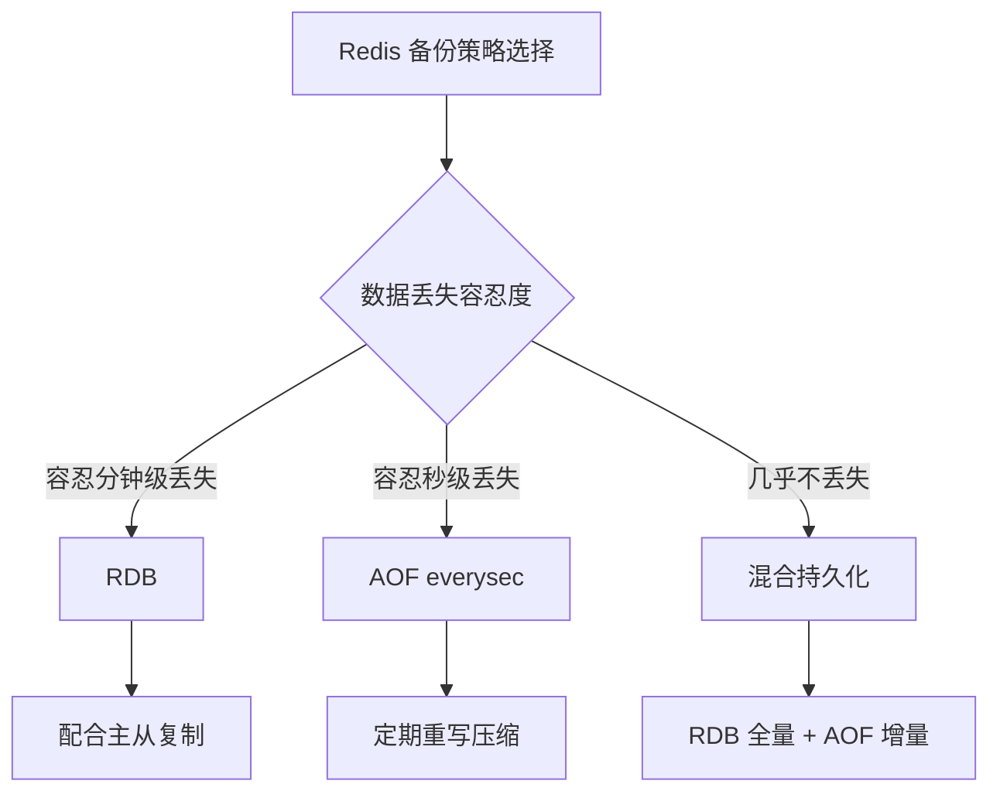
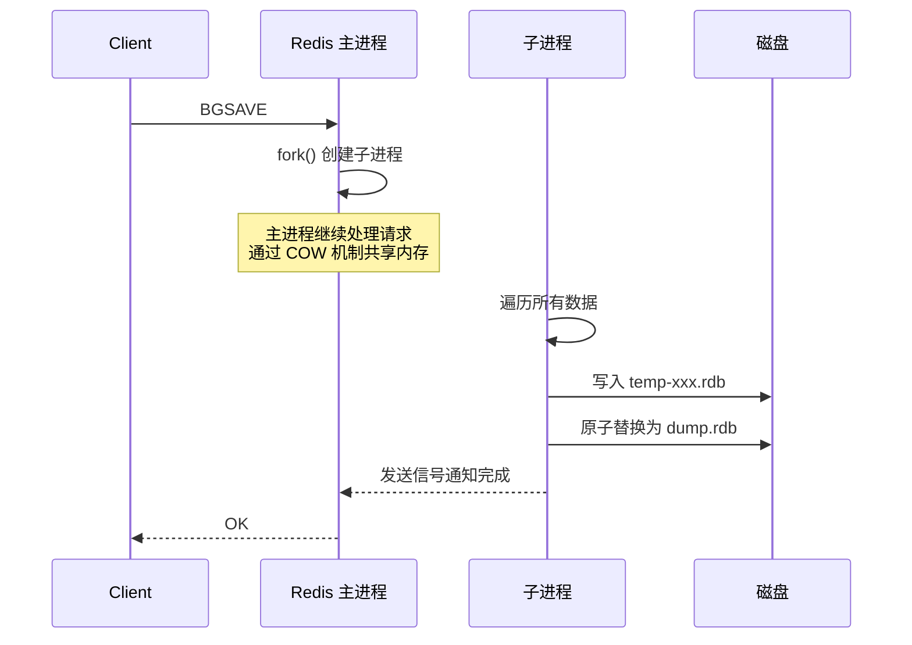
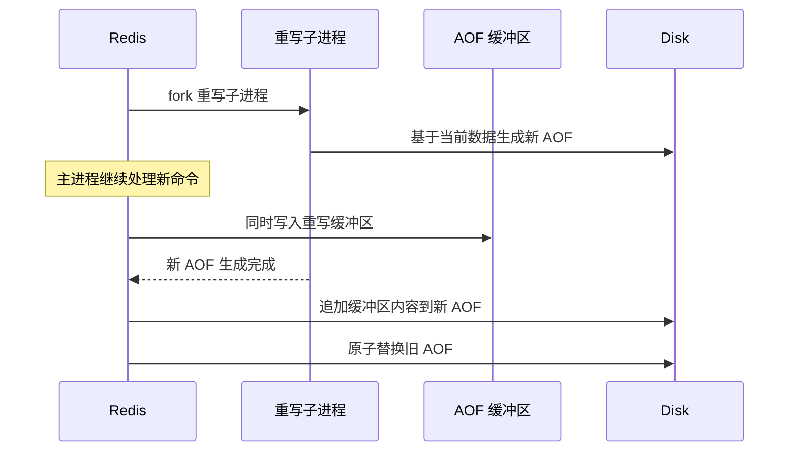
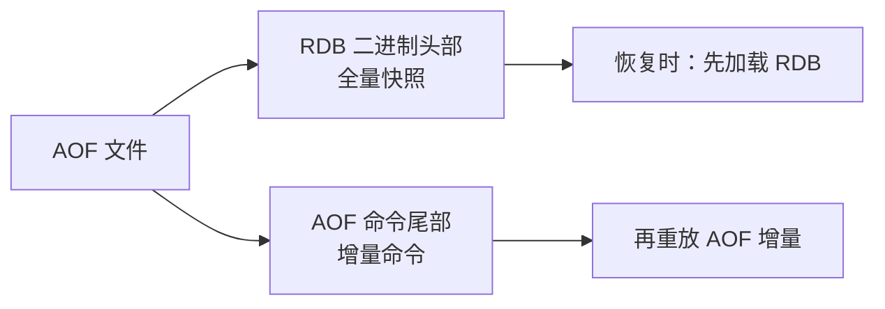
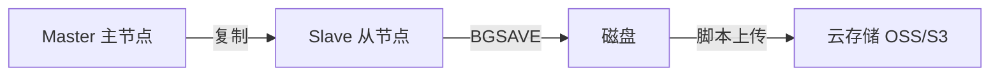
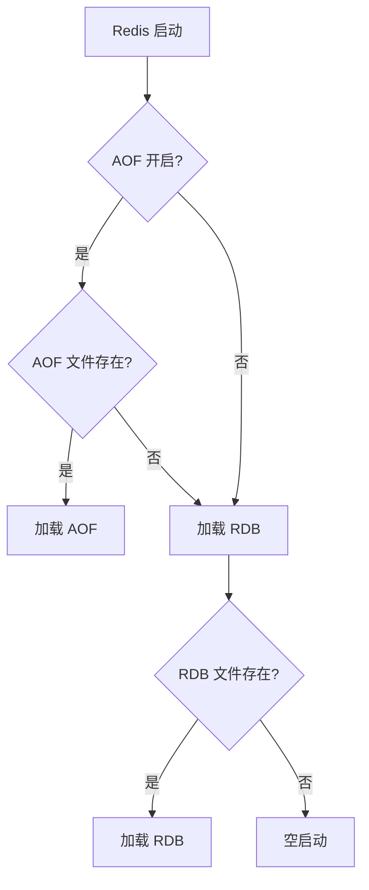
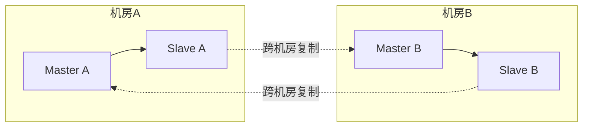

# Redis 数据备份与恢复

> 数据是系统的生命线，Redis 作为内存数据库，备份与恢复策略直接决定故障后的数据损失程度。本文系统讲解 RDB、AOF、混合备份方案，以及在线备份、迁移、灾备等运维实践。

## 目录

- [一、备份方案对比](#一备份方案对比)
- [二、RDB 备份](#二rdb-备份)
- [三、AOF 备份](#三aof-备份)
- [四、混合持久化](#四混合持久化)
- [五、在线备份](#五在线备份)
- [六、数据恢复](#六数据恢复)
- [七、迁移与同步](#七迁移与同步)
- [八、灾备方案](#八灾备方案)
- [九、监控与告警](#九监控与告警)
- [十、相关资料](#十相关资料)

## 一、备份方案对比

| 维度 | RDB | AOF | 混合 |
|------|-----|-----|------|
| **文件类型** | 二进制快照 | 文本命令日志 | RDB + AOF 增量 |
| **数据完整性** | 最后一次快照 | 取决于 fsync 策略 | 几乎无丢失 |
| **恢复速度** | 快（直接加载） | 慢（重放命令） | 快 |
| **文件大小** | 小（压缩） | 大（命令日志） | 中 |
| **对性能影响** | 大（fork 子进程） | 小（追加写） | 小 |
| **适用场景** | 冷备、灾备 | 热备、数据安全 | 生产推荐 |



## 二、RDB 备份

### 2.1 触发方式

```bash
# 手动触发（阻塞，生产慎用）
127.0.0.1:6379> SAVE

# 后台触发（推荐，fork 子进程）
127.0.0.1:6379> BGSAVE

# 自动触发（配置文件）
save 900 1     # 900秒内至少1个key变化
save 300 10    # 300秒内至少10个key变化
save 60 10000  # 60秒内至少10000个key变化

# 关闭自动 RDB
save ""
```

### 2.2 BGSAVE 执行流程



**COW（Copy-On-Write）**：fork 后父子进程共享物理内存，仅当某页被修改时才复制。主进程的写操作不影响子进程生成快照。

### 2.3 RDB 文件操作

```bash
# 查看备份目录
127.0.0.1:6379> CONFIG GET dir
1) "dir"
2) "/var/lib/redis"

# 查看最近一次 BGSAVE 状态
127.0.0.1:6379> LASTSAVE
(integer) 1640000000

# 查看 RDB 文件信息
$ redis-check-rdb dump.rdb
```

### 2.4 RDB 优缺点

**优点**：
- 文件紧凑，适合备份和传输
- 恢复速度快（直接加载二进制）
- 对日常性能影响小（仅 fork 时）

**缺点**：
- 两次 RDB 之间故障会丢失数据
- fork 大内存实例时可能卡顿（内存翻倍风险）

## 三、AOF 备份

### 3.1 开启 AOF

```bash
# redis.conf
appendonly yes                    # 开启 AOF
appendfilename "appendonly.aof"   # AOF 文件名
appendfsync everysec              # fsync 策略
auto-aof-rewrite-percentage 100   # 重写触发：大小翻倍
auto-aof-rewrite-min-size 64mb    # 重写最小大小
```

### 3.2 fsync 策略

| 策略 | 说明 | 数据安全 | 性能 |
|------|------|---------|------|
| `always` | 每条命令都 fsync | 最高（不丢失） | 最差 |
| `everysec` | 每秒 fsync 一次 | 高（最多丢 1 秒） | 好（推荐） |
| `no` | 由操作系统决定 | 不可控 | 最好 |

### 3.3 AOF 重写

AOF 是命令日志，会持续膨胀。重写机制扫描当前数据，生成最简命令集：



```bash
# 手动触发重写
127.0.0.1:6379> BGREWRITEAOF

# 查看当前 AOF 状态
127.0.0.1:6379> INFO persistence
```

### 3.4 AOF 文件修复

```bash
# AOF 文件损坏时（如被截断）
$ redis-check-aof --fix appendonly.aof

# 查看 AOF 内容
$ redis-check-aof appendonly.aof
```

## 四、混合持久化

Redis 4.0+ 引入，结合 RDB 和 AOF 的优点：

```bash
# 开启混合持久化
aof-use-rdb-preamble yes
```

**原理**：AOF 重写时，前半部分写 RDB 二进制（全量数据），后半部分追加 AOF 命令（增量）。



**优势**：
- 恢复速度快（RDB 加载快）
- 数据完整（AOF 增量补全）
- 文件小（RDB 压缩）

## 五、在线备份

### 5.1 通过从节点备份

生产环境推荐在**从节点**上执行备份，避免影响主节点：



```bash
#!/bin/bash
# 在从节点上执行的备份脚本
DATE=$(date +%Y%m%d_%H%M%S)
BACKUP_DIR="/data/backup/redis"
REDIS_DIR=$(redis-cli CONFIG GET dir | tail -1)
REDIS_FILE=$(redis-cli CONFIG GET dbfilename | tail -1)

# 1. 触发 BGSAVE
redis-cli BGSAVE

# 2. 等待完成
while [ $(redis-cli LASTSAVE) -le $(date +%s -d '1 minute ago') ]; do
    sleep 1
done

# 3. 拷贝文件
cp "$REDIS_DIR/$REDIS_FILE" "$BACKUP_DIR/dump_${DATE}.rdb"

# 4. 压缩
gzip "$BACKUP_DIR/dump_${DATE}.rdb"

# 5. 上传到云存储
aws s3 cp "$BACKUP_DIR/dump_${DATE}.rdb.gz" "s3://my-bucket/redis-backup/"

# 6. 清理 7 天前的本地备份
find "$BACKUP_DIR" -name "dump_*.rdb.gz" -mtime +7 -delete
```

### 5.2 通过 LVM 快照

如果 Redis 数据目录在 LVM 逻辑卷上，可直接做磁盘快照：

```bash
# 1. 同步到磁盘
redis-cli SAVE  # 或 BGSAVE

# 2. 创建 LVM 快照
lvcreate -L 1G -s -n redis_snap /dev/vg/redis_lv

# 3. 挂载快照
mount /dev/vg/redis_snap /mnt/redis_snap

# 4. 拷贝 dump.rdb
cp /mnt/redis_snap/dump.rdb /backup/

# 5. 删除快照
umount /mnt/redis_snap
lvremove -f /dev/vg/redis_snap
```

## 六、数据恢复

### 6.1 RDB 恢复

```bash
# 1. 停止 Redis
systemctl stop redis

# 2. 备份当前数据文件（以防万一）
mv /var/lib/redis/dump.rdb /var/lib/redis/dump.rdb.bak

# 3. 拷贝备份文件到数据目录
cp /backup/dump_20240101.rdb /var/lib/redis/dump.rdb
chown redis:redis /var/lib/redis/dump.rdb

# 4. 确保 AOF 关闭（避免 AOF 覆盖 RDB）
# redis.conf 中 appendonly no

# 5. 启动 Redis
systemctl start redis

# 6. 验证数据
redis-cli DBSIZE
```

### 6.2 AOF 恢复

```bash
# 1. 停止 Redis
systemctl stop redis

# 2. 拷贝 AOF 文件
cp /backup/appendonly.aof /var/lib/redis/

# 3. 检查并修复 AOF（如有损坏）
redis-check-aof --fix /var/lib/redis/appendonly.aof

# 4. 确保 AOF 开启
# redis.conf 中 appendonly yes

# 5. 启动 Redis（会自动加载 AOF）
systemctl start redis
```

### 6.3 恢复优先级

当 RDB 和 AOF 同时存在时，Redis 的加载优先级：



> **注意**：AOF 优先级高于 RDB，恢复时若不想用 AOF，需先关闭 `appendonly`。

### 6.4 恢复到指定时间点

**场景**：误删数据，需要恢复到删除前。

```bash
# 1. 停止 Redis
systemctl stop redis

# 2. 用备份的 AOF 文件
cp /backup/appendonly_20240101.aof /var/lib/redis/appendonly.aof

# 3. 编辑 AOF，删除误操作的命令
# 例如删除 DEL key 这一行
vim /var/lib/redis/appendonly.aof

# 4. 修复 AOF
redis-check-aof --fix /var/lib/redis/appendonly.aof

# 5. 启动 Redis
systemctl start redis
```

## 七、迁移与同步

### 7.1 redis-shake（推荐）

阿里开源的 Redis 迁移工具，支持全量 + 增量同步：

```yaml
# redis-shake.conf
source.address: 192.168.1.10:6379
source.password: xxx
target.address: 192.168.1.20:6379
target.password: xxx

# 全量 + 增量
rewrite: true
filter.db: ""
```

```bash
# 启动迁移
./redis-shake.linux -conf=redis-shake.conf -type=sync
```

### 7.2 主从同步迁移

```bash
# 新节点加入集群成为从
redis-cli -h new_redis REPLICAOF old_redis 6379

# 等待同步完成
redis-cli -h new_redis INFO replication
# slave_read_repl_offset == master_repl_offset

# 切换为新主（应用切换连接到新节点）
redis-cli -h new_redis REPLICAOF NO ONE
```

### 7.3 SCAN + DUMP/RESTORE

适合小规模数据迁移：

```python
import redis

src = redis.Redis(host='old_redis')
dst = redis.Redis(host='new_redis')

cursor = 0
while True:
    cursor, keys = src.scan(cursor, count=1000)
    for key in keys:
        ttl = src.pttl(key)
        dump = src.dump(key)
        dst.restore(key, ttl if ttl > 0 else 0, dump, replace=True)
    if cursor == 0:
        break
```

## 八、灾备方案

### 8.1 同城双活



**特点**：
- 跨机房主从复制，延迟 1-5ms
- 单机房故障可切换到另一机房
- 数据丢失风险低

### 8.2 异地灾备


**特点**：
- 异地异步复制，延迟较高（几十毫秒）
- 灾难级故障（如整个机房宕机）时启用
- 可接受少量数据丢失

### 8.3 备份策略矩阵

| 备份类型 | 频率 | 保留时长 | 存储位置 |
|---------|------|---------|---------|
| 实时复制 | 持续 | - | 从节点 |
| RDB 快照 | 每小时 | 7 天 | 本地 + 云存储 |
| 每日全量备份 | 每天 | 30 天 | 云存储 |
| 每周归档 | 每周 | 1 年 | 冷存储 |
| 跨地域备份 | 每天 | 90 天 | 异地云存储 |

## 九、监控与告警

### 9.1 关键指标

```bash
# RDB 相关
redis-cli INFO persistence | grep -E "rdb_|bgsave"

# AOF 相关
redis-cli INFO persistence | grep -E "aof_"

# 复制状态
redis-cli INFO replication

# 最后一次保存时间
redis-cli LASTSAVE
```

| 指标 | 说明 | 告警阈值 |
|------|------|---------|
| `rdb_last_bgsave_status` | 最后一次 BGSAVE 状态 | != ok |
| `rdb_last_bgsave_time_sec` | BGSAVE 耗时 | > 60s |
| `aof_last_bgrewrite_status` | AOF 重写状态 | != ok |
| `aof_pending_fsync` | 待 fsync 的数据 | 持续增长 |
| `master_repl_offset` | 主节点复制偏移量 | 与 slave 差距过大 |
| 备份文件大小 | 监控数据增长趋势 | 突增 > 50% |

### 9.2 备份检查脚本

```bash
#!/bin/bash
# 检查备份是否正常执行
ALERT_EMAIL="ops@company.com"
LAST_SAVE=$(redis-cli LASTSAVE)
NOW=$(date +%s)
DIFF=$((NOW - LAST_SAVE))

if [ $DIFF -gt 7200 ]; then
    echo "警告：Redis 已超过 2 小时未执行 BGSAVE" | mail -s "Redis 备份告警" $ALERT_EMAIL
fi

# 检查备份文件是否存在
BACKUP_FILE="/var/lib/redis/dump.rdb"
if [ ! -f "$BACKUP_FILE" ]; then
    echo "警告：RDB 文件不存在" | mail -s "Redis 备份告警" $ALERT_EMAIL
fi
```

## 十、相关资料

- [Redis 官方文档 - 持久化](https://redis.io/docs/management/persistence/)
- [redis-shake 迁移工具](https://github.com/alibaba/RedisShake)
- [Redis 备份恢复最佳实践](https://redis.io/docs/management/admin/)
- 《Redis 设计与实现》黄健宏
