# Redis 缓存一致性

> 数据库与缓存双写一致性问题，是缓存使用中最核心也最容易踩坑的环节。本文系统讲解各种策略的优缺点、异常场景与工业级解决方案。

## 目录

- [一、问题背景](#一问题背景)
- [二、四种更新策略](#二四种更新策略)
- [三、异常场景分析](#三异常场景分析)
- [四、延迟双删](#四延迟双删)
- [五、最终一致方案](#五最终一致方案)
- [六、Canal + MQ 方案](#六canal--mq-方案)
- [七、强一致性方案](#七强一致性方案)
- [八、选型建议](#八选型建议)
- [九、相关资料](#九相关资料)

## 一、问题背景

业务中使用 Redis 缓存数据库数据，典型读写流程：

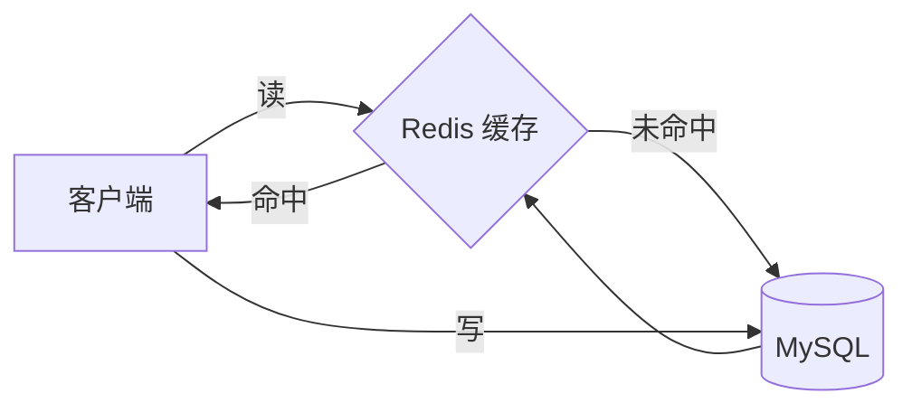

由于数据同时存在于 DB 和 Cache 两处，任何一处更新都需要考虑另一方，否则会出现**数据不一致**。

### 一致性分类

| 类型 | 说明 | 代价 |
|------|------|------|
| **强一致性** | 任何时刻读到都是最新值 | 性能损耗大、实现复杂 |
| **最终一致性** | 短暂不一致，最终会一致 | 实现简单、性能好 |
| **弱一致性** | 不保证最终一致 | 不推荐用于业务数据 |

> 工业实践：缓存场景几乎都采用**最终一致性**，强一致请直接走 DB 或用分布式事务。

## 二、四种更新策略

围绕"写操作时如何处理缓存"展开：

| 策略 | 描述 | 推荐度 |
|------|------|--------|
| 更新缓存 | 写 DB 后更新缓存 | 不推荐 |
| 删除缓存 | 写 DB 后删除缓存 | 推荐 |
| 先删缓存 | 先删缓存再写 DB | 有坑 |
| 后删缓存 | 先写 DB 再删缓存 | 推荐（Cache Aside） |

### 2.1 更新缓存 vs 删除缓存

| 维度 | 更新缓存 | 删除缓存 |
|------|---------|---------|
| 写放大 | 每次写都更新缓存（即使没人读） | 懒加载，按需重建 |
| 一致性风险 | 并发计算易出错 | 重新读 DB，风险低 |
| 适用场景 | 写少读多且计算复杂 | 通用 |

**结论：删除缓存优于更新缓存**，避免无效写和并发更新错乱。

### 2.2 Cache Aside（旁路缓存）— 标准模式

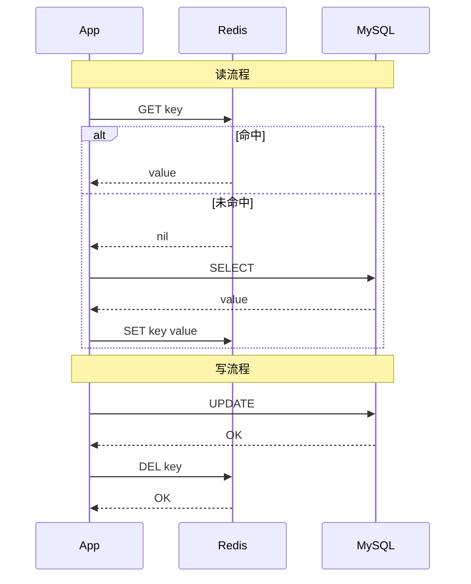

**读**：先查缓存，未命中查 DB 后回填缓存。
**写**：先更新 DB，再删除缓存。

## 三、异常场景分析

### 3.1 先删缓存 + 后更新 DB

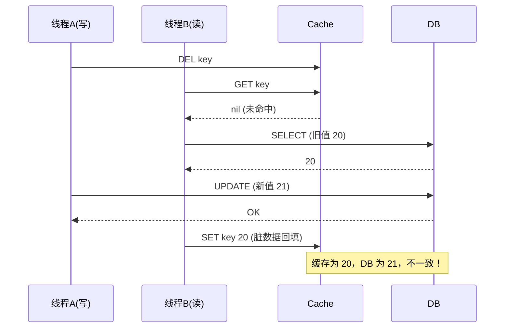

**问题**：读线程把旧值回填缓存，写线程的 DB 更新无法反映到缓存。

### 3.2 先更新 DB + 后删缓存（Cache Aside 标准做法）

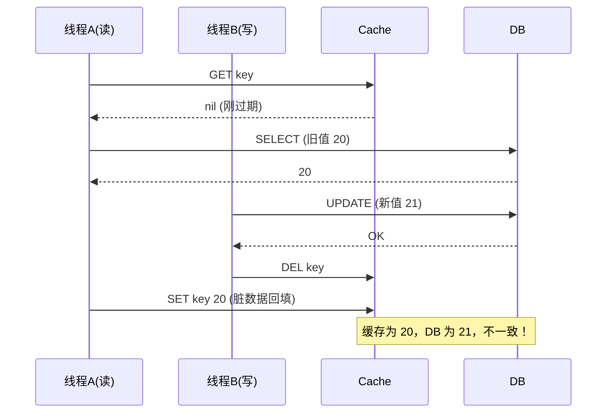

**问题**：理论上仍可能不一致，但发生条件苛刻（读 DB 旧值 + 写 DB + 删缓存 三步在极短时间内交织），且读通常比写快很多，概率极低。

### 3.3 删除缓存失败

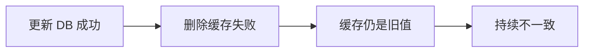

**问题**：写库成功但删缓存失败，缓存长时间保留旧值。

## 四、延迟双删

为解决"先删缓存 + 后更新 DB"的问题，演化出**延迟双删**：

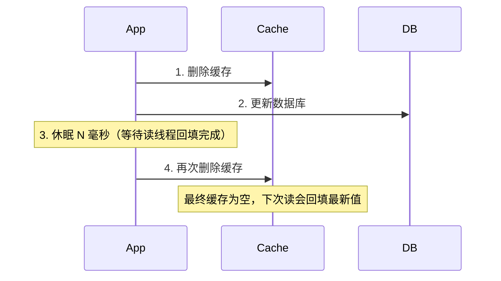

**伪代码**：

```python
def update(key, value):
    cache.delete(key)              # 第一次删除
    db.update(key, value)          # 更新数据库
    time.sleep(0.5)                # 延迟（依据读业务耗时调整）
    cache.delete(key)              # 第二次删除
```

**休眠时间估算**：读业务耗时 + 几百毫秒余量。如读 DB 约 200ms，可休眠 500ms。

**缺点**：
- 写请求耗时增加（吞吐下降）
- 第二次删除仍可能失败
- 延迟时间难精确控制

## 五、最终一致方案

### 5.1 重试 + 消息队列

删除缓存失败时，通过 MQ 重试，保证最终删除成功：

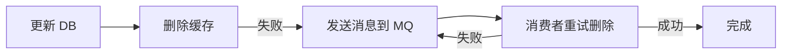

**关键点**：
- 业务代码与缓存解耦，写 DB 后直接发 MQ
- 消费者订阅 MQ 执行删除，失败自动重试
- 达到最大重试次数后告警人工介入

### 5.2 订阅 binlog（推荐）

通过 Canal 等中间件订阅 MySQL binlog，异步删除缓存，业务代码完全无感知：

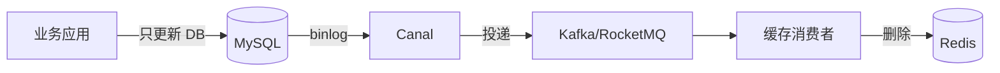

**优势**：
- 业务代码零侵入，无需关心缓存
- binlog 可靠性高，不会丢事件
- 解耦后可独立扩展消费能力

**缺点**：
- 引入额外组件（Canal + MQ）
- 存在秒级延迟（最终一致）

## 六、Canal + MQ 方案

### 6.1 架构

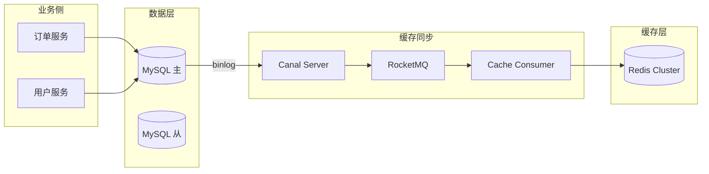

### 6.2 消费者处理逻辑

```python
def consume_binlog(event):
    table = event['table']
    action = event['type']  # INSERT / UPDATE / DELETE

    # 构建缓存 key（依据业务规则）
    keys = build_cache_keys(table, event['data'])

    for key in keys:
        if action == 'DELETE':
            redis.delete(key)
        else:
            # 删除旧缓存，下次读时回填
            redis.delete(key)
            # 或主动回填
            # value = query_db(table, event['data']['id'])
            # redis.set(key, value, ex=3600)
```

### 6.3 关键设计

| 关注点 | 方案 |
|--------|------|
| 顺序性 | 同一 key 路由到同一 MQ 分区 |
| 幂等性 | 消费者记录已处理 binlog 位点 |
| 延迟 | MQ + 消费者并行，控制在 1s 内 |
| 故障恢复 | Canal 记录位点，重启后从断点续传 |

## 七、强一致性方案

当业务确实需要强一致时，可考虑：

### 7.1 加锁串行化

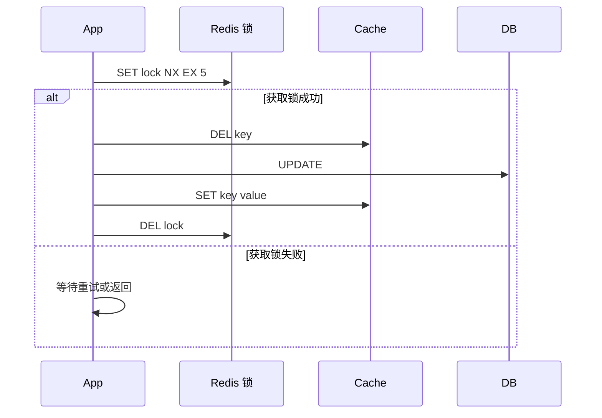

**缺点**：性能严重下降，仅用于关键路径。

### 7.2 引入版本号

```python
def read(key):
    value, version = cache.get_with_version(key)
    db_value, db_version = db.get_with_version(key)
    if version < db_version:
        cache.set(key, db_value, version=db_version)
        return db_value
    return value

def write(key, value):
    new_version = db.update_and_incr_version(key, value)
    cache.set(key, value, version=new_version)
```

### 7.3 2PC / TCC

通过 Seata 等分布式事务框架，将 DB 与 Cache 操作纳入一个全局事务。代价高，慎用。

## 八、选型建议

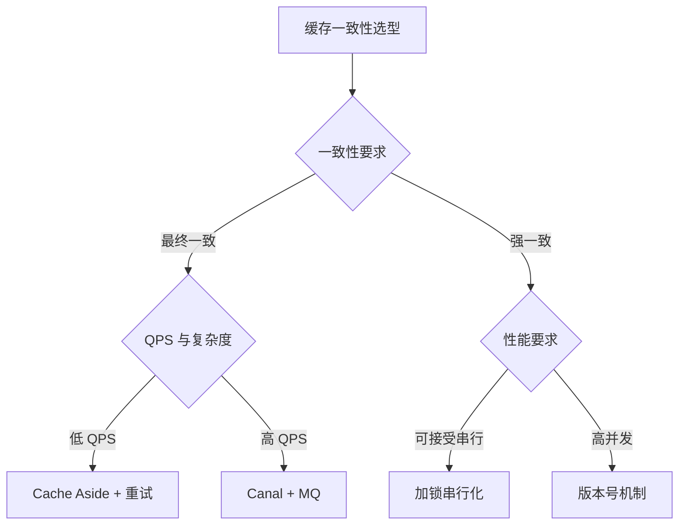

### 通用建议

1. **优先采用 Cache Aside**（先 DB 后删缓存），覆盖 95% 场景
2. 删除缓存失败用**重试机制**兜底（MQ 或 binlog）
3. 强一致场景才考虑加锁，否则牺牲性能不划算
4. 不要在事务里写缓存，事务回滚后缓存不一致难处理

## 九、相关资料

- [Cache Aside Pattern - Microsoft Azure](https://learn.microsoft.com/en-us/azure/architecture/best-practices/caching)
- [Canal GitHub](https://github.com/alibaba/canal)
- 《Redis 设计与实现》黄健宏
- [小林 coding - 数据库与缓存一致性](https://xiaolincoding.com/redis/architecture/mysql_redis_consistency.html)
