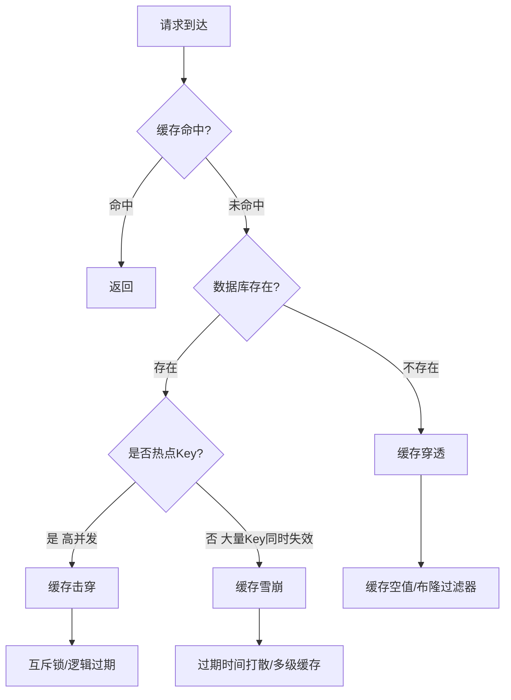
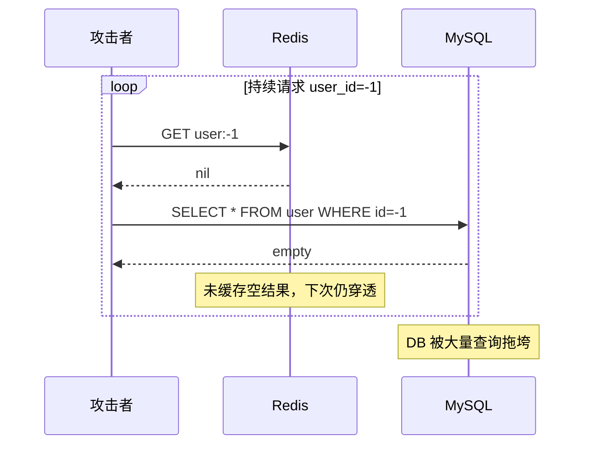
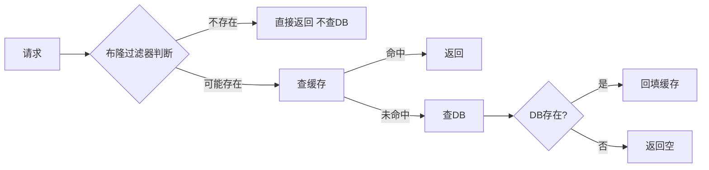
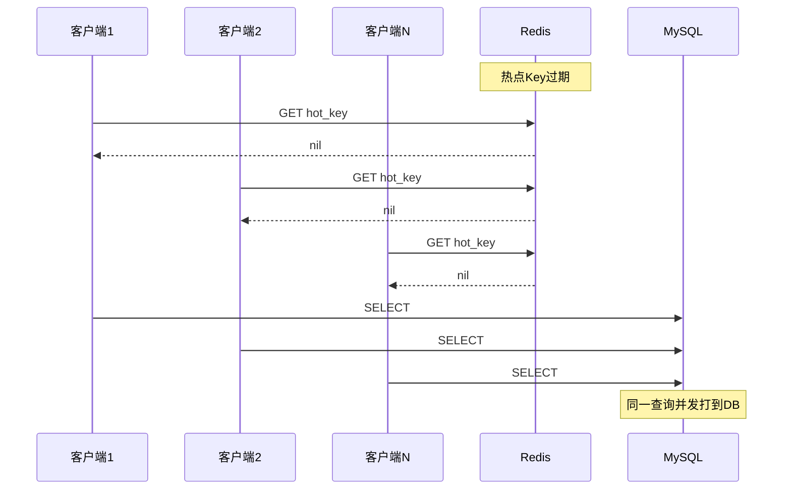
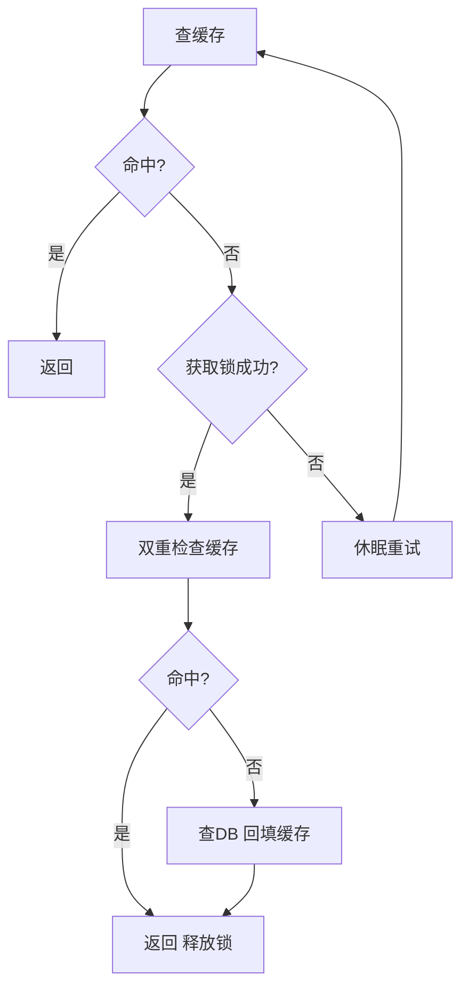
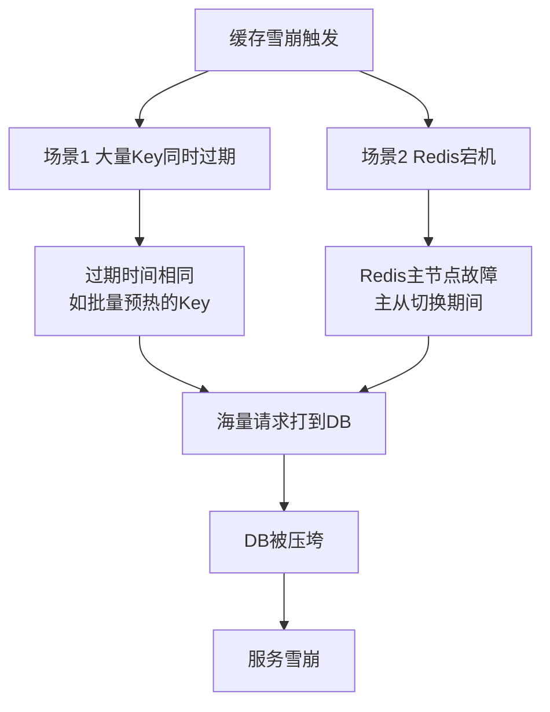
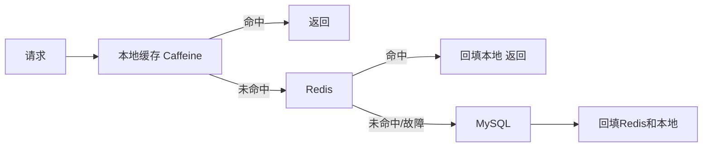
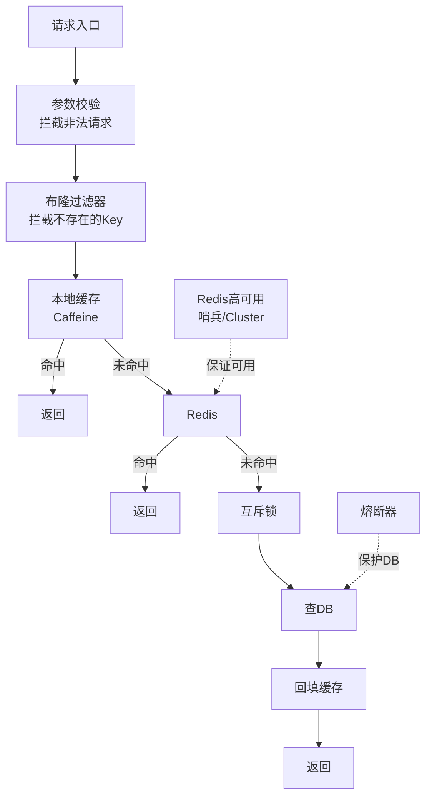

# Redis 缓存雪崩、击穿、穿透

> 高并发场景下，缓存失效会导致请求直接打到数据库，引发连锁故障。本文系统讲解三大经典缓存问题及工业级解决方案。

## 目录

- [一、三大问题对比](#一三大问题对比)
- [二、缓存穿透](#二缓存穿透)
- [三、缓存击穿](#三缓存击穿)
- [四、缓存雪崩](#四缓存雪崩)
- [五、综合防护方案](#五综合防护方案)
- [六、相关资料](#六相关资料)

## 一、三大问题对比

| 维度 | 缓存穿透 | 缓存击穿 | 缓存雪崩 |
|------|---------|---------|---------|
| **本质** | 查询不存在的数据 | 热点 Key 过期 | 大量 Key 同时过期 |
| **触发** | 恶意攻击、参数错误 | 热点数据失效 | 缓存集体失效 / Redis 宕机 |
| **影响范围** | 单个/少量 Key | 单个热点 Key | 大量 Key |
| **请求特征** | 持续查询 DB 不存在的值 | 高并发查询同一 Key | 大量请求同时未命中 |
| **解决思路** | 拦截非法请求 + 缓存空值 | 互斥锁 + 热点永不过期 | 过期时间打散 + 多级缓存 |



## 二、缓存穿透

### 2.1 问题场景

查询一个**数据库和缓存都不存在**的数据，每次请求都会穿透到 DB：



### 2.2 原因

- 攻击者恶意构造不存在的 ID（负数、随机大数）
- 业务参数校验缺失
- 缓存未命中时直接查 DB，未对"DB 也没有"的情况做处理

### 2.3 解决方案一：缓存空值

```python
def get_user(user_id):
    # 参数校验
    if user_id <= 0:
        return None

    # 查缓存
    value = redis.get(f"user:{user_id}")
    if value is not None:
        if value == "NULL_PLACEHOLDER":
            return None  # 缓存的空值
        return value

    # 查数据库
    value = db.query("SELECT * FROM user WHERE id = %s", user_id)
    if value is None:
        # 缓存空值，过期时间短（如 60s）
        redis.setex(f"user:{user_id}", 60, "NULL_PLACEHOLDER")
    else:
        redis.setex(f"user:{user_id}", 3600, value)
    return value
```

**优点**：实现简单。
**缺点**：
- 占用内存（大量不存在的 Key）
- 短期内 DB 新增数据后，缓存仍是空值（需短过期时间缓解）

### 2.4 解决方案二：布隆过滤器（推荐）



**原理**：用位数组 + 多个哈希函数判断元素**一定不存在**或**可能存在**。

```python
from pybloom_live import ScalableBloomFilter

# 启动时加载所有合法 ID 到布隆过滤器
bf = ScalableBloomFilter(initial_capacity=1000000, error_rate=0.001)
for user_id in db.query("SELECT id FROM user"):
    bf.add(user_id)

def get_user(user_id):
    if user_id not in bf:
        return None  # 一定不存在，直接拦截
    # 走正常缓存查询流程
    ...
```

| 维度 | 说明 |
|------|------|
| 空间效率 | 1 亿数据约需 100MB（远小于哈希表） |
| 误判率 | 可配置，通常 0.1% ~ 1% |
| 删除困难 | 标准布隆过滤器不支持删除（可用 Counting Bloom Filter） |
| 数据更新 | 新增数据需同步加入布隆过滤器 |

### 2.5 方案对比

| 方案 | 实现难度 | 内存占用 | 准确性 | 适用场景 |
|------|---------|---------|--------|---------|
| 缓存空值 | 简单 | 高（大量空 Key） | 100% | 不存在 Key 数量少 |
| 布隆过滤器 | 中等 | 低 | 有误判率 | 大规模数据 |
| 参数校验 | 简单 | 无 | 100% | ID 规则明确（如必须正整数） |
| 两者结合 | 中等 | 中 | 高 | 生产推荐 |

## 三、缓存击穿

### 3.1 问题场景

**热点 Key** 过期瞬间，大量并发请求同时未命中，全部打到 DB：



### 3.2 解决方案一：互斥锁

只允许一个请求查 DB 并回填缓存，其他请求等待：

```python
import time
import redis

r = redis.Redis()

def get_with_lock(key, ttl=3600):
    # 1. 查缓存
    value = r.get(key)
    if value is not None:
        return value

    # 2. 获取互斥锁
    lock_key = f"lock:{key}"
    if r.set(lock_key, "1", nx=True, ex=10):
        try:
            # 3. 双重检查
            value = r.get(key)
            if value is not None:
                return value
            # 4. 查 DB 并回填
            value = db.query(key)
            r.setex(key, ttl, value)
            return value
        finally:
            r.delete(lock_key)
    else:
        # 5. 等待重试
        time.sleep(0.05)
        return get_with_lock(key, ttl)
```



**优点**：实现简单，保证强一致。
**缺点**：等待锁会增加响应时间。

### 3.2 解决方案二：逻辑过期（热点永不过期）

不设置 TTL，而是在 Value 中存逻辑过期时间，由后台异步更新：

```python
import json
import time
import threading

def get_with_logical_expire(key):
    value = r.get(key)
    if value is None:
        return None

    data = json.loads(value)
    if data['expire_time'] > time.time():
        # 未逻辑过期，直接返回
        return data['value']

    # 逻辑过期，尝试获取锁异步更新
    lock_key = f"lock:{key}"
    if r.set(lock_key, "1", nx=True, ex=10):
        # 开启后台线程更新
        threading.Thread(
            target=refresh_cache, args=(key,), daemon=True
        ).start()

    # 返回旧值（短暂不一致，但可用）
    return data['value']

def refresh_cache(key):
    try:
        value = db.query(key)
        data = {
            'value': value,
            'expire_time': time.time() + 3600  # 逻辑过期 1 小时
        }
        r.set(key, json.dumps(data))  # 不设 TTL
    finally:
        r.delete(f"lock:{key}")
```

**优点**：请求永不阻塞，性能最好。
**缺点**：
- 短暂数据不一致
- 内存占用高（数据不主动清理）
- 实现复杂

### 3.3 方案对比

| 方案 | 一致性 | 性能 | 实现复杂度 | 适用场景 |
|------|--------|------|----------|---------|
| 互斥锁 | 强 | 中（有等待） | 中 | 一致性要求高 |
| 逻辑过期 | 弱 | 高 | 高 | 超高并发热点 |
| 提前刷新 | 强 | 高 | 中 | 可预测过期时间 |

## 四、缓存雪崩

### 4.1 问题场景

两种触发场景：



### 4.2 场景一：大量 Key 同时过期

**原因**：批量预热缓存时设置了相同的 TTL，导致同时失效。

**解决方案**：过期时间打散

```python
import random

def cache_data(key, value):
    base_ttl = 3600  # 基础过期 1 小时
    random_ttl = random.randint(0, 300)  # 随机 0~5 分钟
    r.setex(key, base_ttl + random_ttl, value)
```

### 4.3 场景二：Redis 宕机

**原因**：Redis 主节点故障，主从切换期间缓存不可用。

**解决方案**：
1. **Redis 高可用**：哨兵模式或 Cluster，故障自动转移
2. **多级缓存**：本地缓存 + Redis，Redis 故障时降级到本地
3. **熔断降级**：DB 压力大时熔断，返回降级数据



**多级缓存伪代码**：

```python
from cachetools import TTLCache

local_cache = TTLCache(maxsize=10000, ttl=60)

def get_data(key):
    # 1. 本地缓存
    if key in local_cache:
        return local_cache[key]

    # 2. Redis
    try:
        value = redis.get(key)
        if value:
            local_cache[key] = value
            return value
    except RedisError:
        pass  # Redis 故障，降级

    # 3. DB
    value = db.query(key)
    if value:
        local_cache[key] = value
        try:
            redis.setex(key, 3600, value)
        except RedisError:
            pass
    return value
```

### 4.4 熔断限流

当 DB 压力过大时，通过熔断器保护系统：

```python
from circuitbreaker import circuit

@circuit(failure_threshold=10, recovery_timeout=30)
def get_from_db(key):
    return db.query(key)

def get_data(key):
    value = redis.get(key)
    if value:
        return value
    try:
        value = get_from_db(key)  # 熔断后抛异常
        redis.setex(key, 3600, value)
        return value
    except CircuitBreakerError:
        return get_fallback_value(key)  # 降级数据
```

## 五、综合防护方案

### 5.1 整体架构



### 5.2 配置清单

| 防护点 | 方案 | 配置示例 |
|--------|------|---------|
| 穿透 | 缓存空值 + 布隆过滤器 | 空值 TTL 60s，误判率 0.1% |
| 击穿 | 互斥锁 + 热点永不过期 | 锁超时 10s，逻辑过期 1h |
| 雪崩 | 过期时间打散 + 多级缓存 | TTL = base + random(0, 300) |
| 宕机 | Redis HA + 熔断降级 | 哨兵故障转移 30s |
| 限流 | 令牌桶 / 漏桶 | 单机 QPS 限流 1000 |

### 5.3 监控指标

```bash
# 缓存命中率（应 > 95%）
INFO stats | grep -E "keyspace_hits|keyspace_misses"

# BigKey 监控
redis-cli --bigkeys

# 慢查询
SLOWLOG GET 10

# 内存使用
INFO memory | grep used_memory_human
```

## 六、相关资料

- [布隆过滤器原理 - Wikipedia](https://en.wikipedia.org/wiki/Bloom_filter)
- [Redis 最佳实践 - 缓存设计](https://redis.io/docs/manual/patterns/)
- [Caffeine 本地缓存](https://github.com/ben-manes/caffeine)
- [小林 coding - 缓存雪崩、击穿、穿透](https://xiaolincoding.com/redis/architecture/cache_problem.html)
