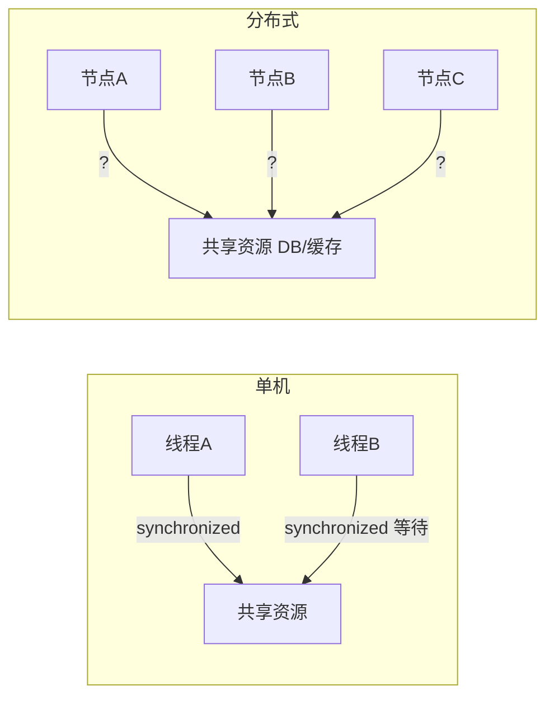
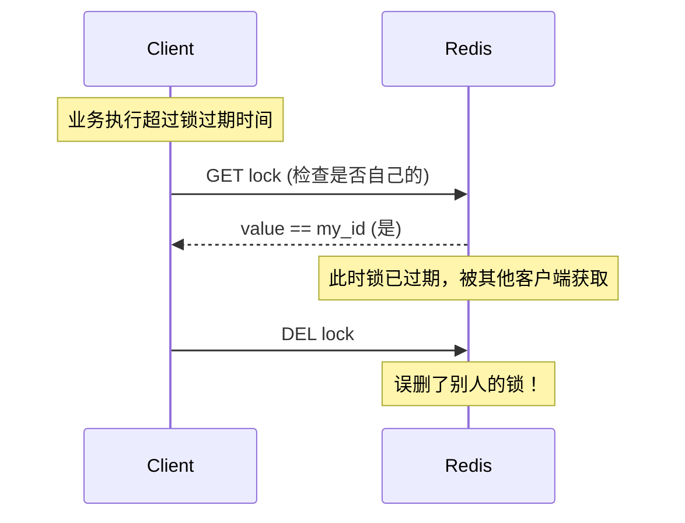
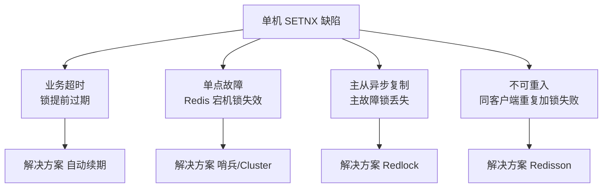
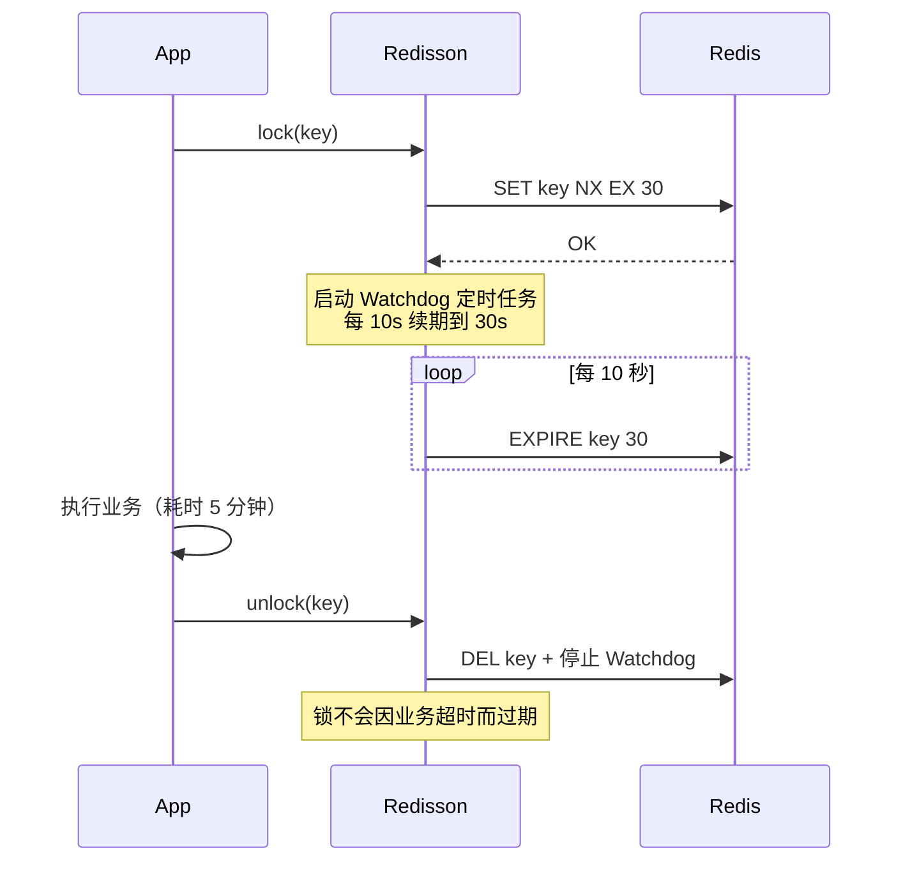
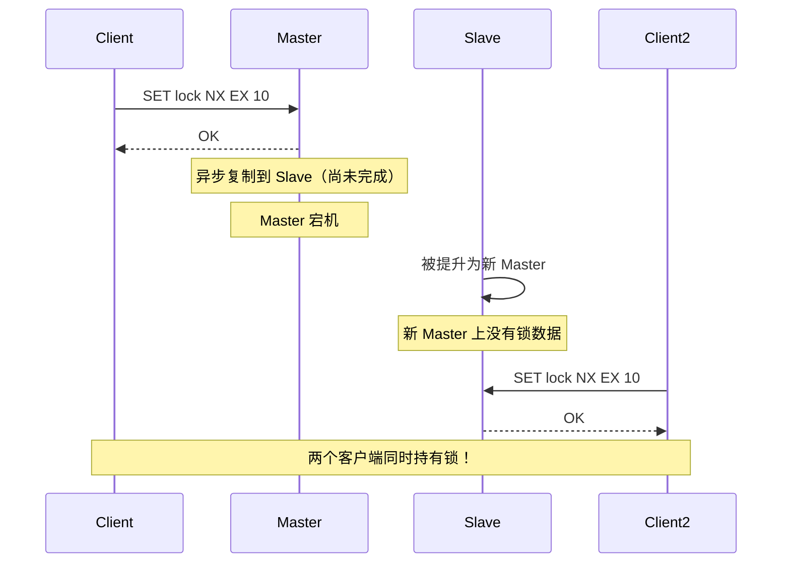
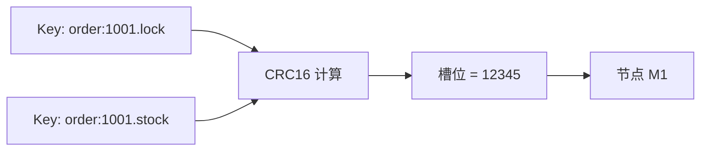
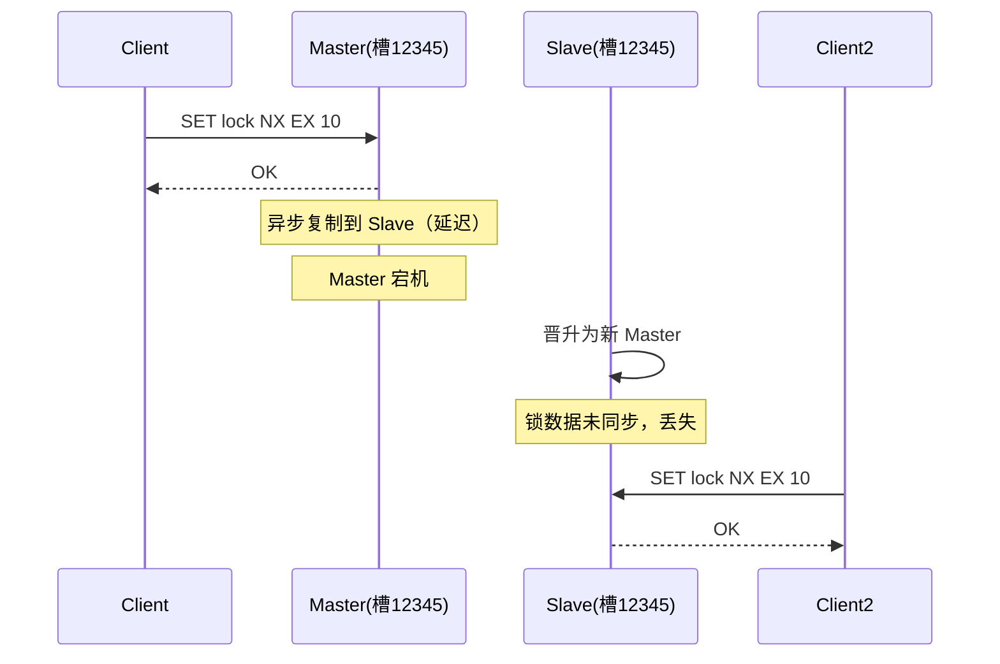
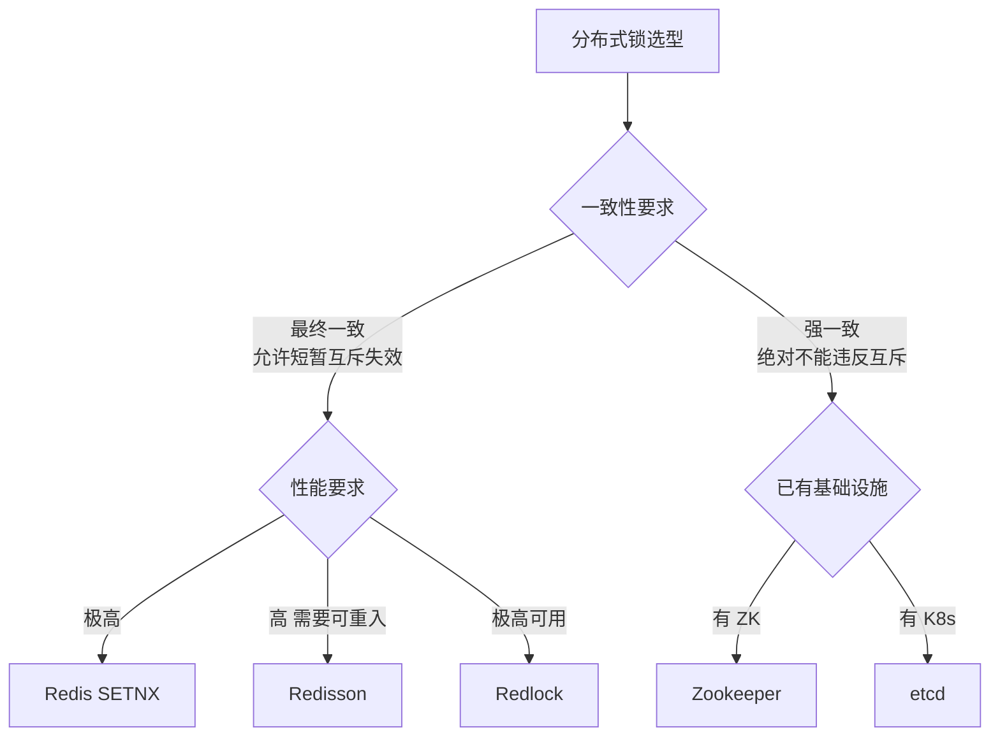

# Redis 分布式锁

> 分布式锁是分布式系统中协调多进程/多节点资源访问的核心机制。本文系统讲解基于 Redis 的分布式锁实现方案，从单机 SETNX 到 Redlock 算法，再到工业级 Redisson 实现。

## 目录

- [一、分布式锁基础](#一分布式锁基础)
- [二、单机 SETNX 实现](#二单机-setnx-实现)
- [三、Redisson 分布式锁](#三redisson-分布式锁)
- [四、Redlock 算法](#四redlock-算法)
- [五、Cluster 模式下的锁问题](#五cluster-模式下的锁问题)
- [六、与其他方案对比](#六与其他方案对比)
- [七、生产实践](#七生产实践)
- [八、相关资料](#八相关资料)

## 一、分布式锁基础

### 1.1 为什么需要分布式锁



单机场景下 `synchronized` / `ReentrantLock` 即可保证互斥；分布式场景下，多个进程跨机器运行，本地锁失效，需要**分布式锁**协调跨节点资源访问。

### 1.2 分布式锁核心特性

| 特性 | 说明 | 重要性 |
|------|------|--------|
| **互斥性** | 任意时刻只有一个客户端持有锁 | 必须 |
| **避免死锁** | 持有锁的客户端崩溃后，锁最终会被释放 | 必须 |
| **可重入性** | 同一客户端可多次获取同一把锁 | 推荐 |
| **高可用** | 锁服务不能成为单点故障 | 推荐 |
| **高性能** | 加锁/解锁延迟低 | 推荐 |
| **公平性** | 按请求顺序获取锁 | 可选 |

### 1.3 典型应用场景

```mermaid
mindmap
    root((分布式锁应用))
    库存扣减
        电商秒杀
        商品库存
    订单防重
        防止重复下单
        幂等性保证
    定时任务
        防止多节点重复执行
        定时对账
    资源互斥
        配置变更
        热点数据更新
    限流
        全局QPS控制
```

## 二、单机 SETNX 实现

### 2.1 基础实现

利用 Redis 的 `SET key value NX EX seconds` 原子命令：

```bash
# 加锁（key 不存在才设置成功，并设置过期时间）
SET lock:order:1001 <request_id> NX EX 10

# 执行业务
# do something ...

# 解锁（需要判断是否是自己加的锁）
DEL lock:order:1001
```

```python
import redis
import uuid

r = redis.Redis()

def acquire_lock(lock_key, expire=10):
    request_id = str(uuid.uuid4())
    # NX: 不存在才设置  EX: 过期时间秒
    if r.set(lock_key, request_id, nx=True, ex=expire):
        return request_id
    return None

def release_lock(lock_key, request_id):
    # 必须用 Lua 脚本保证原子性（判断+删除）
    script = """
    if redis.call('GET', KEYS[1]) == ARGV[1] then
        return redis.call('DEL', KEYS[1])
    else
        return 0
    end
    """
    return r.eval(script, 1, lock_key, request_id)

# 使用示例
def deduct_stock(order_id):
    lock_key = f"lock:order:{order_id}"
    request_id = acquire_lock(lock_key)
    if not request_id:
        raise Exception("获取锁失败")
    try:
        # 业务逻辑
        stock = int(r.get(f"stock:{order_id}"))
        if stock > 0:
            r.decr(f"stock:{order_id}")
            return True
        return False
    finally:
        release_lock(lock_key, request_id)
```

### 2.2 解锁必须用 Lua 脚本



**问题**：`GET` + `DEL` 两步非原子，可能误删他人持有的锁。
**解决**：用 Lua 脚本保证"判断 + 删除"原子执行。

### 2.3 单机方案的缺陷



| 缺陷 | 描述 | 后果 |
|------|------|------|
| 业务超时 | 锁过期但业务未完成 | 其他客户端获取锁，互斥失效 |
| 单点故障 | Redis 宕机 | 所有锁丢失，无法加锁 |
| 主从复制延迟 | 主加锁后未同步到从即故障 | 从晋升为新主，锁丢失 |
| 不可重入 | 同一客户端重复加锁失败 | 嵌套调用场景失效 |

## 三、Redisson 分布式锁

Redisson 是 Redis 的 Java 客户端，提供了工业级的分布式锁实现，解决了单机 SETNX 的大部分缺陷。

### 3.1 Watchdog 自动续期



**机制**：
- 默认锁过期时间 30 秒
- Watchdog 每 10 秒检查锁是否仍被持有，若是则续期到 30 秒
- 客户端崩溃后，Watchdog 停止续期，锁最终过期释放

### 3.2 可重入锁实现

Redisson 通过 Hash 结构记录重入次数：

```
Key: lock:order:1001
Value: {
    "client_uuid:thread_1": 2  # 客户端ID:线程ID -> 重入次数
}
```

```java
// Java 示例
RLock lock = redisson.getLock("lock:order:1001");

lock.lock();  // 第一次加锁，count = 1
try {
    lock.lock();  // 重入，count = 2
    try {
        // 业务逻辑
    } finally {
        lock.unlock();  // count = 1，不释放锁
    }
} finally {
    lock.unlock();  // count = 0，释放锁
}
```

```lua
-- 加锁 Lua 脚本（简化版）
if redis.call('exists', KEYS[1]) == 0 then
    redis.call('hset', KEYS[1], ARGV[2], 1)
    redis.call('pexpire', KEYS[1], ARGV[1])
    return nil
end
if redis.call('hexists', KEYS[1], ARGV[2]) == 1 then
    redis.call('hincrby', KEYS[1], ARGV[2], 1)
    redis.call('pexpire', KEYS[1], ARGV[1])
    return nil
end
return redis.call('pttl', KEYS[1])
```

### 3.3 公平锁

```java
RLock fairLock = redisson.getFairLock("lock:order:1001");
fairLock.lock();
```

基于 Redis List 维护等待队列，按请求顺序获取锁。

### 3.4 读写锁

```java
RReadWriteLock rwLock = redisson.getReadWriteLock("lock:config");

// 读锁（共享）
rwLock.readLock().lock();

// 写锁（排他）
rwLock.writeLock().lock();
```

| 锁类型 | 兼容性 | 适用场景 |
|--------|--------|---------|
| 读锁 | 读锁兼容，写锁互斥 | 读多写少 |
| 写锁 | 与所有锁互斥 | 配置变更、数据更新 |

### 3.5 联锁（MultiLock）

```java
RLock lock1 = redisson1.getLock("lock1");
RLock lock2 = redisson2.getLock("lock2");
RLock lock3 = redisson3.getLock("lock3");

RLock multiLock = redisson.getMultiLock(lock1, lock2, lock3);
multiLock.lock();  // 全部加锁成功才算成功
```

## 四、Redlock 算法

### 4.1 算法背景

Redis 主从异步复制导致锁丢失问题：



### 4.2 Redlock 原理

使用多个**独立**的 Redis 实例（非主从），加锁时向多数节点成功才算成功：

```mermaid
flowchart LR
    Client[客户端] --> R1[Redis 1]
    Client --> R2[Redis 2]
    Client --> R3[Redis 3]
    Client --> R4[Redis 4]
    Client --> R5[Redis 5]
    R1 -->|OK| Client
    R2 -->|OK| Client
    R3 -->|OK| Client
    R4 -->|FAIL| Client
    R5 -->|OK| Client
    Note over Client: 4/5 成功 > N/2+1 = 3<br/>且耗时 < 锁有效期<br/>加锁成功
```

### 4.3 加锁流程

```python
import time
import uuid

class Redlock:
    def __init__(self, redis_nodes):
        self.nodes = redis_nodes  # 5 个独立的 Redis 实例
        self.quorum = len(redis_nodes) // 2 + 1  # 多数 = 3

    def lock(self, lock_key, ttl=10000):
        request_id = str(uuid.uuid4())
        start_time = time.time()
        success_count = 0

        # 并发向所有节点加锁
        for node in self.nodes:
            try:
                if node.set(lock_key, request_id, nx=True, px=ttl):
                    success_count += 1
            except Exception:
                pass

        # 判断是否成功
        elapsed = (time.time() - start_time) * 1000
        if success_count >= self.quorum and elapsed < ttl:
            # 有效期 = TTL - 耗时
            return request_id, ttl - elapsed
        else:
            # 失败，向所有节点解锁
            self.unlock(lock_key, request_id)
            return None

    def unlock(self, lock_key, request_id):
        script = """
        if redis.call('GET', KEYS[1]) == ARGV[1] then
            return redis.call('DEL', KEYS[1])
        else
            return 0
        end
        """
        for node in self.nodes:
            try:
                node.eval(script, 1, lock_key, request_id)
            except Exception:
                pass
```

### 4.4 关键细节

| 要点 | 说明 |
|------|------|
| 节点数量 | 通常 5 个，允许 2 个故障 |
| 多数判定 | `N/2 + 1`，如 5 个节点需 3 个成功 |
| 加锁耗时 | 必须远小于 TTL（通常 TTL=10s，耗时 < 5ms） |
| 有效期 | 实际有效期 = TTL - 加锁总耗时 |
| 时钟同步 | 各节点时钟需同步（NTP），否则判定失效 |
| 解锁 | 向所有节点发送解锁，无论是否持有 |

### 4.5 Redlock 的争议

Martin Kleppmann 在文章《How to do distributed locking》中对 Redlock 提出质疑：

| 质疑点 | 描述 | Redisson 应对 |
|--------|------|--------------|
| 时钟跳跃 | NTP 时钟调整会导致锁有效期计算错误 | 使用 fencing token |
| GC 暂停 | 客户端 STW 后锁已过期，仍以为持有锁 | 无法完全解决 |
| 网络延迟 | 加锁请求延迟，实际有效期缩短 | 设定合理 TTL |

> **结论**：Redlock 适合**效率型锁**（避免重复工作），不适合**正确性型锁**（绝对不能违反互斥）。后者请用 Zookeeper / etcd。

## 五、Cluster 模式下的锁问题

### 5.1 Hash Tag 保证同槽

Redis Cluster 中，跨槽操作不支持原子性。分布式锁的 Key 必须路由到同一槽：

```bash
# 使用 Hash Tag {} 保证相关 Key 在同一槽
SET {order:1001}.lock <value> NX EX 10
SET {order:1001}.stock 100
# 这两个 Key 都按 order:1001 计算 CRC16，路由到同一节点
```



### 5.2 故障转移期间锁丢失



**缓解方案**：
1. 使用 `WAIT` 命令等待复制到至少 1 个从节点
2. 使用 Redlock 算法
3. 接受最终一致性，业务层做幂等

```bash
# 加锁后等待复制
SET lock:order:1001 <id> NX EX 10
WAIT 1 100  # 等待至少 1 个从节点确认，超时 100ms
```

## 六、与其他方案对比

| 维度 | Redis SETNX | Redisson | Redlock | Zookeeper | etcd |
|------|-------------|----------|---------|-----------|------|
| **一致性** | 弱（AP） | 弱（AP） | 弱（CP-ish） | 强（CP） | 强（CP） |
| **性能** | 极高 | 高 | 中 | 低 | 中 |
| **可用性** | 高 | 高 | 高 | 中（需半数存活） | 高 |
| **自动续期** | 无 | 有 | 无 | 有（临时节点） | 有（Lease） |
| **可重入** | 无 | 有 | 无 | 有 | 有 |
| **实现复杂度** | 低 | 低 | 高 | 中 | 中 |
| **适用场景** | 简单互斥 | 通用业务 | 高要求互斥 | 强一致场景 | 强一致场景 |



## 七、生产实践

### 7.1 锁粒度设计

```python
# 差：粒度太粗，并发度低
lock_key = "lock:order"  # 所有订单共用一把锁

# 好：粒度合适，按订单维度加锁
lock_key = f"lock:order:{order_id}"

# 差：粒度太细，锁数量爆炸
lock_key = f"lock:order:{order_id}:field:stock"  # 字段级锁
```

### 7.2 锁超时设置

| 业务类型 | 建议超时 | 说明 |
|---------|---------|------|
| 短事务（< 1s） | 10s | 留足余量 |
| 长事务（1-10s） | 30s | 配合 Watchdog |
| 定时任务 | 5-30 分钟 | 任务最大执行时间 |
| 秒杀扣库存 | 3s | 极短，快速失败 |

### 7.3 失败重试策略

```java
// Java Redisson 示例
RLock lock = redisson.getLock("lock:order:1001");

// 尝试加锁，最多等待 5 秒，锁自动释放 30 秒
boolean acquired = lock.tryLock(5, 30, TimeUnit.SECONDS);

if (acquired) {
    try {
        // 业务逻辑
    } finally {
        lock.unlock();
    }
} else {
    // 获取锁失败，降级处理
    throw new BusinessException("系统繁忙，请稍后重试");
}
```

### 7.4 监控指标

```bash
# 监控锁等待
redis-cli CLIENT LIST | grep -c "cmd=wait"

# 监控锁 Key 数量
redis-cli DBSIZE

# 慢查询（锁操作不应出现在慢查询中）
redis-cli SLOWLOG GET 10
```

| 指标 | 告警阈值 | 说明 |
|------|---------|------|
| 锁获取失败率 | > 5% | 可能锁竞争激烈或持有时间过长 |
| 锁等待时间 P99 | > 1s | 影响用户体验 |
| 锁持有时间 P99 | > 5s | 业务执行过慢 |
| 死锁数量 | > 0 | 需排查解锁逻辑 |

## 八、相关资料

- [Redis 官方文档 - 分布式锁](https://redis.io/docs/manual/patterns/distributed-locks/)
- [Redlock 算法](https://redis.io/docs/manual/patterns/distributed-locks/)
- [Martin Kleppmann - How to do distributed locking](https://martin.kleppmann.com/2016/02/08/how-to-do-distributed-locking.html)
- [Redisson 官方文档](https://github.com/redisson/redisson/wiki)
- [小林 coding - Redis 分布式锁](https://xiaolincoding.com/redis/architecture/distributed_lock.html)
