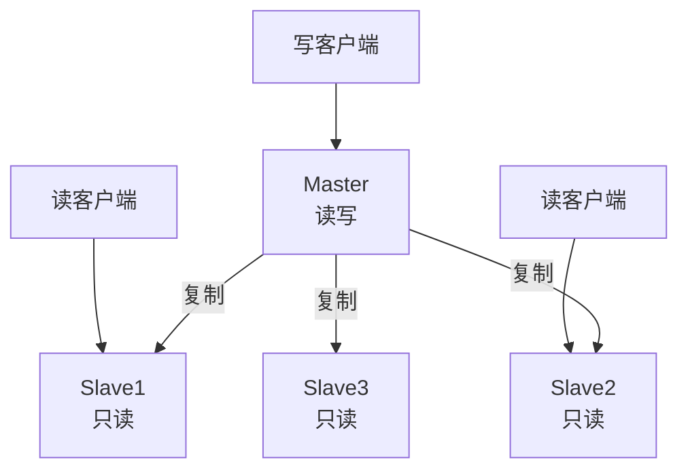
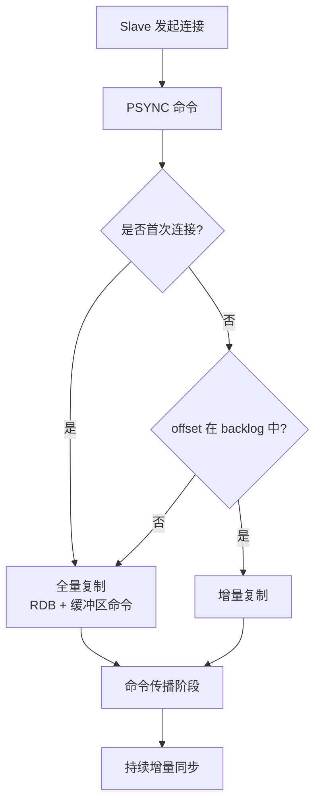

# Redis 集群模式之主从模式

> 主从模式：最简单的 Redis 集群方案，一主多从实现读写分离与数据备份

> 详细原理参见 [主从复制详解](高可用-主从复制详解.md) | 总览参见 [cluster.md](cluster.md)

## 一、模式概览

```
一主多从架构
- Master 负责读写
- Slave 负责读（Redis 2.6 开始默认从只读）
- 异步复制，最终一致
```



## 二、使用方式

### 2.1 配置文件方式

```bash
# Slave 节点的 redis.conf
replicaof 192.168.0.1 6379
masterauth yourpassword

# 从节点只读（默认 yes）
replica-read-only yes
```

### 2.2 命令行启动

```bash
# 启动时指定主节点
./redis-server --slaveof 127.0.0.1 6379

# 运行时切换为从节点
redis-cli> REPLICAOF 192.168.0.1 6379

# 运行时升级为主节点
redis-cli> REPLICAOF NO ONE
```

### 2.3 验证主从状态

```bash
# 主节点查看
127.0.0.1:6379> INFO replication
# role:master
# connected_slaves:3
# slave0:ip=192.168.0.2,port=6379,state=online,offset=1234,lag=0
# slave1:ip=192.168.0.3,port=6379,state=online,offset=1234,lag=0
# slave2:ip=192.168.0.4,port=6379,state=online,offset=1234,lag=0

# 从节点查看
127.0.0.1:6380> INFO replication
# role:slave
# master_host:192.168.0.1
# master_port:6379
# master_link_status:up
# slave_repl_offset:1234
```

## 三、同步机制



详细同步流程参见 [主从复制详解](高可用-主从复制详解.md)。

## 四、优缺点

### 优点

| 优点 | 说明 |
|------|------|
| 配置简单 | 一行 `replicaof` 即可 |
| 读写分离 | 主写从读，提升读 QPS |
| 非阻塞 | 主从节点均不阻塞客户端 |
| 数据备份 | 多副本避免单点故障 |

### 缺点

| 缺点 | 说明 |
|------|------|
| 不支持自动故障转移 | 主节点宕机需人工介入 |
| 主从延迟 | 异步复制导致数据不一致 |
| 主节点 IO 压力 | 从节点过多时主节点复制压力大 |
| 不支持写扩展 | 写仍集中在主节点 |
| 扩容麻烦 | 增加节点需全量复制 |

## 五、应用场景

| 场景 | 适合度 | 说明 |
|------|--------|------|
| 读多写少 | ✓ | 读写分离最大化读 QPS |
| 数据备份 | ✓ | 多副本保障数据安全 |
| 报表统计 | ✓ | 从节点承担分析查询 |
| 高可用要求 | ✗ | 需配合哨兵或 Cluster |
| 大数据量 | ✗ | 单主存储瓶颈，需 Cluster |

## 六、相关资料

- [主从复制详解](高可用-主从复制详解.md)
- [主从脑裂问题](Redis主从脑裂问题和解决方案.md)
- [Redis 官方文档 - 复制](https://redis.io/docs/management/replication/)
- [InfoQ Redis 集群](https://xie.infoq.cn/article/6c3500c66c3cdee3d72b88780)
