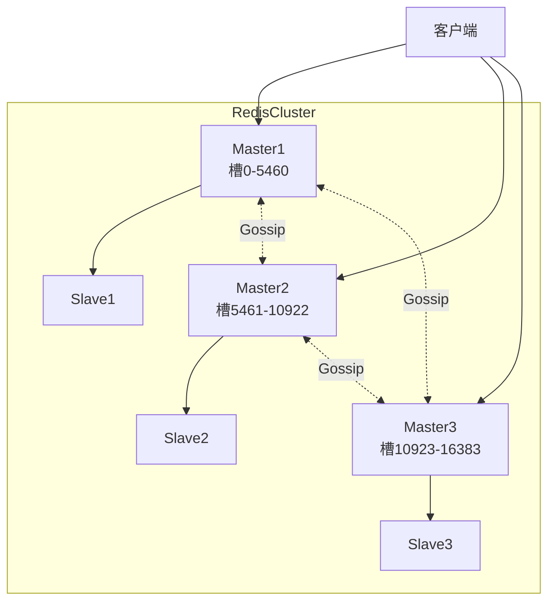
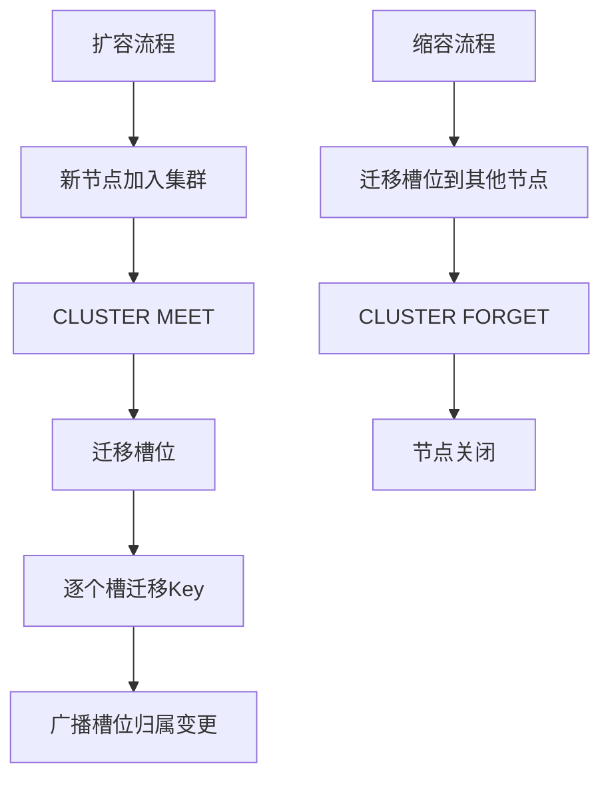
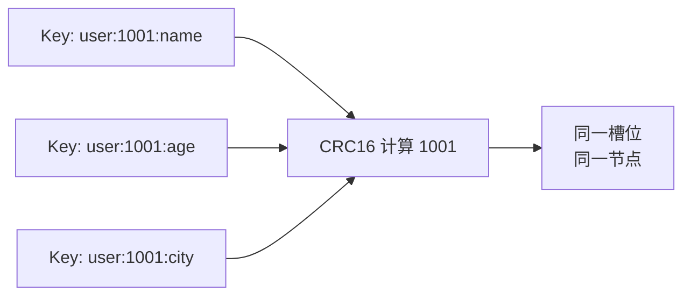

# Redis 集群模式之分片 Cluster 模式

> Cluster 模式：去中心化分片集群，支持横向扩展与自动故障转移

> 详细原理参见 [分片技术.md](分片技术.md) | [Cluster 内部原理](分片RedisCluster原理.md) | 总览参见 [cluster.md](cluster.md)

## 一、模式概览

```
Redis Cluster 特性
- 去中心化：无中心代理节点
- 数据分片：16384 个哈希槽分布到各主节点
- 高可用：每个主节点配一个从节点
- 横向扩展：动态添加节点并迁移槽
- 推荐部署：3 主 3 从（共 6 个节点起步）
```



## 二、关键配置

### 2.1 redis.conf 配置

```bash
# 开启集群模式
cluster-enabled yes

# 集群节点配置文件（自动生成）
cluster-config-file nodes-6379.conf

# 节点超时时间（毫秒）
cluster-node-timeout 15000

# 集群总线端口（默认 = 客户端端口 + 10000）
# cluster-announce-port 6379
# cluster-announce-bus-port 16379

# 数据持久化
appendonly yes
```

### 2.2 配置项说明

| 配置项 | 默认值 | 说明 |
|--------|--------|------|
| `cluster-enabled` | no | 是否开启集群模式 |
| `cluster-config-file` | nodes.conf | 节点信息文件，Redis 自动维护 |
| `cluster-node-timeout` | 15000 | 节点失联超时（毫秒） |
| `cluster-announce-ip` | - | 对外宣告的 IP（NAT 环境用） |
| `cluster-announce-port` | - | 对外宣告的客户端端口 |
| `cluster-announce-bus-port` | - | 对外宣告的总线端口 |
| `cluster-migration-barrier` | 1 | 主节点迁移所需最小从节点数 |
| `cluster-require-full-coverage` | yes | 槽位未全覆盖时是否拒绝服务 |

## 三、集群搭建流程

### 3.1 启动 6 个节点

```bash
# 准备 6 个 redis.conf（端口 6379-6384）
# 每个配置文件都需要开启 cluster-enabled yes

# 启动 6 个 Redis 实例
for port in 6379 6380 6381 6382 6383 6384; do
    redis-server /path/to/redis-${port}.conf
done
```

### 3.2 创建集群

```bash
# Redis 5.0+ 使用 redis-cli 创建
redis-cli --cluster create \
    192.168.1.1:6379 \
    192.168.1.2:6379 \
    192.168.1.3:6379 \
    192.168.1.4:6379 \
    192.168.1.5:6379 \
    192.168.1.6:6379 \
    --cluster-replicas 1

# Redis 5.0 之前使用 redis-trib.rb
# ./redis-trib.rb create --replicas 1 192.168.1.1:6379 ...
```

`--cluster-replicas 1` 表示每个主节点配 1 个从节点。

### 3.3 验证集群

```bash
# 查看集群状态
redis-cli -c -p 6379 CLUSTER INFO
# cluster_state:ok
# cluster_slots_assigned:16384
# cluster_slots_ok:16384
# cluster_known_nodes:6

# 查看节点信息
redis-cli -c -p 6379 CLUSTER NODES
# id addr flags role master ping pong epoch link slots

# 查看槽位分配
redis-cli -c -p 6379 CLUSTER SLOTS
```

## 四、客户端连接

### 4.1 命令行客户端

```bash
# -c 表示集群模式，自动处理 MOVED/ASK 重定向
redis-cli -c -p 6379

127.0.0.1:6379> SET key1 value1
OK
127.0.0.1:6379> SET key2 value2
-> Redirected to slot [4998] located at 192.168.1.2:6379
OK
192.168.1.2:6379> GET key1
-> Redirected to slot [9189] located at 192.168.1.1:6379
"value1"
```

### 4.2 客户端需支持 MOVED/ASK

智能客户端会缓存槽位映射关系，遇到 MOVED 时更新本地缓存：

```python
import redis

# redis-py 自带集群支持
from redis.cluster import RedisCluster

rc = RedisCluster(
    startup_nodes=[redis.ClusterNode('192.168.1.1', 6379)],
    decode_responses=True
)
rc.set('key', 'value')
print(rc.get('key'))
```

## 五、扩容与缩容

### 5.1 扩容流程

```bash
# 1. 启动新节点
redis-server /path/to/redis-6385.conf
redis-server /path/to/redis-6386.conf

# 2. 将新节点加入集群
redis-cli --cluster add-node 192.168.1.7:6379 192.168.1.1:6379
redis-cli --cluster add-node 192.168.1.8:6379 192.168.1.1:6379 --cluster-slave \
    --cluster-master-id <新主节点ID>

# 3. 迁移槽位
redis-cli --cluster reshard 192.168.1.1:6379
# 按提示输入：迁移多少槽、目标节点ID、源节点ID

# 4. 验证
redis-cli --cluster check 192.168.1.1:6379
```

### 5.2 缩容流程

```bash
# 1. 将待下线节点的槽迁移到其他节点
redis-cli --cluster reshard 192.168.1.1:6379
# 输入源节点为待下线节点

# 2. 移除节点
redis-cli --cluster del-node 192.168.1.1:6379 <node-id>

# 3. 验证
redis-cli --cluster check 192.168.1.1:6379
```

### 5.3 扩缩容原理



## 六、Hash Tag（多 Key 操作）

Cluster 模式下，多 Key 操作必须位于同一槽：

```bash
# 使用 Hash Tag 强制分配到同一槽
# 大括号 {} 内的内容参与 CRC16 计算

SET user:{1001}:name "Tom"
SET user:{1001}:age 25
SET user:{1001}:city "Beijing"

# 以下多 Key 操作可行
MGET user:{1001}:name user:{1001}:age user:{1001}:city
```



## 七、优缺点

| 优点 | 缺点 |
|------|------|
| 真正的写扩展与存储扩展 | 不支持跨槽事务（除非 Hash Tag） |
| 自动故障转移 | 客户端需支持 MOVED/ASK |
| 横向扩展能力强 | 发布订阅性能差（广播） |
| 去中心化，无单点 | 运维复杂度高 |
| 多主多从，高可用 | 节点数至少 6 个 |

## 八、限制

| 限制 | 说明 |
|------|------|
| 跨槽 Key 操作 | 不支持 MGET/MSET 等跨节点操作 |
| 跨槽事务 | MULTI/EXEC 跨槽失败 |
| 数据库 | 仅支持 DB 0 |
| 发布订阅 | PUBLISH 会广播到所有节点，开销大 |
| 节点数限制 | 官方建议不超过 1000 |

## 九、相关资料

- [分片技术原理](分片技术.md)
- [Cluster 内部原理](分片RedisCluster原理.md)
- [Linux 搭建步骤](分片RedisCluster搭建.md)
- [Docker 搭建步骤](Redis集群模式Docker搭建.md)
- [Redis 官方文档 - Cluster](https://redis.io/docs/management/scaling/)
