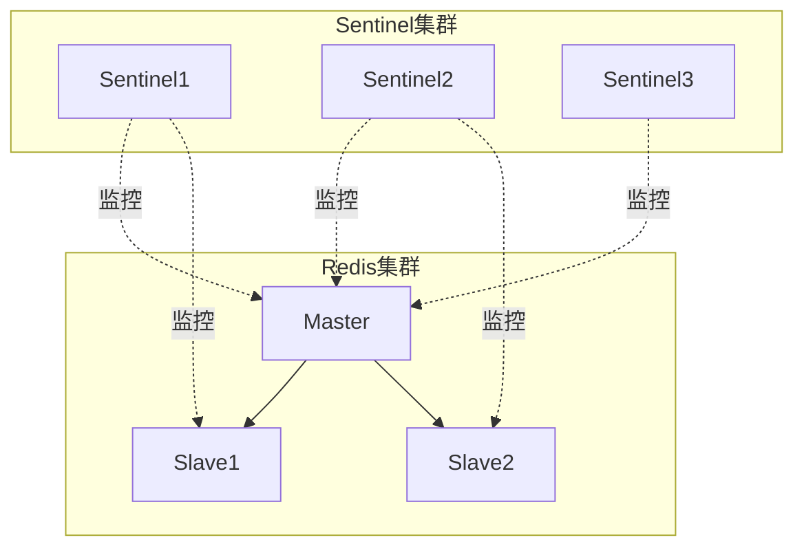
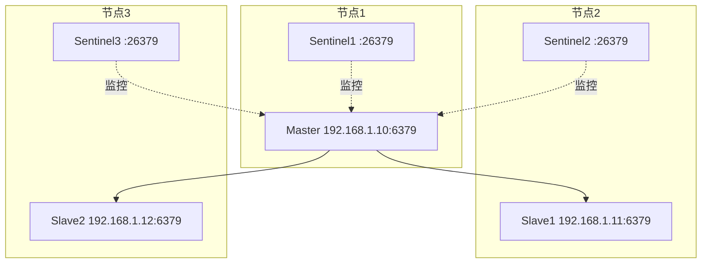
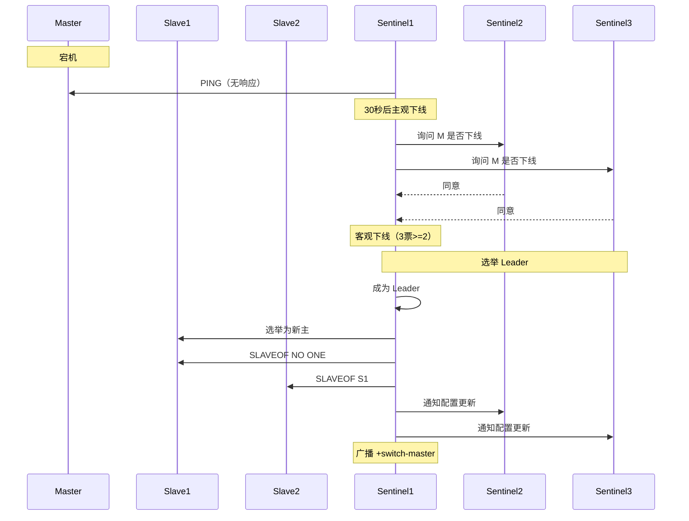

# Redis 集群模式之哨兵模式

> 哨兵模式：主从复制 + Sentinel 哨兵集群，实现自动故障转移

> 原理详见 [哨兵模式.md](哨兵模式.md) | 总览参见 [cluster.md](cluster.md)

## 一、模式概览

```
主从复制 + 哨兵监控
- 主从节点负责数据
- 哨兵独立部署，负责监控与故障转移
- 哨兵自身也是集群（至少 3 个）
```



## 二、配置搭建

### 2.1 主从节点配置

与主从模式相同，参见 [Redis集群模式之主从模式.md](Redis集群模式之主从模式.md)。

### 2.2 Sentinel 配置

```bash
# sentinel.conf
port 26379
daemonize yes
pidfile "/var/run/redis-sentinel.pid"
logfile "/var/log/redis/sentinel.log"
dir "/var/redis/sentinel"

# 监控的主节点（名称、IP、端口、quorum）
sentinel monitor mymaster 192.168.1.10 6379 2

# 主节点密码
sentinel auth-pass mymaster yourpassword

# 主观下线判定时间（毫秒）
sentinel down-after-milliseconds mymaster 30000

# 故障转移时同时同步的从节点数
sentinel parallel-syncs mymaster 1

# 故障转移超时（毫秒）
sentinel failover-timeout mymaster 180000
```

### 2.3 启动 Sentinel

```bash
# 方式一：使用 redis-sentinel 命令
redis-sentinel /path/to/sentinel.conf

# 方式二：使用 redis-server --sentinel
redis-server /path/to/sentinel.conf --sentinel
```

## 三、典型部署拓扑

### 3.1 推荐部署：1主2从3哨兵



### 3.2 节点配置建议

| 部署项 | 建议 | 原因 |
|--------|------|------|
| 哨兵数量 | 3 个（奇数） | 避免脑裂，容忍 1 个故障 |
| 部署位置 | 与 Redis 节点跨机器 | 避免单机故障影响 |
| quorum | 2 | 多数派同意才能客观下线 |
| 端口规划 | Redis 6379，Sentinel 26379 | 标准化便于运维 |

## 四、工作流程



详细原理参见 [哨兵模式.md](哨兵模式.md)。

## 五、客户端连接

### 5.1 客户端配置（Python 示例）

```python
from redis.sentinel import Sentinel

sentinel = Sentinel([
    ('192.168.1.10', 26379),
    ('192.168.1.11', 26379),
    ('192.168.1.12', 26379),
], socket_timeout=0.5)

# 获取主节点连接（自动故障转移后自动切换）
master = sentinel.master_for('mymaster', socket_timeout=0.5)
master.set('key', 'value')

# 获取从节点连接（读请求）
slave = sentinel.slave_for('mymaster', socket_timeout=0.5)
slave.get('key')
```

### 5.2 Java（Jedis）示例

```java
Set<String> sentinels = new HashSet<>();
sentinels.add("192.168.1.10:26379");
sentinels.add("192.168.1.11:26379");
sentinels.add("192.168.1.12:26379");

JedisSentinelPool pool = new JedisSentinelPool("mymaster", sentinels);
try (Jedis jedis = pool.getResource()) {
    jedis.set("key", "value");
}
```

## 六、优缺点

| 优点 | 缺点 |
|------|------|
| 自动故障转移，无需人工 | 写仍集中在单主 |
| 哨兵自身集群高可用 | 配置比主从模式复杂 |
| 客户端动态感知主切换 | 故障转移期间短暂不可用 |
| 保留读写分离能力 | 不支持数据分片 |

## 七、应用场景

| 场景 | 适合度 |
|------|--------|
| 中等规模业务 | ✓ |
| 高可用要求 | ✓ |
| 读多写少 | ✓ |
| 跨机房灾备 | △（需特殊配置） |
| 写扩展需求 | ✗（需 Cluster） |

## 八、相关资料

- [哨兵模式原理详解](哨兵模式.md)
- [集群方案总览](cluster.md)
- [Redis 官方文档 - Sentinel](https://redis.io/docs/management/sentinel/)
