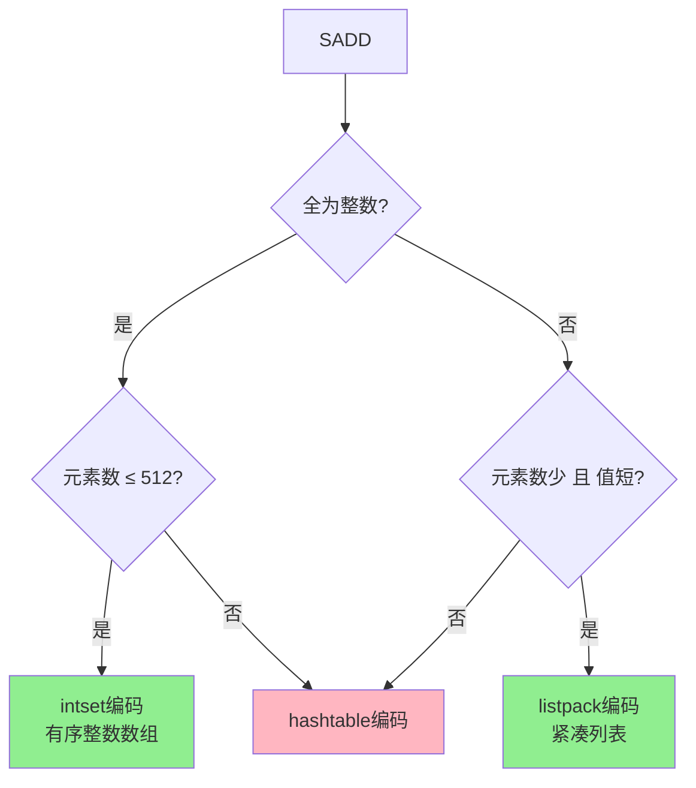

> Redis Set 类型：无序、不重复的字符串集合

## 目录

- [一、基本概念](#一基本概念)
- [二、常用命令](#二常用命令)
- [三、底层实现](#三底层实现)
- [四、应用场景](#四应用场景)
- [五、使用示例](#五使用示例)
- [六、相关资料](#六相关资料)

## 一、基本概念

| 特性 | 说明 |
|------|------|
| 结构 | 无序、不重复元素集合 |
| 元素数上限 | 2^32 - 1 |
| 编码方式 | intset / listpack / hashtable |
| 操作复杂度 | 添加/删除/查找 O(1) |

## 二、常用命令

### 2.1 基本操作

```bash
# 添加元素
$ SADD tags python redis go

# 查看所有元素
$ SMEMBERS tags

# 判断元素是否存在
$ SISMEMBER tags python

# 获取元素数
$ SCARD tags

# 移除元素
$ SREM tags go

# 随机弹出元素
$ SPOP tags
$ SPOP tags 3     # 弹出3个

# 随机获取但不移除
$ SRANDMEMBER tags
$ SRANDMEMBER tags 3

# 移动元素到另一个set
$ SMOVE source destination member
```

### 2.2 集合运算

```bash
# 交集
$ SINTER set1 set2
$ SINTERSTORE dest set1 set2  # 结果存到dest

# 并集
$ SUNION set1 set2
$ SUNIONSTORE dest set1 set2

# 差集（set1有但set2没有）
$ SDIFF set1 set2
$ SDIFFSTORE dest set1 set2
```

### 2.3 扫描

```bash
$ SSCAN tags 0 MATCH p* COUNT 10
```

## 三、底层实现

### 3.1 编码选择



### 3.2 intset 整数集合

```c
typedef struct intset {
    int32 encoding;   // INT16/INT32/INT64
    int32 length;
    int8  contents[]; // 有序数组
} intset;
```

**特性**：
- 有序数组，二分查找O(log n)
- 整数编码升级：int16 → int32 → int64（不可逆）
- 内存紧凑

### 3.3 hashtable

当元素较多时转为字典实现，查找O(1)。

## 四、应用场景

### 4.1 标签系统

```python
# 给用户打标签
r.sadd('user:1001:tags', 'python', 'redis', 'go')

# 查看标签
tags = r.smembers('user:1001:tags')

# 查找有某标签的用户
r.sadd('tag:python', 'user:1001', 'user:1002')
r.sadd('tag:redis', 'user:1001', 'user:1003')

# 同时有python和redis标签的用户
both = r.sinter('tag:python', 'tag:redis')
```

### 4.2 共同好友

```python
# 用户的好友列表
r.sadd('friends:user:1001', 'user:1002', 'user:1003', 'user:1004')
r.sadd('friends:user:1002', 'user:1003', 'user:1004', 'user:1005')

# 共同好友
common = r.sinter('friends:user:1001', 'friends:user:1002')
# {'user:1003', 'user:1004'}

# 可能认识的人（user:1001认识但user:1002不认识）
may_know = r.sdiff('friends:user:1001', 'friends:user:1002')
```

### 4.3 抽奖

```python
# 参与抽奖
r.sadd('lottery:draw1', 'user:1', 'user:2', 'user:3', 'user:4', 'user:5')

# 抽取1名获奖者（不移除）
winner = r.srandmember('lottery:draw1')

# 抽取3名获奖者（移除）
winners = r.spop('lottery:draw1', 3)
```

### 4.4 去重

```python
# 记录UV
for visitor_id in visitors:
    r.sadd('page:article:123:uv', visitor_id)

# 获取UV数
uv = r.scard('page:article:123:uv')
```

### 4.5 黑白名单

```python
# 加入黑名单
r.sadd('blacklist:ip', '1.2.3.4', '5.6.7.8')

# 判断是否在黑名单
if r.sismember('blacklist:ip', '1.2.3.4'):
    block_request()
```

## 五、使用示例

### 5.1 Python示例

```python
import redis

r = redis.Redis(host='localhost', port=6379, decode_responses=True)

# 基本操作
r.sadd('tags:python', 'web', 'data', 'ai', 'automation')
print(r.smembers('tags:python'))
# {'web', 'data', 'ai', 'automation'}

print(r.sismember('tags:python', 'web'))  # True
print(r.scard('tags:python'))  # 4

# 集合运算
r.sadd('tags:go', 'web', 'cloud', 'automation')
print(r.sinter('tags:python', 'tags:go'))  # {'web', 'automation'}
print(r.sunion('tags:python', 'tags:go'))
print(r.sdiff('tags:python', 'tags:go'))  # python有，go没有

# 随机弹出
print(r.spop('tags:python', 2))
```

### 5.2 Go示例

```go
package main

import (
    "context"
    "fmt"
    "github.com/redis/go-redis/v9"
)

func main() {
    rdb := redis.NewClient(&redis.Options{Addr: "localhost:6379"})
    ctx := context.Background()

    rdb.SAdd(ctx, "tags:python", "web", "data", "ai")
    rdb.SAdd(ctx, "tags:go", "web", "cloud")

    // 交集
    inter, _ := rdb.SInter(ctx, "tags:python", "tags:go").Result()
    fmt.Println(inter) // [web]
}
```

## 六、相关资料

- [Redis Set命令](https://redis.io/commands/?group=set)
- [intset源码](https://github.com/redis/redis/blob/unstable/src/intset.c)
