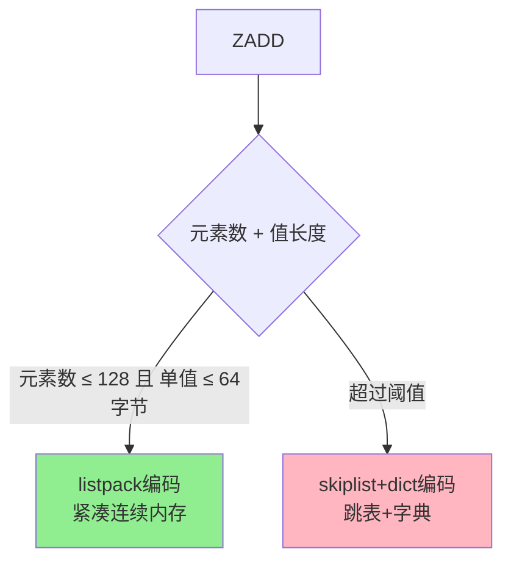
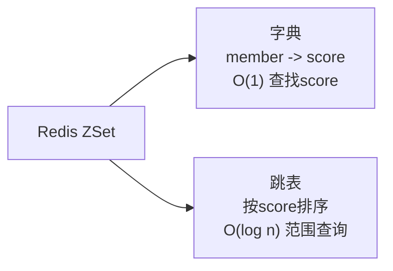

> Redis SortedSet（ZSet）类型：带分数的有序集合，分数相同时按字典序排序

## 目录

- [一、基本概念](#一基本概念)
- [二、常用命令](#二常用命令)
- [三、底层实现](#三底层实现)
- [四、应用场景](#四应用场景)
- [五、使用示例](#五使用示例)
- [六、相关资料](#六相关资料)

## 一、基本概念

| 特性 | 说明 |
|------|------|
| 结构 | member-score（成员-分数）有序集合 |
| 元素唯一 | 成员不重复 |
| 有序 | 按score升序，score相同时按字典序 |
| 元素数上限 | 2^32 - 1 |
| 编码方式 | listpack / skiplist+dict |
| 操作复杂度 | 插入/删除/查找 O(log n) |

## 二、常用命令

### 2.1 基本操作

```bash
# 添加元素
$ ZADD rank 100 alice 85 bob 92 charlie

# 带选项添加
$ ZADD rank NX 70 david        # 不存在才添加
$ ZADD rank XX 75 david        # 存在才更新
$ ZADD rank GT 90 alice        # 仅当新score大于当前值时更新
$ ZADD rank LT 80 alice        # 仅当新score小于当前值时更新
$ ZADD rank CH 90 alice        # 返回变更的元素数

# 获取元素分数
$ ZSCORE rank alice

# 获取元素排名（从0开始，升序）
$ ZRANK rank alice

# 降序排名
$ ZREVRANK rank alice

# 元素数量
$ ZCARD rank

# 分数自增
$ ZINCRBY rank 5 alice
```

### 2.2 范围查询

```bash
# 按排名范围（升序）
$ ZRANGE rank 0 -1              # 所有
$ ZRANGE rank 0 -1 WITHSCORES   # 带分数
$ ZRANGE rank 0 2               # 前3名

# 按排名范围（降序）
$ ZREVRANGE rank 0 2 WITHSCORES

# 按分数范围
$ ZRANGEBYSCORE rank 80 100
$ ZRANGEBYSCORE rank (80 100    # 不含80
$ ZRANGEBYSCORE rank -inf +inf
$ ZRANGEBYSCORE rank 80 100 LIMIT 0 10  # 分页

# 降序按分数
$ ZREVRANGEBYSCORE rank 100 80

# 按字典序范围
$ ZRANGEBYLEX rank '[a' '[z'
$ ZRANGEBYLEX rank '(alice' '[charlie'
```

### 2.3 统计与删除

```bash
# 分数范围内的元素数
$ ZCOUNT rank 80 100

# 移除元素
$ ZREM rank alice bob

# 移除排名范围内的元素
$ ZREMRANGEBYRANK rank 0 2

# 移除分数范围内的元素
$ ZREMRANGEBYSCORE rank 0 60
```

### 2.4 集合运算

```bash
# 交集
$ ZINTERSTORE dest 2 set1 set2
$ ZINTERSTORE dest 2 set1 set2 AGGREGATE SUM   # 默认：分数求和
$ ZINTERSTORE dest 2 set1 set2 AGGREGATE MIN
$ ZINTERSTORE dest 2 set1 set2 AGGREGATE MAX
$ ZINTERSTORE dest 2 set1 set2 WEIGHTS 2 3     # 权重

# 并集
$ ZUNIONSTORE dest 2 set1 set2

# 差集
$ ZDIFFSTORE dest 2 set1 set2
```

## 三、底层实现

### 3.1 编码选择



### 3.2 listpack 编码

少量元素时使用，紧凑存储：

```
| total bytes | num elements | member1 | score1 | member2 | score2 | ... | end |
```

按score有序排列，查找O(n)。

### 3.3 skiplist + dict 编码

元素多时使用，结合**跳表**和**字典**：



**为什么同时使用两种结构**：

| 结构 | 作用 | 操作 |
|------|------|------|
| 字典 | member→score映射 | O(1)查score |
| 跳表 | 按score排序 | O(log n)范围查询 |

两者共享同一份元素数据，不重复存储。

### 3.4 跳表详解

详见 [跳表.md](../algorithm/跳表.md)

## 四、应用场景

### 4.1 排行榜

```python
# 游戏积分榜
r.zadd('game:rank', mapping={
    'alice': 1000,
    'bob': 850,
    'charlie': 920
})

# 更新分数
r.zincrby('game:rank', 50, 'alice')

# 获取前10名（降序）
top10 = r.zrevrange('game:rank', 0, 9, withscores=True)

# 获取我的排名
my_rank = r.zrevrank('game:rank', 'alice')
my_score = r.zscore('game:rank', 'alice')
```

### 4.2 延迟队列

```python
import time

# 添加延迟任务（score为执行时间戳）
r.zadd('delay:queue', {
    'task:1001': time.time() + 60,    # 60秒后执行
    'task:1002': time.time() + 120,   # 120秒后执行
})

# 消费者轮询
while True:
    now = time.time()
    # 获取到期的任务
    tasks = r.zrangebyscore('delay:queue', 0, now, start=0, num=10)
    for task in tasks:
        # 移除并处理（Lua保证原子性）
        if r.zrem('delay:queue', task):
            process(task)
    time.sleep(0.1)
```

### 4.3 热搜榜

```python
# 搜索词热度
r.zincrby('hot:search', 1, 'redis')
r.zincrby('hot:search', 1, 'redis')
r.zincrby('hot:search', 2, 'mysql')

# 获取前10热搜
hot_keywords = r.zrevrange('hot:search', 0, 9, withscores=True)
```

### 4.4 时间线

```python
# 朋友圈动态时间线
r.zadd('timeline:user:1001', mapping={
    'post:1001': 1700000000,
    'post:1002': 1700000100,
    'post:1003': 1700000200
})

# 获取最新的10条
latest = r.zrevrange('timeline:user:1001', 0, 9)
```

## 五、使用示例

### 5.1 Python示例

```python
import redis

r = redis.Redis(host='localhost', port=6379, decode_responses=True)

# 添加元素
r.zadd('rank', {'alice': 100, 'bob': 85, 'charlie': 92})

# 获取分数
print(r.zscore('rank', 'alice'))  # 100.0

# 获取排名（升序，0开始）
print(r.zrank('rank', 'alice'))  # 2

# 降序排名
print(r.zrevrank('rank', 'alice'))  # 0

# 前三名（降序）
print(r.zrevrange('rank', 0, 2, withscores=True))
# [('alice', 100.0), ('charlie', 92.0), ('bob', 85.0)]

# 分数范围查询
print(r.zrangebyscore('rank', 85, 95))
# ['bob', 'charlie']

# 自增分数
r.zincrby('rank', 10, 'bob')
```

### 5.2 Go示例

```go
package main

import (
    "context"
    "fmt"
    "github.com/redis/go-redis/v9"
)

func main() {
    rdb := redis.NewClient(&redis.Options{Addr: "localhost:6379"})
    ctx := context.Background()

    // 添加
    members := []redis.Z{
        {Score: 100, Member: "alice"},
        {Score: 85, Member: "bob"},
        {Score: 92, Member: "charlie"},
    }
    rdb.ZAdd(ctx, "rank", members...)

    // 前三名
    vals, _ := rdb.ZRevRangeWithScores(ctx, "rank", 0, 2).Result()
    for _, v := range vals {
        fmt.Printf("%s: %v\n", v.Member, v.Score)
    }
}
```

## 六、相关资料

- [Redis SortedSet命令](https://redis.io/commands/?group=sorted_set)
- [跳表源码 t_zset.c](https://github.com/redis/redis/blob/unstable/src/t_zset.c)
