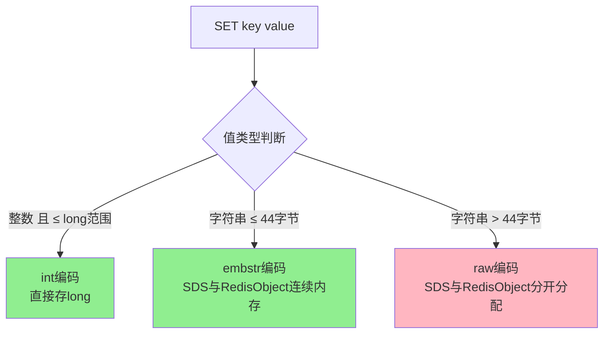
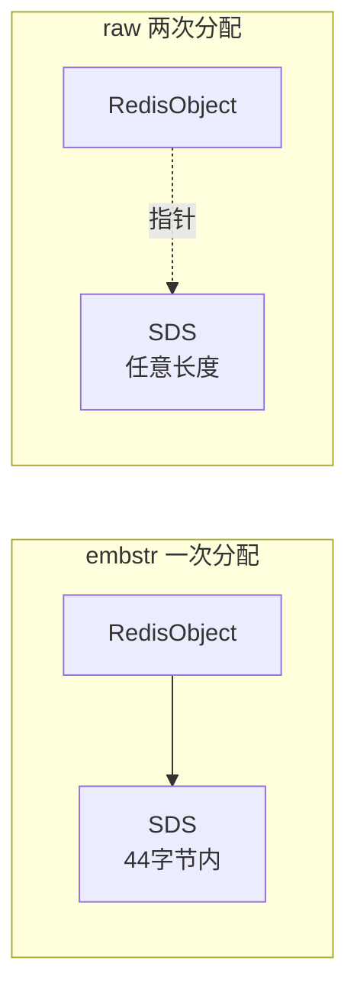

> Redis String 类型：二进制安全的字符串，可存储文本、数字、图片等任何数据

## 目录

- [一、基本概念](#一基本概念)
- [二、常用命令](#二常用命令)
- [三、底层实现](#三底层实现)
- [四、应用场景](#四应用场景)
- [五、使用示例](#五使用示例)
- [六、相关资料](#六相关资料)

## 一、基本概念

| 特性 | 说明 |
|------|------|
| 二进制安全 | 可存储任意二进制数据（图片、序列化对象） |
| 最大值 | 512MB |
| 编码方式 | int / embstr / raw |
| 线程安全 | 单线程操作，原子性 |

## 二、常用命令

### 2.1 基本操作

```bash
# 设置值
$ SET key value
$ SET key value EX 60       # 60秒过期
$ SET key value PX 60000    # 60秒过期（毫秒）
$ SET key value NX          # 不存在才设置
$ SET key value XX          # 存在才设置
$ SETNX key value           # 等同于 SET NX
$ SETEX key 60 value        # 等同于 SET EX

# 获取值
$ GET key

# 追加
$ APPEND key "world"

# 获取长度
$ STRLEN key

# 获取/设置范围
$ GETRANGE key 0 3
$ SETRANGE key 0 "Redis"
```

### 2.2 数值操作

```bash
# 自增1
$ INCR counter

# 自增指定值
$ INCRBY counter 10
$ INCRBYFLOAT price 3.14

# 自减1
$ DECR counter

# 自减指定值
$ DECRBY counter 5
```

### 2.3 批量操作

```bash
# 批量设置
$ MSET k1 v1 k2 v2 k3 v3

# 批量获取
$ MGET k1 k2 k3
```

## 三、底层实现

### 3.1 三种编码



### 3.2 编码对比

| 编码 | 场景 | 特点 |
|------|------|------|
| int | 纯整数 | 直接存long，无SDS |
| embstr | 短字符串 ≤ 44字节 | 一次内存分配，缓存友好 |
| raw | 长字符串 > 44字节 | 两次内存分配 |

### 3.3 embstr vs raw



**embstr 优势**：
- 一次内存分配
- 数据连续，缓存命中率高
- 适合短字符串

**embstr 劣势**：
- 只读：修改时需转为raw
- 长度受限

## 四、应用场景

### 4.1 缓存

```python
# 用户信息缓存
r.set('user:1001:profile', json.dumps(user_data), ex=3600)

# 读取
data = r.get('user:1001:profile')
if data:
    user = json.loads(data)
```

### 4.2 计数器

```python
# 文章浏览量
r.incr('article:123:views')

# 点赞数
r.incrby('article:123:likes', 1)

# 库存扣减
stock = r.decr('product:1001:stock')
if stock >= 0:
    # 下单成功
    pass
else:
    # 库存不足
    r.incr('product:1001:stock')  # 回滚
```

### 4.3 分布式锁

```bash
# 加锁（SET NX EX）
$ SET lock:order:1001 "owner_id" NX EX 30

# 释放锁（Lua保证原子性）
$ EVAL "if redis.call('get', KEYS[1]) == ARGV[1] then return redis.call('del', KEYS[1]) else return 0 end" 1 lock:order:1001 "owner_id"
```

### 4.4 全局ID生成

```python
# 生成全局ID
def generate_id():
    return r.incr('global:id')
```

## 五、使用示例

### 5.1 Python示例

```python
import redis

r = redis.Redis(host='localhost', port=6379, decode_responses=True)

# 基本操作
r.set('name', 'Alice')
print(r.get('name'))  # Alice

r.append('name', ' Bob')
print(r.get('name'))  # Alice Bob

# 数值操作
r.set('counter', 100)
r.incr('counter')
r.incrby('counter', 10)
r.decr('counter')
print(r.get('counter'))  # 110

# 批量操作
r.mset({'k1': 'v1', 'k2': 'v2', 'k3': 'v3'})
print(r.mget('k1', 'k2', 'k3'))  # ['v1', 'v2', 'v3']

# 过期时间
r.set('session:abc', 'user_data', ex=60)
```

### 5.2 Go示例

```go
package main

import (
    "context"
    "fmt"
    "github.com/redis/go-redis/v9"
)

func main() {
    rdb := redis.NewClient(&redis.Options{
        Addr: "localhost:6379",
    })
    ctx := context.Background()

    // 基本操作
    rdb.Set(ctx, "name", "Alice", 0)
    val, _ := rdb.Get(ctx, "name").Result()
    fmt.Println(val) // Alice

    // 数值操作
    rdb.Incr(ctx, "counter")
    rdb.IncrBy(ctx, "counter", 10)
    n, _ := rdb.Get(ctx, "counter").Int64()
    fmt.Println(n) // 11

    // 设置过期
    rdb.Set(ctx, "temp", "data", 60*time.Second)
}
```

## 六、相关资料

- [Redis String命令](https://redis.io/commands/?group=string)
- [Redis字符串实现](https://redis.io/docs/reference/internals/sds/)
