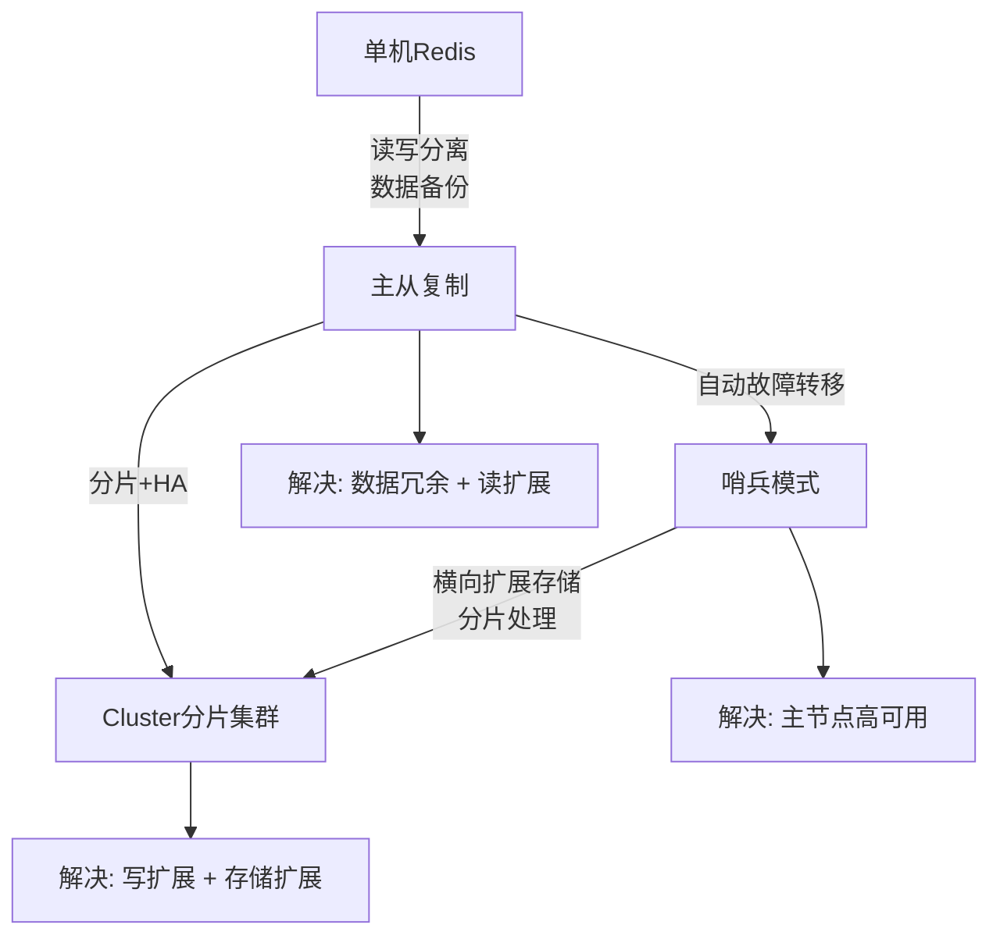
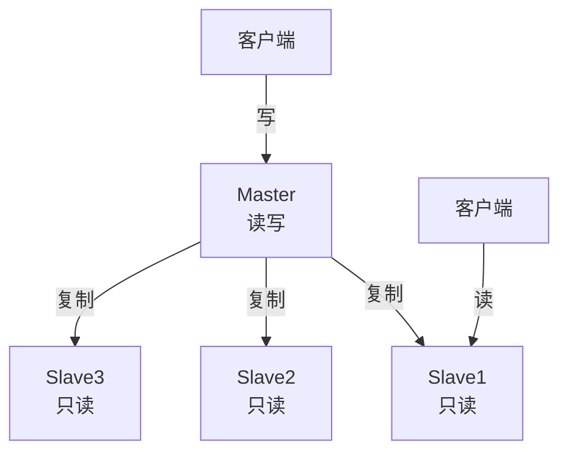
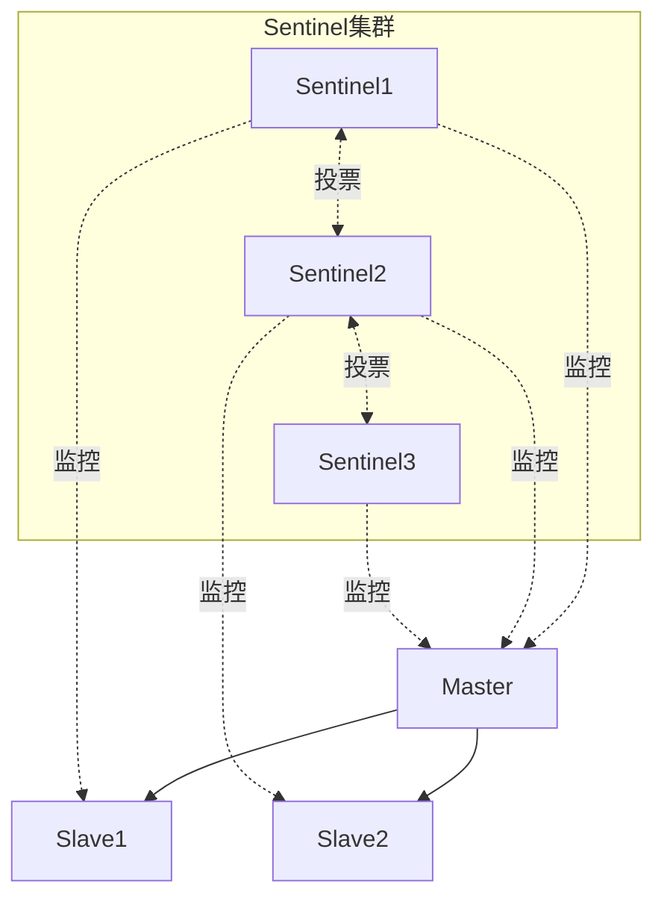
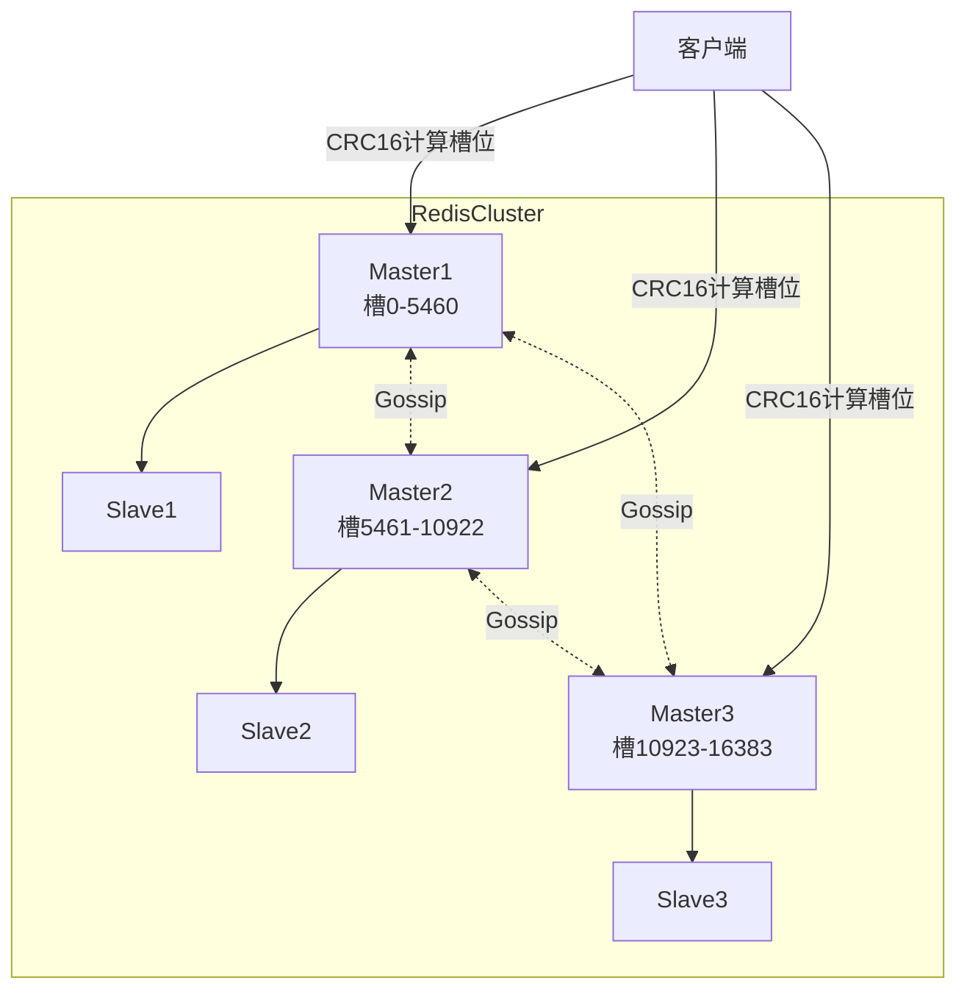
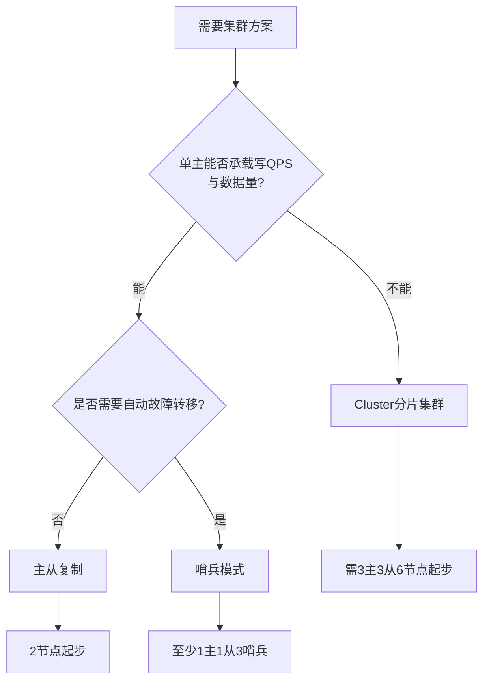

> Redis 集群与高可用：从主从复制到分片集群，三种方案递进式解决可用性、扩展性问题

## 目录

- [一、集群方案概览](#一集群方案概览)
- [二、三种方案对比](#二三种方案对比)
- [三、主从复制模式](#三主从复制模式)
- [四、哨兵模式（Sentinel）](#四哨兵模式sentinel)
- [五、Cluster 分片集群](#五cluster-分片集群)
- [六、选型指南](#六选型指南)
- [七、相关资料](#七相关资料)

## 一、集群方案概览

Redis 提供三种递进式的集群方案，分别解决不同维度的问题：

| 方案 | 解决问题 | 复杂度 | 适用规模 |
|------|---------|--------|---------|
| 主从复制 | 数据备份、读写分离 | 低 | 小型（单主可承载） |
| 哨兵模式 | 自动故障转移 | 中 | 中型（单主可承载） |
| Cluster 分片 | 数据分片、写扩展 | 高 | 大型（单主无法承载） |

## 二、三种方案对比

| 维度 | 主从复制 | 哨兵模式 | Cluster |
|------|---------|---------|---------|
| 数据分片 | 否 | 否 | 是（16384 槽） |
| 自动故障转移 | 否（需人工） | 是 | 是 |
| 主节点数量 | 1 | 1 | 多个（每主负责部分槽） |
| 写扩展 | 否 | 否 | 是 |
| 读扩展 | 是 | 是 | 是 |
| 客户端复杂度 | 低 | 中（需 Sentinel API） | 高（需支持 MOVED/ASK） |
| 跨槽事务 | 支持 | 支持 | 不支持 |
| 发布订阅 | 支持 | 支持 | 受限（广播开销大） |
| 最少节点数 | 2 | 3（1主1从1哨兵） | 6（3主3从） |
| 推荐版本 | 2.6+ | 2.8+ | 3.0+ |

## 三、主从复制模式

### 3.1 架构

### 3.2 核心特性

- **一主多从**：一个主节点可挂载多个从节点
- **读写分离**：主节点负责写，从节点负责读
- **异步复制**：主节点写入后立即返回，不等待从节点确认
- **数据最终一致**：从节点数据存在延迟

### 3.3 优缺点

| 优点 | 缺点 |
|------|------|
| 配置简单 | 主节点宕机需人工介入 |
| 读写分离提升读 QPS | 不支持写扩展 |
| 数据冗余备份 | 主从同步存在延迟 |
| 主从非阻塞式 | 从节点过多增加主节点 IO 压力 |

详见：[主从复制详解](高可用-主从复制详解.md) | [主从模式搭建](Redis集群模式之主从模式.md) | [脑裂问题](Redis主从脑裂问题和解决方案.md)

## 四、哨兵模式（Sentinel）

### 4.1 架构

### 4.2 核心特性

- **自动故障检测**：哨兵每秒 PING 主从节点
- **主观下线 + 客观下线**：单个哨兵判定 + 多数哨兵确认
- **Leader 选举**：基于 Raft 算法选出执行故障转移的哨兵
- **自动故障转移**：从从节点中选出新主，并通知客户端

### 4.3 优缺点

| 优点 | 缺点 |
|------|------|
| 自动故障转移，无需人工 | 主节点仍单点（写无法扩展） |
| 哨兵自身集群高可用 | 配置较复杂 |
| 客户端动态感知主节点切换 | 故障转移期间有短暂不可用 |
| 仍保留主从读写分离 | 不支持数据分片 |

详见：[哨兵模式原理详解](哨兵模式.md) | [哨兵模式搭建](Redis集群模式之哨兵模式.md)

## 五、Cluster 分片集群

### 5.1 架构

### 5.2 核心特性

- **去中心化**：无中心节点，所有主节点平等
- **数据分片**：16384 个哈希槽分布到各主节点
- **高可用**：每个主节点配一个从节点，主节点宕机自动切换
- **横向扩展**：可动态添加节点并迁移槽位
- **Gossip 协议**：节点间通过 Gossip 交换集群状态

### 5.3 优缺点

| 优点 | 缺点 |
|------|------|
| 真正的写扩展与存储扩展 | 不支持跨槽事务（除非 hash tag） |
| 自动故障转移 | 客户端需支持 MOVED/ASK 重定向 |
| 横向扩展能力强 | 发布订阅性能差（广播） |
| 去中心化，无单点 | 运维复杂度高 |
| 多主多从，高可用 | 节点数至少 6 个（3主3从） |

详见：[分片技术原理](分片技术.md) | [Cluster 内部原理](分片RedisCluster原理.md) | [Cluster 模式搭建](Redis集群模式之分片Cluster模式.md) | [Linux 搭建](分片RedisCluster搭建.md) | [Docker 搭建](Redis集群模式Docker搭建.md)

## 六、选型指南

### 6.1 决策流程

### 6.2 场景对照

| 场景 | 推荐方案 | 原因 |
|------|---------|------|
| 个人项目/开发测试 | 单机 | 简单够用 |
| 中小应用，读多写少 | 主从 | 读写分离，配置简单 |
| 业务可用性要求高 | 哨兵 | 自动故障转移 |
| 大规模数据/高并发写入 | Cluster | 分片扩展 |
| 多机房高可用 | 哨兵 + 主从跨机房 | 灾备 |
| 极端高可用 + 扩展 | Cluster + 跨机房部署 | 双重保障 |

### 6.3 容量规划参考

| QPS | 数据量 | 推荐方案 |
|-----|--------|---------|
| < 10万 | < 10GB | 单机或主从 |
| 10万-50万 | 10GB-100GB | 哨兵模式 |
| > 50万 | > 100GB | Cluster 分片 |

## 七、相关资料

- [Redis 官方文档 - 复制](https://redis.io/docs/management/replication/)
- [Redis 官方文档 - Sentinel](https://redis.io/docs/management/sentinel/)
- [Redis 官方文档 - Cluster](https://redis.io/docs/management/scaling/)
- [小林 coding - Redis 主从、哨兵、分片集群](https://xiaolincoding.com/redis/cluster/master_slave_replication.html)
- [Java 全栈知识体系 - Redis 集群](https://pdai.tech/md/db/nosql-redis/db-redis-x-cluster.html)
