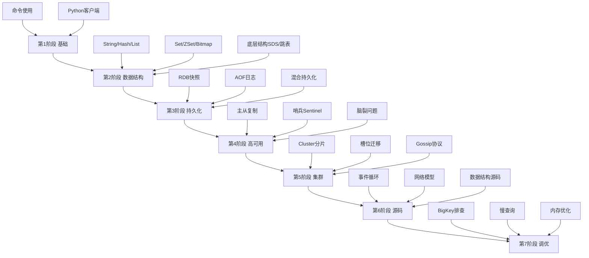

> Redis 学习计划与路线图

## 目录

- [一、学习目标](#一学习目标)
- [二、学习路线](#二学习路线)
- [三、阶段任务](#三阶段任务)
- [四、实战项目](#四实战项目)
- [五、面试要点](#五面试要点)

## 一、学习目标

| 阶段 | 目标 | 周期 |
|------|------|------|
| 入门 | 掌握基本命令与数据类型 | 1周 |
| 进阶 | 理解持久化、主从、哨兵 | 2周 |
| 高级 | Cluster集群、源码剖析 | 3周 |
| 实战 | 性能调优、问题排查 | 持续 |

## 二、学习路线

## 三、阶段任务

### 3.1 第一阶段：基础命令（1周）

- [ ] 安装Redis（Docker、源码）
- [ ] 掌握String、Hash、List、Set、ZSet命令
- [ ] 理解Key过期策略、TTL机制
- [ ] 使用Python/Go客户端连接

### 3.2 第二阶段：数据结构原理（2周）

- [ ] SDS简单动态字符串
- [ ] 字典与渐进式rehash
- [ ] 跳表SkipList
- [ ] 压缩列表ziplist与listpack
- [ ] quicklist快速列表
- [ ] intset整数集合

### 3.3 第三阶段：持久化机制（1周）

- [ ] RDB快照原理与bgsave流程
- [ ] AOF日志与重写机制
- [ ] 混合持久化配置
- [ ] fork子进程与COW机制

### 3.4 第四阶段：高可用（2周）

- [ ] 主从复制流程（全量+增量）
- [ ] 哨兵Sentinel选主机制
- [ ] 故障转移流程
- [ ] 脑裂问题与min-slaves配置

### 3.5 第五阶段：集群（2周）

- [ ] Cluster架构与槽位
- [ ] Gossip协议与节点通信
- [ ] 槽位迁移与扩缩容
- [ ] 跨槽位操作（hash tag）

### 3.6 第六阶段：源码剖析（4周）

- [ ] 事件循环（aeEventLoop）
- [ ] 网络IO模型
- [ ] Redis 6.0多线程IO
- [ ] 关键数据结构源码

### 3.7 第七阶段：性能调优（持续）

- [ ] BigKey排查与优化
- [ ] 慢查询分析
- [ ] 内存优化配置
- [ ] Pipeline与批量操作

## 四、实战项目

| 项目 | 技术点 | 难度 |
|------|--------|------|
| 缓存系统 | String + 过期 + 模式 | ★ |
| 分布式锁 | SETNX + Lua | ★★ |
| 秒杀系统 | 原子操作 + 库存扣减 | ★★★ |
| 排行榜 | ZSet | ★★ |
| 签到系统 | Bitmap | ★★ |
| 消息队列 | Stream/List | ★★★ |
| 限流器 | 滑动窗口 + Lua | ★★★ |
| 附近的人 | Geo | ★★ |

## 五、面试要点

### 5.1 高频考点

| 主题 | 关键点 |
|------|--------|
| 数据结构 | ZSet底层（跳表+字典）、Hash底层 |
| 持久化 | RDB vs AOF、AOF重写 |
| 过期策略 | 惰性删除 + 定期删除 |
| 内存淘汰 | 8种策略 |
| 缓存问题 | 穿透/击穿/雪崩 |
| 分布式锁 | SETNX、Redlock |
| 主从复制 | 全量+增量、offset |
| 哨兵 | 选主、故障转移 |
| Cluster | 槽位、Gossip、CAP |
| 性能优化 | BigKey、Pipeline、慢查询 |

### 5.2 场景题

1. **Redis为什么快？**
   - 内存操作
   - 单线程避免锁竞争
   - IO多路复用
   - 高效数据结构

2. **缓存与数据库一致性？**
   - Cache Aside Pattern
   - 延迟双删
   - 订阅binlog

3. **热点Key如何处理？**
   - 本地缓存
   - 多副本读
   - 限流/熔断
