> Redis Sentinel 哨兵机制：监控 + 通知 + 自动故障转移，基于 Raft 算法实现 Leader 选举

## 目录

- [一、哨兵核心功能](#一哨兵核心功能)
- [二、哨兵集群的建立](#二哨兵集群的建立)
- [三、监控与下线判定](#三监控与下线判定)
- [四、Leader 哨兵选举](#四leader-哨兵选举)
- [五、新主节点选举](#五新主节点选举)
- [六、故障转移流程](#六故障转移流程)
- [七、客户端通知机制](#七客户端通知机制)
- [八、配置与运维](#八配置与运维)
- [九、相关资料](#九相关资料)

## 一、哨兵核心功能

Sentinel 是 Redis 官方的高可用解决方案，提供四大核心功能：

| 功能 | 说明 |
|------|------|
| **监控** | 持续检查主节点和从节点是否正常工作 |
| **通知** | 通过 API 通知运维人员或其他程序集群异常 |
| **自动故障转移** | 主节点宕机时自动选举新主，并让从节点跟随新主 |
| **配置提供者** | 客户端连接 Sentinel 查询主节点地址，实现服务发现 |

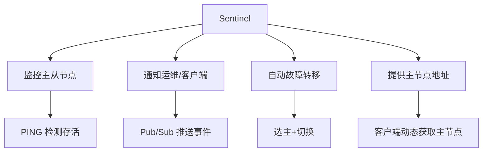

## 二、哨兵集群的建立

### 2.1 基于 Pub/Sub 的相互发现

哨兵之间通过 Redis 的 Pub/Sub 机制实现相互发现：

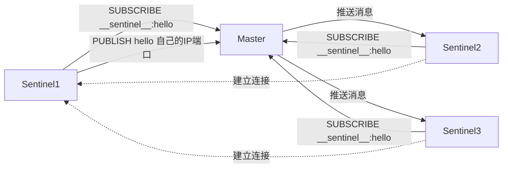

### 2.2 与从节点的连接建立

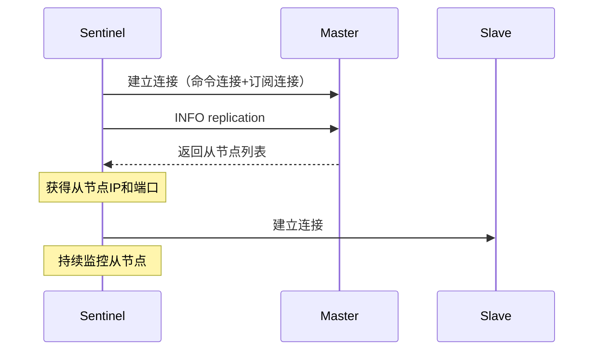

### 2.3 哨兵与节点的连接

| 连接对象 | 命令连接 | 订阅连接 |
|---------|---------|---------|
| 主节点 | ✓ | ✓（订阅 `__sentinel__:hello`） |
| 从节点 | ✓ | ✓（订阅 `__sentinel__:hello`） |
| 其他哨兵 | ✓ | ✗ |

## 三、监控与下线判定

### 3.1 主观下线（Subjective Down, SDOWN）

单个哨兵认为节点不可达。

```bash
# sentinel.conf
sentinel down-after-milliseconds mymaster 30000
# 30秒内未响应 PING 则判定主观下线
```

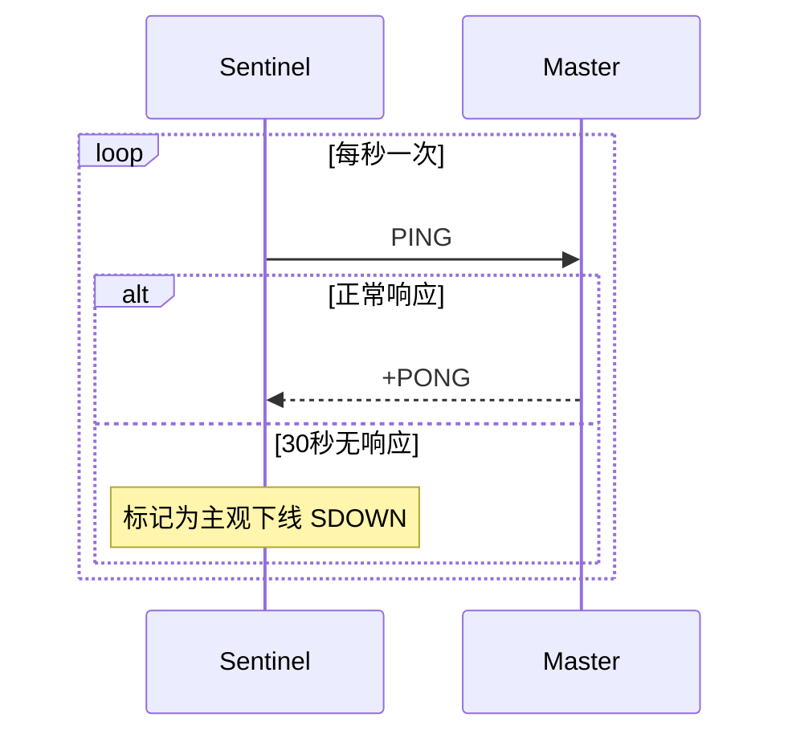

**PING 响应判定**：
- 返回 `+PONG`、`-LOADING`、`-MASTERDOWN` 之外的内容 → 无效响应
- 30 秒（配置值）内未返回 → 主观下线

### 3.2 客观下线（Objective Down, ODOWN）

足够多数量的哨兵认为主节点不可达，触发故障转移。

```bash
# sentinel.conf
sentinel monitor mymaster 192.168.1.10 6379 2
# 最后的 2 是 quorum，表示需要 2 个哨兵同意才能客观下线
```

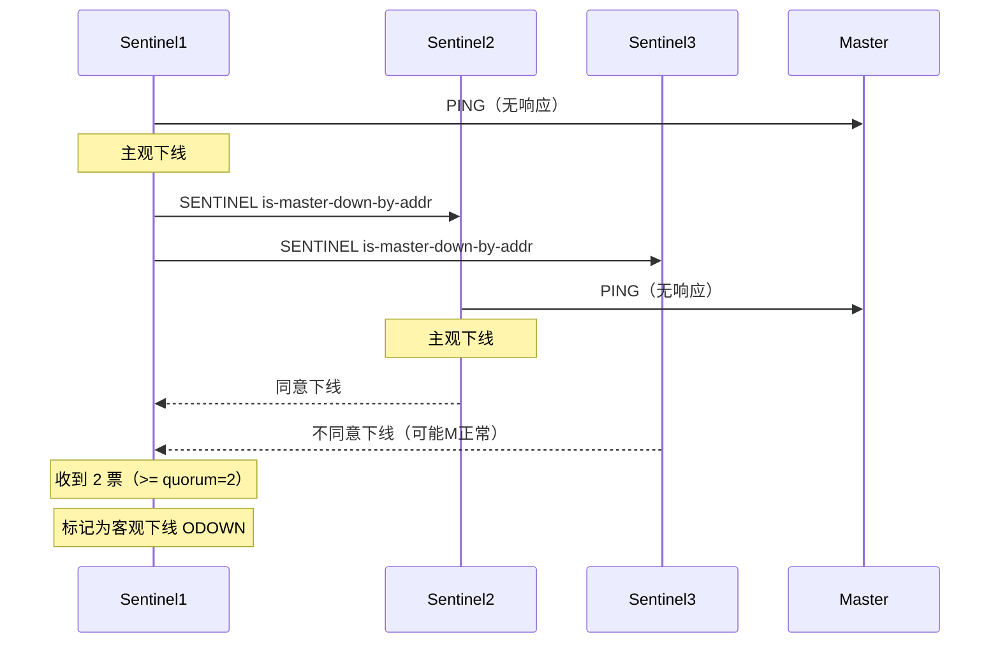

**关键参数**：
- `quorum`：客观下线所需的最少哨兵票数
- 仅适用于主节点，从节点只需主观下线即可

### 3.3 quorum 与哨兵数量的关系

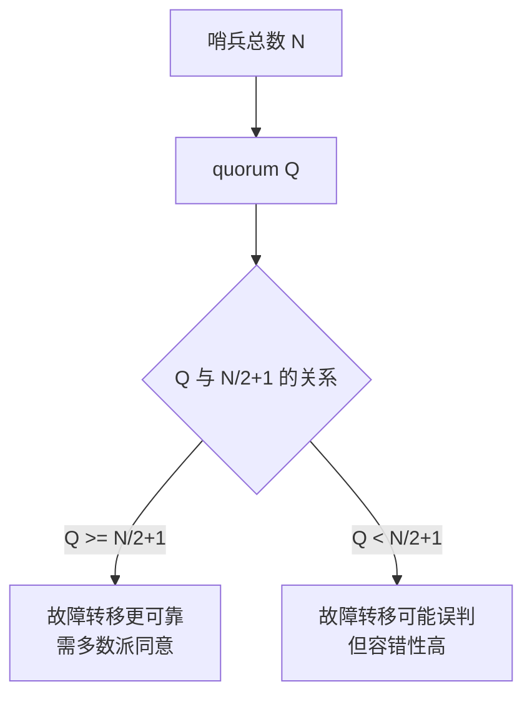

**典型场景分析**：

> **1主4从，5个哨兵，3个哨兵故障，主库宕机，能否完成故障转移？**

```
5 个哨兵中 3 个故障 → 仅剩 2 个哨兵可用
需要 quorum=3 票才能客观下线 → 只能获得 2 票
因此：能标记主库下线，但无法完成 Leader 选举（需 N/2+1=3 票）
```

| 哨兵数 | quorum 推荐 | 容忍故障数 |
|--------|------------|-----------|
| 1 | 1 | 0 |
| 3 | 2 | 1 |
| 5 | 3 | 2 |

## 四、Leader 哨兵选举

客观下线后，哨兵需要选出一个 Leader 来执行故障转移，基于 **Raft 算法**。

### 4.1 选举流程

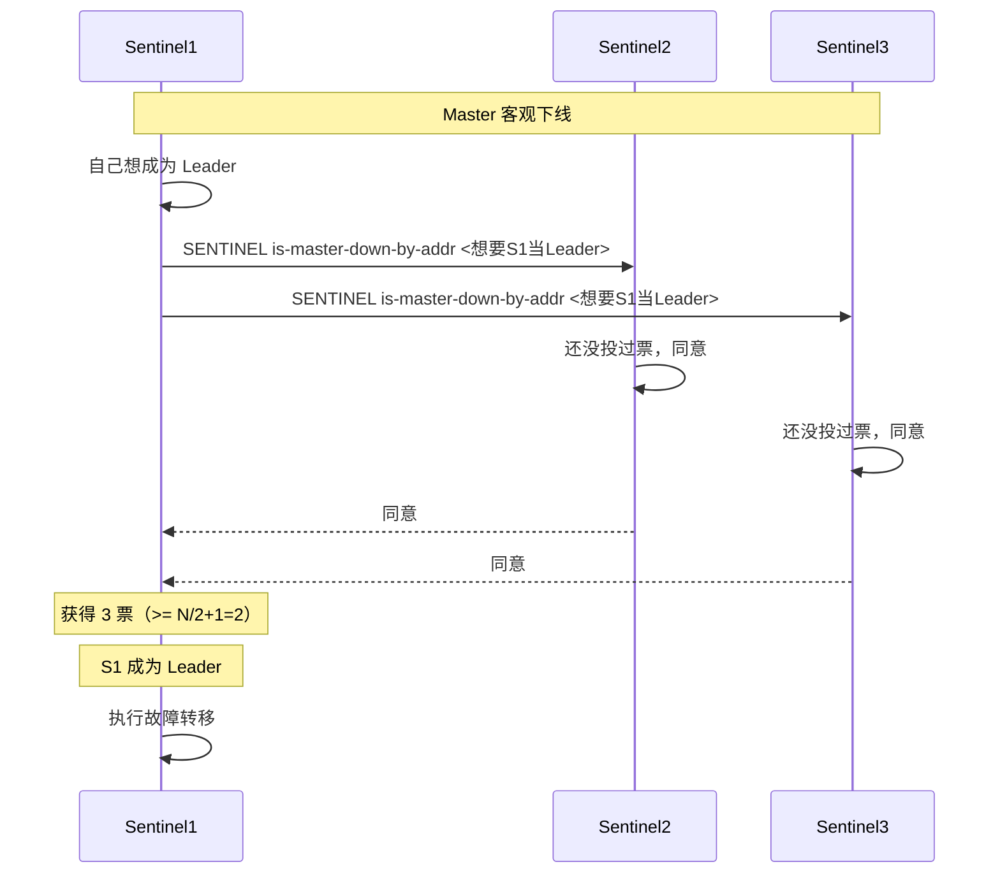

### 4.2 Raft 选举要点

| 要点 | 说明 |
|------|------|
| 任期（term） | 每次选举 term+1，防止过期选举 |
| 投票原则 | 每个哨兵在一个 term 中只能投一票（先到先得） |
| 当选条件 | 获得超过半数（N/2+1）选票 |
| 选举超时 | 未获得多数票则等待随机时间后重新发起 |

### 4.3 选举失败的处理

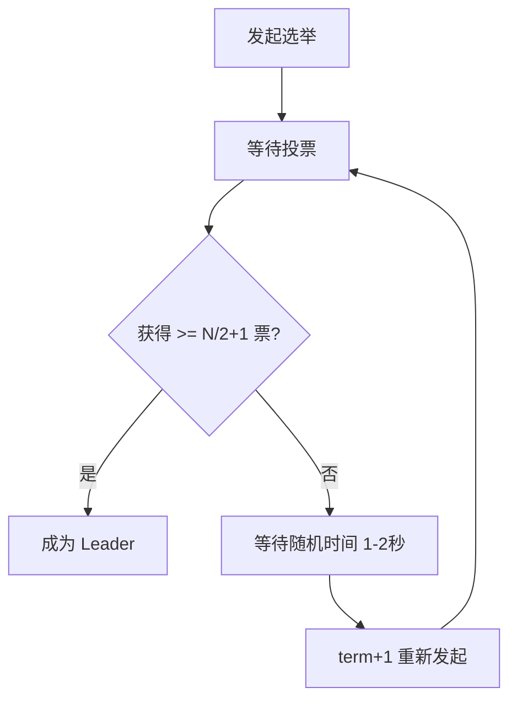

## 五、新主节点选举

Leader 哨兵负责从从节点中选出新主节点：

### 5.1 筛选流程

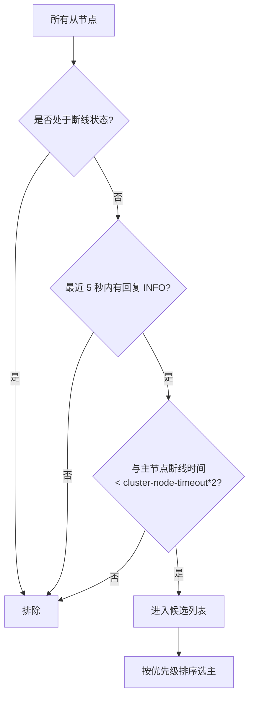

### 5.2 选举规则（按顺序）

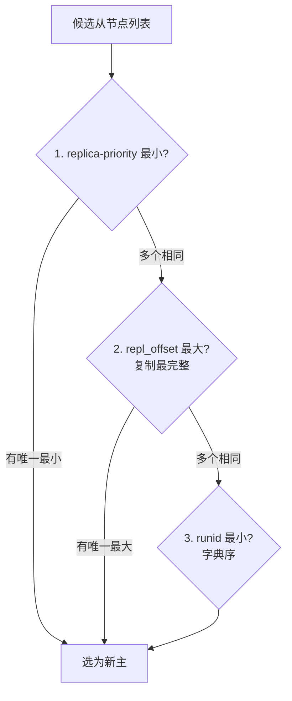

| 优先级 | 判定依据 | 配置/字段 |
|--------|---------|----------|
| 1 | `replica-priority` 值最小 | `redis.conf` 中配置，默认 100 |
| 2 | 复制偏移量 `repl_offset` 最大 | 数据最完整 |
| 3 | `runid` 字典序最小 | 兜底策略 |

```bash
# 从节点配置优先级（值越小优先级越高，0 表示永不升主）
replica-priority 100

# 设置为 0 的场景：
# - 跨机房的从节点，避免被提升为主
# - 性能较差的从节点
```

## 六、故障转移流程

### 6.1 完整流程

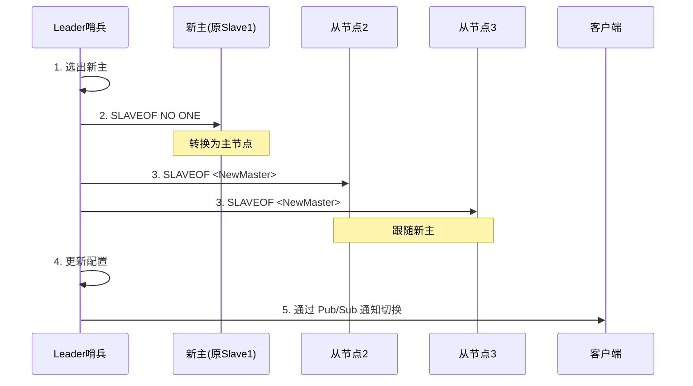

### 6.2 关键步骤详解

**步骤1：选出新主**
- Leader 哨兵执行选举规则

**步骤2：提升新主**
- 向新主发送 `SLAVEOF NO ONE`
- 新主停止复制，成为独立主节点

**步骤3：修改其他从节点**
- 向其他从节点发送 `SLAVEOF <新主IP> <新主端口>`
- 从节点开始复制新主的数据

**步骤4：配置更新**
- Leader 哨兵更新内部的配置
- 将旧主标记为下线状态
- 旧主恢复后会自动被配置为新主的从节点

**步骤5：通知客户端**
- 通过 `+switch-master` 频道广播新主地址
- 客户端订阅该频道以动态感知切换

### 6.3 故障转移完成条件


## 七、客户端通知机制

### 7.1 Pub/Sub 事件订阅

```bash
# 订阅所有事件
redis-cli -p 26379 PSUBSCRIBE *

# 订阅特定事件
redis-cli -p 26379 SUBSCRIBE +switch-master
```

### 7.2 关键事件类型

| 事件 | 说明 |
|------|------|
| `+sdown` | 主观下线 |
| `+odown` | 客观下线 |
| `+failover-state-select-slave` | 开始选择新主 |
| `+selected-slave` | 选出新主 |
| `+failover-state-send-slaveof-noone` | 提升新主 |
| `+switch-master` | 主节点切换完成 |
| `+convert-to-slave` | 旧主降级为从节点 |
| `-failover-abort` | 故障转移中止 |

### 7.3 客户端实现思路

```python
import redis

class SentinelAwareClient:
    def __init__(self, sentinels, master_name):
        self.sentinels = sentinels
        self.master_name = master_name
        self.master = None
        self._subscribe_events()

    def _subscribe_events(self):
        """订阅哨兵事件，主节点切换时自动更新连接"""
        for sentinel in self.sentinels:
            pubsub = redis.Redis(host=sentinel[0], port=sentinel[1]).pubsub()
            pubsub.subscribe("+switch-master")
            threading.Thread(target=self._listen, args=(pubsub,), daemon=True).start()

    def _listen(self, pubsub):
        for msg in pubsub.listen():
            if msg['type'] == 'message':
                self._refresh_master()

    def _refresh_master(self):
        """从哨兵查询当前主节点地址"""
        for sentinel in self.sentinels:
            try:
                master = redis.Redis(host=sentinel[0], port=sentinel[1]) \
                    .sentinel_master(self.master_name)
                self.master = redis.Redis(host=master['ip'], port=master['port'])
                return
            except Exception:
                continue
```

## 八、配置与运维

### 8.1 sentinel.conf 完整配置

```bash
# 监控的主节点
sentinel monitor mymaster 192.168.1.10 6379 2

# 主节点密码
sentinel auth-pass mymaster yourpassword

# 主观下线判定时间（毫秒）
sentinel down-after-milliseconds mymaster 30000

# 故障转移时同时同步的从节点数
sentinel parallel-syncs mymaster 1

# 故障转移超时时间（毫秒）
sentinel failover-timeout mymaster 180000

# 通知脚本（可选）
sentinel notification-script mymaster /var/redis/notify.sh

# 客户端重配置脚本（可选）
sentinel client-reconfig-script mymaster /var/redis/reconfig.sh
```

### 8.2 关键参数说明

| 参数 | 默认值 | 说明 |
|------|--------|------|
| `down-after-milliseconds` | 30000 | 多久无响应判定主观下线 |
| `parallel-syncs` | 1 | 故障转移时同时同步的从节点数 |
| `failover-timeout` | 180000 | 故障转移超时 |
| `quorum` | - | 客观下线所需哨兵数 |

### 8.3 常用运维命令

```bash
# 查看哨兵状态
redis-cli -p 26379 INFO sentinel

# 查看主节点信息
redis-cli -p 26379 SENTINEL master mymaster

# 查看从节点列表
redis-cli -p 26379 SENTINEL replicas mymaster

# 查看其他哨兵
redis-cli -p 26379 SENTINEL sentinels mymaster

# 手动故障转移
redis-cli -p 26379 SENTINEL failover mymaster

# 重置哨兵状态
redis-cli -p 26379 SENTINEL reset mymaster
```

### 8.4 部署建议

| 部署项 | 建议 |
|--------|------|
| 哨兵数量 | 至少 3 个（奇数，避免脑裂） |
| 哨兵分布 | 与 Redis 节点跨机器部署 |
| quorum | N/2+1（多数派） |
| down-after-milliseconds | 30 秒以上（避免误判） |
| parallel-syncs | 1（避免新主被压垮） |
| 监控 | 监控 `+odown` 和 `+switch-master` 事件 |

## 九、相关资料

- [Redis 官方文档 - Sentinel](https://redis.io/docs/management/sentinel/)
- [Redis 源码 - sentinel.c](https://github.com/redis/redis/blob/unstable/src/sentinel.c)
- 《Redis 设计与实现》黄健宏 - 第 16 章
- [小林 coding - 哨兵集群](https://xiaolincoding.com/redis/cluster/sentinel.html)
- [Raft 论文中文版](https://github.com/maemual/raft-zh_cn)
