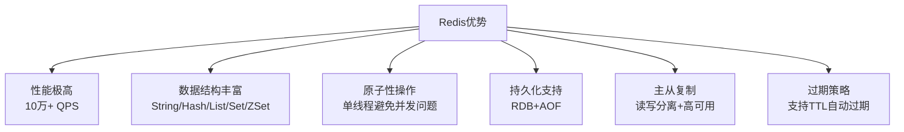

> Redis（Remote Dictionary Server）：基于C语言开发的高性能内存键值数据库

## 目录

- [一、Redis简介](#一redis简介)
- [二、安装与启动](#二安装与启动)
- [三、基本数据类型](#三基本数据类型)
- [四、通用命令](#四通用命令)
- [五、Key设计规范](#五key设计规范)
- [六、Python客户端](#六python客户端)
- [七、相关资料](#七相关资料)

## 一、Redis简介

### 1.1 什么是Redis

| 特性 | 说明 |
|------|------|
| 类型 | 内存键值（Key-Value）数据库 |
| 语言 | C语言 |
| 作者 | Salvatore Sanfilippo（antirez） |
| 特点 | 高性能、单线程、丰富的数据结构 |
| 端口 | 默认 6379 |

### 1.2 Redis的优势



### 1.3 应用场景

| 场景 | 数据类型 | 示例 |
|------|----------|------|
| 缓存 | String | 商品详情、用户信息 |
| 计数器 | String | 点赞数、浏览量 |
| 会话存储 | String | 分布式Session |
| 消息队列 | List | 异步任务队列 |
| 排行榜 | SortedSet | 游戏积分榜 |
| 社交关系 | Set | 共同好友、关注列表 |
| 地理位置定位 | Geo | 附近的人、商铺 |
| 布隆过滤器 | Bitmap | 垃圾邮件过滤 |

## 二、安装与启动

### 2.1 Docker方式（推荐）

```bash
# 拉取镜像
$ docker pull redis:7.2

# 启动容器
$ docker run -d \
    --name redis \
    -p 6379:6379 \
    -v /data/redis:/data \
    redis:7.2 redis-server --appendonly yes

# 进入容器
$ docker exec -it redis redis-cli
```

### 2.2 源码编译

```bash
# 下载源码
$ wget https://download.redis.io/releases/redis-7.2.4.tar.gz
$ tar xzf redis-7.2.4.tar.gz
$ cd redis-7.2.4

# 编译
$ make

# 启动服务
$ src/redis-server

# 启动客户端
$ src/redis-cli
```

### 2.3 macOS安装

```bash
$ brew install redis
$ brew services start redis
```

## 三、基本数据类型

| 类型 | 说明 | 典型场景 |
|------|------|----------|
| **String** | 字符串/数字 | 缓存、计数器 |
| **Hash** | 哈希表 | 对象存储 |
| **List** | 双向链表 | 消息队列 |
| **Set** | 无序集合 | 标签、社交关系 |
| **SortedSet** | 有序集合 | 排行榜 |
| **Bitmap** | 位图 | 签到、布隆过滤器 |
| **HyperLogLog** | 基数估算 | UV统计 |
| **Geo** | 地理坐标 | 附近的人 |
| **Stream** | 流 | 消息队列 |

## 四、通用命令

### 4.1 Key操作

```bash
# 查找Key（生产慎用 *)
$ KEYS pattern
$ SCAN 0 MATCH user:* COUNT 100

# 判断Key是否存在
$ EXISTS key

# 查看Key类型
$ TYPE key

# 删除Key
$ DEL key1 key2

# 设置过期时间（秒）
$ EXPIRE key 60
$ PEXPIRE key 60000  # 毫秒

# 查看剩余时间
$ TTL key
$ PTTL key

# 取消过期时间
$ PERSIST key

# 重命名Key
$ RENAME oldkey newkey
```

### 4.2 数据库操作

```bash
# 切换数据库（0-15）
$ SELECT 0

# 清空当前数据库
$ FLUSHDB

# 清空所有数据库
$ FLUSHALL

# 查看Key数量
$ DBSIZE

# 查看服务器信息
$ INFO
```

## 五、Key设计规范

### 5.1 命名规范

| 规则 | 示例 |
|------|------|
| 冒号分隔层级 | `user:1001:profile` |
| 业务前缀 | `order:2024:12345` |
| 避免过长 | 不超过44字节可嵌入SDS |
| 避免特殊字符 | 不使用空格、换行、中文 |

### 5.2 BigKey避免

```bash
# 查看bigkey
$ redis-cli --bigkeys

# 查看内存占用
$ MEMORY USAGE key
```

| 类型 | BigKey阈值 | 风险 |
|------|-----------|------|
| String | > 10KB | 网络阻塞 |
| Hash | > 500字段 | 阻塞主线程 |
| List | > 5000元素 | 删除耗时 |
| Set | > 5000元素 | 内存膨胀 |
| ZSet | > 5000元素 | 范围查询慢 |

## 六、Python客户端

### 6.1 安装redis-py

```bash
$ pip install redis
```

### 6.2 基本使用

```python
import redis

# 创建连接
r = redis.Redis(host='localhost', port=6379, db=0, decode_responses=True)

# String操作
r.set('name', 'Alice', ex=60)  # 60秒过期
print(r.get('name'))  # Alice

r.incr('counter')  # 自增
r.incrby('counter', 10)  # 自增指定值

# Hash操作
r.hset('user:1001', 'name', 'Alice')
r.hset('user:1001', 'age', 30)
print(r.hgetall('user:1001'))  # {'name': 'Alice', 'age': '30'}

# List操作
r.lpush('queue', 'task1', 'task2')
print(r.rpop('queue'))  # task1

# Set操作
r.sadd('tags:1001', 'python', 'redis', 'go')
print(r.smembers('tags:1001'))

# SortedSet操作
r.zadd('rank', {'alice': 100, 'bob': 85})
print(r.zrevrange('rank', 0, -1, withscores=True))
```

### 6.3 连接池

```python
import redis

pool = redis.ConnectionPool(
    host='localhost',
    port=6379,
    max_connections=20,
    decode_responses=True
)
r = redis.Redis(connection_pool=pool)
```

## 七、相关资料

- [Redis官网](https://redis.io/)
- [Redis命令大全](https://redis.io/commands/)
- [Redis源码](https://github.com/redis/redis)
- [redis-py文档](https://redis-py.readthedocs.io/)
