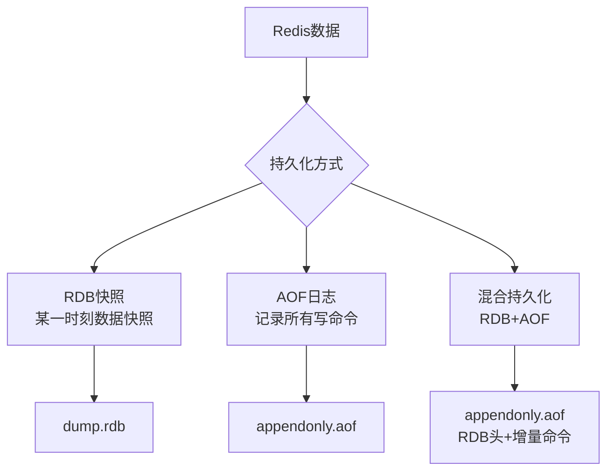
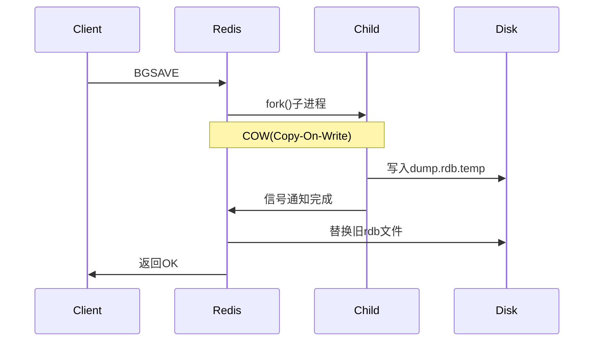
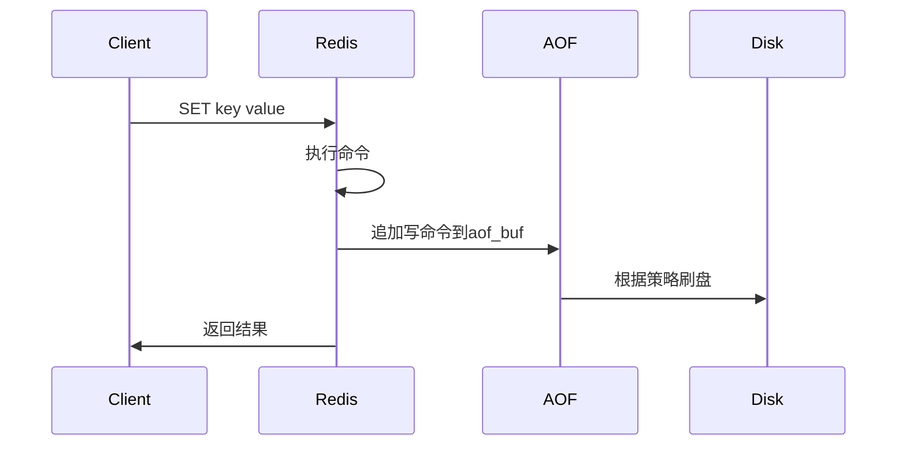
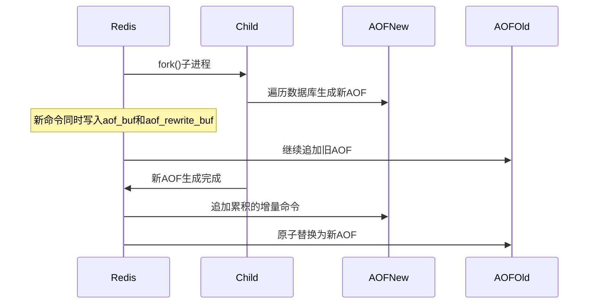
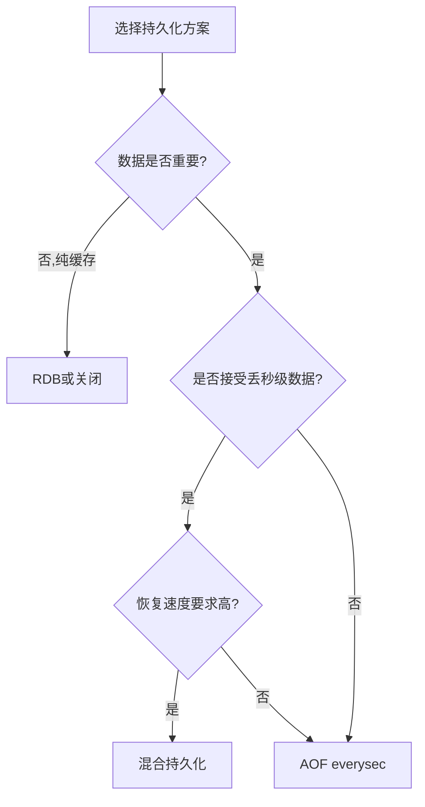

> Redis 持久化：RDB快照 + AOF日志，保障数据不丢失

## 目录

- [一、持久化概述](#一持久化概述)
- [二、RDB快照](#二rdb快照)
- [三、AOF日志](#三aof日志)
- [四、混合持久化](#四混合持久化)
- [五、持久化对比](#五持久化对比)
- [六、配置与实战](#六配置与实战)
- [七、相关资料](#七相关资料)

## 一、持久化概述



| 方式 | 原理 | 数据安全性 | 性能影响 | 恢复速度 |
|------|------|-----------|----------|----------|
| RDB | 数据快照 | 较低（可能丢数据） | 低 | 快 |
| AOF | 命令日志 | 高（可配置到0丢失） | 较高 | 慢 |
| 混合 | RDB+AOF | 高 | 中 | 快 |

## 二、RDB快照

### 2.1 工作原理



### 2.2 触发方式

```bash
# 手动触发
$ SAVE         # 阻塞主线程，生产禁用
$ BGSAVE       # 后台触发（推荐）

# 配置自动触发
# redis.conf
save 3600 1     # 1小时内1次修改
save 300 100    # 5分钟内100次修改
save 60 10000   # 1分钟内10000次修改

# 关闭RDB
save ""

# 关闭持久化上次的save配置被覆盖
```

### 2.3 RDB文件结构

```
| REDIS | 版本号 | 辅助字段 | redis-checksum | 数据区 | EOF | CRC64 |
```

### 2.4 fork与COW机制

- **fork()**：创建子进程，与父进程共享内存
- **COW（Copy-On-Write）**：写时复制
  - 父进程修改数据时，OS会复制该页给父进程修改
  - 子进程依然看到旧数据，保证快照一致性

### 2.5 RDB优缺点

| 优点 | 缺点 |
|------|------|
| 文件紧凑，适合备份 | 无法实时持久化，可能丢数据 |
| 恢复速度快 | fork阻塞（大内存实例） |
| 对主线程影响小 | 不适合高可用场景 |
| 跨平台兼容 | 版本兼容性问题 |

## 三、AOF日志

### 3.1 工作原理



**AOF记录的是命令本身**，而非数据。

### 3.2 三种刷盘策略

```bash
# redis.conf
appendfsync always      # 每次写都刷盘，最安全但最慢
appendfsync everysec    # 每秒刷盘（默认，推荐）
appendfsync no          # 由OS决定，最快但可能丢数据
```

| 策略 | 数据安全 | 性能 | 适用场景 |
|------|----------|------|----------|
| always | 0丢失 | 最差 | 极度敏感数据 |
| everysec | 最多丢1秒 | 好 | 通用推荐 |
| no | 不可控 | 最好 | 缓存场景 |

### 3.3 AOF重写

AOF文件越来越大，需要重写压缩：



**重写触发**：

```bash
# 自动触发
auto-aof-rewrite-percentage 100  # 文件大小翻倍
auto-aof-rewrite-min-size 64mb   # 最小阈值

# 手动触发
$ BGREWRITEAOF
```

### 3.4 AOF优缺点

| 优点 | 缺点 |
|------|------|
| 数据安全性高 | 文件体积大 |
| 可读性好（文本格式） | 恢复速度慢 |
| 兼容性好 | 写入性能略低 |
| 支持重写压缩 | 重写时fork阻塞 |

## 四、混合持久化

### 4.1 原理

Redis 4.0+ 引入，AOF重写时**先以RDB格式写入全量数据**，再追加增量命令：

```
AOF文件结构：
| RDB二进制数据（全量快照） | AOF增量命令（文本） |
```

### 4.2 配置

```bash
# 开启混合持久化（Redis 4.0+）
aof-use-rdb-preamble yes
```

### 4.3 优势

| 维度 | 纯RDB | 纯AOF | 混合持久化 |
|------|-------|-------|-----------|
| 恢复速度 | 快 | 慢 | 快 |
| 数据安全 | 低 | 高 | 高 |
| 文件大小 | 小 | 大 | 中 |
| 推荐场景 | 备份 | 高可用 | 生产推荐 |

## 五、持久化对比

### 5.1 综合对比

| 维度 | RDB | AOF | 混合 |
|------|-----|-----|------|
| 全量/增量 | 全量 | 增量 | 全量+增量 |
| 文件格式 | 二进制 | 文本 | 二进制+文本 |
| 数据丢失 | 窗口期 | 1秒 | 1秒 |
| 恢复速度 | 快(10s) | 慢(60s+) | 快 |
| 性能影响 | 小 | 中 | 中 |
| 推荐场景 | 备份 | 高可用 | 生产默认 |

### 5.2 选型建议



## 六、配置与实战

### 6.1 生产推荐配置

```bash
# redis.conf

# 开启AOF
appendonly yes
appendfilename "appendonly.aof"
appendfsync everysec

# 开启混合持久化
aof-use-rdb-preamble yes

# AOF重写
auto-aof-rewrite-percentage 100
auto-aof-rewrite-min-size 64mb

# RDB备份（保留作为备份手段）
save 3600 1
save 300 100
save 60 10000

# 目录配置
dir /data/redis

# 关闭时持久化
stop-writes-on-bgsave-error yes
rdbcompression yes
rdbchecksum yes
```

### 6.2 恢复流程

```bash
# 1. 关闭Redis
$ redis-cli shutdown nosave

# 2. 替换持久化文件
$ cp /backup/dump.rdb /data/redis/
$ cp /backup/appendonly.aof /data/redis/

# 3. 启动Redis（自动加载）
# 优先级：AOF > RDB
$ redis-server /etc/redis/redis.conf
```

### 6.3 备份策略

```bash
# 定时备份脚本
#!/bin/bash
BACKUP_DIR=/backup/redis/$(date +%Y%m%d)
mkdir -p $BACKUP_DIR

# 通过BGSAVE生成最新rdb
redis-cli -h 127.0.0.1 -p 6379 BGSAVE
while [ $(redis-cli INFO persistence | grep rdb_bgsave_in_progress | awk -F: '{print $2}' | tr -d '\r') -eq 1 ]; do
    sleep 1
done

# 复制文件
cp /data/redis/dump.rdb $BACKUP_DIR/
cp /data/redis/appendonly.aof $BACKUP_DIR/

# 保留7天
find /backup/redis/ -mtime +7 -exec rm -rf {} \;
```

## 七、相关资料

- [Redis持久化](https://redis.io/docs/management/persistence/)
- [RDB源码 src/rdb.c](https://github.com/redis/redis/blob/unstable/src/rdb.c)
- [AOF源码 src/aof.c](https://github.com/redis/redis/blob/unstable/src/aof.c)
