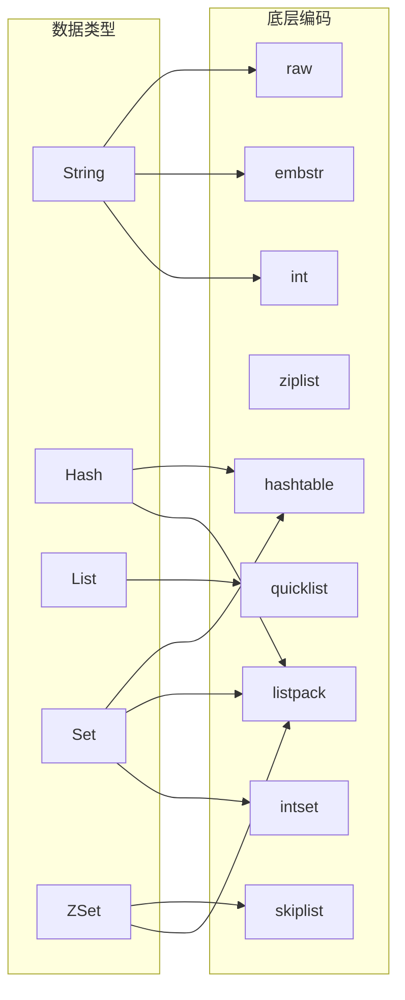
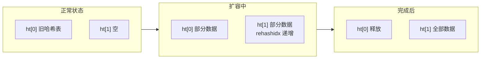

> Redis 数据结构与数据类型的对应关系与底层实现

## 目录

- [一、数据类型与数据结构](#一数据类型与数据结构)
- [二、底层数据结构详解](#二底层数据结构详解)
- [三、编码转换规则](#三编码转换规则)
- [四、OBJECT ENCODING 查看](#四object-encoding-查看)
- [五、相关资料](#五相关资料)

## 一、数据类型与数据结构

Redis 的数据类型（对外暴露）与数据结构（底层实现）是多对多的关系：



## 二、底层数据结构详解

### 2.1 SDS 简单动态字符串

```
struct sdshdr {
    int len;       // 已使用长度
    int alloc;     // 分配总长度
    char flags;    // 类型标识
    char buf[];    // 字符数组
};
```

| 特性 | 说明 |
|------|------|
| O(1) 获取长度 | len字段记录长度 |
| 二进制安全 | 不依赖`\0`判断结束 |
| 空间预分配 | 扩容时多分配，减少内存重分配 |
| 惰性释放 | 缩短时不立即释放，备用 |
| 兼容C字符串 | 末尾保留`\0`，可复用string.h函数 |

### 2.2 字典 dict

Redis 字典使用**渐进式 rehash**：



**触发条件**：
- 负载因子 ≥ 1 且未进行BGSAVE/AOF重写时扩容
- 负载因子 ≥ 5 强制扩容

### 2.3 跳表 skiplist

| 特性 | 说明 |
|------|------|
| 多级索引 | 通过随机层数建立索引 |
| O(log n) | 查找、插入、删除 |
| 平均指针数 | 每节点2个（p=0.5） |

详见 [跳表.md](../algorithm/跳表.md)

### 2.4 压缩列表 ziplist（Redis 7前）

紧凑的连续内存结构，节省内存：

```
| zlbytes | zltail | zllen | entry1 | entry2 | ... | entryN | zlend |
```

**缺点**：
- 连锁更新：中间节点长度变化导致后续节点级联扩展
- Redis 7.0后逐渐被 listpack 替代

### 2.5 listpack（Redis 7.0+）

改进的紧凑列表，解决连锁更新问题：

```
| total bytes | num elements | entry1 | entry2 | ... | entryN | end |
```

每个entry自包含长度信息，不依赖前驱节点。

### 2.6 quicklist

List类型的底层实现，双向链表 + 每个节点是ziplist/listpack：


### 2.7 intset 整数集合

当 Set 全为整数且元素数 ≤ 512 时使用：

```c
typedef struct intset {
    int32 encoding;  // 编码：int16/int32/int64
    int32 length;
    int8 contents[]; // 有序数组
};
```

升级不可逆：int16 → int32 → int64，不会降级。

### 2.8 hashtable

当元素较多或为字符串时使用，基于 dict.c 实现。

## 三、编码转换规则

### 3.1 String 编码转换

| 条件 | 编码 |
|------|------|
| 整数且 ≤ long范围 | int |
| 字符串 ≤ 44字节 | embstr |
| 字符串 > 44字节 | raw |

### 3.2 Hash 编码转换

| 条件 | 编码 |
|------|------|
| 元素数 ≤ 128 且 单值 ≤ 64字节 | listpack |
| 超过上述阈值 | hashtable |

### 3.3 List 编码转换

| 条件 | 编码 |
|------|------|
| 所有情况 | quicklist |

### 3.4 Set 编码转换

| 条件 | 编码 |
|------|------|
| 全为整数 且 元素数 ≤ 512 | intset |
| 字符串元素少 | listpack |
| 超过阈值 | hashtable |

### 3.5 ZSet 编码转换

| 条件 | 编码 |
|------|------|
| 元素数 ≤ 128 且 单值 ≤ 64字节 | listpack |
| 超过阈值 | skiplist + dict |

## 四、OBJECT ENCODING 查看

```bash
# 查看编码
$ SET num 12345
$ OBJECT ENCODING num
# "int"

$ SET str "hello"
$ OBJECT ENCODING str
# "embstr"

$ SET bigstr "aaaa...(超过44字节)"
$ OBJECT ENCODING bigstr
# "raw"

$ HSET user:1 name Alice age 30
$ OBJECT ENCODING user:1
# "listpack"

# 添加大量字段后
$ OBJECT ENCODING user:1
# "hashtable"

$ ZADD rank 100 alice 85 bob
$ OBJECT ENCODING rank
# "listpack"
```

## 五、相关资料

- [Redis数据结构](https://redis.io/docs/reference/internals/data-types/)
- [Redis源码 src/object.c](https://github.com/redis/redis/blob/unstable/src/object.c)
- [Redis编码转换规则](https://github.com/redis/redis/blob/unstable/src/config.c)
