> Redis 内存管理：过期删除策略 + 内存淘汰策略，平衡内存占用与访问性能

## 目录

- [一、内存管理概览](#一内存管理概览)
- [二、过期Key的存储结构](#二过期key的存储结构)
- [三、过期删除策略](#三过期删除策略)
- [四、Redis 的删除方案：惰性 + 定期](#四redis-的删除方案惰性--定期)
- [五、内存淘汰机制](#五内存淘汰机制)
- [六、LRU 与 LFU 算法原理](#六lru-与-lfu-算法原理)
- [七、生产配置与最佳实践](#七生产配置与最佳实践)
- [八、相关资料](#八相关资料)

## 一、内存管理概览

Redis 的内存管理由两个相互独立的机制组成：

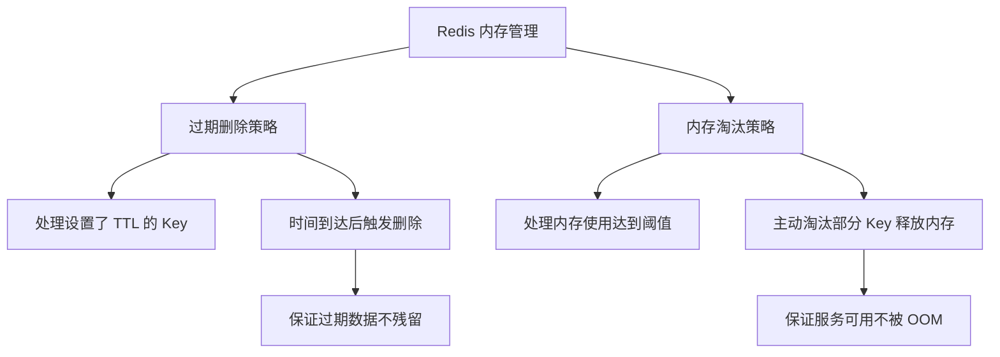

| 维度 | 过期删除 | 内存淘汰 |
|------|---------|---------|
| 触发条件 | Key 到达过期时间 | 内存使用量达到 `maxmemory` |
| 作用对象 | 仅设置 TTL 的 Key | 全部 Key 或带 TTL 的 Key（视策略） |
| 目的 | 清理失效数据 | 释放内存避免服务不可用 |
| 触发时机 | 访问时 + 后台定期 | 写入操作时检查 |

## 二、过期Key的存储结构

### 2.1 过期字典（expires dict）

Redis 在每个 RedisDB 结构中维护一个独立的过期字典：

```c
typedef struct redisDb {
    dict *dict;         // 键空间，存储所有键值对
    dict *expires;      // 过期字典，key->过期时间戳(ms)
    dict *blocking_keys;
    dict *ready_keys;
    dict *watched_keys;
    int id;
    long long avg_ttl;
    unsigned long expires_cursor;
    list *defrag_later;
} redisDb;
```

### 2.2 过期判断逻辑

```
判断 Key 是否过期：
  1. 在 expires 字典中查找 key
  2. 若存在，比较 expire_timestamp 与当前 system_timestamp
  3. expire_timestamp <= system_timestamp，则判定已过期
```

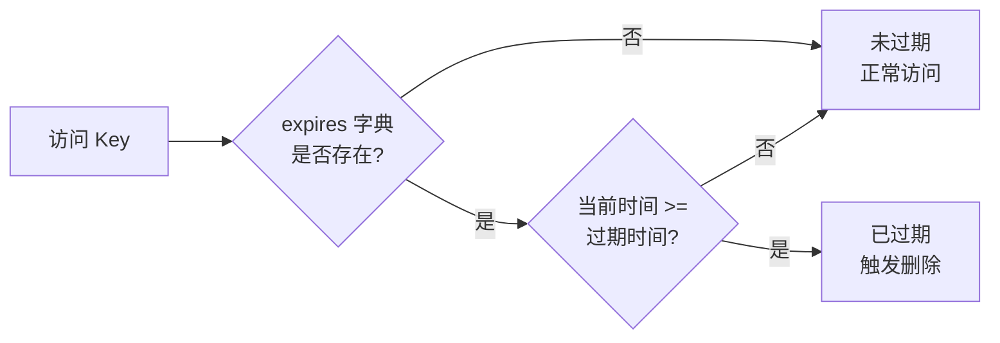

### 2.3 设置过期时间的命令

| 命令 | 说明 | 单位 |
|------|------|------|
| `EXPIRE key seconds` | 设置过期秒数 | s |
| `PEXPIRE key milliseconds` | 设置过期毫秒数 | ms |
| `EXPIREAT key timestamp` | 设置 UNIX 过期时间戳 | s |
| `PEXPIREAT key timestamp` | 设置 UNIX 过期毫秒时间戳 | ms |
| `TTL key` | 查看剩余生存时间 | s |
| `PTTL key` | 查看剩余生存时间 | ms |
| `PERSIST key` | 移除过期时间 | - |

## 三、过期删除策略

Redis 综合了三种经典策略，最终采用 **惰性删除 + 定期删除** 的组合方案。

### 3.1 三种经典策略对比

| 策略 | 原理 | 优点 | 缺点 | 应用场景 |
|------|------|------|------|---------|
| **定时删除** | 设置 Key 时同时创建定时器，时间到达时自动删除 | 内存友好，过期即清理 | CPU 不友好，大量定时器开销大 | 几乎不使用 |
| **惰性删除** | 访问 Key 时才检查是否过期，过期则删除 | CPU 友好，仅在访问时检查 | 内存不友好，过期 Key 不访问会一直占用内存 | Redis 主策略 |
| **定期删除** | 每隔一段时间随机抽样检查并删除过期 Key | 平衡 CPU 与内存 | 执行频率与抽样数量需调优 | Redis 辅助策略 |

### 3.2 定时删除的缺陷

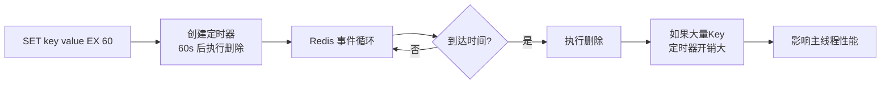

- 每个 Key 都需要在事件循环中注册定时器
- 大量 Key 同时过期会引发"删除风暴"
- 内存占用与 CPU 消耗陡增

## 四、Redis 的删除方案：惰性 + 定期

### 4.1 惰性删除（Lazy Deletion）

**触发点**：所有读写命令在执行前都会调用 `expireIfNeeded()` 函数检查 Key 是否过期。

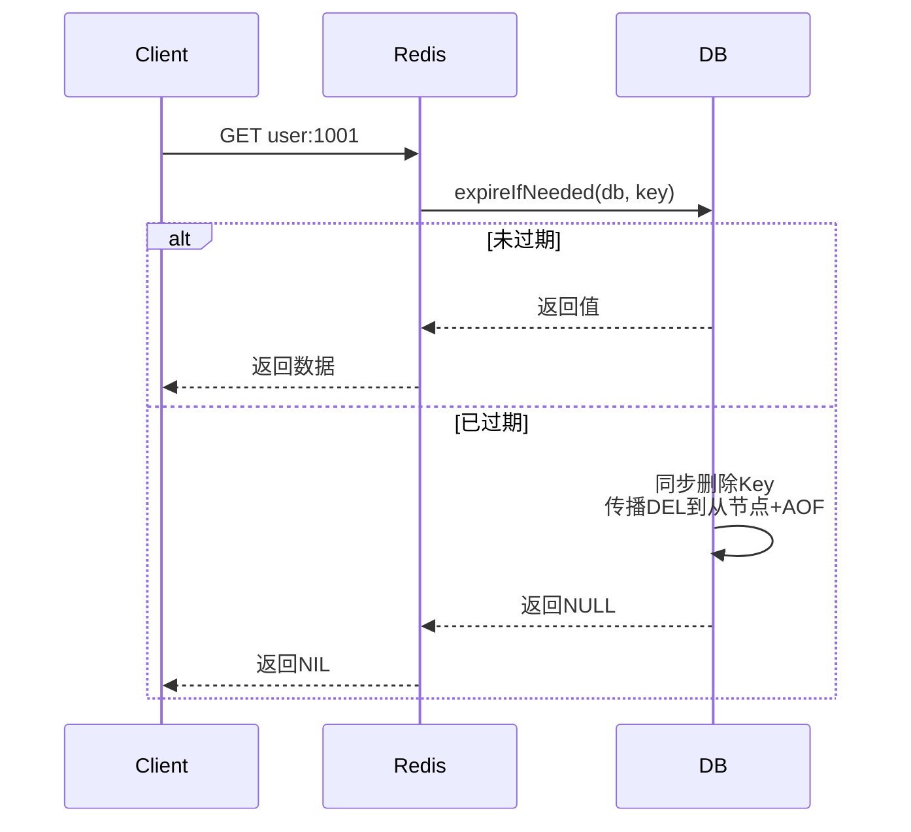

**源码位置**（Redis 7.x `db.c`）：

```c
int expireIfNeeded(redisDb *db, robj *key, int force) {
    if (!keyIsExpired(db, key)) return 0;

    // 从节点不主动删除，等待主节点的 DEL 命令同步
    if (server.masterhost != NULL) {
        if (server.current_client && server.current_client != server.master &&
            server.current_client->flags & CLIENT_NO_EVICT)
            return 0;
        return 1;
    }

    // 删除 Key 并传播删除事件
    if (force || server.stat_active_defrag_running == 0) {
        propagateDeletion(db, key, server.lazyfree_lazy_expire);
    }
    notifyKeyspaceEvent(NOTIFY_EXPIRED, "expired", key, db->id);
    signalModifiedKey(NULL, db, key);
    int retval = server.lazyfree_lazy_expire ?
                 dbAsyncDelete(db, key) : dbSyncDelete(db, key);
    server.stat_expiredkeys++;
    return 1;
}
```

**关键特性**：
- 主节点删除后会通过 `propagateDeletion` 将 DEL 命令传播到从节点和 AOF
- 从节点不会主动删除，仅等待主节点同步
- 根据 `lazyfree-lazy-expire` 决定同步删除还是异步删除（4.0+）

### 4.2 定期删除（Active Expiration Cycle）

**触发点**：Redis 事件循环中的 `serverCron` 周期性调用 `activeExpireCycle`。

**核心参数**（`redis.conf`）：

```bash
# 基础频率：每秒执行 serverCron 的次数
hz 10

# 自适应频率：根据负载动态调整 hz 上限
dynamic-hz yes

# 每轮定期删除的抽样数量
ACTIVE_EXPIRE_CYCLE_LOOKUPS_PER_LOOP = 20

# 抽样过期比例阈值：若过期比例 > 25%，立刻再次抽样
ACTIVE_EXPIRE_CYCLE_ACCEPTABLE_STALE = 25  # %
```

**执行流程**：

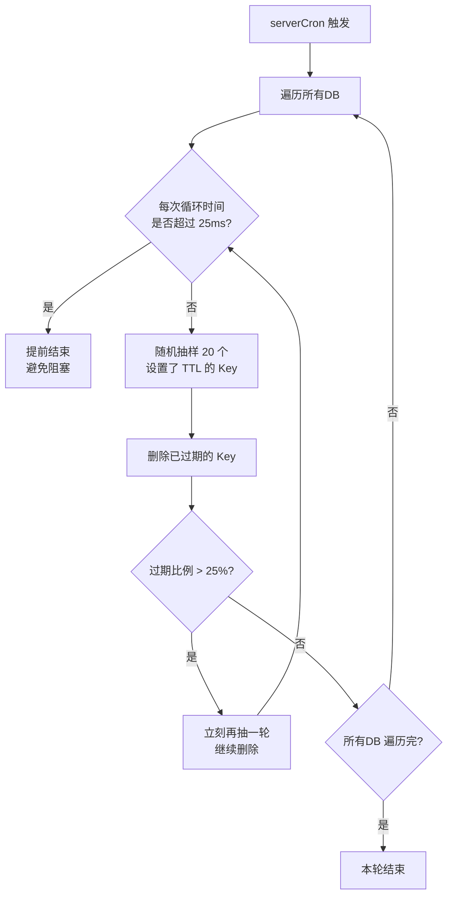

**关键设计**：
- **时间上限**：每轮定期删除耗时不超过 25ms（可配置），防止阻塞主线程
- **快速退出**：抽样中过期比例 ≤ 25% 时认为该 DB 大致无堆积，跳到下一个
- **持续清理**：过期比例 > 25% 时立即再抽样，直到比例下降或时间用尽
- **自适应频率**：`dynamic-hz yes` 时，根据客户端连接数自动提升 hz（最高 500）

### 4.3 异步删除（LazyFree）

Redis 4.0 引入异步删除，针对大 Key 删除避免主线程阻塞：

```bash
# 异步删除相关配置
lazyfree-lazy-eviction yes      # 内存淘汰时异步删除
lazyfree-lazy-expire yes        # 过期删除时异步删除
lazyfree-lazy-server-del yes    # server 隐式删除时异步删除
lazyfree-lazy-user-del yes      # 用户 DEL 命令异步删除
lazyfree-lazy-user-flush yes    # FLUSHALL/FLUSHDB 异步删除
replica-lazy-flush yes          # 从节点全量同步时清空数据异步删除
```

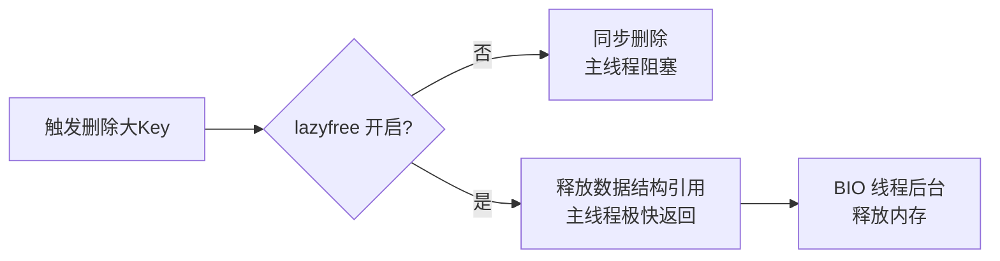

| 删除方式 | 适用场景 | 阻塞影响 |
|---------|---------|---------|
| 同步删除 | 小 Key（如 String、小 Hash） | 几乎无影响 |
| 异步删除 | 大 Key（百万级 List/Hash/Set） | 主线程仅处理引用解绑，释放由 BIO 完成 |

## 五、内存淘汰机制

### 5.1 触发条件

Redis 在每次执行写入命令前都会调用 `performEvictions` 检查内存使用情况：

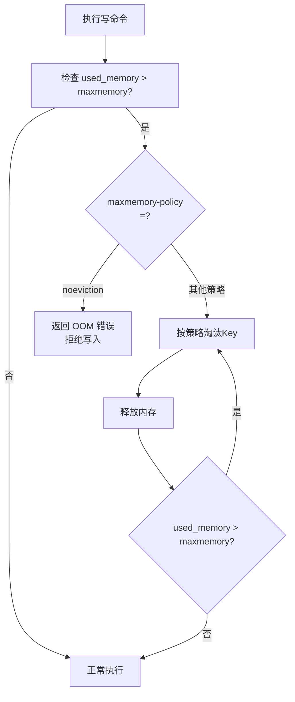

### 5.2 maxmemory 配置

```bash
# 最大内存限制
maxmemory 4gb

# 32 位系统默认 3GB（受限于地址空间）
# 64 位系统默认 0（不限制，但受物理内存限制）

# 淘汰策略
maxmemory-policy allkeys-lru

# 每次淘汰时抽样数量
maxmemory-samples 5

# 后台淘汰策略：开启时淘汰工作由 BIO 线程异步进行
maxmemory-eviction-tenacity 10
```

### 5.3 八种淘汰策略

| 策略 | 作用范围 | 淘汰规则 | 适用场景 |
|------|---------|---------|---------|
| `noeviction` | - | 不淘汰，写入直接返回错误 | 数据不可丢失的缓存场景 |
| `volatile-lru` | 设置 TTL 的 Key | 淘汰最久未访问的 | 缓存与持久数据混合 |
| `volatile-lfu` | 设置 TTL 的 Key | 淘汰访问频次最少的 | 缓存热点数据 |
| `volatile-ttl` | 设置 TTL 的 Key | 优先淘汰剩余时间最短的 | 优先清理即将过期的 |
| `volatile-random` | 设置 TTL 的 Key | 随机淘汰 | 简单粗暴的场景 |
| `allkeys-lru` | 所有 Key | 淘汰最久未访问的 | **纯缓存场景最常用** |
| `allkeys-lfu` | 所有 Key | 淘汰访问频次最少的 | 访问频次差异明显的缓存 |
| `allkeys-random` | 所有 Key | 随机淘汰 | 无明显访问模式的场景 |

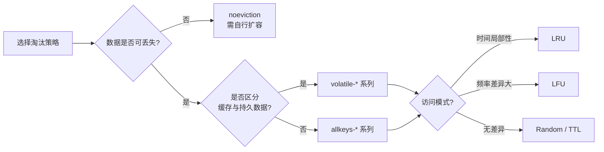

### 5.4 Redis 4.0+ 新增策略

- **`volatile-lfu` / `allkeys-lfu`**：基于 LFU 算法，对长期热点数据更友好
- **`volatile-random` / `allkeys-random`**：随机淘汰，性能开销最小

### 5.5 LRU 与 LFU 的近似实现

Redis 不维护严格的 LRU 链表，而是采用 **抽样近似**：

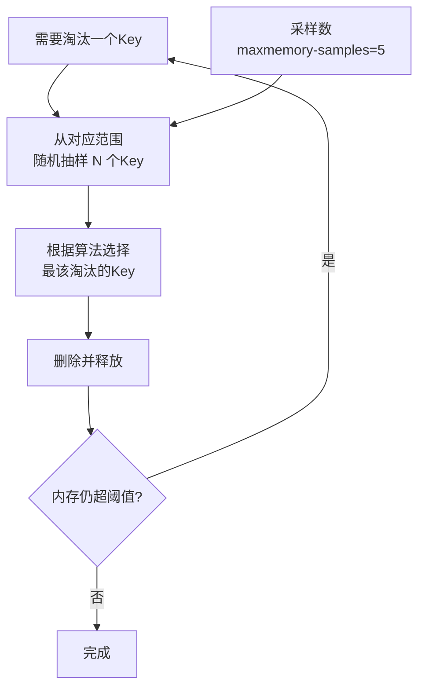

**抽样数量影响**：
- `maxmemory-samples 1`：随机淘汰，等同于 Random
- `maxmemory-samples 5`（默认）：接近真实 LRU，性能与准确度平衡
- `maxmemory-samples 10`：更接近真实 LRU，CPU 开销略增

## 六、LRU 与 LFU 算法原理

### 6.1 LRU（Least Recently Used）

**核心思想**：最近被访问过的数据，将来被访问的概率也更高。

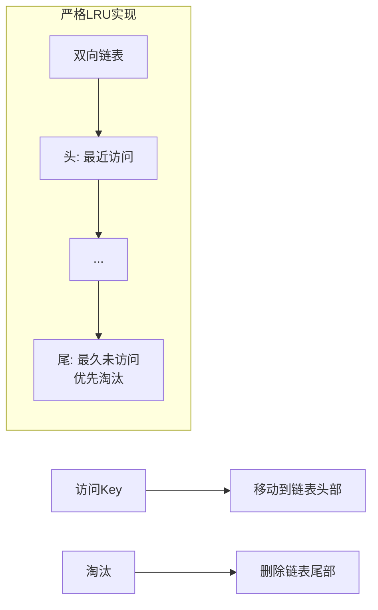

**严格 LRU 的开销**：
- 每次访问需移动链表节点，影响性能
- 双向链表 + 哈希表的内存开销大
- 在多线程下需要加锁

**Redis 近似 LRU**：
- 在 RedisObject 中维护 24 位 LRU 时钟字段
- 抽样后比较 LRU 时钟，选择最久未访问的淘汰

```c
typedef struct redisObject {
    unsigned type:4;
    unsigned encoding:4;
    unsigned lru:LRU_BITS;  // 24 bits，记录最后访问时间或LFU计数
    int refcount;
    void *ptr;
} robj;
```

### 6.2 LFU（Least Frequently Used）

**核心思想**：访问频次低的数据，将来被访问的概率也低。

Redis 4.0 引入 LFU，复用 `lru` 字段（24 bits）：

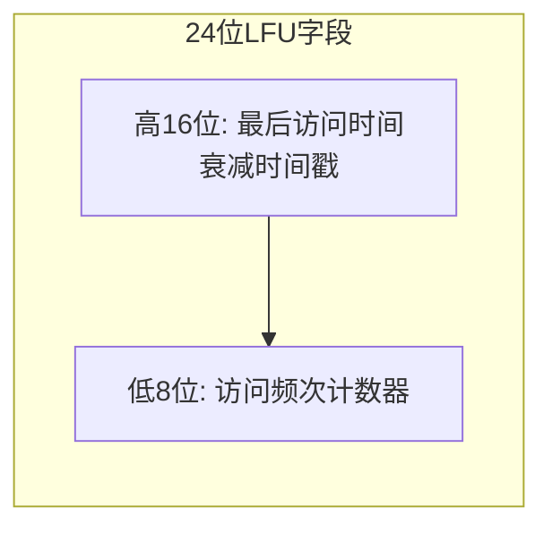

**频次计数器（8 bits）**：
- 范围 0-255，但采用 **对数概率递增** 算法，可记录远超 255 次的访问
- 访问越频繁，递增概率越低，避免计数饱和

**衰减机制**：
- 长时间不访问的 Key，频次会随时间衰减
- 通过 `lfu-decay-time`（默认 1 分钟）控制衰减速率

```bash
# LFU 相关配置
maxmemory-policy allkeys-lfu

# 访问计数器增长速率，越大增长越慢（0=每次访问+1）
lfu-log-factor 10

# 衰减时间，N 分钟内未访问则计数器 -1
lfu-decay-time 1
```

### 6.3 LRU vs LFU 对比

| 维度 | LRU | LFU |
|------|-----|-----|
| 依据 | 最后访问时间 | 访问频次 |
| 优点 | 实现简单，热点响应及时 | 区分长期热点与偶发访问 |
| 缺点 | 偶发批量访问会污染缓存 | 新数据初始频次低，易被淘汰 |
| 适用 | 时间局部性强的场景 | 频次分布差异大的场景 |
| Redis 抽样精度 | 较高 | 依赖对数计数器 |

### 6.4 LRU 污染问题示例

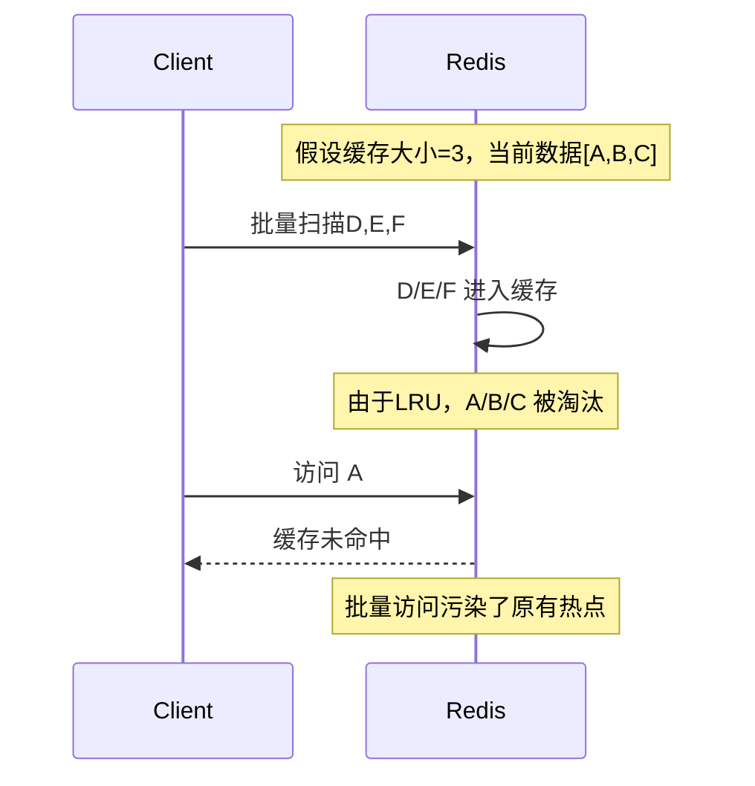

LFU 通过频次计数，D/E/F 仅被访问 1 次，不会被判定为热点，从而保留 A/B/C。

## 七、生产配置与最佳实践

### 7.1 推荐配置

```bash
# 内存与淘汰策略
maxmemory 4gb
maxmemory-policy allkeys-lru          # 纯缓存场景
maxmemory-samples 10                  # 提升淘汰准确度

# 如果缓存与持久化数据混用
# maxmemory-policy volatile-lru

# 开启异步删除，避免大Key阻塞
lazyfree-lazy-eviction yes
lazyfree-lazy-expire yes
lazyfree-lazy-server-del yes
lazyfree-lazy-user-del yes
lazyfree-lazy-user-flush yes

# 定期删除相关
hz 10
dynamic-hz yes

# LFU 配置（若使用 allkeys-lfu）
lfu-log-factor 10
lfu-decay-time 1
```

### 7.2 监控指标

```bash
# 查看内存使用
127.0.0.1:6379> INFO memory
# used_memory:4123421888         # Redis 分配器分配的内存
# used_memory_rss:4294967296      # 操作系统视角的内存
# used_memory_peak:4613734400     # 内存使用峰值
# maxmemory:4294967296            # 配置的最大内存

# 查看淘汰统计
127.0.0.1:6379> INFO stats
# evicted_keys:12345              # 因淘汰被删除的Key总数
# expired_keys:678                # 因过期被删除的Key总数
# evicted_clients:0               # 因内存限制被踢出的客户端

# 查看各 DB 的过期Key数量
127.0.0.1:6379> DBSIZE
127.0.0.1:6379> SCAN 0 COUNT 1000  # 配合脚本统计
```

### 7.3 排查过期Key堆积

```bash
# 1. 查看过期Key统计
redis-cli INFO stats | grep expired_keys
redis-cli INFO keyspace

# 2. 监控 active expire cycle 执行情况
redis-cli --latency-intrinsic-history -n 100

# 3. 若发现过期Key堆积，调整 hz
config set hz 50   # 临时提升定期删除频率
```

### 7.4 处理大 Key 淘汰

```bash
# 1. 识别大 Key
redis-cli --bigkeys
redis-cli --memkeys

# 2. 使用 MEMORY USAGE 查看单 Key 内存占用
127.0.0.1:6379> MEMORY USAGE user:1001
(integer) 10485760

# 3. 异步删除大 Key
127.0.0.1:6379> UNLINK user:1001

# 4. 配置 lazyfree 后，DEL 也会异步执行
127.0.0.1:6379> DEL user:1001
```

### 7.5 选型建议

| 场景 | 推荐策略 | 原因 |
|------|---------|------|
| 纯缓存（如热点商品、推荐位） | `allkeys-lru` | 命中率最高，配置简单 |
| 纯缓存（访问频次差异大） | `allkeys-lfu` | 更准确识别长期热点 |
| 缓存 + 持久化混用 | `volatile-lru` | 仅淘汰带 TTL 的 Key，保护持久数据 |
| 会话存储 | `volatile-lru` | 自然过期 + 主动释放 |
| 消息队列（List/Stream） | `noeviction` + 监控 | 不允许数据丢失，需扩容告警 |
| 临时数据 + 持久数据 | `volatile-ttl` | 优先清理即将过期的 |

## 八、相关资料

- [Redis 官方文档 - Key 过期](https://redis.io/docs/manual/keyspace/)
- [Redis 官方文档 - 内存优化](https://redis.io/docs/manual/management/optimization/memory-optimization/)
- [Redis 源码 - db.c (expireIfNeeded)](https://github.com/redis/redis/blob/unstable/src/db.c)
- [Redis 源码 - evict.c (performEvictions)](https://github.com/redis/redis/blob/unstable/src/evict.c)
- 《Redis 设计与实现》黄健宏
- 《Redis 开发与运维》付磊
