> Redis 主从复制：RDB 快照 + 增量缓冲区，实现异步最终一致性复制

## 目录

- [一、复制概述](#一复制概述)
- [二、复制的建立](#二复制的建立)
- [三、全量同步流程](#三全量同步流程)
- [四、增量同步流程](#四增量同步流程)
- [五、命令传播阶段](#五命令传播阶段)
- [六、关键概念解析](#六关键概念解析)
- [七、心跳与延迟检测](#七心跳与延迟检测)
- [八、调优与最佳实践](#八调优与最佳实践)
- [九、相关资料](#九相关资料)

## 一、复制概述

Redis 主从复制是构建高可用 Redis 集群的基础，主要解决两个问题：
1. **数据冗余**：主节点数据备份到从节点，避免单点故障
2. **读写分离**：主节点写、从节点读，提升整体读 QPS

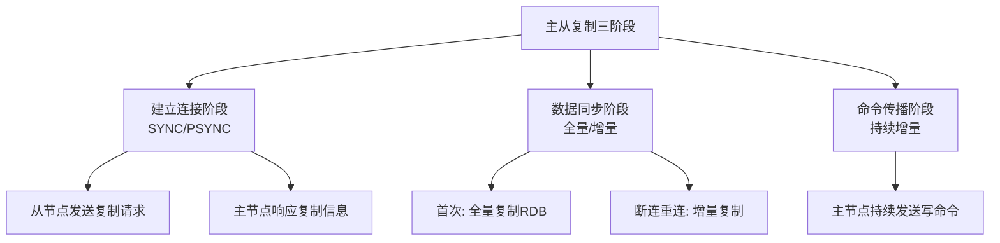

| 复制类型 | 触发场景 | 数据传输方式 |
|---------|---------|------------|
| 全量复制 | 首次连接、断线后缓冲区被覆盖 | RDB + 缓冲区命令 |
| 增量复制 | 短暂断线后重连 | repl_backlog_buffer 中的差异部分 |
| 命令传播 | 正常运行时 | 主节点实时转发写命令 |

## 二、复制的建立

### 2.1 配置方式

```bash
# 方式一：配置文件
# redis.conf (从节点)
replicaof 192.168.0.1 6379
masterauth yourpassword      # 主节点有密码时配置

# 方式二：命令行动态配置
redis-cli> REPLICAOF 192.168.0.1 6379

# 取消主从关系
redis-cli> REPLICAOF NO ONE
```

### 2.2 建立连接流程

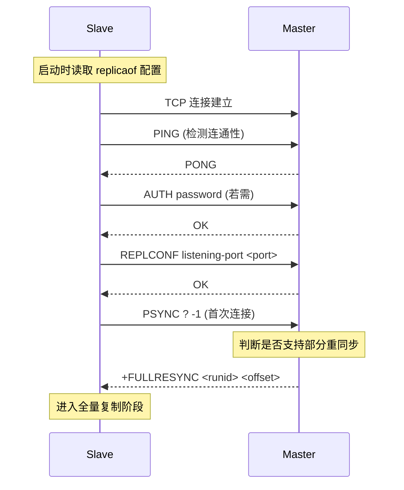

### 2.3 PSYNC 命令

```
PSYNC <runid> <offset>

- runid: 主节点实例ID，? 表示首次连接
- offset: 复制偏移量，-1 表示无历史
```

主节点响应：
- `+FULLRESYNC <runid> <offset>`：要求全量复制
- `+CONTINUE`：可以进行增量复制
- `-ERR`：不支持 PSYNC（旧版本），回退到 SYNC

## 三、全量同步流程

### 3.1 完整流程

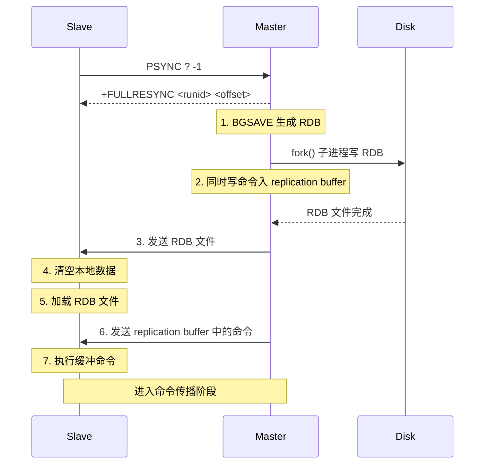

### 3.2 关键步骤详解

**1. BGSAVE 生成 RDB**
- 主节点 fork 子进程，利用 COW 机制生成 RDB
- 生成期间，主节点继续处理客户端请求
- 新写入的命令同时记录到 replication buffer

**2. 发送 RDB 文件**
- RDB 生成后，主节点将文件内容发送给从节点
- 从节点接收完成后清空本地数据并加载 RDB

**3. 发送缓冲命令**
- RDB 生成期间主节点收到的写命令
- 通过 replication buffer 发送给从节点
- 从节点执行后数据状态与主节点一致

### 3.3 全量复制开销

| 维度 | 开销 |
|------|------|
| 主节点 CPU | BGSAVE fork + RDB 序列化 |
| 主节点磁盘 | RDB 文件写入 |
| 主节点内存 | replication buffer 占用 |
| 网络带宽 | RDB 文件传输 |
| 从节点 CPU | RDB 加载、数据清空 |
| 从节点内存 | 旧数据 + 新 RDB 短暂共存 |
| 阻塞 | 从节点加载 RDB 期间无法提供服务 |

### 3.4 无磁盘复制（Diskless Replication）

```bash
# 主节点配置
repl-diskless-sync yes
repl-diskless-sync-delay 5   # 延迟 5 秒等待多个从节点一起传输
```

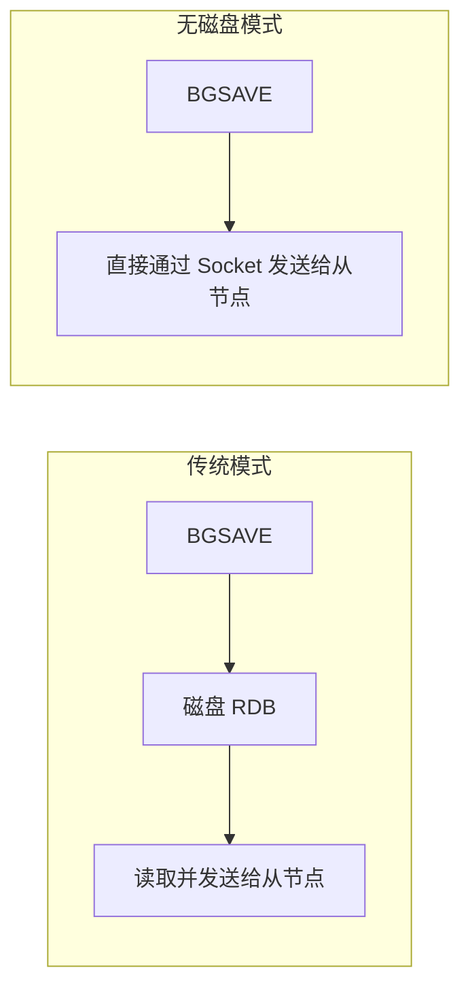

**适用场景**：
- 主节点磁盘 IO 瓶颈
- 网络带宽充足
- 多个从节点同时全量同步

## 四、增量同步流程

### 4.1 触发条件

从节点断线重连后，若满足以下条件则进行增量同步：
1. 主从节点 runid 一致（同一主节点）
2. 从节点的 offset 仍在主节点 repl_backlog_buffer 中

### 4.2 增量同步流程

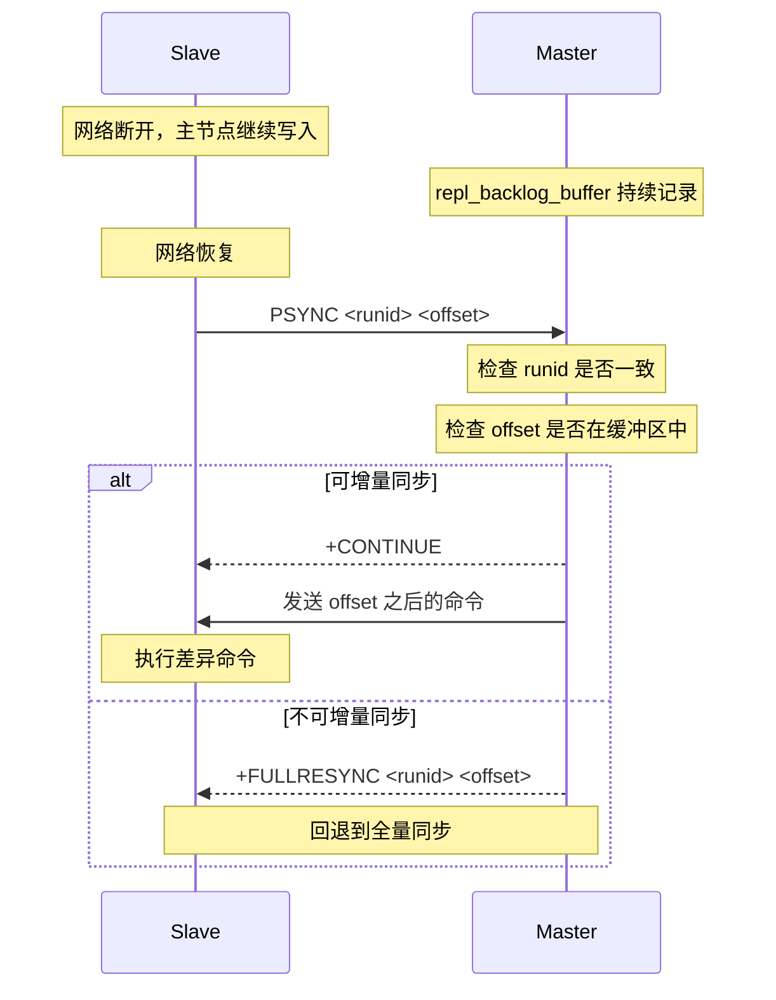

### 4.3 增量 vs 全量判定

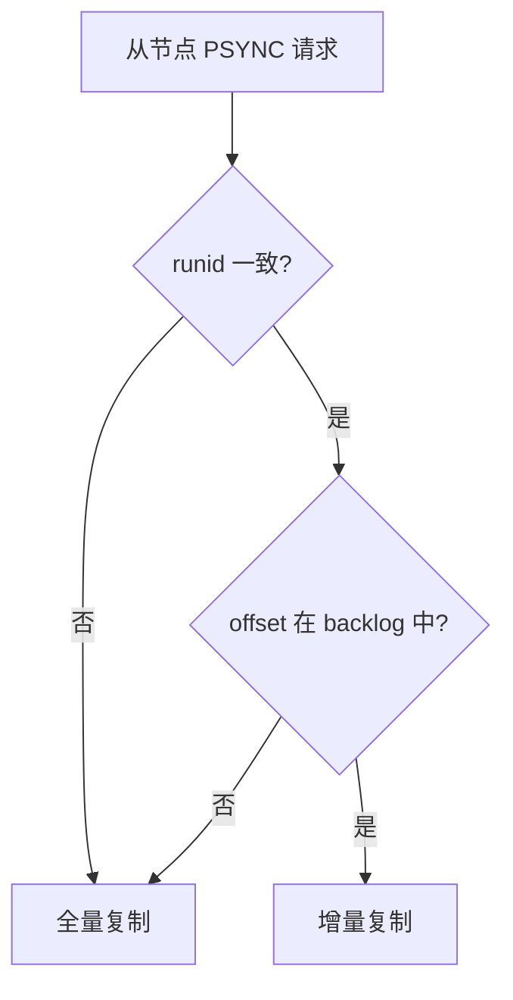

## 五、命令传播阶段

完成全量或增量同步后，进入持续命令传播阶段：

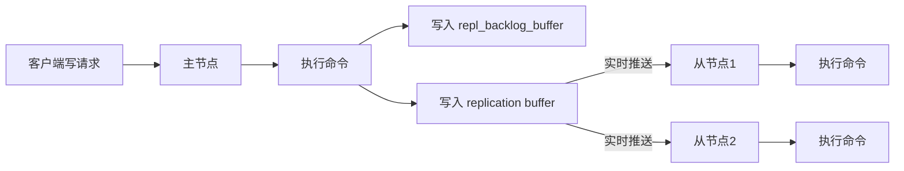

**关键点**：
- 主节点每执行一个写命令，立即转发给所有从节点
- 转发基于**长连接**，无需重建连接
- **异步复制**：主节点不等待从节点确认即返回客户端

## 六、关键概念解析

### 6.1 replication buffer vs repl_backlog_buffer

| 维度 | replication buffer | repl_backlog_buffer |
|------|-------------------|--------------------|
| 作用 | 主从实时复制命令传输 | 断线重连增量同步 |
| 数量 | 每个从节点一个 | 主节点全局唯一 |
| 生命周期 | 从节点断开即销毁 | 持续存在，环形覆盖 |
| 大小配置 | client-output-buffer-limit | repl-backlog-size |
| 内容 | 当前待发送的命令 | 最近写入的命令历史 |

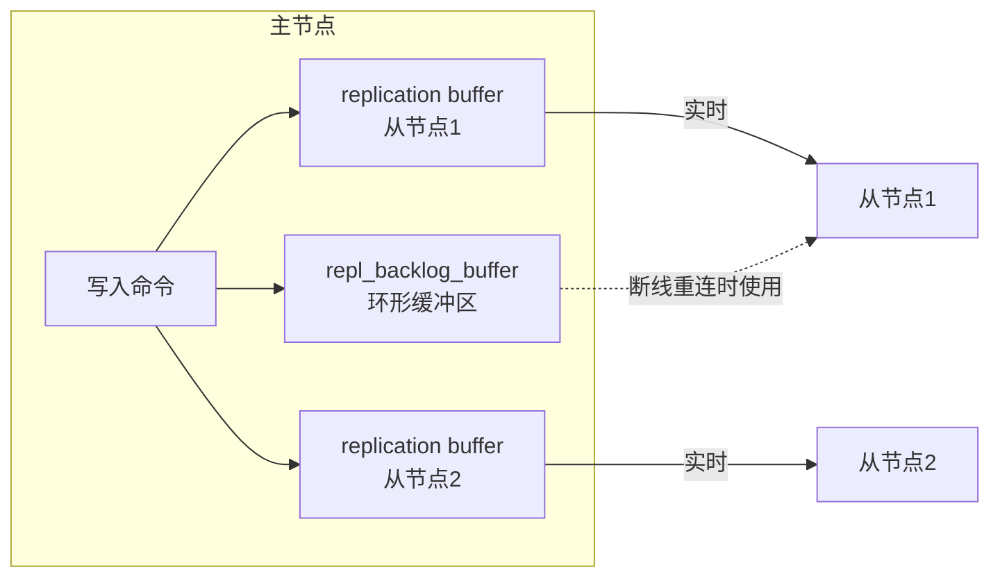

### 6.2 repl_backlog_buffer 环形结构

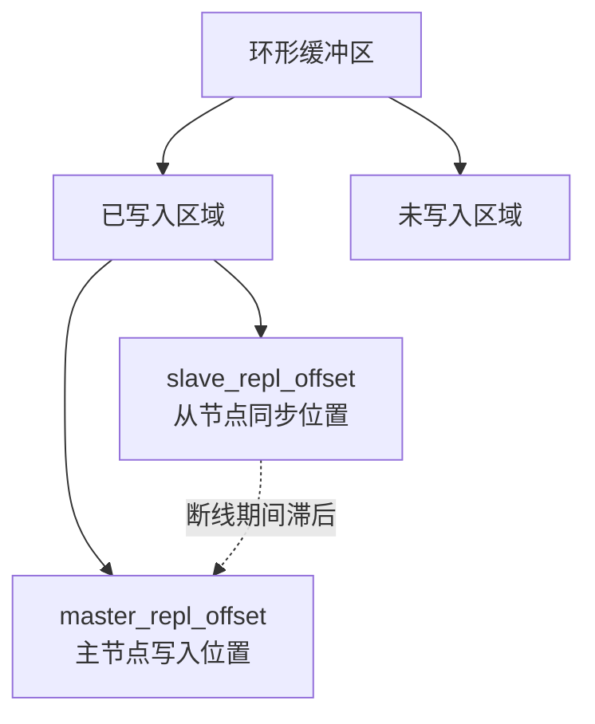

```bash
# 主节点查看复制状态
127.0.0.1:6379> INFO replication
# role:master
# connected_slaves:2
# repl_backlog_size:1048576       # 配置的环形缓冲区大小
# repl_backlog_first_byte_offset:1 # 缓冲区起始 offset
# repl_backlog_histlen:1048576    # 缓冲区已用长度
# master_replid:8371b4d115ff6c4b...
# master_repl_offset:1048576      # 主节点当前 offset
```

**覆盖逻辑**：
- 缓冲区写满后，新数据从头部开始覆盖
- 从节点 offset 落在被覆盖的区域 → 无法增量同步 → 全量复制

### 6.3 复制偏移量（offset）

```bash
# 主节点 offset
127.0.0.1:6379> INFO replication | grep master_repl_offset
master_repl_offset:1234567

# 从节点 offset
127.0.0.1:6380> INFO replication | grep slave_repl_offset
slave_repl_offset:1234500

# 延迟 = master_repl_offset - slave_repl_offset
```

## 七、心跳与延迟检测

### 7.1 心跳机制

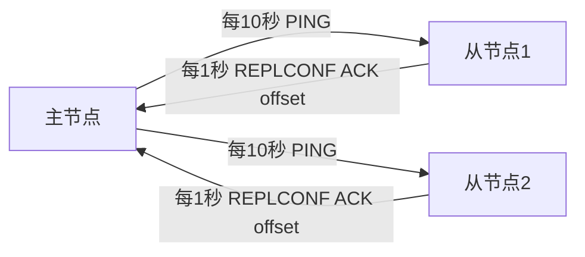

| 心跳方向 | 频率 | 命令 | 作用 |
|---------|------|------|------|
| 主→从 | 10 秒 | PING | 检测从节点存活 |
| 从→主 | 1 秒 | REPLCONF ACK `<offset>` | 上报复制偏移量 |

### 7.2 配置参数

```bash
# 主节点向从节点发送 PING 的间隔
repl-ping-replica-period 10

# 心跳超时时间
repl-timeout 60

# 从节点 ACK 间隔
repl-ping-slave-period 10   # 已废弃，等同 repl-ping-replica-period
```

### 7.3 数据安全配置

```bash
# 至少有 N 个从节点 ACK 延迟不超过 T 秒，主节点才接受写入
min-replicas-to-write 1
min-replicas-max-lag 10
```

此配置可缓解脑裂问题（详见 [Redis主从脑裂问题和解决方案](Redis主从脑裂问题和解决方案.md)）。

## 八、调优与最佳实践

### 8.1 避免不必要的全量复制

```bash
# 增大 repl_backlog_buffer，降低断线后全量复制概率
repl-backlog-size 64mb        # 默认 1mb，生产建议 64mb+
repl-backlog-ttl 3600         # 缓冲区保留时长（秒）

# 计算 backlog 大小公式：
# backlog_size = (master每秒写入量 × 预计断线时长) × 2
# 例如: 1MB/s × 60秒 × 2 = 120MB
```

### 8.2 降低全量复制开销

```bash
# 开启无磁盘复制
repl-diskless-sync yes
repl-diskless-sync-delay 5

# 限制 RDB 传输速率（避免占用全部带宽）
repl-diskless-sync-delay 5
```

### 8.3 主从延迟优化

```bash
# 从节点禁用慢查询，避免阻塞命令执行
slowlog-log-slower-than 10000

# 从节点禁用 AOF（仅主节点开启）
appendonly no  # 从节点
```

### 8.4 从节点的从节点（级联复制）

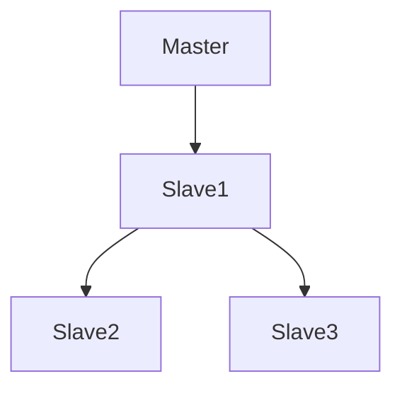

```bash
# Slave2 和 Slave3 配置
replicaof <Slave1_IP> 6379
```

**作用**：减轻主节点 IO 压力，但增加同步层级延迟。

### 8.5 强烈建议主节点开启持久化

```bash
# 主节点配置
appendonly yes
save 900 1
save 300 10
```

**原因**：主节点未开启持久化且自动重启，会导致主节点以空数据启动。若 Sentinel 未检测到主节点宕机，从节点全量同步后将清空所有数据，造成灾难性数据丢失。

### 8.6 主从复制 vs RDB 持久化

为什么主从复制使用 RDB 而不是 AOF 作为全量同步数据载体？

| 维度 | RDB | AOF |
|------|-----|-----|
| 加载速度 | 快（二进制格式） | 慢（命令重放） |
| 文件大小 | 小（压缩） | 大（命令文本） |
| 网络传输 | 带宽占用小 | 带宽占用大 |
| 主节点开销 | 一次性 fork | 持续 fsync |

### 8.7 数据不一致的容忍

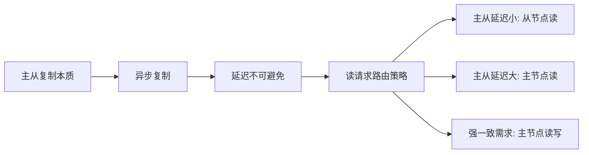

**监控延迟**：
```bash
# 主节点上查看各从节点延迟
127.0.0.1:6379> INFO replication
# slave0:ip=192.168.1.2,port=6379,state=online,offset=1234567,lag=0
# lag=0 表示从节点 1 秒前 ACK 过
```

## 九、相关资料

- [Redis 官方文档 - 复制](https://redis.io/docs/management/replication/)
- [Redis 源码 - replication.c](https://github.com/redis/redis/blob/unstable/src/replication.c)
- 《Redis 设计与实现》黄健宏 - 第 15 章
- [小林 coding - 主从复制原理](https://xiaolincoding.com/redis/cluster/master_slave_replication.html)
- [InfoQ Redis 集群](https://xie.infoq.cn/article/6c3500c66c3cdee3d72b88780)
