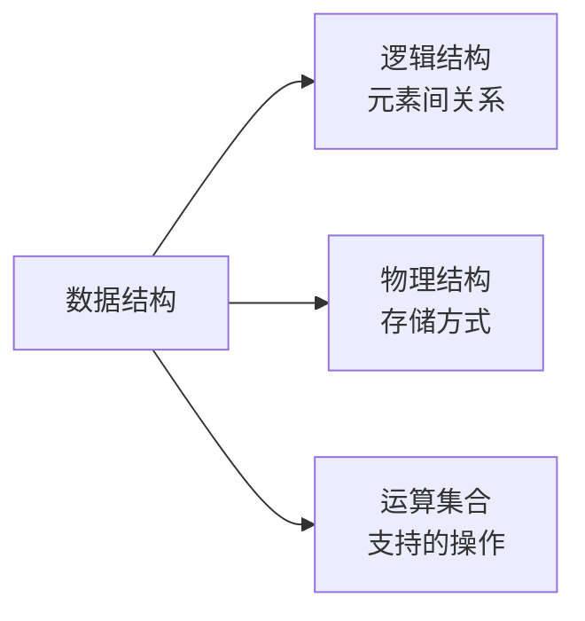
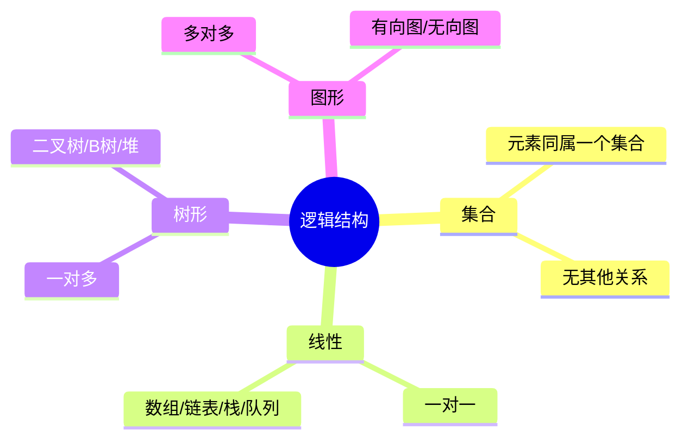

# 数据结构绪论

> 数据结构研究数据的组织方式与操作。本目录关注**结构本身的设计与特性**，算法题解见 `algorithm/` 目录。

## 一、什么是数据结构

**数据结构**：相互之间存在一种或多种特定关系的数据元素的集合。

> 经典公式：`程序 = 数据结构 + 算法`
> - 数据结构：数据如何组织存储
> - 算法：如何高效操作这些数据

### 1.1 三要素



| 要素 | 含义 | 例子 |
|------|------|------|
| 逻辑结构 | 数据元素之间的逻辑关系 | 线性、树形、图形 |
| 物理结构 | 数据在内存中的存储方式 | 顺序存储、链式存储 |
| 运算 | 该结构支持的操作 | 插入、删除、查找 |

## 二、逻辑结构

按元素间的关系分类：



| 结构 | 关系 | 典型应用 |
|------|------|---------|
| 集合 | 仅属于同一集合 | 哈希集合 |
| 线性 | 一对一 | 列表、栈、队列 |
| 树形 | 一对多 | 文件系统、索引 |
| 图形 | 多对多 | 社交网络、路由 |

## 三、物理结构（存储结构）

### 3.1 顺序存储

- 数据元素在内存中**连续存放**
- 通过下标直接计算地址
- **优点**：随机访问 O(1)、存储密度高
- **缺点**：插入删除 O(n)、需预分配空间
- **代表**：数组、动态数组

### 3.2 链式存储

- 数据元素**不连续**，通过指针链接
- **优点**：动态分配、插入删除 O(1)
- **缺点**：不能随机访问、额外存指针
- **代表**：链表、树的链式实现

### 3.3 索引存储

- 建立附加索引表，按关键字检索
- **代表**：B+ 树、数据库索引

### 3.4 散列存储

- 通过哈希函数直接计算存储位置
- **优点**：查找 O(1) 平均
- **缺点**：冲突问题、无序
- **代表**：哈希表

## 四、抽象数据类型 ADT

**ADT（Abstract Data Type）**：一个数学模型 + 该模型上定义的一组操作。只描述"做什么"，不关心"怎么做"。

```text
ADT 栈 Stack
{
    数据对象：有限元素序列
    数据关系：后进先出 LIFO
    基本操作：
        Push(x)  // 入栈
        Pop()    // 出栈
        Top()    // 取栈顶
        Empty()  // 是否为空
}
```

**意义**：把数据封装起来，外部只用接口操作，便于实现替换。

## 五、数据结构选型决策

### 5.1 按需求选结构

| 需求 | 推荐结构 |
|------|---------|
| 按下标随机访问 | 数组 |
| 频繁插入删除 | 链表 |
| 后进先出 | 栈 |
| 先进先出 | 队列 |
| 快速查找关键字 | 哈希表 |
| 范围查询/有序遍历 | 平衡 BST |
| 动态取最值 | 堆 |
| 前缀匹配 | Trie |
| 元素唯一性 | 集合（哈希/BST） |
| 大规模磁盘存储 | B+ 树 |

### 5.2 时间 vs 空间权衡

- 哈希表：用空间换时间（O(1) 查找但占用大）
- 位图：极致压缩空间（1 bit 表示存在性）
- 缓存：用内存换磁盘 I/O

## 六、与 algorithm 目录的分工

| 本目录 `struct/` | `algorithm/` 目录 |
|------------------|------------------|
| 数据结构的**定义与设计** | 用数据结构**解题** |
| 实现原理、性质、变种 | 算法思想、复杂度题解 |
| 选型对比、面试概念题 | LeetCode 题解、套路总结 |
| 例：什么是红黑树？为什么用它？ | 例：用 BST 解决区间查询 |

## 七、面试常见概念题

1. 数组和链表的区别？什么场景下用哪个？
2. 哈希表如何解决冲突？几种方法对比？
3. 二叉搜索树为什么需要平衡？常见的平衡树有哪些？
4. B 树和 B+ 树的区别？为什么数据库用 B+ 树？
5. 堆和二叉搜索树的区别？
6. 跳表相对于平衡树的优势？
7. 图的邻接矩阵和邻接表各适合什么场景？
8. LRU 缓存为什么用哈希表 + 双向链表？

> 详细答案见后续章节。

## 八、参考资料

- 《大话数据结构》程杰
- 《数据结构与算法分析》Mark Allen Weiss
- [数据结构与算法教程 解学武](http://data.biancheng.net/)
- [浙江大学数据结构 陈越](https://www.bilibili.com/video/BV1H4411N7oD/)
