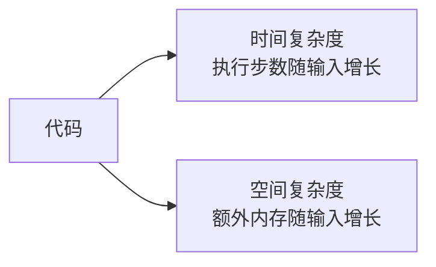
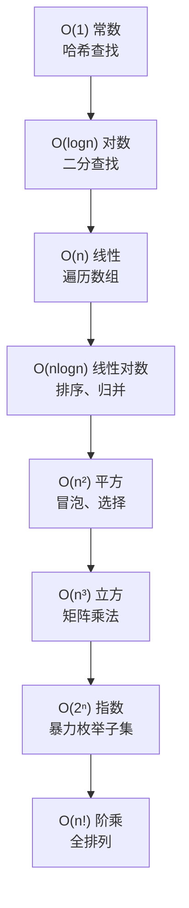

# 复杂度分析

> 复杂度是衡量数据结构与算法效率的标尺。掌握大 O 表示法是面试的基础。

## 一、为什么要分析复杂度

- **理论评估**：不依赖具体硬件、编译器、测试数据
- **横向对比**：在不同方案间快速选优
- **面试沟通**：用统一语言描述效率



## 二、大 O 表示法

### 2.1 定义

`T(n) = O(f(n))`：当 n → ∞ 时，T(n) 增长率不超过 f(n) 的常数倍。

**关注趋势，忽略常数和低阶项**：
- `O(2n+3)` → `O(n)`
- `O(n²+n)` → `O(n²)`
- `O(3n²+5nlogn+100)` → `O(n²)`

### 2.2 常见复杂度等级



**直观对比（n=100）**：

| 复杂度 | 操作次数 | 体感 |
|-------|---------|------|
| O(1) | 1 | 瞬间 |
| O(logn) | 7 | 瞬间 |
| O(n) | 100 | 很快 |
| O(nlogn) | 664 | 快 |
| O(n²) | 10,000 | 可接受 |
| O(n³) | 1,000,000 | 较慢 |
| O(2ⁿ) | 10³⁰ | 不可行 |

## 三、时间复杂度计算

### 3.1 基本规则

```go
// 1. 顺序语句 → 取最大
for i := 0; i < n; i++ { ... }      // O(n)
for i := 0; i < n; i++ { ... }      // O(n)
// 总计：O(n) + O(n) = O(n)

// 2. 嵌套循环 → 相乘
for i := 0; i < n; i++ {            // n 次
    for j := 0; j < n; j++ { ... }  // n 次
}
// 总计：O(n²)

// 3. 条件分支 → 取最坏
if cond {
    doO_n()    // O(n)
} else {
    doO_n2()   // O(n²)
}
// 总计：O(n²)（最坏情况）
```

### 3.2 常见场景

**对数复杂度 O(logn)**：每次把问题规模减半
```go
for i := 1; i < n; i *= 2 { ... }  // 二分、倍增
```

**递归复杂度**：主定理
```
T(n) = a·T(n/b) + f(n)
  - a：子问题个数
  - n/b：每个子问题规模
  - f(n)：分解与合并的代价
```

| 递归式 | 复杂度 | 例子 |
|-------|-------|------|
| T(n) = 2T(n/2) + O(n) | O(nlogn) | 归并排序 |
| T(n) = 2T(n/2) + O(1) | O(n) | 二叉树遍历 |
| T(n) = T(n/2) + O(1) | O(logn) | 二分查找 |
| T(n) = T(n-1) + O(n) | O(n²) | 冒泡排序 |
| T(n) = 2T(n-1) + O(1) | O(2ⁿ) | 暴力枚举 |

### 3.3 最好 / 最坏 / 平均

```go
// 在数组中找 target
func find(arr []int, target int) int {
    for i, v := range arr {
        if v == target {
            return i
        }
    }
    return -1
}
```
- 最好：O(1)（第一个就是）
- 最坏：O(n)（最后或不存在）
- 平均：O(n)（期望位置 n/2）

## 四、空间复杂度

### 4.1 定义

算法运行过程中**额外**占用的内存随 n 增长的趋势。**不包括输入本身**。

### 4.2 常见情形

| 情形 | 空间 | 例子 |
|------|------|------|
| 原地操作 | O(1) | 冒泡、二分 |
| 一维辅助数组 | O(n) | 归并排序、DP |
| 二维辅助数组 | O(n²) | 矩阵 DP |
| 递归栈深度 | O(递归深度) | DFS 递归 |

```go
// O(1) 空间
func sum(n int) int {
    s := 0
    for i := 1; i <= n; i++ {
        s += i
    }
    return s
}

// O(n) 空间
func copyArr(arr []int) []int {
    res := make([]int, len(arr))  // 额外 O(n)
    copy(res, arr)
    return res
}

// O(n) 空间（递归深度）
func fac(n int) int {
    if n <= 1 {
        return 1
    }
    return n * fac(n-1)  // 递归深度 n
}
```

## 五、均摊分析

### 5.1 什么时候用均摊

某些操作大多数情况很快，偶尔很慢。整体看每次操作的**平均代价**更合理。

### 5.2 动态数组扩容

```go
// Go slice append 操作
arr = append(arr, x)
```
- 大多数 append：O(1)
- 容量满时扩容：O(n)（拷贝所有元素到新数组）

**均摊分析**：连续 n 次 append，总拷贝 `n + n/2 + n/4 + ... < 2n`，均摊每次 **O(1)**。

### 5.3 并查集

- 单次 `find` 最坏 O(n)
- 路径压缩 + 按秩合并后，**均摊 O(α(n)) ≈ O(1)**

## 六、面试常见复杂度速查

| 数据结构 | 访问 | 查找 | 插入 | 删除 |
|---------|------|------|------|------|
| 数组 | O(1) | O(n) | O(n) | O(n) |
| 链表 | O(n) | O(n) | O(1)* | O(1)* |
| 哈希表 | - | O(1) | O(1) | O(1) |
| BST（平衡） | - | O(logn) | O(logn) | O(logn) |
| 堆 | - | O(n) | O(logn) | O(logn) |

> *链表插入删除 O(1) 前提是已定位到位置

| 排序算法 | 最好 | 平均 | 最坏 | 空间 |
|---------|------|------|------|------|
| 冒泡 | O(n) | O(n²) | O(n²) | O(1) |
| 快排 | O(nlogn) | O(nlogn) | O(n²) | O(logn) |
| 归并 | O(nlogn) | O(nlogn) | O(nlogn) | O(n) |
| 堆排序 | O(nlogn) | O(nlogn) | O(nlogn) | O(1) |

## 七、面试要点

### 7.1 易错点

1. **忽略递归栈空间**：递归深度也算空间复杂度
2. **混淆均摊和平均**：均摊是**总代价除以操作数**，平均是**所有输入的期望**
3. **O(2ⁿ) vs O(n!)**：阶乘比指数更爆炸
4. **常数项不写进大 O**：但实际工程中常数大小很重要

### 7.2 复杂度优化思路

```mermaid
flowchart LR
    Slow[O(n²) 暴力]
    Slow -->|空间换时间| Hash[O(n) 哈希]
    Slow -->|排序+双指针| Sort[O(nlogn)]
    Slow -->|分治/DP| Opt[O(nlogn) 或 O(n)]
```

### 7.3 高频面试题

1. 给定代码，分析时间/空间复杂度
2. 为什么快排平均 O(nlogn) 但最坏 O(n²)？
3. 归并排序为什么是稳定排序？
4. 哈希表为什么是 O(1) 而不是 O(n)？
5. 动态数组的 append 为什么均摊 O(1)？
6. 递归求斐波那契数列的复杂度是多少？如何优化？

## 八、参考资料

- 《算法导论》第 3 章 函数的增长
- [Big-O Cheat Sheet](https://www.bigocheatsheet.com/)
