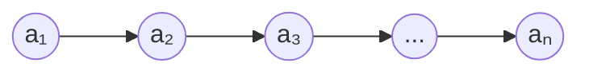
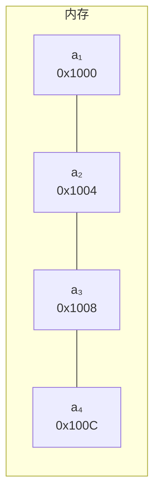
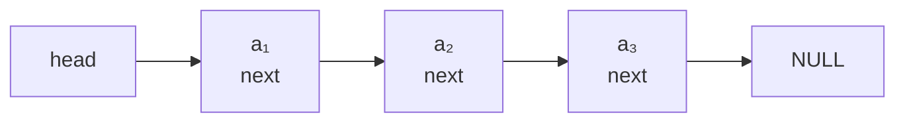
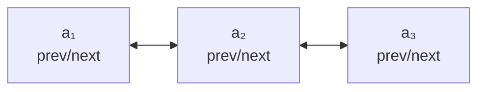
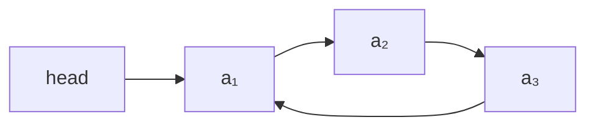

# 线性表

> 线性表是最基础的数据结构。理解数组与链表的存储差异和适用场景，是面试的必考点。

## 一、线性表的定义

**线性表**：零个或多个数据元素的**有限序列**。



**特征**：
- 元素个数有限
- 除首元素外，每个元素有且仅有一个**直接前驱**
- 除尾元素外，每个元素有且仅有一个**直接后继**
- 元素之间是**一对一**的逻辑关系

**常见的线性表**：数组、链表、栈、队列、字符串。

## 二、顺序存储——数组

### 2.1 存储原理

数据元素在内存中**连续存放**，通过下标直接计算地址：

```
Location(aᵢ) = Location(a₁) + c × (i-1)
```

其中 `c` 是每个元素占用的字节数。



### 2.2 静态数组 vs 动态数组

| 类型 | 大小 | 扩容 | 例子 |
|------|------|------|------|
| 静态数组 | 编译期确定 | 不支持 | C `int arr[10]` |
| 动态数组 | 运行时可变 | 自动扩容 | Go slice、C++ vector、Java ArrayList |

**动态数组扩容机制**（以 Go slice 为例）：
- 容量不足时分配更大的新数组（通常 2 倍）
- 拷贝旧元素到新数组
- 释放旧数组
- **均摊 O(1)**：n 次 append 总拷贝 < 2n

### 2.3 操作复杂度

| 操作 | 时间 | 说明 |
|------|------|------|
| 按下标访问 | O(1) | 直接算地址 |
| 头部插入 | O(n) | 全部后移 |
| 尾部插入 | O(1)* | 均摊 |
| 中间插入 | O(n) | 部分后移 |
| 删除 | O(n) | 部分前移 |
| 查找（无序） | O(n) | 顺序扫描 |
| 查找（有序） | O(logn) | 二分 |

### 2.4 优缺点

**优点**：
- 随机访问 O(1)
- 存储密度高（无额外指针开销）
- 缓存友好（连续内存命中率高）

**缺点**：
- 插入删除 O(n)
- 需要预分配或扩容
- 大数组可能内存碎片化

## 三、链式存储——链表

### 3.1 单链表

每个节点 = 数据域 + 指针域。



```go
type ListNode struct {
    Val  int
    Next *ListNode
}
```

### 3.2 双向链表

节点额外存前驱指针，支持双向遍历。



```go
type DListNode struct {
    Val  int
    Prev *DListNode
    Next *DListNode
}
```

**优势**：
- 删除节点 O(1)（无需找前驱）
- 双向遍历
- Java `LinkedList`、LRU 缓存实现的核心

### 3.3 循环链表

尾节点指向头节点，形成环。



**应用**：约瑟夫环、资源轮转调度。

### 3.4 静态链表

用数组模拟链表：节点存储下一个节点的**数组下标**而非指针。

```go
type Node struct {
    Data int
    Cur  int // 下一个节点的数组下标
}
```

**应用**：不支持指针的语言（早期 BASIC）、内存池场景。

### 3.5 操作复杂度

| 操作 | 时间 | 说明 |
|------|------|------|
| 按下标访问 | O(n) | 必须从头遍历 |
| 头部插入 | O(1) | 改指针即可 |
| 尾部插入 | O(1)* | 维护尾指针 |
| 中间插入 | O(1)* | 已知前驱时 |
| 删除 | O(1)* | 已知前驱时 |
| 查找 | O(n) | 顺序扫描 |

## 四、数组 vs 链表

| 维度 | 数组 | 链表 |
|------|------|------|
| 内存 | 连续 | 离散 |
| 随机访问 | O(1) | O(n) |
| 插入删除 | O(n) | O(1)* |
| 空间开销 | 仅存数据 | 额外存指针 |
| 缓存命中 | 高 | 低 |
| 扩容 | 需拷贝 | 天然动态 |
| 实现 | 简单 | 较复杂 |

### 4.1 选型建议

- **频繁访问下标** → 数组
- **频繁头部/中间插入删除** → 链表
- **数据规模可预估** → 数组
- **数据规模变化大** → 链表
- **需要双向遍历** → 双向链表
- **缓存敏感场景** → 数组

## 五、其他线性结构

### 5.1 字符串

特殊线性表，元素为字符。涉及匹配、子串等问题，KMP、Trie 等结构见 [5.串.md](5.串.md)。

### 5.2 跳表

多层索引链表，把 O(n) 查找降到 O(logn)。详见 [algorithm/跳表.md](../algorithm/跳表.md)。

## 六、内存布局深入

### 6.1 数组的缓存友好性

```mermaid
flowchart TD
    CPU[CPU] -->|读 arr[0]| L1[L1 Cache<br/>加载整个 Cache Line<br/>如 64 字节]
    L1 -->|arr[1..15] 已在缓存| Fast[后续访问 O(1)<br/>不需访存]
```

**结论**：连续内存的数组遍历比链表快 5-10 倍。

### 6.2 链表的指针追逐

链表节点散落在堆上，每次 `next` 跳转可能引发 cache miss，性能较差。

## 七、面试要点

### 7.1 高频概念题

1. **数组和链表的区别？**
   - 存储方式、随机访问、插入删除、空间开销、缓存友好性

2. **为什么数组比链表快？**
   - 连续内存 → CPU 缓存命中率高 + 直接算地址无需解引用

3. **双向链表比单链表多花什么？**
   - 每个节点多一个指针（8 字节 on 64bit）

4. **动态数组如何扩容？均摊 O(1) 怎么证明？**
   - 几何扩容（2 倍），总拷贝 < 2n，均摊 O(1)

5. **链表插入删除真的是 O(1) 吗？**
   - 仅在已知前驱时；若要先查找位置，仍 O(n)

6. **为什么 LRU 用双向链表而非单链表？**
   - 删除节点需更新前驱的 next，单链表找前驱 O(n)

### 7.2 实现题（详见 algorithm/链表.md）

- 反转链表
- 检测环、找环入口
- 合并两个有序链表
- 删除倒数第 K 个节点
- 链表中点、相交链表

> 这些是**算法题**，本目录不重复实现。

### 7.3 工程视角题

1. **Go slice 的扩容策略是什么？**
   - 小于 1024 时 2 倍；大于 1024 时 1.25 倍（Go 1.18 后规则有调整）

2. **Java ArrayList 默认容量？**
   - 10，扩容 1.5 倍

3. **为什么 Redis 的 ziplist 要换成 listpack？**
   - ziplist 的连锁更新问题，listpack 简化结构

## 八、参考资料

- 《大话数据结构》第 3 章 线性表
- Go slice 扩容源码 `src/runtime/slice.go`
