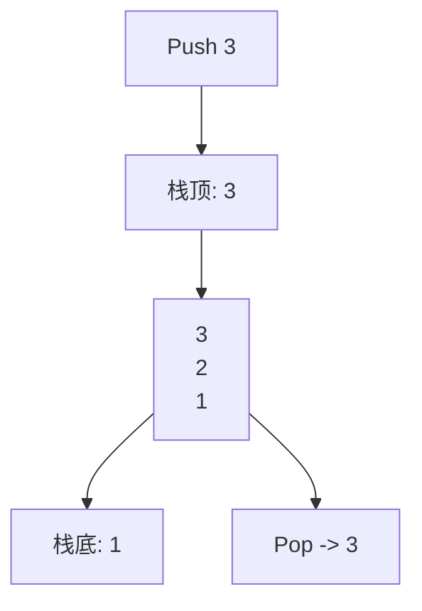
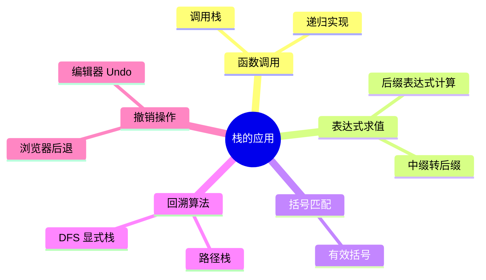
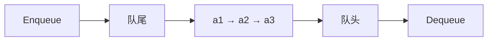
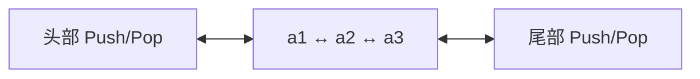
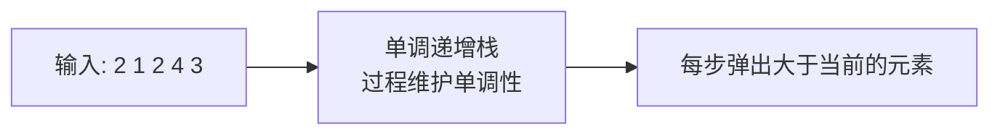

# 栈与队列

> 栈和队列是操作受限的线性表。限制带来特性，特性带来应用场景。

## 一、栈 Stack

### 1.1 定义

**栈**：只允许在**一端**进行插入和删除的线性表。



**LIFO（Last In First Out）**：后进先出。

### 1.2 核心操作

```go
type Stack struct {
    data []int
}

func (s *Stack) Push(x int) { s.data = append(s.data, x) }
func (s *Stack) Pop() int {
    n := len(s.data)
    x := s.data[n-1]
    s.data = s.data[:n-1]
    return x
}
func (s *Stack) Top() int  { return s.data[len(s.data)-1] }
func (s *Stack) Empty() bool { return len(s.data) == 0 }
```

| 操作 | 复杂度 |
|------|------|
| Push | O(1) |
| Pop | O(1) |
| Top | O(1) |
| 查找 | O(n) |

### 1.3 实现方式

| 实现 | 优点 | 缺点 |
|------|------|------|
| 数组 | 缓存友好、扩容简单 | 可能预分配浪费 |
| 链表 | 无容量限制 | 每节点额外指针 |

### 1.4 栈的应用



#### 函数调用栈

```go
func factorial(n int) int {
    if n <= 1 {
        return 1
    }
    return n * factorial(n-1)  // 每层递归压栈
}
```

**递归过深会栈溢出**：Go 默认栈 1MB，可调；Java 默认栈 512KB。

#### 括号匹配

```go
func isValid(s string) bool {
    pair := map[byte]byte{')': '(', ']': '[', '}': '{'}
    stack := []byte{}
    for i := 0; i < len(s); i++ {
        c := s[i]
        if c == '(' || c == '[' || c == '{' {
            stack = append(stack, c)
        } else {
            if len(stack) == 0 || stack[len(stack)-1] != pair[c] {
                return false
            }
            stack = stack[:len(stack)-1]
        }
    }
    return len(stack) == 0
}
```

## 二、队列 Queue

### 2.1 定义

**队列**：只允许在**一端插入、另一端删除**的线性表。



**FIFO（First In First Out）**：先进先出。

### 2.2 链式队列 vs 顺序队列

| 实现 | 入队 | 出队 | 注意 |
|------|------|------|------|
| 链表（带尾指针） | O(1) | O(1) | 动态扩容 |
| 数组（朴素） | O(1) | O(n) | 出队需移动 |
| 数组（循环队列） | O(1) | O(1) | 推荐 |

### 2.3 循环队列

用数组 + 取模实现，避免出队时搬移元素。

```go
type CircularQueue struct {
    data  []int
    front int // 队头下标
    rear  int // 队尾下一个待插入位置
    size  int
}

func NewQueue(k int) *CircularQueue {
    return &CircularQueue{data: make([]int, k+1), size: k + 1}
}

func (q *CircularQueue) Enqueue(x int) bool {
    if (q.rear+1)%q.size == q.front {
        return false // 队满
    }
    q.data[q.rear] = x
    q.rear = (q.rear + 1) % q.size
    return true
}

func (q *CircularQueue) Dequeue() (int, bool) {
    if q.front == q.rear {
        return 0, false // 队空
    }
    x := q.data[q.front]
    q.front = (q.front + 1) % q.size
    return x, true
}
```

**关键**：牺牲一个单元区分队空和队满。
- 队空：`front == rear`
- 队满：`(rear+1) % size == front`

### 2.4 队列的应用

- **BFS 广度优先搜索**：层级遍历、最短路径
- **任务调度**：操作系统进程调度、消息队列
- **缓冲区**：生产者消费者、网络数据包队列
- **打印队列**

## 三、双端队列 Deque

### 3.1 定义

**双端队列**：两端都允许插入和删除的线性表。



### 3.2 实现要点

```go
type Deque struct {
    data []int
}

func (d *Deque) PushFront(x int) { d.data = append([]int{x}, d.data...) }
func (d *Deque) PushBack(x int)  { d.data = append(d.data, x) }
func (d *Deque) PopFront() int {
    x := d.data[0]
    d.data = d.data[1:]
    return x
}
func (d *Deque) PopBack() int {
    x := d.data[len(d.data)-1]
    d.data = d.data[:len(d.data)-1]
    return x
}
```

> 生产实现通常用环形缓冲区，避免头插 O(n)。

### 3.3 应用

- **滑动窗口最大值**：单调双端队列
- **工作窃取调度器**：Java ForkJoinPool
- **浏览器历史**：前后向导航

## 四、单调栈

### 4.1 定义

**单调栈**：栈内元素保持**单调递增**或**单调递减**的栈。



### 4.2 两种模式

| 类型 | 维护方式 | 解决问题 |
|------|---------|---------|
| 递增栈 | 入栈前弹出 ≥ 当前者 | 找下一个更小元素 |
| 递减栈 | 入栈前弹出 ≤ 当前者 | 找下一个更大元素 |

### 4.3 经典问题：下一个更大元素

```go
func nextGreaterElement(nums []int) []int {
    n := len(nums)
    res := make([]int, n)
    for i := range res {
        res[i] = -1
    }
    stack := []int{} // 存下标
    for i := 0; i < n; i++ {
        for len(stack) > 0 && nums[stack[len(stack)-1]] < nums[i] {
            top := stack[len(stack)-1]
            stack = stack[:len(stack)-1]
            res[top] = nums[i]
        }
        stack = append(stack, i)
    }
    return res
}
```

> 具体题目与解法见 [algorithm/双指针与滑动窗口.md](../algorithm/双指针与滑动窗口.md)。

### 4.4 应用场景

- 柱状图最大矩形
- 接雨水
- 每日温度
- 股票跨度

## 五、单调队列

### 5.1 定义

**单调队列**：双端队列维护单调性，支持 O(1) 取最值。

### 5.2 滑动窗口最大值

```go
func maxSlidingWindow(nums []int, k int) []int {
    dq := []int{} // 存下标，队首是当前窗口最大值
    res := []int{}
    for i := 0; i < len(nums); i++ {
        // 移除超出窗口的元素
        for len(dq) > 0 && dq[0] <= i-k {
            dq = dq[1:]
        }
        // 维护单调递减
        for len(dq) > 0 && nums[dq[len(dq)-1]] <= nums[i] {
            dq = dq[:len(dq)-1]
        }
        dq = append(dq, i)
        if i >= k-1 {
            res = append(res, nums[dq[0]])
        }
    }
    return res
}
```

> 详细题目分析见 [algorithm/双指针与滑动窗口.md](../algorithm/双指针与滑动窗口.md)。

## 六、优先队列（堆）

> 优先队列是队列的扩展：出队按优先级而非时间。Go 标准库 `container/heap`。
>
> **结构原理见 [7.堆.md](7.堆.md)，算法应用见 [algorithm/堆与优先队列.md](../algorithm/堆与优先队列.md)。**

## 七、栈与队列的相互实现

### 7.1 用两个栈实现队列

```go
type MyQueue struct {
    in, out []int
}

func (q *MyQueue) Push(x int) {
    q.in = append(q.in, x)
}

func (q *MyQueue) Pop() int {
    q.shift()
    x := q.out[len(q.out)-1]
    q.out = q.out[:len(q.out)-1]
    return x
}

func (q *MyQueue) shift() {
    if len(q.out) == 0 {
        for len(q.in) > 0 {
            q.out = append(q.out, q.in[len(q.in)-1])
            q.in = q.in[:len(q.in)-1]
        }
    }
}
```

**均摊 O(1)**：每个元素最多入栈出栈各两次。

### 7.2 用两个队列实现栈

思路：每次入栈时，把新元素先入空队列 Q1，再把另一队列 Q2 所有元素搬到 Q1。Pop 时直接出 Q1 队头。

## 八、面试要点

### 8.1 高频概念题

1. **栈和队列的区别？**
   - LIFO vs FIFO、操作端、应用场景

2. **为什么递归会栈溢出？**
   - 每层调用压栈，深度过深超过栈容量

3. **循环队列为什么牺牲一个单元？**
   - 区分队空（front==rear）和队满，避免歧义

4. **单调栈解决什么问题？**
   - 找下一个更大/更小元素，O(n) 代替 O(n²)

5. **双端队列和优先队列的区别？**
   - 双端队列两端操作 O(1)，按位置；优先队列按优先级出队

6. **两个栈实现队列的均摊复杂度？**
   - O(1)，每个元素最多出入栈两次

### 8.2 选型决策

| 场景 | 推荐 |
|------|------|
| 函数调用、回溯、表达式 | 栈 |
| BFS、任务调度 | 队列 |
| 滑动窗口最值 | 单调队列 |
| 下一个更大元素 | 单调栈 |
| 按优先级出队 | 优先队列 |
| 前后双向操作 | 双端队列 |

### 8.3 易错点

1. **循环队列**：注意 size 取模、判断空和满的条件
2. **单调栈**：存下标还是存值要看题目（求位置存下标，求值都可以）
3. **递归转显式栈**：注意入栈顺序与递归顺序相反

## 九、参考资料

- 《大话数据结构》第 4 章 栈与队列
- LeetCode 栈与队列专题
